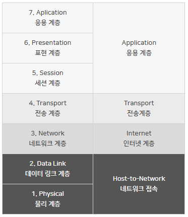
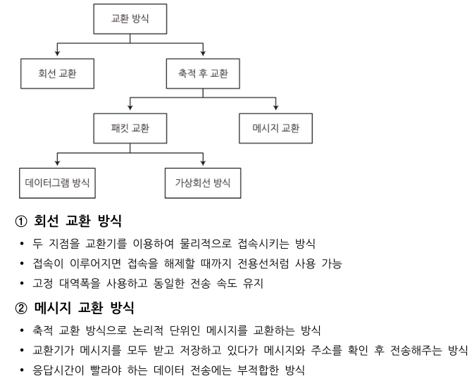
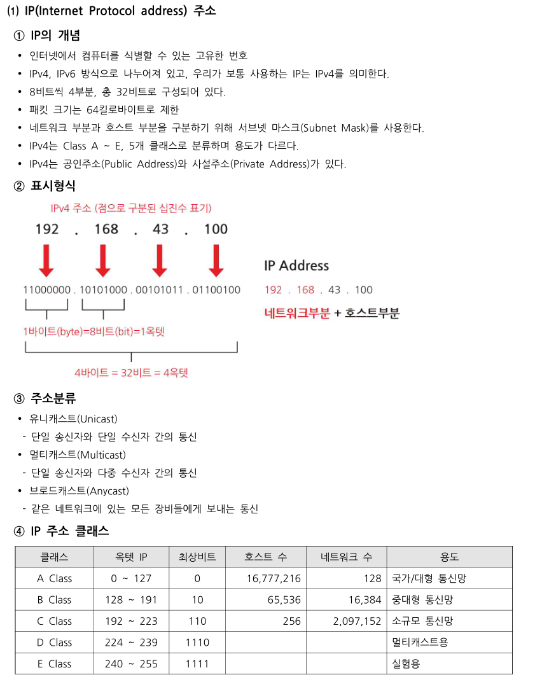
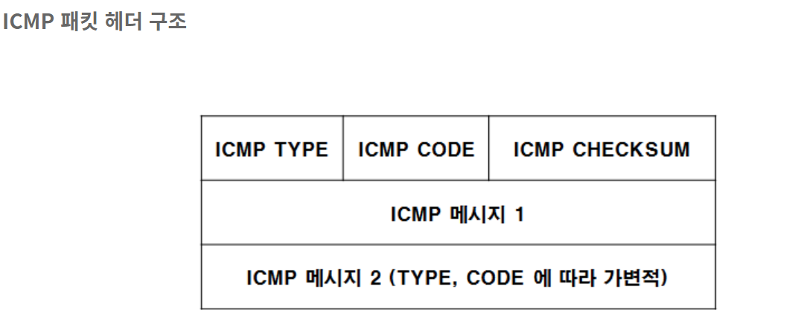
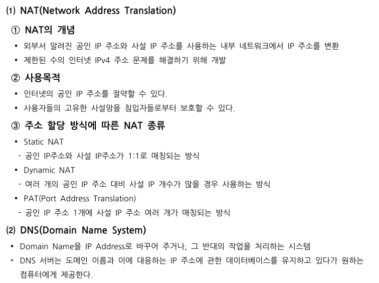
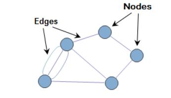

# 네트워크 레이어 part 1. 데이터 평면

## 네트워크 계층 개요

#### 포워딩, 라우팅 - 데이터 평면 / 제어 평면

#### 네트워크 서비스 모델

### 1️⃣ 네트워크 계층 - 3계층

---



- 네트워크를 논리적으로 구분하고 연결 (논리적 주소 사용 - 최적 경로 설정)
- 경로 설정 (Routing) 및 혼잡 제어를 수행
- 주소 및 종단점의 식별 기능을 행함

- **라우팅 (Routing)** : 데이터를 목적지까지 가장 안전하고 빠르게 전달해주는 과정
- **라우터 (Router)** : 다른 네트워크로 통신하기 위한 장치

- 전송 단위 : 패킷, Packet
  - **패킷 (Packet)** : 정보 기술에서 컴퓨터 네트워크가 전달하는 데이터의 형식화된 블록
    - 제어 정보와 사용자 데이터로 구성
- 프로토콜 : IP, ICMP
  - **IP** : 인터넷 상 Host 주소 지정 및 Packet 전달 / 네트워크 계층에서 통신하는 주요 프로토콜
    - 데이터그램 (Datagram) : IP 계층의 Packet을 의미함 / 인터넷을 통해 전달되는 정보의 기본 단위


---

[류리상자 : 네이버 블로그](https://blog.naver.com/fbfbf1/222271147841)

[코딩꿈나무 조정현 : 네이버 블로그](https://blog.naver.com/ds4ouj/222520927555)

[[Network] 네트워크 계층 : 개요와 서비스 모델](https://hyeo-noo.tistory.com/239)

### 🔵 포워딩 (Forwarding)

---

- _Local, Per-Router_
- 각각의 라우터 마다의 개념

- 데이터 평면에 구현된 가장 보편적이고 중요한 기능
- 패킷이 라우터의 입력 링크에 도착했을 때, 라우터는 그 패킷을 적절한 출력 링크로 이동시켜야 한다.
  - 패킷을 올바른 방향으로 전달하는 역할
- 주로 몇 나노 초 단위를 가지기 때문에 일반적으로 하드웨어에서 실행

---

> **Forwaridng table**

- 들어온 패킷이 어느 방향을 향하는지에 따라 어떤 라우터 보낼지 결정하는 테이블
- 만드는 방법 ⇒ 라우팅 알고리즘

- **라우팅 알고리즘**
  - 패킷이 거치는 라우터의 경로를 좋게 만드는 방법
  1. **_Link-state 알고리즘 (global 라우팅)_**
     - 다익스트라 알고리즘
     2 . **_Distance-vector 알고리즘(decentralized 라우팅)_**
  - 벨만 포드 방정식(동적 프로그래밍)

### 🔵 라우팅 (Routing)

---

- _Global, Network-Wide_
- End-to-End 네트워크 전역에 걸쳐 있음
- 네트워크 계층의 제어 평면 (Control Plane)에서 실행

- 패킷을 전송할 때 네트워크 계층은 패킷 경로를 결정해야함 ⇒ 라우팅 알고리즘
- 출발지에서 목적지까지 데이터그램의 종단간 경로를 결정하기 때문에 초 단위를 가지고 보통 소프트웨어에서 실행

### 🔵 제어 평면 (Control Plane)

---

- 데이터 영역으로 어떻게 무슨 트래픽이 흐르도록 제어하는 영역
- _network-wide logic_
- 모든 라우터가 공통으로 돌릴 수 있는 부분들이다.
  - 예를 들어 Routing protocol 같이 어떤 라우터든 공통으로 돌아갈 수 있는 것
  - 그래서 Datagram을 보낼 Path를 결정하는 Routing에 대한 것
- ex) 신호등

### 🔵 데이터 평면 (Data Plane)

---

- _Forwaridng plane_
- 트래픽을 전송하는 목적을 제공하는 영역
- local 라우터마다 있는 기능이다.
  - 어떤 Datagram이 라우터의 Input으로 들어왔을 때 어떻게 Forwarding 해줄 것인가 (Forwarding Function)
- Header에 있는 값(Data)이 들어와서, 이 Data마다 라우터에서 내보내주게 되는 것
- ex) 자동차

---

- 네트워크 전체적인 로직을 위한 영역
- 데이터그램의 경로를 결정하는 기능을 수행
- 두개의 제어 영역 접근법
  - Traditional Routing Algorithms
  - SDN (Software Defined Networking)

---

- **전통적인 방법 (Traditional Routing Algorithms)**
  - 라우터에 각자의 라우팅 알고리즘이 제어 평면에 있음 ⇒ 포워딩 테이블의 내용을 결정한다.
  - 라우터는 포워딩과 라우팅 기능을 모두 가지고 있음
  - 한 라우터의 알고리즘은 다른 라우터의 라우팅 알고리즘과 서로 소통하며 포워딩 테이블의 값들을 계산


---

- **SDN (Software Defined Networking)**
  - 논리적으로 집중된 제어
  - 제어 영역 라우팅 기능이 물리적 라우터와 다른 것
  - 원격제어가 포워딩 테이블을 계산하는 동안 라우팅 기기는 포워딩만을 수행

  - 논리적으로 집중된 컨트롤러가 포워딩 테이블을 작성
    - 모든 개별 라우터가 사용할 수 있도록 배포한 경우


- Control Plane을 가지고 있지 않기 때문에 스위치(Switch)라고 부른다.

### 🔵 네트워크 서비스 모델

---

- _Network service model_
- 송수신 호스트 간 패킷 전송 특성 정의

Q. 트랜스포트 계층의 입장에서는 네트워크 계층이 패킷을 전달해준다는 것을 믿을 수 있을까?

Q. 호스트에서 보낸 순서와 동일하게 패킷을 전송할까?

1. 보장된 전달
   - 이 서비스는 패킷이 출발지에서 목적지까지 도착하는 것을 보장한다.
2. 지연 제한 이내의 보장된 전달
   - 호스트간의 특정 지연 제한 안에 도착을 보장한다. (timeout 이전 도착)
3. 순서화 패킷 전달
   - 패킷이 목적지에 송신된 순서로 도착하는 것을 보장한다.
4. 최소 대역폭 보장
   - 송신호스트가 비트들을 특정한 비트 속도 이하로 전송하는 한 모든 패킷이 목적지 호스트까지 전달됨을 보장한다.
5. 보안 서비스
   - 출발지에서 암호화, 목적지에서 복호화를 할 수 있게 하여 트랜스포트 계층의 모든 세그먼트들에 대해 기밀성을 제공한다.

## 라우터

#### **용어 정리**

- **네트워크 계층** - 서로 다른 네트워크에 있는 목적지로 데이터를 전송하는 기능을 하는 계층
- **라우터 router**
  - TCP/ IP 프로토콜 등에서 인터넷 접속에 사용되는 OSI 7계층의 3계층(네트워크 계층) 장비
  - **서로 다른 네트워크를 연결해주는 장비. 현재 네트워크에서 다른 네트워크로 패킷을 전송할 수 있도록 한다.**
  - 데이터그램(패킷)이 이동할 경로를 설정하고, 입력받은 데이터를 올바른 경로로 보내는 네비게이션 역할을 한다
  - **입력 포트**로부터 **패킷**을 입력받아 **포워딩 테이블**을 사용하여 패킷이 전달되어야 할 **출력 포트**를 찾고, 출력 포트로 패킷을 전달한다
  - 스위치만 있는 네트워크에서는 모든 컴퓨터와 스위치가 동일 네트워크에 속하는데, 이를 분리시킬 수 있게 되었다
  - 컴퓨터1 이 다른 네트워크에 데이터를 전송하려면 라우터의 IP 주소를 설정해야 한다.
  - NAT(Network Address Translation), 방화벽, VPN(Virtual Private Network), Qos(Quality of Service) 등 다양한 부가 기능을 함께 제공
  - 데이터의 목적지가 정해지면 해당 목적지까지 어떤 경로로 가는 것이 좋은지를 알려주는 기능을 한다. 이를 위해서는 네트워크 목적지 주소가 필요하다.
    - 기본 게이트웨이 default gateway - 라우터의 IP 주소 설정 (네트워크 출입구 설정)
    - 출입구 지정 후 일단 라우터로 데이터를 전송
- **라우팅 routing** - 네트워크 전반에 걸쳐 출발지에서 목적지 IP 주소까지 어떤 경로로 데이터그램을 보낼지 결정하는 것.
- **라우팅 테이블(포워딩 테이블)** - 경로 정보를 등록, 관리. 소규모 네트워크는 수동, 대규모 네트워크는 자동. 자동은 라우터 간 경로 정보를 서로 교환하여 라우팅 테이블 정보를 자동으로 수정해준다. 따라서 네트워크 관리자가 일일이 변경하지 않아도 된다
- **라우팅 프로토콜** - 라우터 간에 라우팅 정보를 교환하기 위한 프로토콜. 라우터 간에 경로 정보를 서로 교환하고 이를 테이블에 등록해나간다.
  - 대표적인 라우팅 프로토콜은 **RIP, OSPF, BGP** 등이 있다.

## **라우터의 구조**

[[영진전문대 컴퓨터 프로그래밍 전공] 01. 라우팅 및 패킷 포워딩 소개 - 1) 라우터 내부 구조(1)](https://blog.naver.com/PostView.nhn?isHttpsRedirect=true&blogId=dufvndrnjs&logNo=70149987979&parentCategoryNo=&categoryNo=12&viewDate=&isShowPopularPosts=true&from=search)

[[영진전문대 컴퓨터 프로그래밍 전공] 01. 라우팅 및 패킷 포워딩 소개 - 2) 라우터 내부 구조(2)](https://blog.naver.com/PostView.naver?blogId=dufvndrnjs&logNo=70149989605&parentCategoryNo=&categoryNo=12&viewDate=&isShowPopularPosts=true&from=search)


**라우터 컴포넌트**

컴포넌트란 여러 기능을 모아서 처리할 수 있는 단위를 말한다. 모듈이라고도 부른다.


- **입력 포트 input port**
  - 라우터로 들어오는 입력 링크. 물리 계층 기능을 수행. 수신된 신호로부터 비트가 생성됨
  - 프레임을 역캡슐화(decapsultation)해서 패킷을 추출하고, 오류를 검사하며 훼손된 경우 패킷을 폐기한다.
  - 물리 계층 프로세서, 데이터 링크 계층 프로세서, 큐로 구성
  - 쌍방향 데이터 전송이 가능하므로 양 쪽 모두 입출력 포트가 될 수 있음
  - **라인 종단** - 회선이 꽂히는 부분. 물리 계층에 속함
  - **링크 계층 프로토콜** - 이더넷
    - 들어오는 링크의 반대편 링크 계층과 상호 운용하기 위해 기능 수행
  - **탐색(검색), 포워딩, 큐잉 (가장 중요!)**
  - 분산 스위칭 - 데이터의 헤더 필드값을 보고 적절항 방향(출력 포트)를 찾는 것
    - match plus action - 주소가 맞으면 전달
    - 출력 포트를 찾기 위해 입력포트 메모리에 존재하는 포워딩 테이블을 참조
    - 제어 패킷(라우팅 프로토콜 정보를 전달하는 패킷)은 입력 포트에서 라우팅 프로세서로 전달(포트 = 물리적 입출력 라우터 인터페이스)
  - 도착하는 데이터그램의 수가 스위치 패브릭으로 전달되는 수보다 많은 경우 큐잉 발생
  
  - **목적지 기반 포워딩** - 전통적인 방법. 목적지 IP 기반으로 포워딩
    - 데이터그램에 들어있는 목적지 주소가 포워딩 테이블에 적혀있는 목적지 주소 범위에 포함되는 경우, 해당 링크 인터페이스로 전달하는 방식
    - IP주소 32비트를 모두 저장하기 때문에 테이블이 커진다는 단점
    - 라우터는 목적지를 찾기 위해 복잡한 연산을 수행하지 않고, 범위내 값을 찾도록 비교, 탐색하는 단순한 연산을 진행하므로 성능이 우수한 CPU가 필요하지 않다
    - 일정 부분 다른 주소와 중복 → 불필요하게 같은 앞부분 고려하지 않고 차이가 있는 중간부분부터 비교할 수 있는 **최장 프리픽스 대응 규칙**이 있다.
    
    - **최장 프리픽스 대응 규칙**
      - 주어진 목적지 주소에 대한 포워딩 테이블 엔트리를 찾을 때, 목적지 주소와 가장 길게 매칭되는 프리픽스를 선택
      - 빨간 글씨 기준으로 앞은 공통되는 초반 목적지 주소, 뒤는 일치하지 않아도 되는 부분
      - TCAMs ( 내용 주소화 기억 장치 Ternary content addressable memories)를 사용해 구현. 주소 입력 시 한 개 클럭 사이클 후 주소를 찾아낼 수 있는 특수 용도의 고속 메모리.
  - **일반적인 포워딩** - 헤더 필드 값의 설정 내용을 기반으로 다양한 포워딩
  - **입력 포트 큐잉**
    - 입력 포트보다 느린 속도의 패브릭은 입력 큐에 큐잉을 발생시킴
    - 입력 버퍼 오버플로우 - 큐가 모든 패킷을 받지 못하는 경우 → 이로 인해 큐잉 지연 (패킷이 계속 큐에 쌓이는 것) / 손실(큐 안에 들어오지 못한 패킷 버려짐)
    
    - **HOL(Head=of-the-Line) 블로킹**
      - 큐 전단에 위치하는 데이터그램이 큐 안의 다른 데이터그램의 이동을 제한하는 것
- **스위치 구조**
  - 라우터의 입력 포트와 출력 포트를 연결.(입력 버퍼의 패킷을 출력 버퍼로 전달)
  - 라우터 내부에 포함(네트워크 라우터의 내부 네트워크). **라우터의 핵심**
  - 작업의 수행 속도로 입력 / 출력 큐의 크기와 패킷 전달의 전체 지연에 영향을 준다.
  - 메모리 / 버스 / crossbar(상호 연결)
    
    
  - **메모리 경유 스위칭(교환)**
    - 초기 라우터에서 사용. 데이터가 들어오면 라우터 내에 CPU가 들어온 데이터를 메모리 특정 위치에 저장시킨 뒤 다음 사이클에 꺼낸다.
    - 메모리 출입 지점에 병목 현상이 발생
    - 속도에 제한이 있다(데이터그램 당 버스를 2번 경유)
    
  - **버스 스위칭**
    - 입력 포트에 도착한 패킷이 라우팅 프로세서 개입 없이 공유 버스를 경유해 출력 포트 메모리로 직접 이동
    - 모든 출력 포트에 패킷이 수신되지만 레이블과 매치되는 포트만 패킷을 유지
    - 레이블은 스위치 내에서만 사용되므로 출력 포트에서 제거됨
    - 여러 패킷이 동시에 다른 입력 포트에 있는 라우터에 도착 시 하나를 제외한 모든 패킷이 대기
    - 버스 충돌(Bus Contention) 발생 가능. 패킷 두 개가 충돌 시 둘 다 소멸되며, 여러번 일어나면 데이터 전송율 하락
    
  - **상호 연결 네트워크(인터커넥션) 스위칭**
    - crossbar( 크로스바 )
    - 공유 버스의 대역폭 제한을 극복하기 위해 고안
    - N개의 입력 포트를 N개의 출력 포트에 연결하는 2N버스로 구성
    - 각 수직 버스는 교차점에서 각 수평 버스와 교차하며 스위치 구조 컨트롤러에 의해 언제든지 열리거나 닫힐 수 있다
    - 패킷이 포트 A에 도착해 포트 Y로 전달되어야 하는 경우 스위치 컨트롤러는 A와 Y 버스들과 포트 A의 교차로에서 교차점을 닫고 버스로패킷을 전달 → Y 버스만으로 픽업
    - A → Y / B → X의 경우 다른 입출력 버스를 사용하므로 두 패킷은 동시에 전달될 수 있다
    - 즉, 여러 패킷을 병렬적으로 전달이 가능
    - 출력포트로 전달되지 않는 한 출력 포트가 차단되진 않지만, 동시에 하나의 출력 포트로 전달되는 경우 한 번에 하나의 패킷만 특정 버스에 전송될 수 있으므로 입력을 기다린다.
    
  - **반얀 스위치 (Banyan Switch)**
    - 크로스바 스위치보다 현실적인 것
    - 마이크로 스위치를 사용한 다단식 스위치로 출력 포트를 기반으로 패킷을 라우팅한다. 각 단은 이진 문자열로 표시한다.
    - 간단하게 설명하면, 각 입력 포트를 2/n의 개수의 소자로 받고, 출력 포트의 개수 n개를 표현할 수 있는 2진수로 갯수만큼 준비해서 입력 포트와 출력 포트의 갯수가 둘 다 n개라 치면, 2/n \* log2N 의 갯수의 소자로 처리하는 것이다.
      
  - **배처-반얀 스위치 (Batcher-Banyan Switch)**
    - 반얀 스위치의 문제점은 두 개의 패킷이 같은 출력 포트로 전달될 때, 충돌이 발생할 수 있다는 점이다.그걸, Batcher라는 교통 정리기 같은 기계로, 충돌하지 않게 처리하는 방식이다.


- **출력 포트 output port**
  - 스위치 구조에서 수신한 패킷을 저장하고 필요한 링크 계층 및 물리 계층 기능을 수행해 출력 링크로 패킷을 전송
  - 출력될 패킷이 큐에 들어오면 각 패킷은 프레임으로 캡슐화(encaptulation)가 되고, 최종적으로물리 계층에서 프레임을 전기적으로 생성하여 전송된다.
  - 큐, 데이터 링크 계층 프로세서, 물리 계층 프로세서로 구성
  - 링크가 양방향인 경우(양방향 트래픽 전달) 출력 포트는 일반적으로 동일한 링크의 입력 포트와 한 쌍을 이룸
  - 대부분의 큐잉 지연이 발생 (그래서 중요)
  - 전송을 위한 패킷 선택(스케줄링), 큐 제거, 필요한 링크 계층 및 물리 계층 전송 기능을 수행
  - **버퍼링 필요** - 패킷이 패브릭으로부터 전송율보다 빠르게 도착한 경우, 먼저 들어온 패킷들이 지금 보내지고 있는 중이므로 대기해야 한다.(버퍼링 하지 않으면 혼잡 / 버퍼 부족으로 패킷 손실 위험 → 손실이 발생한다면 이 곳에서 발생한 것)
  - **스케줄링** - 큐에 있는 패킷을 선택 후 전송될 때 사용하는 규칙. 어떤 것을 먼저 보낼 것인지에 대해 우선순위를 정하는 것. 최대 성능과 네트워크 중립성을 감안(구글처럼 사용자가 많은 서비스라고 해서 우선순위가 높고 사용자가 적은 서비스라고 우선순위가 낮은게 아닌, 모든 서비스가 100개 보내면 100개 바을 수 있도록 중립을 지키는 것)
- **라우팅 프로세서**
  - 네트워크 계층의 기능 수행한다.
  - 패킷을 전송할 출력 포트번호와 다음 홉 주소를 찾기 위해 패킷의 주소를 참조한다.
  - 라우팅 프로세서가 포워딩 테이블에서 검색하기 때문에 이런 동작은 테이블 검색으로도 알려져있다.
  - 최신 라우터에서는 라우팅 프로세서의 이런 기능을 입력 포트에서 작동하도록 하여 더 신속하게 처리하고 있다.

최근 이론과 실험에서는 많은 수의 독립적인 TCP 흐름(N)이 링크를 통과할 때 필요한 버퍼량

$B = RTT * C/ (N)**(1/2)$

(링크 용량 C, 버퍼링 양 B, 평균 왕복 시간 RTT)

### 패킷 스케줄링

- **FIFO**
  
  - 다들 아시죠?
  - 스케줄링 시에 큐가 완전히 꽉 차있는 상태면 어쩔 수 없이 일부의 패킷은 버리게 된다. 이런 경우 어떤 패킷을 버리느냐에 대한 내용이 '**폐기 정책**'이다. 폐기 정책에는 아래의 세 가지가 있다.
  - 꼬리 짜르기(tail drop) : 최근 도착한 패킷을 폐기
  - 우선 순위 : 우선순위에 따라 버리거나 삭제
  - 임의(random) : 임의로 선택하여 버리거나 삭제
- **우선순위 큐잉**
  
  
  - 클래스 : IP 송수신 주소, 포트 번호 등 사전에 정해진 규칙에 의존
  - 우선순위 동일한 경우는 FIFO
- **라운드 로빈 RR**
  - 다양한 클래스들이 있어 클래스별 큐를 주기적으로 스캔해 큐에 도착한 한 개의 완전한 패킷을 전송
- **WFQ(가중치 공정 큐잉 Weighted Fail Queuing)**
  - 라우터에서 널리 구현된 RR 큐잉의 일반화된 형태
  - 도착한 패킷은 적절한 클래스별 대기 영역에서 분류되어 대기한다
  - 순환 방식으로 동작
  - 빈 클래스 큐를 찾으면 서비스 순서에서 다음 클래스로 즉시 이동
  - 각 클래스마다 **다른 양의 서비스 시간**을 부여받음(가중치)

---

## 인터넷 프로토콜 IPv4 주소체계

### 인터넷 프로토콜 IPv4 주소체계

#### 데이터그램 포맷

데이터그램(Datagram): 인터넷을 통해 전달되는 정보의 기본 단위

우선 네트워크 계층은 출발지인 호스트에서 트랜스포트 계층 프로토콜인 TCP,UDP의 세그먼트를 받아서 캡슐화하고 전달한다. 

그리고 이 때 네트워크 계층에서 움직이는 패킷을 '데이터그램'이라고 한다.

###### 아래의 사진은 IPv4 데이터그램 포맷


```markdown
**버전 번호**: 4비트로 데이터그램의 IP 프로토콜 버전을 명시. 
   다른 버전의 IP는 다른 데이터그램 형식을 사용하기 때문에 라우터는 버전 번호를 확인하여 
   데이터그램의 나머지 부분을 어떻게 해석하는지 결정한다. 

**헤더 길이**: IPv4 데이터그램은 헤더에 가변 길이의 옵션을 포함하기 때문에 4비트의 
   헤더 길이를 통해 IP 데이터그램에서 실제 *페이로드*가 시작하는 곳을 명시해줍니다. 
   대부분 IPv4 데이터그램은 옵션을 포함하지 않아서 데이터그램의 헤더는 20바이트가 통상적.
   위 그림에서 <옵션> 부분을 없애면 32 bit씩 5줄이니까 20바이트가 된다. 
   (출발지,목적지 IP는 하나로)

**서비스 타입**: 서비스 타입 비트는 서로 다른 유형의 IP 데이터그램을 구별합니다. 
   예를 들어, 실시간 데이터그램(IP 통신 어플리케이션)과 비실시간 트래픽(FTP)을 구분할 수 있다.

**데이터그램 길이**: 바이트로 계산한 IP 데이터그램(헤더와 데이터)의 전체 길이입니다. 
   이 필드의 크기는 16비트이므로 IP 데이터그램의 이론상 최대 길이는 65,536(2^16)바이트이지만 
   1,500바이트보다 큰 경우는 거의 없으므로 최대 크기의 이더넷 프레임의 페이로드 필드에 
   IP 데이터그램이 장착될 수 있다.

**식별자, 플래그, 단편화 오프셋**: 세 필드는 *IP 단편화*와 관계가 있다. 

**TTL(Time-To-Live)**: 이 필드는 네트워크에서 데이터그램이 무한히 순환하지 않도록 합니다. 
   라우터가 데이터그램을 처리할 때마다 값을 감소시켜서 TTL 필드값이 0이 되면 
   라우터는 데이터그램을 폐기한다.

**상위 계층 프로토콜**: 이 필드는 일반적으로 IP 데이터그램이 최종 목적지에 도달했을 때만 
  사용합니다. 이 필드값은 IP 데이터그램에서 데이터 부분이 전달될 목적지의 전송 계층의 
  특정 프로토콜을 명시하는데요. 
  예를 들어, 이 필드값이 "6"이면 데이터 부분을 TCP로, "17"이면 UDP로 데이터를 전달하라는 뜻.

**헤더 체크섬**: 헤더 체크섬은 라우터가 수신한 IP 데이터그램의 비트 오류를 
   탐지하는 데 도움을 줍니다. 

**출발지와 목적지 IP 주소**: 출발지가 데이터그램을 생성할 때, 자신의 IP 주소를 
   출발지 IP 주소 필드에 삽입하고 목적지 IP 주소를 목적지 IP 주소 필드에 삽입. 

**옵션**: 옵션 필드는 IP 헤더를 확장합니다.

**데이터(페이로드)**: 데이터그램이 존재하는 이유이자 가장 중요한 마지막 필드입니다. 
   대부분의 경우에 IP 데이터그램의 데이터 필드는 목적지에 전달하기 위해 
   전송 계층 세그먼트 (TCP, UDP)를 포함하지만, *ICMP 메시지*와 같은 다른 유형의 데이터를 
   담기도 합니다.
```

```markdown
**용어 정리**
페이로드
 - 전송되는 데이터를 의미
   예를 들어 운송업에서 해당 물건을 운송해주고 나면 고객은 오직 해당 물건의 무게만큼의
   	비용을 지급하는 것과 같다.

IP 단편화
 - 단편화(Fragmentaion): 주기억장치에 프로그램을 할당하고 반납하는 과정에서 발생하는 
   사용되지 않는 작은 조각 공간
 - IP 단편화: 패킷을 MTU 이하의 조각으로 분할하는 것을 단편화, 분할된 조각을 단편이라고 한다.
 - MTU(Maximum Transmission Unit)이란?
   네트워크에 연결된 장치가 받아들일 수 있는 최대 데이터 패킷 크기를 말한다.
   
ICMP 메시지
 - Internet Control Message Protocol: 인터넷 제어 메시지 프로토콜로 
   오류 메세지를 전송받는데 주로 쓰인다.
```


### 데이터 교환 방식



---


## IPv4 주소 체계



### 네트워크 주소변환 NAT

#### 인터넷 프로토콜 IPv4 주소체계

### 데이터그램 포맷

데이터그램(Datagram): 인터넷을 통해 전달되는 정보의 기본 단위

우선 네트워크 계층은 출발지인 호스트에서 트랜스포트 계층 프로토콜인 TCP,UDP의 세그먼트를 받아서 캡슐화하고 전달한다. 

그리고 이 때 네트워크 계층에서 움직이는 패킷을 '데이터그램'이라고 한다.

###### 아래의 사진은 IPv4 데이터그램 포맷


```markdown
**버전 번호**: 4비트로 데이터그램의 IP 프로토콜 버전을 명시. 
   다른 버전의 IP는 다른 데이터그램 형식을 사용하기 때문에 라우터는 버전 번호를 확인하여 
   데이터그램의 나머지 부분을 어떻게 해석하는지 결정한다. 

**헤더 길이**: IPv4 데이터그램은 헤더에 가변 길이의 옵션을 포함하기 때문에 4비트의 
   헤더 길이를 통해 IP 데이터그램에서 실제 *페이로드*가 시작하는 곳을 명시해줍니다. 
   대부분 IPv4 데이터그램은 옵션을 포함하지 않아서 데이터그램의 헤더는 20바이트가 통상적.
   위 그림에서 <옵션> 부분을 없애면 32 bit씩 5줄이니까 20바이트가 된다. 
   (출발지,목적지 IP는 하나로)

**서비스 타입**: 서비스 타입 비트는 서로 다른 유형의 IP 데이터그램을 구별합니다. 
   예를 들어, 실시간 데이터그램(IP 통신 어플리케이션)과 비실시간 트래픽(FTP)을 구분할 수 있다.

**데이터그램 길이**: 바이트로 계산한 IP 데이터그램(헤더와 데이터)의 전체 길이입니다. 
   이 필드의 크기는 16비트이므로 IP 데이터그램의 이론상 최대 길이는 65,536(2^16)바이트이지만 
   1,500바이트보다 큰 경우는 거의 없으므로 최대 크기의 이더넷 프레임의 페이로드 필드에 
   IP 데이터그램이 장착될 수 있다.

**식별자, 플래그, 단편화 오프셋**: 세 필드는 *IP 단편화*와 관계가 있다. 

**TTL(Time-To-Live)**: 이 필드는 네트워크에서 데이터그램이 무한히 순환하지 않도록 합니다. 
   라우터가 데이터그램을 처리할 때마다 값을 감소시켜서 TTL 필드값이 0이 되면 
   라우터는 데이터그램을 폐기한다.

**상위 계층 프로토콜**: 이 필드는 일반적으로 IP 데이터그램이 최종 목적지에 도달했을 때만 
  사용합니다. 이 필드값은 IP 데이터그램에서 데이터 부분이 전달될 목적지의 전송 계층의 
  특정 프로토콜을 명시하는데요. 
  예를 들어, 이 필드값이 "6"이면 데이터 부분을 TCP로, "17"이면 UDP로 데이터를 전달하라는 뜻.

**헤더 체크섬**: 헤더 체크섬은 라우터가 수신한 IP 데이터그램의 비트 오류를 
   탐지하는 데 도움을 줍니다. 

**출발지와 목적지 IP 주소**: 출발지가 데이터그램을 생성할 때, 자신의 IP 주소를 
   출발지 IP 주소 필드에 삽입하고 목적지 IP 주소를 목적지 IP 주소 필드에 삽입. 

**옵션**: 옵션 필드는 IP 헤더를 확장합니다.

**데이터(페이로드)**: 데이터그램이 존재하는 이유이자 가장 중요한 마지막 필드입니다. 
   대부분의 경우에 IP 데이터그램의 데이터 필드는 목적지에 전달하기 위해 
   전송 계층 세그먼트 (TCP, UDP)를 포함하지만, *ICMP 메시지*와 같은 다른 유형의 데이터를 
   담기도 합니다.
```

```markdown
**용어 정리**
페이로드
 - 전송되는 데이터를 의미
   예를 들어 운송업에서 해당 물건을 운송해주고 나면 고객은 오직 해당 물건의 무게만큼의
   	비용을 지급하는 것과 같다.

IP 단편화
 - 단편화(Fragmentaion): 주기억장치에 프로그램을 할당하고 반납하는 과정에서 발생하는 
   사용되지 않는 작은 조각 공간
 - IP 단편화: 패킷을 MTU 이하의 조각으로 분할하는 것을 단편화, 분할된 조각을 단편이라고 한다.
 - MTU(Maximum Transmission Unit)이란?
   네트워크에 연결된 장치가 받아들일 수 있는 최대 데이터 패킷 크기를 말한다.
   
ICMP 메시지
 - Internet Control Message Protocol: 인터넷 제어 메시지 프로토콜로 
   오류 메세지를 전송받는데 주로 쓰인다.
```




### 데이터 교환 방식


---


### IPv4 주소 체계


### 네트워크 주소변환 NAT



---

## 인터넷 프로토콜 IPv6

### **[공인 IP주소와 사설 IP주소](https://kosaf04pyh.tistory.com/181#%EA%B-%B-%EC%-D%B-%--IP%EC%A-%BC%EC%--%-C%EC%--%--%--%EC%--%AC%EC%--%A-%--IP%EC%A-%BC%EC%--%-C)**

집에서 인터넷에 연결하는 컴퓨터가 여러 대라면 공인 IP주소를 사용할 수 있는 수가 한정되어 있으므로 컴퓨터 한 대당 공인 IP주소를 할당하기가 쉽지 않습니다.

그래서 ISP가 제공하는 공인 IP주소를 라우터에만 할당하고

LAN 안에서 사용하는 컴퓨터나 노트북을 인터넷에 연결할 때는 LAN의 네트워크 관리자가 자유롭게 사설 IP 주소를 할당하거나 라우터의 DHCP(IP주소를 자동으로 할당하는 프로토콜) 기능을 이용하여 주소를 자동으로 할당합니다.


## **[IPv6](https://kosaf04pyh.tistory.com/181#IPv-)**

IPv4는 산술적으로 43억개를 할당할 수 있지만 클래스별 주소 분류 방식 때문에 실제로 사용하지 않는 주소가 많습니다. 4차 산업혁명 시대에는 단말기마다 IP가 부여되는 환경이 필요하므로 IPv4를 사용하면 IP 주소가 부족하게 됩니다. IPv6는 60억 인구가 1인당 53,731,028개의 주소를 할당받을 수 있기 때문에 주소 부족 현상이 일어나지는 않을 것입니다. 그리고 기존의IPv4 주소도 하위 32비트는 IPv4주소를 그대로 두고 상위 비트는 모두 0으로 채워 IPv6주소로 표현할 수 있습니다.


Pv6 주소의 128bit는 2Byte 영역 8개로 나뉘며, 16진수 표기법에서 2byte는 16진수 4개로 나타낼 수 있으므로 IPv6 주소는 16진수 32개로 표현됩니다.

IPv6주소에서 앞의64bit는 네트워크 주소를 의미하고 뒤의 64bit는 네트워크 연결된 통신 장비 등에 할당된 인터페이스 주소를 의미합니다.

IPv6의 표기법은 길기 때문에 경우에 따라 생략이 가능합니다.

1. 앞쪽의 0을 생략할 수 있습니다. 예를 들어 0056은 56, 000D는 D, 0000은 0으로 표현할 수 있습니다.

2. 연속으로 0으로만 (2byte 이상) 구성된 섹션은 0을 모두 지우고 콜론 2개로 대치할 수 있습니다. 이는 주소당 한 번만 허용됩니다. 예를 들어 FDCB : 000 : 000 : 0 : 0 : ASDD : 0 : FFFF  ->  FDCB :: ASDD : 0 : FFFF으로 가능합니다. 반대로 FDCB :: ASDD : 0 : FFFF으로 주어졌을 경우에는 총 8개의 섹션중에 생략되지 않은 부분이 FDCB, ASD, 0, FFFF 총 4개 이므로, :: 으로 생략된 0000 섹션이 총 4개라는 것을 알 수 있습니다.

### **IP Address (IPv6)**

- 128-bit address space

- 상황 : IPv4는 32-bit 주소 공간으로 약 40억개의 IP주소만 생성 가능. 디지털화에 따라 40억개는 굉장히 부족한 개수.

- 구조 : IPv6 datagram format

* Header 크기 : 40 bytes

* Priority : Flow 안에서 우선순위 구별

* Flow label : 같은 flow에 있는 datagram들을 구별

* Next header : 데이터를 위한 상위 계층 프로토콜 구별


**[ IPv6 사용 이유 ]**

1. IPv4 주소 고갈 문제 해결

2. 보안 기능

3. 라우팅 효율성

4. QoS 보장

5. 편리한 인터넷 서비스 기능 , 이동성

**※ IPv4에서 ipv6로의 전환 방법**

하루아침에 전 세계 모든 장비들을 IPv6로의 변경은 불가능합니다. 그럼 어떻게 ipv4와 IPv6를 혼합된 네트워크로 운영을 할 것인가? 3가지 방법이 있습니다.


**1. 듀얼스택 (DualStack)**

- 기기, 운영체제 , 응용프로그램에서 IPV4와 IPv6를 모두 사용할 수 있게 하는 기술로 , 둘 중에 어떤 걸 써도 처리가 가능합니다. IPv6 전환 시 가장 일반화된 방식입니다.

**2. 터널링 (Tunneling)**

- IPv6 전환 초기에는 IPv4망이 더 많습니다. 양 끝단에 있는 IPv6 단말이 있고 중간 경로상에 IPv4망이 막고 있는 경우 IPv4망에 논리적인 터널 경로를 구성하여 , IPv6 패킷을 IPv4헤더로 감싸서 IPv4망을 통과해 목적지 직전에 다시 IPv4헤더를 벗겨내는 방식으로 양단간의 IPv6통신을 가능하게 합니다. 망의 모든 구간에서 듀얼스택이 적용되기 어려운 경우 IPv4 only망을 타 넘는 기술로 터널링 기술은 매유 유용하게 사용됩니다.

**3. 변환 (Translation)**

- IPv6 => IPv4로 혹은 그 반대로 패킷을 완전히 재조합하는 방식입니다. 통신 애플리케이션 별로 특성을 모두 반영해야 하는 한계가 있어 , IPv6전환기에 한시적으로 한정적인 분양에 대해서만 사용을 권장하고 있습니다.

---

## SDN

[Chalk Talk: SDN이란 무엇인가?](https://www.youtube.com/watch?v=RzuCInygkQA)

[[Network] SDN(Software Defined Network) 이란? :: Suyeon's Blog](https://suyeon96.tistory.com/48)

### 💡SDN

---

### 등장배경

- 모바일 기기의 급증과 클라우드 기반 가상화 서비스 등장으로 과거와 트래픽 패턴이 달라짐
- 기존 네트워크 환경에서는 프로비저닝 설정을 변경할 때 장비마다 일일이 명령어를 입력해야 함
- 변화하는 비즈니스와 사용자 요구에 맞추어 네트워크 규모를 확대하려 하는 기업들

### SDN이란?

- 소프트웨어 정의 네트워크 (SDN: Software Defined Network)
- 소프트웨어 프로그래밍을 통해 네트워크 경로 설정과 제어 및 복잡한 운용 관리를 편리하게 처리할 수 있는 차세대 네트워킹 기술


- 과거에는 개별 네트워크 장비에서 제어 기능을 분리할 수 없었으나,
- SDN에서는 접근 가능한 컴퓨터 장치로 제어 영역이 분리되면서, 논리로 네트워크를 관리하고 제어할 수 있는 애플리케이션으로 네트워크 서비스를 관리할 수 있다.
- ⇒ 소프트웨어로 네트워크를 제어하는 기술

### 장점

1. 비용 절감
   - 제어부가 여러 네트워크 장비를 제어할 수 있기 때문에 관리가 간소화되고, 비용을 줄일 수 있다.
   - 각 장비의 사양을 각각의 기능에 최적화시킬 수 있으므로, 리소스의 낭비가 적다.
2. 확장성 및 유연성
   - 원하는 시기에 필요한 만큼 네트워크 리소스를 확장하거나 축소할 수 있다. (트래픽 제어)
3. 중앙 집중화
   - 네트워크를 전체적인 관점에서 파악할 수 있다.

### 구성


- 인프라 계층(Data plane)
  - SDN 컨트롤러의 지시에 따라 패킷 전송을 수행하는 네트워크 장치를 통칭
- 제어 계층(Control plane)
  - 전체 네트워크 자원에 대한 중앙 집중적 제어 담당
  - 애플리케이션 정보를 활용하여 데이터 패킷 라우팅 방식을 결정
- 애플리케이션 계층
  - 전반적인 리소스 요청 또는 네트워크 관련 정보를 통신
  - 네트워크를 제어하는 데 사용되는 소프트웨어 애플리케이션들
  - API와 여러 서비스들을 이용하여 Control 기능 구현
    - 경로 계산 엔진: 최적 경로 계산
    - 네트워크 최적화: 트래픽 조절 → 혼잡도 낮출 수 있음
    - 일정 관리 및 주문형 서비스

### 💡오픈플로우

---

- SDN을 구성하는 하나의 요소
- 제어 기능을 가진 머신과 네트워킹 스위치 간 통신을 담당하는 표준 인터페이스
  (제어부와 분리된 네트워크 장비 간의 통신)
- 일종의 SDN을 지원하는 프로그래밍 가능한 API


### 작동방식

- OpenFlow 스위치, OpenFlow 컨트롤러로 구성
- 흐름(flow) 정보를 제어하여 패킷의 전달 경로 및 방식을 결정함
- OpenFlow 스위치 내부에 패킷 전달 경로와 방식에 대한 정보를 가지고 있는 FlowTable 존재

1. 패킷이 발생하면 제일 먼저 Flow Table이 해당 패킷에 대한 정보를 가지고 있는지 확인하고
2. 없다면 패킷에 대한 제어 정보를 OpenFlow 컨트롤러에 요청한다.
3. OpenFlow 컨트롤러 내의 패킷 제어 정보는 외부에서 API를 통해 입력할 수 있다.

---

# control plane 제어 평면 개요 + 라우팅 알고리즘

##### 링크 상태 LS 라우팅 알고리즘

##### 거리 벡터 DB 라우팅 알고리즘

### **네트워크 계층 : 제어평면 (The Control Plane)**

### **역할**

- 데이터그램이 출발지 호스트부터 목적지 호스트까지 전달되는 경로 제어
- 네트워크 계층 구성요소와 서비스의 설정 및 관리 제어

### **방식**


- **라우터별 제어 (Per-router control plane)**
  - 포워딩과 라우팅 기능이 개별 라우터에 포함
  - 라우팅 알고리즘이 각각의 라우터에서 동작


- **논리적 중앙 집중형 제어 (Logically centralized control plane)**
  - 논리적 중앙 집중형 컨트롤러 (Logically centralized controller)가 포워딩 테이블을 작성
  - 작성한 포워딩 테이블을 개별 라우터가 사용할 수 있도록 배포
  - 컨트롤러는 각 라우터의 제어 에이전트(control agent, CA)와 상호작용

### **라우팅 알고리즘**




[https://www.caida.org/projects/as-core/pics/2020/ascore-2020-ipv4v6-poster.png](https://www.caida.org/projects/as-core/pics/2020/ascore-2020-ipv4v6-poster.png)

1. **정적 라우팅 (static routing) 알고리즘 & 동적 (dynamic routing) 알고리즘**
   - 정적 라우팅 알고리즘
     - 목적지까지의 경로를 수동으로 추가
     - 경로가 거의 변하지 않음
   - 동적 라우팅 알고리즘
     - 경로의 변화에 따라 자동으로 라우팅 경로 조정
     - 주기적으로, 또는 변경이 있을 때 응답
2. **부하에 민감한 (load-sensitive) 알고리즘 & 부하에 민감하지 않은 (load-insensitive) 알고리즘**
   - 부하에 민감한 알고리즘
     - 링크 비용이 현재의 혼잡을 반영
     - 링크 비용 변경에 따라 경로 조정
   - 부하에 민감하지 않은 알고리즘
     - 현재의 혼잡을 반영하지 않음
3. **중앙 집중형 라우팅 (centralized routing) 알고리즘 & 분산 라우팅 (decentralized routing) 알고리즘**
   - 중앙 집중형 라우팅 알고리즘
     - 링크 상태 (link-state, LS) 알고리즘
     - 네트워크 전체에 대한 완전한 정보를 가지고 최소 비용 경로 계산
   - 분산 라우팅 알고리즘
     - 거리 벡터 (distance-vector, DV) 알고리즘
     - 최소 비용 경로 계산이 개별 라우터들에 의해 수행
     - 각 노드가 자신에게 직접 연결된 링크에 대한 비용 정보만을 가짐

### **LS 라우팅 알고리즘**

- LSA (link-state-advertisement) 를 통해 전체 네트워크 상태에 대한 정보 교환
  - LSA : 정보를 교환하기 위한 패킷
- 각 라우터들은 자신의 이웃에 대한 정보가 바뀌었을 때 LSA 생성
- 생성된 LSA는 자신이 속한 네트워크의 모든 라우터들에게 전송

### **DV 라우팅 알고리즘**

- 분산적, 반복적, 비동기적
  - 분산적 (distributed) : 노드가 직접 연결된 이웃으로부터 정보를 받고, 계산 수행 후, 결과를 다시 이웃들에게 배포
  - 반복적 (iterative) : 이웃끼리 더 이상 정보를 교환하지 않을 때까지 프로세스 지속
  - 비동기적 (asynchronous) : 각 노드의 프로세스는 개별적으로 종료

### **※ 라우팅 루프**

- 패킷이 목적지를 찾지 못하고 순환 (loop) 하는 현상
- 방지 기술
  - 포이즌 리버스 (poisoned reverse)
  - Holddown Timer
  - Triggered Update
