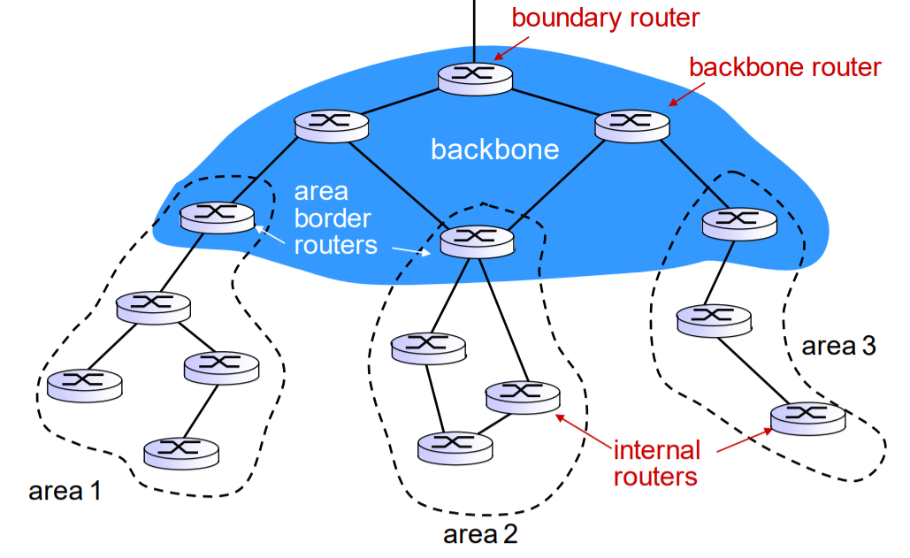

# 네트워크 레이어 part2. 제어 평면

## OSPF

**자율 시스템 AS Autonomous System**

- **확장 문제** - 수억개의 라우터 목적지 라우팅 정보를 저장하려면 거대한 메모리를 필요로 함
- **관리 자율성 문제** - ISP는 자신의 네트워크를 원하는대로 운영하거나 네트워크 내부 구성을 외부에 감추고자 함
- 두 문제를 해결하기 위한 AS (자율 시스템)
- 동일한 관리 제어 하에 있는 라우터의 그룹으로 구성되며, 이들은 고유한 ASN(넘버)로 구별
- 한 AS 안에는 동일한 라우팅 알고리즘을 사용하고, 상대방에 대한 정보를 갖고 있다.
- 자율 시스템 내부에서 동작하는 라우팅 알고리즘을 AS 내부 라우팅 프로토콜이라 부름

`Intra-AS : AS 내부 프로토콜`

`Inter-AS : AS 외부 프로토콜`

`gateway router : 다른 AS와 연결되는 라우터`

**개방형 최단 경로 우선 프로토콜 Open Shortest Path First OSPF**

관리자가 일일이 경로를 지정하지 않아도 패킷이 알아서 길을 찾아나가는 다이나믹 라우팅 프로토콜 (Dynamic Routing Protocol) 방식 중, 링크 상태를 확인하여 최단 경로를 찾는 알고리즘을 통해 확인된 경로를 바탕으로 패킷을 전달해주는 라우팅 프로토콜.

- 하나의 AS(Autonomous System) 안에서 동작하는 Link State Routing Protocol
- Link State 기술에 의한 최단경로 선택 알고리즘. 다익스트라의 SPF(Shortest Path First)

<aside>
💡 라우터는 링크 상태를 AS 내부 모든 라우터에게 flood.

각 라우터는 전체 AS에 대한 완벽한 토폴로지 지도(즉 그래프)를 얻는다.

OSPF는 링크의 가중치 설정 방법에 특정하지 않고, 주어진 링크 가중치에 대해 최소 비용 경로를 결정하는 방법을 제공

모든 링크 가중치를 1로 하여 최소 홉 라우팅을 하거나, 링크 용량에 반비례하는 가중치를 주어 적은 대역폭의 링크 사용을 최소화하는 라우팅을 할 수 있다.

</aside>

장점

- 빠른 재수렴 (Fast Reconvergence) - 네트워크의 모든 라우터 간 정보를 주고 받는데 걸리는 시간을 **컨버전스 타임**(Convergence Time)이라 하는데, OSPF는 변화가 생기면 바로 해당 정보를 전파해 즉시 변경된 라우팅 정보를 반영해 빠른 컨버전스 타임을 가진다
- 부분 갱신(Partial Update) - 링크 상태 Link State 변화시에만 라우팅 정보를 전송해 리소스 낭비 방지 (멀티캐스트)

- Area 개념을 통해 OSPF 네트워크를 더 작은 영역으로 나눠 관리하므로 더 효율적인 라우팅 및 관리가 가능. 따라서 큰 네트워크 적합. 반드시 백본 영역(Area 0)이 존재해야 하며, 연결되지 못한 경우 Virtual 링크를 통해 연결되어야 한다
- Sub Area 개념을 통해 내부 라우터에게 외부 경로에 대한 정보를 차단하고 기본 라우팅만 전달. 따라서 라우팅 테이블 크기 대폭 감소 → 네트워크 안정성 확보, 라우팅 성능 향상
- VSLM 지원. 서브넷을 더 잘개 쪼개는 기능을 제공하므로 IP주소를 효과적으로 사용할 수 있을 뿐만 아니라 라우팅 테이블을 줄일 수 있으므로 효율적인 리소스 사용이 가능. 라우트 요약(최적화) 기능을 제공하므로 여러 라우팅 경로를 하나로 묶을 수 있다
- RIP 프로토콜의 경우 홉 카운트가 15로 제한되지만 OSPF는 제한이 없어 네트워크 크기제한이 없음
- 홉 카운트만을 고려하는 RIP와 달리 링크 비용 개념으로 다양한 변수를 기반으로 한 메트릭 산정해 최단 거리를 구하므로 더 효율적이고 빠른 경로 산출이 가능

**토폴로지 Topology**

- **브로드캐스트 멀티 액세스 토폴로지**
  - 네트워크 상에 두 개 이상의 라우터가 연결되는 경우 하나의 메세지를 보내면 브로드캐스트로 네트워크 상의 모든 개체가 정보를 받는 구조. 이더넷 세그먼트

- **점대점 토폴로지**
  - 네트워크 상에서 1:1로 단 한쌍의 라우터만 존재하는 경우
    - 전용선

- **NBMA 토폴로지**
  - 네트워크 상에 두 개 이상의 라우터가 연결되는 것은 브로드캐스트 멀티 액세스와 같으나 브로드캐스트를 하지 못함
    - 프레임 릴레이, x.25 네트워크

**OSPF (Open Short Path First) 주요 용어**

- **이웃(네이버 , Neighbor)**

  = 하나의 라우터에 있어 라우팅 정보를 교환하는 다른 라우터를 일컫는 말이다.

  = 네이버를 잘 맺어야면, 비로소 라우팅 정보를 주고 받게 된다.

  = 한 라우터를 기준으로 볼 때 직접 연결되어 있는 라우터를 말한다.

- **이웃사촌(Adjacency)**

  = 라우팅 정보를 교환하는 좀 더 친밀한 관계로서 네이버가 되는 것이 선행되어야 한다.

- **init, 2way, exstart, exchangem loading, full**

  = 라우터가 상대 라우터와 OSPF 네이버 관계를 맺는 과정이 어느정도까지 진행되었는지 나타내준다.

  = 어떠한 문제로 인해 네이버를 제대로 못 맺는 경우나 각 상태에 따라 어떠한 문제가 있는지 판단할 수 있어 장애처리(트러블 슈팅)이 가능해진다.

  = 예를 들어, 라우터가 네이버를 맺는데 있어 init 상태로 있고 2way 상태가 되지 못한다면, 두 라우터가 양방향으로 OSPF 패킷을 주고 받지 못하는 상황이다.

**OSPF (Open Short Path First) DR, BDR**

- OSPF 라우터들을 총괄적으로 관리해야 할 DR과 DR이 제대로 동작하는지 감독하고 이상이 있을 경우 DR을 대신하는 BDR이 있다.
- OSPF에서 DR과 BDR이 아닌 라우터들은 설정이 변경 되면 자신의 링크 상태를 DR과 BDR에게 알린다.
- DR은 받은 정보들을 모두 일치시키며 관리한다.
- OSPF 구성 라우터 중에 DR이 되기 위해서는 우선순위(Priority)가 높아야 한다. 기본 값은 1이며, 관리자의 설정으로 우선순위를 정할 수 있다.
- 우선 순위가 같다면, 라우터의 ID를 가지고 비교를 한 후 높은 라우터가 DR이 되는데, 라우터 ID는 그 라우터가 가지고 있는 IP 주소 중에 가장 높은 주소로 설정이 된다.
- IP 주소로 DR이 정해진 경우 일반 인터페이스인 경우, 자주 shutdown하게 되면 DR이 계속 바뀔 수가 있어 과부하가 발생하게 된다.
- 이 문제를 해결하기 위해서 Loopback 가상 장치를 생성하여 높은 IP 주소를 할당하도록 한다.
- 우선 순위 이던지, IP 주소로 이던지 DR이 정해진 라우터는 다운이 되지 않는 안정된 라우터여야 한다.
- 우선 순위나 Loopback IP주소를 설정한 경우 라우터를 재부팅하거나 OSPF 프로토콜을 재시작해야 적용이 된다.

**OSPF DR, BDR 선출 과정**

① 어느 라우터의 우선순위(Priority)가 높은가?

② 어느 라우터의 라우터 ID가 높은가?

**OSPF (Open Short Path First) 이웃 (Neighbor)**

- OSPF는 주위의 OSPF 라우터들을 찾아 자신의 데이터베이스 안에 저장하여 주위에 어떤 라우터가 있는지 인지한다.
- 단계별로 INIT → 2WAY → EXSTART → EXCHANGE → LOADING → FULL 순으로 진행한다.
- 이웃 연결 확인은 프리빌리지 모드에서 #show ip sopf neighbor 명령어를 통해 알 수 있다.
- 이웃이 되었다면 Full 상태가 되고, 연결이 되지 않았다면 이웃 목록에 없거나 Attempt 상태가 지속될 것이다.

**OSPF (Open Shor Path First) 단계별 사용하는 패킷 종류**

**INIT → 2WAY → EXSTART → EXCHANGE → LOADING → FULL**

**HELLO 패킷**

**DAD, LSR, LSU, LSAch 패킷**

① Down State

- R1, R2 두 라우터 모두 꺼져있는 상태이다.
- 관리자는 우선순위 (기본 값 : 1)나 Router ID를 설정하여 임의 지정할 수 있다. (우선순위 0~255)
- 우선순위와 Router ID가 높을 수록 DR이 되며, 우선순위를 0으로 지정하면 DR, BDR에 제외된다.

② Attempt State

- 두 개의 라우터가 모두 켜지게 되면 R1에서 Hello 메시지를 내보낸다.
- 라우터 ID를 내보내는데, R1 라우터에 연결된 IP 주소 중에 가장 높은 주소를 보낸다.
- Hello 메시지 패킷은 브로드캐스트가 아닌 멀티캐스트 주소 224.0.0.5 를 이용해서 OSPF에 연결된 라우터들에게만 보낸다.

③ Init State

- R2는 Hello 메시지를 받아 자신의 라우터에 이웃 목록을 넣게 되며, 이 과정을 Init State라고 한다.

④ 2-Way State

- DR/BDR이 선출되는 상태로서 Hello 패킷이 교환 완료되어 이웃을 맺는 상태이다.
- Neighbor Table이 생성된다 (확인 명령어 : show ip ospf neighbor)

⑤ Exstart State

- Adjacency 로서 서로 데이터베이스를 주고 받을 수 있는 단계이다.
- Router ID가 높은 라우터를 Master 라우터로 선출하고, 낮은 라우터를 Slave 라우터로 선출한다.

⑥ Exchange State

- 이웃 관계가 되어 서로 OSPF 데이터를 주고 받는다.
- 여기부터 주고 받는 패킷의 종류는 DBD, LSR, LSU, LSACK이 있다.
- Master 라우터에서 Slave 라우터 쪽으로 DBD 패킷을 전송한다.
- Slave 라우터에서 Master 라우터 쪽으로 DBD 패킷을 전송한다.

⑦ Loading State

- LSR 패킷 및 LSU 패킷을 교환한다.

⑧ Full State

- OSPF 이웃 관계를 완성 시킨다.
- 이 과정이 끝난 후 SPF 알고리즘을 통해서 Metric 계산

## **BGP**

### BGP

### BGP (Boarder Gateway Protocol)

- 각 경계 간으로 이루어지는 즉 AS와 AS 간 사용되는 라우팅 프로토콜 이다.

- 라우팅 방식이 Path Vector (or Advanced Distance Vector) 방식을 따른다.

- 수렴 속도가 느리다.

- IGP에 비해 설정이 복잡하고 경로 조정 시에 여러 가지를 고려해야 함으로 관리자가 적극 개입 한다.

### IGP(Interior Gateway Protocol)

- AS 내부 간에서 이루어지는 라우팅 프로토콜이다.
- 라우팅 방식이 Distance Vector 방식과 Link State 방식이 있다.
- 수렴 속도가 빠르다.
- 설정이 비교적 간단하고 경로 조정 시 단순히 Metric 값 조정으로 하여 간단하고 관리자 개입이 적다.

---

### BGP Routing

- BGP 라우팅 정보를 보내기 위해서는 eBGP와 iBGP가 사용되고 또한 IGP도 필요하다.

- 각 Protocol을 통해 라우팅 정보가 전송되어 라우팅이 이루어 진다.

- BGP에서 Protocol마다 사용하는 기능을 알아보면

  1. IGP

     - AS 내부의 라우팅 정책을 구현하기 위해 사용한다. (RIP, EIGRP, OSPF)

  2. eBGP

     - AS와 AS 간의 BGP 라우팅 정보를 교환하기 위해 사용한다.

  3. iBGP

     - AS 내에서 BGP 라우팅 정보를 교환하기 위해 사용한다.

---

### 용어 정리

자율 시스템(AS: Autonomous System)

- AS 내의 라우터들은 서로 동일한 라우팅 프로토콜을 사용한다.
- AS 내의 네트워크와 라우터들은 한 조직에 의해 관리된다.
- 인터넷은 각 AS들이 복잡하게 연결 구성된다.

## SDN 제어 평면

### SDN 제어 평면

- Software-Defined Networking
- 중앙화된 제어 평면
- 소프트웨어 기반 네트워킹

### SDN 구조의 특징

- 플로우 기반 포워딩
  - SDN으로 제어되는 스위치들에서의 패킷 전달은 트랜스포트 계층, 네트워크 계층, 링크 계층 헤더의 어떤 값을 기반으로 하든 가능하다.
- 데이터 평면과 제어 평면의 분리
  - 데이터 평면 : 네트워크 장비들로 구성. 데이터의 실질적인 전송을 담당.
  - 제어 평면 : 소프트웨어로 구성. 플로우 테이블을 결정, 관리.
- 네트워크 제어 기능이 데이터 평면 스위치 외부에 존재
- 프로그램이 가능한 `네트워크`

### SDN 컨트롤러

[https://t1.daumcdn.net/cfile/tistory/9989AD335A2B7CCD31](https://t1.daumcdn.net/cfile/tistory/9989AD335A2B7CCD31)

- 통신 계층
  - SDN 컨트롤러와 제어받는 네트워크 장치들 사이의 통신
- 네트워크 전역 상태 관리 계층
  - 네트워크 장치들의 플로우 테이블 결정
- 네트워크 제어 응용 계층과의 인터페이스
  - 네트워크 제어 어플리케이션이 네트워크 상태 정보와 플로우 테이블을 읽도록 상호작용

### OpenFlow 프로토콜

- 컨트롤러 → 스위치
  - 설정 : 스위치의 설정 파라미터를 문의하거나 설정
  - 상태 수정 : 플로우 테이블의 엔트리를 추가/제거/수정 하거나 스위치 포트의 특성 설정
  - 상태 읽기 : 플로우 테이블과 포트로부터 통계 정보와 카운터 값을 요청
  - 패킷 전송 : 스위치의 지정된 포트에서 특정 패킷을 내보낼 때 사용
- 스위치 → 컨트롤러
  - 플로우 제거 : 어떤 플로우 테이블 엔트리가 시간이 만료 되었거나, 상태 수정 메시지에 대한 결과로 삭제되었음을 알림
  - 포트 상태 : 포트의 상태변화를 알림
  - 패킷 전달 : 처리, 또는 작업 수행이 필요한 패킷을 컨트롤러에 전달

## ICMP / SNMP

[개발노트 : 네이버 블로그](https://blog.naver.com/hep1224/222475682961)

[SNMP 쉽게 이해하기 #1](https://aws-hyoh.tistory.com/179)

### 1️⃣ ICMP

---

- _Internet Control Message Protocol_
- 인터넷 제어 메시지 프로토콜
- IP 네트워크에서 사용하는 가장 기본적인 프로토콜 ⇒ 네트워크 계층 (3계층)
- 네트워크 제어를 위한 각종 메시지가 규정

### 🔵 IP

---

- Internet 상에서 Host 주소지정 및 packet 전달
- End-to-End 간에 전송되는 메시지의 안정성이나 흐름제어에 대해서는 책임 없음 ⇒ 비신뢰적
- TCP, UDP, ICMP를 위해 호스트에서 호스트, Internet datagram 전송 담당 프로토콜

---

### 🔵 ICMP 용도

---

- 운영체제에서 오류 메세지 전송받는 프로토콜
- Error condition 이나 unexpected circumstance에 대한 information 제공
- HOST간의 패킷, 메시지 전달 목적이 아님

  ⇒ 네트워크 상태에 관한 파악이 주 목적

- 네트워크의 어떤 특정 지점에서 IP 라우터가 HTTP 요청 메시지에 명시된 호스트로 가능 경로를 찾을 수 없을때
  - 해당 라우터가 호스트에게 오류가 발생했음을 알리기 위해 ICMP 메시지를 만들어서 보낸 것
- ICMP Message Format

  

  1. **_ICMP Message Type_**
     - ICMP 메시지를 구별하는 역할
  2. **I*CMP Code***
     - 메시지 내용에 대한 목적과 용도, 즉 ICMP Type에 대한 상세 정보
  3. **_ICMP Checksum_**
     - ICMP 값이 변경 유무를 확인
  4. **_ICMP Message_**
     - ICMP Type에 따라 가변적으로 들어가는 내용

  

  - 0, 3, 5, 8, 11
    - 8 : 요청
    - 0 : 응답
    - 3 : 가는 경로상의 문제 (중간 라우터 설정이 잘못)
    - 11 : 상대방에게 문제 (방화벽)
    - 5 : ICMP 라우터 테이블을 수정할 때 사용

### 🔵 ICMP ping

---

- ping을 통해 ICMP를 자주 사용
  1. CDM 창을 열어 ipconfig ⇒ IP 주소 찾기
  2. Gateway 주소를 확인하여 ping 명령어 사용
  3. ping이 잘 도착하면 인터넷 통신 이상이 없음
- tracert 명령어도 사용
  1. CDM 창을 열어 tracert URL

### 2️⃣ SNMP

---

- Simple Network Management Protocol
- 네트워크 7계층 중에서 응용 계층에 해당하는 프로토콜
- TCP / IP 프로토콜 을 사용하는 인터넷에서 장치들을 관리하기 위해 사용하는 프로토콜
  - UDP에 캡슐화되어 전송
- 일반적으로 서버 / 네트워크 장비 / SNMP 설정이 가능한 장비들에 SNMP를 설정하면
  - SNMP서버에서 그 장비들에 대한 정보(CPU 사용률, 포트 UP/Down , Memory사용률 등등)를 수집
  - NMS나 SMS 같은 프로그램에서 표출/관리
- 원격지에서 전산자원을 운영, 관리할 수 있도록 지원해주는 가장 간단한 형태의 망관리 프로토콜
- 서버에서 클라이언트로 주기적으로 상태정보를 요청하며 자원관리 수행
- 프로토콜일 뿐임
  - **SNMP 프로토콜을 활용해서 실제 네트워크 관리 정보를 얻어오기 위해서는 어플리케이션이 필요!**

### 🔵 기능

---

- 네트워크 구성관리
- 성능 관리
  - 가동률
  - 응답시간
  - 정확도
  - 처리량
  - 효율
- 장비 관리
- 보안 관리

### 🔵 동작방식

---

- Manager

  - Agent에 필요한 정보를 요청하는 역할 수행
  - 장비의 정보를 수집하는 하드웨어/소프트웨어
  - 162/UDP 포트

- Agent
  - Agent가 설치된 시스템 정보나 네트워크 정보 등을 수집하여 MIB 형태로 보관, Manager에 전달해주는 역할
  - 정보를 제공하는 주체인 네트워크 장비
  - 161/UDP 포트

---

> **데이터 수집 방법**

1. **Polling**
   - 요청에 응답하면 방법
   - 매니저가 에이전트에게 원하는 정보를 요구하면 에이전트는 매니저가 원하는 정보를 찾아서 응답
   - 간단하지만 트래픽을 많이 사용
2. **Event Reporting**
   - 특별한 이벤트가 발생했을 경우 전송되며 트랩이라고 함

### 🔵 **SNMP 주요 용어**

---

- **MIB** (Management Information Base)
  - 관리 되어야 할 정보, 자원을 객체(Object)라 하며, 이 객체들을 모아놓은 집합체
  - 관리자가 조회하거나 설정할 수 있는 객체들의 데이터베이스
  - MIB는 객체별로 트리 형식의 구조를 이룸
- **SMI** (Structure Management Information)
  - MIB를 정의하기 위한 구조를 의미함
  - ASN.1(Abstract Syntax Notation) 언어를 사용
  - 데이터와 데이터 속성들을 설명하기 위한 공식 언어로, 다수 프로그램 언어에서 데이터를 데이터 유형과 값으로 표현
  - 정의된 모든 객체는 name, syntax, encoding을 가짐
    - name : 해당 객체를 식별하기 위한 식별자 (OID : Object Identifier)
    - syntax : 객체의 데이터 유형(ex. INTEGER, OCTET STRING 등)
    - encoding : 메세지 전송 시 비트 변환 규칙(ASN.1의 encoding rule 중 BER(Basic Encoding Rules) 사용)

### 🔵 SNMP 명령어

---

- **Get** : 관리정보를 검색
  - 변수 읽어 들이기, Agent가 가지고 있는 변수 읽기
- **Get-Next** : 관리정보를 연속해서 검색
- **Set** : 관리정보를 바꾸는데 사용
  - 변수 써넣기, Agent가 갖고있는 변수 바꿔쓰기
- **GetResponse** : 관리시스템 명령에 대한 응답
- **Trap** : 예외 동작을 통지, 예상치 못한 사태 발생을 알림
