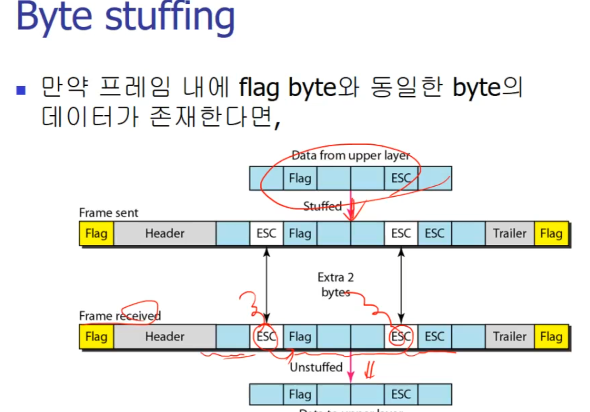
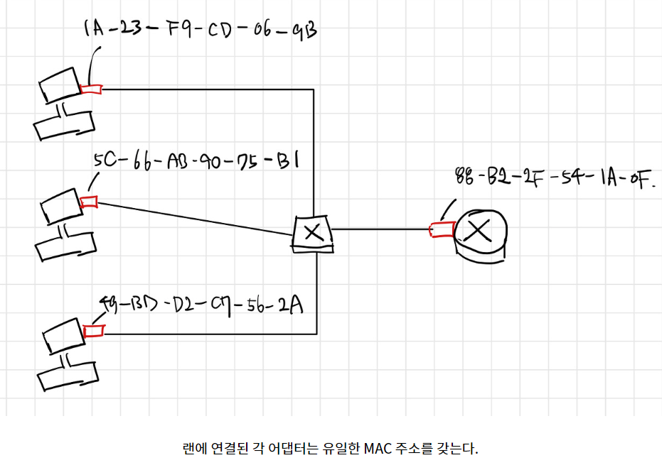
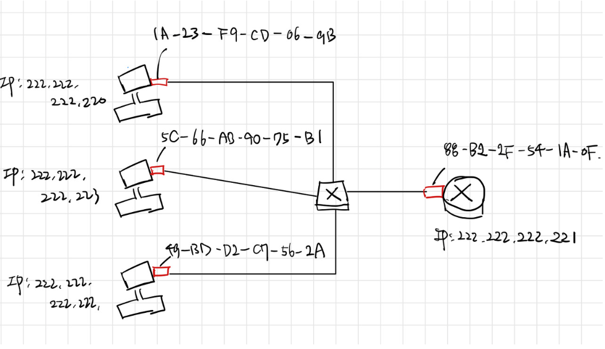

# 링크 계층과 근거리 네트워크

## 링크 계층 오류 및 정정 기술

링크 계층은 어떤 노드(호스트/라우터)로부터 인접한 노드까지 연결한 엣지(링크)로 안전하게 패킷/데이터그램을 옮기는 책임을 가진다. 이를 위한 기능과 절차를 제공하며, 1계층인 물리 계층에서 발생할 수 있는 오류를 감지하고 수정한다. 대표적인 프로토콜로는 이더넷이 있다.

네트워크 계층에서 받은 데이터그램을 **프레임** 단위로 쪼개어 전송하며, 이 프레임들은 전송 과정 중 모든 링크가 같은 프로토콜을 사용하지 않고, 다른 서비스를 제공하는 다른 프로토콜을 거치게 된다. 따라서 링크 계층은 논리 구현과 더불어 실제 기기(NIC, 칩셋 등)가 존재해야 한다. **전송 속도와 정확성**을 목적으로 한다.

**링크 계층(data-link layer)**

- 프린스턴에서 로잔까지 간다면,

- 1. 리무진을 타고 프린스턴에서 JFK 공항까지

- 2. 비행기를 타고 JFK 공항에서 제네바공항까지

- 3. 기차를 타고 제네바 공항에서 로잔까지

이때 여행객=데이터그램,

운송 부분=통신 링크,

운송수단=링크계층 프로토콜,

여행 플래너 = 라우팅 알고리즘

**MAC**

물리적 부분. 매체간 연결 방식을 제어하고 1계층과 연결되어 있다. 48bit 6-byte로 구성되어 있으며, 각 바이트마다 16진수로 표현된다.

<aside>
💡 앞 세자리는 Organization Unidque Identifier ( OUI ) 제조사 식별 코드

나머지 3자리는 제조사의 일련번호

따라서 MAC로 어떤 제조사가 만들었는지 구분할 수 있고, 고유한 주소를 가진다.

</aside>

**LLC**

논리적 부분. 데이터 링크의 데이터 프레임인 Protocol Data Unit (PDU)를 만들고 이를 3계층인 네트워크 계층과 연결한다.

**링크 계층 서비스**

시스템 간에 접속되어있는 물리적 링크를 통해 신뢰성있는 정보를 전송하는 기능을 제공.

- **노드 대 노드 전달** : 인접 노드 사이를 잇는 링크에서 데이터 전달을 담당

- **프레이밍**(framing) : 계층에서 구성되는 데이터의 단위인 데이터그램에 헤더와 트레일러를 붙여 프레임(frame) 단위로 포장. 주소 지정.

- 헤더`Header` : 목적지, 출발지 주소 그리고 데이터 내용을 정의
- 트레일러`Trailer` : 비트의 에러를 감지

- 공유 매체라면 채널 접근

- **접근 제어** : 두 개 이상의 노드들이 동일한 링크에 연결될 경우 충돌을 방지하기 위한 제어 기능이 필요

- **흐름 제어**(flow control) : 수신 노드의 버퍼가 넘치지 않도록 하기 위해 인접한 노드 간의 송신과 수신의 속도를 제어 . Feedback 방식으로 흐름을 제어하며 이를 **Stop & Wait** 방식이라 부르기도 한다. 상위 계층은 Rate 기반.

**Flow Control 방식 중 하나 Sliding Window**

재전송 발생 시 슬라이딩 윈도우

ACK의 응답 없이 여러 개의 프레임을 연속으로 전송. 이때 데이터를 보관하고 있는 `Window`
라는 버퍼가 있는데, 이 `Window`의 크기가 전송과 수신 측의 데이터가 저장되는 버퍼의 크기.

- **에러 탐지**(error detection) : 에러(신호 감쇠, 노이즈로 인해 발생)를 수신자가 탐지해서 재송신 받거나 버림

- **에러 수정**(error correction) : 수신자가 에러 탐지 후 비트 오류를 스스로 수정

- **반양방 통신**(한 쪽이 송신하고 있을 때 다른 한 쪽은 수신할 수 밖에 없음) / **전이중 통신**(쌍방향)

- **동기화** : 데이터의 시작과 끝을 알리기 위한 방식으로 헤더 앞 부분에 일정한 비트 패턴을 첨가. 프레임의 헤더에는 시작과 도착점을 식별하기 위해 MAC 주소가 존재(IP와 다름)

**링크 계층의 실제 위치**

- 모든 호스트 안에 존재

- 어댑터(NIC 네트워크 인터페이스 카드)나 칩셋 = (컨트롤러 + 물리계층)

- 호스트의 시스템 버스에 붙어 있음

- 하드웨어, 소프트웨어, 펌웨어 등 다양하게 사용됨

- 송신측은 데이터그램을 프레임으로 캡슐화 하고, 오류 확인용 비트, rdt, 흐름 제어 요소 등을 추가한다.

- 수신측은 에러여부, rdt, 흐름 제어 요소를 확인하고 데이터그램을 확인해 상위 계층으로 넘긴다

### 오류 확인 ( 트랜스포트 레이어 참고)

[https://www.youtube.com/watch?v=YYzBWOssrfk&list=PLwaVnP-dAv35UWQ7ObLNwU78asNwYzdI6&index=5](https://www.youtube.com/watch?v=YYzBWOssrfk&list=PLwaVnP-dAv35UWQ7ObLNwU78asNwYzdI6&index=5)

**패리티 검사**

single bit(더해서 홀짝인가),

two-dimensional bit(가로세로 다 더해서 홀짝인가)

**체크섬 방법**

송신자는 데이터를 16bit 정수로 읽고 1의 보수합을 해 데이터그램 한 켠에 넣는다. 수신측에서 이를 검사

**[순환 중복 검사 CRC](http://blog.skby.net/%EC%88%9C%ED%99%98-%EC%A4%91%EB%B3%B5-%EA%B2%80%EC%82%AC-crc-cyclic-redundancy-check/)**

- 네트워크 등을 통하여 데이터를 전송할 때 전송된 데이터에 오류가 있는지를 확인하기 위한 체크값을 결정하는 방식
- 송신측에서는 CRC값을 데이터에 붙인 코드워드를 전송하며, 수신측에서는 수신된 코드워드에서 CRC값을 이용하여 에러 발견
- CRC 기법은 수학적 연산 과정은 복잡하나, 높은 오류 검출율과 간단한 H/W 구현 가능
- CRC-8/-10/-16/-32 유형 존재

뒤에 나머지를 붙여서 송신측에서 보낸다. 수신측이 110을 갖고 같은 연산을 해나가면 0이 나오고 이를 통해 검사한다

## 다중 접속 링크와 프로토콜

### [Network]링크 계층의 다중 접속 프로토콜이란?

### 2. 다중 접속 링크와 프로토콜

컴퓨터 네트워크에서 수백 개에서 수천 개의 노드들이 브로드캐스드 채널을 통해 통신한다. 모든 노드들이 프레임을 전송할 수 있기 때문에 하나의 노드가 여러 개의 프레임을 받게 되면 충돌이 발생한다. 일반적으로 충돌이 발생하면 프레임의 의미를 파악할 수 없게 된다.

다중 접속 프로토콜은(multiple access protocol) 브로드캐스트 채널이 제대로 동작하도록 보장한다. 다중 접속 프로토콜은 채널 분할 프로토콜, 랜덤 접속 프로토콜, 순번 프로토콜으로 분류할 수 있다.

### 2.1 채널 분할 프로토콜 (channel partitioning protocol)

채널 분할 프로토콜은 시간을 분할하는 방식과 주파수를 분할하는 방식이 존재한다. (+ 무선 채널에서 사용되는 코드 분할 다중 접속도 있다.)

### **_1. TDM_**

시분할 다중화(time division multiplexing, TDM)은 시간을 **time frame**으로 나누고 **각 프레임을 N개의 time slot**으로 나눈다. 분할된 time slot은 N개 노드에게 각각 할당한다. 노드는 전송할 패킷이 있을 때마다 TDM 프레임에서 자신에게 할당된 time slot 동안 패킷을 전송한다.

칵테일 파티에서 파티 참석자가 번갈아 가며 말을 한다고 하자. TDM은 참석자에게 고정된 시간 동안 말을 할 수 있는 기회를 주는 것이다. “일단” 모든 사람에게 말을 할 수 있는 기회가 주어진다.

- TDM은 충돌을 제거할 수 있다.
- 전송할 패킷이 있는 노드가 단 하나인 경우에도 전송률이 평균 R/N으로 제한된다.
- 전송을 위해 항상 자신의 차례를 기다려야 한다.

### **_2. FDM_**

주파수 분할 다중화(frequency division multiplexing, FDM)은 **R bps의 채널을 각 R/N의 대역폭을 갖는 주파수로 나눠** N개 노드에게 각각 할당한다.

- FDM은 충돌을 제거할 수 있다.
- 전송할 패킷이 있는 노드가 단 하나인 경우에도 대역폭이 R/N으로 제한된다.

### 2.2 랜덤 접속 프로토콜 (random access protocol)

랜덤 접속 프로토콜에서는 노드는 항상 채널의 최대 전송률인 R bps로 프레임을 전송한다. 만약 충돌이 발생하면 각 프레임이 충돌 없이 전송에 성공할 때까지 재전송한다. 이 때, 재전송을 즉시하는 것이 아니라 랜덤 시간 동안 기다린 후 재전송하는 것이다.

일반적으로 사용되는 랜덤 프로토콜의 종류에는 알로하 프로토콜, CSMA 프로토콜이 있다.

### **_1. 슬롯 알로하_**

슬롯 알로하는 다음과 같은 특징을 갖는다.

- 모든 프레임은 정확히 L 비트로 구성된다.
- 시간을 L/R초의 슬롯들로 나눈다.
- 노드는 슬롯의 시작점에만 프레임을 전송 시작한다.
- 각 노드들은 슬롯의 시작점을 알고 충돌이 발생하면 슬롯이 끝나기전에 충돌 발생을 알게 된다.

TDM와 유사하게 시간을 분할하지만 노드들의 위치를 고정하지는 않은 방식이라 생각하면 된다. 노드들에게 정해진 순서가 없기 때문에 충돌이 발생할 수 있다. 각 노드들은 정해진 확률 p로 다음 슬롯에서 프레임을 재전송하면 된다.

슬롯 알로하에서는 채널 분할과 달리 채널의 최대 전송률인 R로 프레임을 전송할 수 있다. 또한 노드가 충돌을 감지하고 언제 재전송할 지 각자가 결정하기 때문에 분산된 구조이다. 다만 노드들이 슬롯의 시작점과 충돌 발생을 알기 위해 동기화 과정이 필요하다.

슬롯 알로하는 노드가 하나일 때는 잘 동작하지만 많은 노드들이 프레임을 전송하려고 한다면 충돌이 계속해서 발생할 것이고 충돌이 발생한 슬롯은 낭비 되어버린다. 게다가 확률적인 정책으로 인해 빈 슬롯이 발생하기도 한다.

### **_2. 알로하_**

알로하 프로토콜은 처음에 슬롯이 없는 완전히 분산된 형태의 프로토콜이었다. 프레임이 준비되면 즉시 그 프레임 전체를 브로드캐스트 채널로 전송하고 충돌이 발생한다면 확률 p로 즉시 재전송한다.

### **_3. CSMA (Carrier Sense Multiple Access)_**

이름에서 알 수 있듯이 CSMA는 캐리어를 감지한다. 다시 칵테일 파티의 예시를 들어보자면 다른 사람이 말을 하고 있다면, 말이 끝날 때까지 듣고 있는 것이다. 다른 사람의 말이 끝나면 내가 말을 시작한다. CSMA는 어느 정도 충돌을 회피하는 전략이다.

캐리어를 감지하고 만일 채널이 유휴 상태일 때 프레임을 전송하더라도 비슷한 시기(다른 프레임이 전송되고 있다는 것을 알아채기 전)에 프레임을 전송하는 노드와 충돌이 여전히 발생한다. CSMA에서는 충돌이 발생했음에도 불구하고 자신의 프레임 전체를 계속해서 전송한다.

### **_4. CSMA/CD (CSMA with Collision Detection)_**

CSMA/CD에서는 충돌을 감지한다.

1. 네트워크 계층으로부터 데이터그램을 받아서 프레임으로 캡슐화한다. 프레임을 버퍼에 저장한다.
2. 각 노드들은 채널이 유휴한 것을 감지하면 프레임 전송을 시작한다.
3. 전송하는 동안 노드들은 브로드캐스트 채널을 사용하는 다른 노드로부터의 신호가 있는지 감시한다. (Collision Detection)
4. 신호가 감지되지 않으면 전송을 완료한다. 만약 신호가 감지되면 자신의 프레임 전송을 취소한다.
5. 전송 취소 이후 랜덤 시간만큼 기다린 후 채널이 유휴하다면 다시 프레임 전송을 시작한다.

---

여전히 문제는 남아있다. 만약 기다리는 시간의 간격이 작고 충돌하는 노드의 수가 많으면 프레임 전송이 반복해서 취소될 것이다.

이더넷 프로토콜에서는 **이진 지수적 백오프 알고리즘**을 통해 랜덤 시간의 최댓값을 2배로 늘리며 대기한다. 즉, 충돌을 n번 경험한 프레임은 [0,1,2,4,…,2^n-1] 중에서 고른 랜덤 시간만큼 기다린다.

### 2.3 순번 프로토콜 (taking-turns protocol)

순번 프로토콜에는 폴링 프로토콜과 토큰 전달 프로토콜이 있다.

**폴링 프로토콜**은 마스터 노드가 라운드 로빈 방식으로 각 노드들에게 순서를 정해주는 방식이다. 만약 마스터 노드가 고장나면 전체 채널이 동작하지 못한다. 동시에 자신의 순서가 되었음을 알려주는 시간이 생기기 때문에 지연이 발생한다.

**토큰 전달 프로토콜**은 토큰을 가진 노드가 프레임을 전송하고 다른 노드에게 토큰을 전달한다. 이 방식에서도 노드 하나가 고장나면 이후의 전체 채널이 동작하지 못하게 된다.

## 스위치 근거리 네트워크

### 링크 계층 주소체계와 ARP

호스트와 라우터들은 네트워크 계층 주소(IP)를 가지고 있는데

사실 호스트와 라우터들은 네트워크 계층 주소 뿐만 아니라 링크 계층의 주소도 가진다고 한다.

그런데 호스트와 라우터들은 모두(네트워크 계층 주소, 링크 계층의 주소)를 필요로 하는가 하면

### MAC 주소 (링크 계층 주소)

우선 실제로 링크 계층 주소를 가지는 것은 호스트나 라우터가 아닌

호스트나 라우터의 `어댑터(네트워크 인터페이스)`이다.

여기서 어댑터란 LAN을 의미한다.

또한 링크 계층 주소를 `랜 주소 또는 MAC 주소`라고 한다.

- 대부분 랜의 경우 MAC 주소의 길이가 6Byte이기에 2^48개 만큼 사용 가능한 랜 주소가 존재한다고 한다.
- 그래서 6Byte의 주소는 주로 16진수로 표기되며, 주소의 각 비트는 2개의 16진수로 표현된다고 한다.
- 또한 MAC 주소는 어떤 어댑터도 동일한 주소를 갖지 않는 유일한 주소를 가진다는 점. (IEEE가 MAC주소 공간을 관리하기 때문)
- 또한 어댑터의 MAC주소는 평면 구조를 가지고 있어 어댑터의 위치에 따라 변경되지 않는다고 한다.
  - 즉 이더넷 카드가 있는 휴대용 컴퓨터는 어디에 있든지 항상 동일한 MAC주소를 갖는다는 의미.

정리하자면

- 어댑터의 MAC 주소는 사람의 주민등록번호와 같은 느낌이며
- IP 주소는 사람이 살고 있는 우편 주소와 유사한 느낌을 준다.
- 우편 주소와 주민등록번호 두 가지를 다 가지는 것이 사람을 찾는 데 유용한 것처럼,
- 호스트와 라우터 인터페이스 역시 네트워크 계층 주소와 MAC 주소를 모두 가지는 것이 유용하다

따라서 다수의 네트워크 인터페이스를 가지고 있는 호스트나 라우터는 같은 서브넷 안에 여러 개의 링크 계층 주소를 가지게 되지만

링크 계층 스위치는 호스트나 라우터를 연결해주는 인터페이스에 링크 계층 주소를 할당받지 않았는데

이유는 링크 계층 스위치는 호스트와 라우터 간에 데이터그램을 전달하는 일만을 하기 때문이다.

그래서 아래의 그림을 보면, 스위치가 아닌

각 호스트나 라우터에만 링크 계층 주소가 할당되어 있다는 것을 알 수 있다.

그래서 MAC 주소가 필요한 이유를 한번 더 정리하자면

- 송신자는 MAC 주소를 프레임에 넣고 랜상으로 전송하며
- 수신자는 해당 MAC주소와 자신의 MAC주소가 일치할 때만
- 해당 프레임을 상위 계층인 네트워크 계층으로 전달하기 때문이다.

---

### ARP(Address Resolution Protocol)

- ARP

  - IP 주소를 MAC 주소로 변환.
  - 네트워크 상에서 IP주소를 물리적 네트워크 주소(MAC)로 대응시키기 위해 사용되는 프로토콜

- RARP
  - 호스트의 물리적 주소로부터 IP 주소를 구할 수 있도록 하는 프로토콜

위 그림의 상황에서

- IP 주소 222.222.222.220을 가진 호스트가
- 동일한 서브넷에 존재하는 호스트 222.222.222.222로 IP 데이터그램을 전송한다면

데이터그램을 전송하기 위해서는 출발지 노드는 반드시 자신의 어댑터에게 IP 데이터그램뿐만 아니라

목적지 222.222.222.222의 MAC 주소도 알려주어야 합다.

그래야 송신 어댑터가 목적지의 MAC 주소가 포함된 링크 계층 프레임을 구성해서 그 프레임을 랜으로 전송할 수 있기 때문.

그런데 이 때, **송신 호스트가 IP 주소 222.222.222.222를 가진 호스트의 MAC 주소를 결정할 수 있는 이유는? 바로 ARP**.

송신 호스트의 ARP 모듈은 입력값으로서 동일한 랜상의 임의의 IP 주소를 받아서 대응되는 MAC 주소를 리턴한다.
위의 예시에서 송신 호스트 222.222.222.220가 자신의 ARP 모듈에게 IP 주소 222.222.222.222를 주면,
ARP 모듈은 대응하는 MAC 주소 49-BD-D2-C7-56-2A를 리턴.

### 이더넷

### 이더넷이란?

- 원칙적으로 하나의 인터넷 회선에 유/무선 통신장비 공유기, 허브 등을 통해
  다수의 시스템이 랜선 및 통신포트에 연결되어 통신이 가능한 네트워크 구조를 의미.

- OSI 7계층 중 물리 계층과 데이터 링크 계층에서 그 구성 형식이 정의된다.

- 이더넷 통신 방식중 중요한 방식인 `CSMA / CD`(Carrier Sense Multiple Access/ Collision Detection) 방식.

  - 즉 충돌 감지 원리
  - 유사한 방식은 CSMA / CA (Carrier Sense Multiple Access/ Collision Avoidance)로 충돌 회피가 있다.

- 그래서 CSMA/CD의 원리는

  

  1. 보낸 사람은 케이블의 신호와 이력을 확인하고, 다른 사람에게 신호가 흐르고 있지않음을 확인 후 전송을 시작한다.
  2. 전송 중에도 파형에 의해 다른 사람의 송신과 충돌하지 않는지를 감시하며,
     만약 충돌하는 경우에는 일정량의 전송 후 중단하고 각 보낸 사람마다 일정 시간의 딜레이를 두고 전송을 재시작 한다.

  (하나의 회선을 다수가 공유하거나, 많은 데이터를 다운로드를 하게 되면, 속도가 느려지듯이 자체적으로 CSMA / CD 방식으로 제어를 한다고 보시면 된다)

### 이더넷(Ethernet) 시스템 규격

통신이 가능한 랜선의 데이터 전송 속도를 정의하는 것으로

가장 많이 사용하는 3가지 종류

- 1000BASE-T
- 100BASE-TX
- 10BASE-T

- 10 BASE 2: 얇은 동축 케이블을 이용하며, 2는 세그먼트의 최장거리가 200m
- 10 BASE 5: 굵은 동축 케이블을 이용하며, 5는 세그먼트의 최장거리가 500m
- 10 BASE F: 광섬유 케이블을 이용하는 이더넷
- 10 BASE T: 10MBps의 전송 속도, 베이스 밴드 방식, Twisted Pair Wire 케이블 사용
- 고속 이더넷(Fast Ethernet): 100 BASE T 라고 불리는 이더넷의 고속 버전
- 기가비트 이더넷(Gigabit Ethernet): 1Gbps의 전송속도를 지원

## 스위치 근거리 네트워크2

### **링크 계층 스위치**

### **스위치란?**

- 여러 네트워크 장치를 연결하는 장치
- 네트워크 중간에서 데이터를 받아 필요한 곳에 보내주는 중재자 역할

### **스위치의 작동 방식**

- 포워딩과 필터링
  - 포워딩 : 데이터를 보낼 장치를 결정하고 해당 장치로 데이터를 보내는 기능
  - 필터링 : 특정 기준에 따라 데이터를 폐기할지 결정하는 기능
- 스위치 테이블

  [https://t1.daumcdn.net/cfile/tistory/24566A4257CAC76220](https://t1.daumcdn.net/cfile/tistory/24566A4257CAC76220)

  - MAC 주소
  - 해당 MAC 주소로 가게 하는 장치
  - 이 정보가 테이블에 만들어진 시점에 대한 정보

- 자가학습
  - 스위치 테이블을 자동으로, 동적으로, 자치적으로 구축
    1. 비어 있는 스위치 테이블
    2. 스위치가 데이터를 받으면 (1) 출발한 MAC 주소, (2) 데이터를 전해준 장치, (3) 현재 시간을 저장
    3. 저장된 MAC 주소에서 수명 시간(aging time)이 지나도 데이터가 오지 않으면 삭제

### **스위치의 특성**

- 충돌 제거
  - CSMA/CD (Carrier Sense Multiple Access with Collision Detection) 프로토콜을 통해 충돌 방지
- 이질적인(heterogeneous) 링크들
  - 각 링크별로 다른 매체 사용, 다른 속도로 동작 등이 가능
- 관리의 용이성
  - 향상된 보안 제공
    - 필터링 기능을 이용하여 승인되지 않은 장치의 엑세스 방지
  - 쉬운 네트워크 관리
    - 어댑터의 오작동 등 오류 해결의 용이
    - 아무 설정 없이 네트워크에 연결해도 데이터를 전달하는 기본 동작 수행 (플러그 앤 플레이 장치 / plug-and-play device)
  - 다양한 통계치 수집
    - 대역폭 사용, 충돌률, 트래픽 종류 등

### **VLAN**

### **VLAN 이란?**

- 가상 근거리 네트워크(virtual local area network)
- 물리적 네트워크를 여러 개의 논리적 네트워크로 분할하여 만든 네트워크
- 각각의 VLAN간에 통신을 하기 위해서는 3계층 장비(라우터)가 필요

### **VLAN의 종류**

- **포트 기반**
  - 연결된 스위치의 포트를 기반으로 VLAN 할당
  - 현재 사용되는 대부분의 VLAN
- **MAC 주소 기반**
  - 스위치에 연결되는 단말의 MAC주소를 기반으로 VLAN 할당
  - 점차 사용이 증가하는 추세

## 링크 가상화 / 데이터 센터 네트워킹

- 다중 프로토콜 레이블 스위칭 MPLS
- 구조(로드 밸런싱, 계층적 구조)
- 동향(비용 감소, 중앙 집중형 SDN 제어 및 관리, 가상화, 물리적 제약, 하드웨어 모듈화와 커스터마이징)

### 💡가상화 (virtualization)

---

### 가상화

- 물리적인 네트워크 자원들의 사용 효율을 높이기 위한 방법
- 자원들을 논리적으로 분리하는 기술
- 클라우드 컴퓨팅(Cloud computing) 구현을 위한 네트워크 인프라 (Infrastructure) 제공 기술로 각광받고 있다.

### 왜 가상화를 이용해야 하는가?

일반적으로 OS를 실행하려면 각 OS를 전용 물리적 서버에서 실행해야 한다.

OS 1개당 물리적 서버 1대가 필요하므로 여러 OS를 동시에 실행해야 하는 경우에는 OS를 모두 실행할 수 있도록 여러 대의 서버가 필요하게 된다.

그리고 여러 운영 체제를 실행하는 것은 비용(초기 + 유지보수)이 많이 드는 작업이다.

그러나 **가상화**를 이용하면 운영 체제를 기반 하드웨어로부터 분리할 수 있으므로 Windows나 Linux와 같은 **여러 운영 체제**를 **하나의 물리적 머신에서 동시에** 실행할 수 있다.

즉 , 가상화를 통해 시간과 비용을 절약할 수 있다.

### 가상화의 장점

- **유연성**: 동일한 하드웨어에서 여러 운영 체제를 동시에 실행할 수 있다.
- **민첩성**: 한 물리적 서버에서 다른 물리적 서버로 파일이나 사진을 이동하는 것처럼 운영 체제 이동이 가능하다.
- **내결함성**: 물리적 서버에 장애가 발생하면 관리 소프트웨어는 이용 가능한 다른 서버로 신속하게 인스턴스를 마이그레이션하여 물리적 하드웨어에 장애가 발생했다는 것조차 알 수 없도록 조치한다.
- **비용 효율성**: 필요한 물리적 서버 수를 줄일 수 있고 전기 요금과 운영 및 유지보수 비용도 절감할 수 있다.

### 네트워크 가상화

**네트워크 가상화**란 하나의 물리 네트워크 위에서 여러 가상 네트워크를 생성하고, 각각의 가상 네트워크를 마치 실제 물리 네트워크와 같이 사용하는 기술을 통칭하는 용어입니다.

[그림 1]에서는 서버 가상화와 네트워크 가상화에 대한 개념도를 나타냅니다.

서버 가상화가 하나의 물리 서버에서 하이퍼바이저(Hypervisor)가 동작하여 논리적인 단위의 여러 가상 서버들을 생성하여 마치 실제 물리 서버인 것처럼 사용하는 기술인 반면,

**네트워크 가상화는 여러 서버들 및 스위치, 라우터 등과 같은 네트워크 장비들과 함께 이루어진 물리 네트워크를 논리적인 여러 가상 네트워크로 쪼개어 각각을 마치 실제 물리 네트워크처럼 사용하는 기술**을 이야기합니다.

### 링크 가상화

- 링크 가상화 소프트웨어를 이용해 하나의 물리적인 네트워크 인터페이스(NIC: Network
  Interface Card)로부터 다수의 가상 네트워크 인터페이스를 제공하는 기술
- 소프트웨어적인 네트워크 가상화를 지원하는 기술로는 Xen 과 VMware, Linux VServer, Crossbow, Trellis`s link virtualization 기술 (EGRE)이 있다

### 링크 가상화 기술

- **Trunk** (하나를 여러 개인 것처럼)
  - 하나의 링크 속에서 vlan 10, vlan 20등과 같이 VLAN TAG로 캡슐화된 패킷이 돌아다닐 수 있게 함으로써 하나의 링크이지만, 각 VLAN을 위한 링크 여러개가 있는 것처럼 사용하기 위한 솔루션
- **EC** (여러 개를 하나인 것처럼)
  - 스위칭 루프를 방지하며 여러 개의 링크를 하나로 합쳐서 bandwidth를 늘리기 위한 솔루션
  - 8개 링크까지 합치기 가능

### 💡MPLS (Multi Protocol Label Switching)

---

### MPLS

- 라벨 단위에 기반한 라우팅 기법
- OSI 7 계층 중 Layer3 에 해당하는 IP(Internet Protocol) 를 확인하여 패킷을 전달하는 것이 아닌, 패킷에 라벨 (Label)을 붙여 이를 확인하여 전달하기 때문에 라벨 스위칭(Label Switching)이라고도 한다.
- 라벨은 일반적으로 목적지 IP 주소와 대응하며 라벨이 붙은 패킷은 프로토콜(protocol)의 종류와 무관하기 때문에 라우터의 전달 기능을 단순화하여 고속 전송을 가능하게 한다.

- MPLS 헤더에는 라벨과 3개의 예약 비트, 끝을 나타내는 비트, ttl 필드가 존재한다.
  - Label : 라벨에는 MPLS 라우터에서 패킷을 포워딩해야할 위치를 결정하기 위한 정보가 포함된다.
  - exp : exp 비트는 우선순위를 결정한다.
  - s : MPLS 라우터에 여기가 마지막 레이블인지 알려준다.
  - ttl : 패킷을 버리기 전까지 가능한 홉 횟수를 식별한다.

- 테이블이 만들어지는 과정
  1. R1은 자신이 목적지 A까지 라우팅할 수 있고, MPLS 라벨 6을 포함하는 프레임을 목적지 A로 전달할 수 있음을 R2,R3에게 광고한다.
  2. R3은 자신이 목적지 A,D까지 라우팅할 수 있고, MPLS 라벨 10, 12를 포함하는 입력 프레임을 각각 이들 목적지를 향해 스위칭할 수 있음을 라우터 R4에게 광고한다.
  3. R2는 목적지 A에 도달할 수 있고 MPLS 라벨 8을 포함하는 수신 프레임을 A로 스위칭할 수 있음을 라우터 R4에게 광고한다.
  4. R4는 이제 3개의 테이블 요소들을 갖게 된다.

### 💡데이터 센터 네트워킹 ( + 가상화 )

---

### 데이터 센터 ?

- 서버 등 IT 인프라를 중앙 집중식 환경으로 전용 건물에 구축하고 24시간 365일 해당 환경을 운영 및 관리하는 장소
- 데이터센터 내에 여러 물리 서버들이 놓여 있으며, 해당 물리 서버들은 보통 데이터센터 외부의 클라이언트에서 요청이 있는 경우 요청을 물리 서버에서 처리한 후 결과를 클라이언트에 주는 트래픽 유형이 주를 이루었다.
- 그런데, 클라우드 컴퓨팅과 가상화 환경이 도입되면서, 데이터 센터에서 오가는 네트워크 트래픽의 패턴이 변화하였다.

  

  위 그림은 이러한 데이터센터 트래픽 패턴의 변화를 보여주고 있다.

  - (a)는 전통적인 데이터센터 트래픽의 패턴으로, 외부 인터넷망은 코어 스위치와 연결되어 있으며, 물리 서버들은 액세스 스위치에 연결되어 있다. 물리 서버들은 외부 클라이언트의 요청을 주로 거리하기에, 코어 스위치에는 외부 인터넷 망과 통신을 하는 트래픽이 많아지며, 이에 따라 코어 스위치들은 많은 트래픽을 수용 가능한 값비싼 스위치들을 필요로 하였다.
  - 반면, (b)는 **클라우드 컴퓨팅 및 가상화 환경으로 인해 변화하는 데이터센터 트래픽 패턴**에 해당한다. 오늘날 데이터 센터에서는 내부에서 먼저 트래픽을 처리하는 경우가 많다. 예를 들어, 빅데이터의 경우 축적된 자료를 데이터센터 내에서 여러 방향으로 먼저 분석이 이루어져야 할 것이다.이렇게 **데이터센터 내부에서 트래픽이 더 많이 발생하는 경우가 많아지고 있으며 이를 수용하기 위해 새로운 데이터센터 네트워크 디자인을 필요**로 하였다.

## 웹 페이지 요청에 대한 처리

- DHCP, UDP, IP 그리고 이더넷
- DNS ARP
- DNS 서버로의 인트라 도메인 라우팅
- 웹 클라이언트-서버 상호작용 TCP HTTP

---

- DHCP, UDP, IP 그리고 이더넷
- DNS ARP
- DNS 서버로의 인트라 도메인 라우팅
- 웹 클라이언트-서버 상호작용 TCP HTTP

---

### DHCP (Dynamic Host Configuration Protocol)

---

- _동적 호스트 설정 프로토콜_

- 컴퓨터, 스마트폰, 태블릿에 인터넷을 할 수 있게 IP를 할당해주는 역할
- IP주소와 게이트웨이 또는 네임서버의 주소의 정보를 자동으로 할당해주는 프로토콜
- DHCP 서버가 클라이언트의 IP주소, 서브넷 마스크, DNS 서버 IP주소, 임대 기간 등 다양한 네트워크 정보를 자동으로 할당해주는 프로토콜
- 일반적인 가정집이나 사무실에서 가장 많이 사용되는 네트워크 사용 방법이다.

  - 예) IP를 할당하는 공유기에 PC를 연결하면 자동으로 192.168.~ 로 시작하는 IP 주소를 자동으로 할당해주는 것과 같다.

- 장점

  - 이용자가 네트워크 정보를 직접 설정할 필요 없이 자동으로 설정 가능, 네트워크 관리가 용이함
  - DHCP는 서버에서 모든 사설 IP 주소를 관리하기 때문에 IP 주소 충돌과 같은 문제를 예방할 수 있음

- 단점

  - DHCP 서버에 의존하게 되므로 DHCP 서버에 문제가 생기면 IP 할당이 제대로 이루어지지 않는다.

- 원리

  - DHCP를 통한 IP 주소 할당은 “임대” 개념
  - 즉 DHCP 서버가 클라이언트에게 영구적으로 IP 주소를 할당하는 것이 아니라 임대 기간 (IP Lease Time)을 정하여 그 기간 동안 클라이언트가 해당 IP 주소를 사용

- 임대기간 이후에도 해당 IP 주소를 사용하려면 IP 주소 임대기간 연장 요청
- 더 이상 해당 IP 주소가 필요하지 않다면 IP 주소 반납 절차 수행

- IP 주소 할당 절차 (IP Address Allocation Procedure)

  1. DHCP Discover

  2. DHCP Offer

  3. DHCP Request

  4. DHCP Ack

1. DHCP Discover

- 단말이 DHCP 서버를 찾는 단계

2. DHCP Offer

- DHCP 서버가 응답하는 메세지
- 단말에 할당할 IP 주소 정소를 포함한 다양한 네트워크 정보를 함께 실어서 전달

3. DHCP Request

- 하나의 DHCP 서버를 선택하고 해당 서버에게 단말이 사용할 네트워크 정보를 요청

4. DHCP Ack

- DHCP 절차의 마지막 메시지
- DHCP 서버가 단말에게 네트워크 정보를 전달해 주는 메시지
- 네트워크 정보와 동일한 파라미터가 포함 (DHCP Offer)

### IP

---

- 인터넷 프로토콜 (Internet Protocol)의 약자
- 인터넷이 통하는 네트워크에서 어떤 정보를 수신하고 송신하는 통신에 대한 규약을 의미

### Ethernet (이더넷)

---

- 가장 대표적인 버스 구조 방식의 근거리통신망 (LAN)
- 컴퓨터 네트워크 기술 중 하나로 일반적으로 LAN, MAN 및 WAN에서 가장 많이 활용되는 기술 규격
  - 인터넷이 전세계적으로 네트워킹하는 방식이면 이더넷은 소규모 네트워킹하는 방식
- OSI 7계층에서 물리 계층과 데이터 링크 계층을 정의하고 있음

- **CSMA/CD**
  - 공유버스 구조 / 데이터 전송 전 공유버스의 신호를 감지해 충돌 예방
  - 허브라는 박스 형태 장비에 잭을 연결해 호스트 연결 케이블 구성이 간단,
  - 외형상 스타형 구조 내부 동작원리는 버스형 구조,
  - 전송한 프레임을 허브에 연결된 모든 호스트에 전달

  - 스위치는 해당 프레임의 목적지로 지정한 호스트에만전송, 프레인 전송이 진행 중이어도 다른 호스트 끼리 프레임 전송 가능
  - 네트워크 트래픽이 심할때, 특정 호스트가 오랫동안 프레임을 전송하지 못함, 우선순위 규정 X

### ARP

---

ARP : IP주소로부터 MAC주소를 얻음
RARP : MAC주소를 이용해 IP주소를 얻음

### 인트라

---

- DNS 서버에 IP 주소 조회 통신을 암호화한 것
  - 제3자에 의한 DNS 감시 및 조작을 막는다.
- 따로 설정되지 않은 상태에서는 구글의 DNS 서버를 사용하도록 설정되어 있지만, 다른 서버를 사용할 수도 있다.
- DNS 서버는 DoH라는 암호화 기술을 지원

