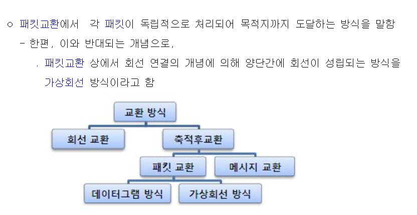
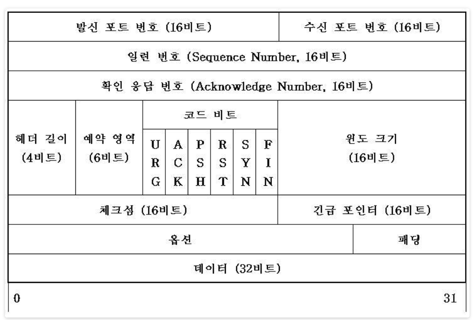

# **트랜스포트 레이어**

## **트랜스포트 계층 (Transport Layer)**

- 애플리케이션 계층 (Application Layer)과 네트워크 계층 (Network Layer) 사이의 계층
- 네트워크 구조의 핵심역할
- 서로 다른 호스트에서 동작하는 애플리케이션 프로세스간의 논리적 통신 제공
  - 논리적 통신 : 애플리케이션의 관점에서 호스트들이 직접 연결된 것처럼 보이는 것

    ex) 서로 다른 컴퓨터의 카톡이 메시지를 주고 받는 통신을 할 때 트랜스포트가 논리적 통신을 제공해서

    두 컴퓨터가 직접 연결된 것처럼 통신을 한다.
- 트랜스포트 계층의 프로토콜은 종단 시스템에서만 구축
  - 중간에 있는 네트워크 라우터가 아닌 종단 시스템 (Host : 컴퓨터, 스마트폰 등) 에서 구현

### **Host간의 통신**

- 보내는 쪽 Host를 S (Sender), 받는 쪽을 R (Receiver) 라고 하자.

1. S 쪽의 트랜스포트 계층은 S 쪽 애플리케이션 프로세스로부터 수신한 메시지를 트랜스포트 계층의 패킷인 '세그먼트로 변환'
   - 데이터는 계층마다 다르게 존재
     - 애플리케이션 : 애플리케이션 계층에서의 패킷인 '메시지'로 존재
     - 트랜스포트 : 트랜스포트 계층에서의 패킷인 '세그먼트'로 존재
     - 네트워크 : 네트워크 계층에서의 패킷인 '데이터그램'으로 존재
2. 애플리케이션 계층의 메시지를 트랜스포트 계층의 세그먼트로 만들기 위해 작은 조각으로 분할하고, 각각의 조각에 트랜스포트 헤더를 추가
   - 후에 표시된 헤더의 정보를 통해 조각을 합쳐 완성체 조립
3. 트랜스포트 계층에서 송신 종단 시스템에 있는 네트워크 계층으로 세그먼트 전달
4. 세그먼트가 네트워크 계층의 패킷인 데이터그램 안에 캡슐화 되어 목적지인 R 쪽으로 전달
   - 전달 과정에서 여러 라우터들을 거침
   - 라우터는 네트워크 계층까지만 존재하므로, 라우터는 데이터그램까지만 인식 (그 안에 캡슐화된 세그먼트는 검사하지 않는다)
5. R 쪽의 네트워크 계층은 수신한 데이터그램에서 세그먼트를 추출하고 트랜스포트 계층으로 전달
6. R 쪽의 트랜스포트 계층에서 수신한 세그먼트를 처리하여 R 쪽의 애플리케이션에서 세그먼트 내부의 데이터를 이용할 수 있도록 함

### **트랜스포트 계층과 네트워크 계층 간 관계**

- 트랜스포트 계층 프로토콜 : 서로 다른 호스트에서 동작하는 프로세스들 사이의 논리적 통신 제공
- 네트워크 계층 프로토콜 : 서로 다른 호스트에서의 논리적 통신 제공

  ### **ex)**

  - A집과 B집이 있다.
  - 각각 집에서 보내는 편지는 부모님이 모아서 우체통에 넣는다
  - 마찬가지로, 각각 집에 오는 편지는 부모님이 받아서 가족에게 나눠준다.
  - 우체통의 편지는 우편배달부가 각각의 집으로 전달한다.

  **A집, B집 : Host**

  **편지 : 애플리케이션 메시지**

  **부모님 : 트랜스포트 계층 프로토콜**

  **우편배달부 : 네트워크 계층 프로토콜**

  - 우편배달부는 편지는 전달하지만 편지 내용은 모른다.

### **인터넷 트랜스포트**

### **UDP (User Datagram Protocol)**

- 비신뢰적
- 비연결형
  - 정보를 주고받을 때 정보를 보낸다는 신호나 받는다는 신호 절차를 거치지 않음
  - 보내는 쪽에서 일방적으로 데이터를 전달
- TCP보다 빠른 속도

### **TCP (Transmission Control Protocol)**

- 신뢰적
- 연결 지향
  - 연결 설정 (3-way handshaking) 및 해제 (4-way handshaking)
- 흐름 제어 및 혼잡 제어
- UDP보다 느린 속도

### **다중화 (Multiplexing) / 역다중화 (Demultiplexing)**

#### **다중화 (Multiplexing)**

- 송신 측에서 이루어짐
- 여러 소켓의 데이터를 처리
- 각 데이터에 헤더 정보를 추가

#### **역다중화 (Demultiplexing)**

- 수신 측에서 이루어짐
- 헤더 정보를 이용하여 수신된 세그먼트를 올바른 소켓으로 전송

### **비연결형 트랜스포트 UDP**

### **UDP 세그먼트 구조**

- Source port : 출발지 포트 번호
- Dest.port : 목적지 포트 번호
- Checksum : 체크섬

### **UDP 체크섬**

- 오류 검출을 위한 정보
- 세그먼트가 출발지로부터 목적지로 이동했을 때, UDP 세그먼트 안의 비트에 대한 변경사항이 있는지 검사

---

## 신뢰적인 데이터 전송 원리

**reliable data transfer - RDT protocol [손수민 ]**

- TCP에서 제공하는 가장 중요한 기능 **reliable data transfer**
- 데이터를 전송할 때 전송된 데이터가 손상되거나 손실되지 않게 보장하는 개념
- 전송 계층에서는 신뢰성 있는 데이터 교환을 원하지만 하위 레이어들에서는 신뢰성을 보장할 수 없기 때문에 문제가 발생
- 해결하기 위해 전송 계층의 **RDT 프로토콜**을 이용

**송신자**

- 상위 레이어에서 보내려는 데이터가 있다면 rdt_send() 를 호출해 데이터를 RDT 프로토콜로 전송
- RDT 프로토콜에서 신뢰할 수 없는 채널인 하위 레이어로 보낼때 udt_send() 를 호출해 패키 전송

**수신자**

- 하위 레이어에서 받은 패킷이 있다면 rdt_rcv() 호출해 RDT 프로토콜로 전송
- RDT 프로토콜에서 상위 레이어로 데이터 보낼 때 deliver_data()를 호출해 데이터 전송

### 신뢰적인 데이터 전송 프로토콜의 구축

**Unreliable channel의 문제점**

- 메세지가 가는 도중 에러가 발생할 수 있다.(**Error**)
- 큐가 꽉 차서 데이터가 유실될 수 있다(**Loss**)

→ 이 두 가지 문제를 극복할 수 있다면 마치 **reliable** 한 것처럼 보여질 수 있다.

### FSM ( Finite State Machines ) - 유한 상태 기계

유한 개의 상태 state가 존재할 때, 어떠한 상태가 어떠한 사건에 의해 다른 상태로 전이(transition) 발생하는 것을 도식화. 이 이벤트가 발생하면 이 액션을 하고 넘어간다.

- event = 상태를 변화시키는 원인
- actions = 상태가 변화할 때 취하는 행동

RDT라는 간단한 프로토콜을 디자인하며 이 문제점들을 해결해보자.

- **RDT 1.0** → 만약 채널이 완벽하게 reliable 했다면 어떤 모습이었을까?
  - sender은 패킷을 보내고 receiver은 패킷을 받으면 된다. 끝

- **RDT 2.0** → Loss 없이 (BIT) Error는 발생할 수 있는 경우

  - How do humans recover from “errors” during conversation?
  - 전화 통화할 때 서로 안 보인다. 그 상태로 의사소통하므로 중간에 에러가 발생 가능. 그래도 제대로 합니다. 암묵적으로 에러를 극복할 수 있는 습관이 있다.
  - 샌더가 보낸 것을 리시버가 이해할 수 있도록.. 어. 어. 어. 어. 어? 하고… 피드백을 잘 못들었다고 준다. 혹시라도 에러가 발생했다면 네거티브 피드백을 줍니다.
  - **ACKs (Acknowledgements)** : 수신 측이 송신 측에게 패킷을 제대로 받았다고 말하는 것
  - **NAKs (Negative Acknowledgements)** : 수신 측이 송신 측에서 패킷에 오류가 있다고 말하는 것
  - 잘 받았다고 주다가 ACKs 하다가 잘못 받으면 NAKs를 전달.(에러 있는 경우)
  - 즉 에러 디텍션이랑 피드백을 통해 이를 극복

- **RDT 2.0 절차**

  - (송신 측) 상위 레이어에서 데이터를 받아온다.
  - 데이터를 패킷으로 만들어 udt_send()로 보낸다.
  - 수신 측에서 패킷을 받는다.
  - 이상이 없으므로 ACK 신호를 송신 측으로 보낸다.
  - 송신 측에서 ACK 신호를 받고 종료한다.

- **RDT 2.0 문제점**
  - ACK / NAK 신호에 오류가 발생하거나 손실될 수 있다
  - 예를 들어 수신측에서 패킷 오류를 탐지하고 ACK 신호를 송신 측에 보냈으나 이것이 손실 될 수 있다. 이 경우 수신측은 무한적으로 ACK, NAK 신호를 기다리게 된다
  - 또한 ACK / NAK 신호에 중복이 발생해 패킷이 중복으로 재전송 될 수 있다.

- **RDT 2.1** → Error 해결 + 피드백에서 Error 발생 막기 위해 sequence number 추가한 버전
  - 하지만 피드백 자체에 에러가 발생한 여부를 확인하는 coner case가 존재하므로 sequence number을 붙여서 이를 해결
  - 센더의 header에는 checksum, sequence numbering field가 필요
  - 리시버도 피드백 시 header에 checksum 들어가야 합니다
  - 헤더에 들어갈 필드가 정해졌다면 크기 책정이 필요합니다.
    - 시퀀스 넘버링은 어케할거임? 필요한 시퀀스 넘버 개수를 알아야 합니다. 2개! 잘 받으면 1, 아니면 0으로 표기 가능
- **RDT 2.1 전송 절차**

  - 송신 측에서 0번 패킷 보내고 ACK 0 / NAK 0 신호를 기다린다
  - 0번 패킷이 수신 측에서 에러가 발생했다면 NAK 0을 받을 것이고 수신 측으로 0번 패킷을 재전송할 것이다.
  - 0번 패킷이 정상적으로 전송되었다면 ACK 0을 받을 것이고 다음 패킷 1번 패킷을 전송할 것
  - 마찬가지로 ACK 1 / NAK 1 신호를 기다리며 모든 패킷 보낼때까지 반복

- **RDT 2.2** → ACK NAK 2개로 하니 번잡스럽다. ACK 하나로만 같은 구현 해보자
  - **NAK - free protocol**
  - 무조건 ACK가 가되 시퀀스 넘버를 함께 보낸다. 제대로 받은 마지막 시퀀스 넘버
  - 1번을 보내면 피드백이 ACK 1이 와야하는데 ACK 0이 왔다면 제대로 안 갔다 → 재전송
  - 센더가 1 보내고 그 다음인 0을 언제 보낼 수 있나? ACK 1 을 받아야 넘어갈 수 있다. ACK 0이 왔다? → 문제 발생
  - 센더가 1 보내고 피드백이 에러났다? ACK 1 아니면 무조건 재전송 넣는다
- **RDT 2.2 전송 절차**

  - 중복되는 ACK 신호를 받으면 현재 패킷을 다시 재전송
  - 예를 들어 0번 패킷 보내고 제대로 송신되어서 ACK 0를 받았다
  - 이후 1번 패킷 보내는데 수신 측에서 오류를 탐지했다면 ACK1이 아닌 가장 최근에 전송에 성공한 ACK 0 보낸다
  - 수신 측은 ACK 1 기대했는데 ACK 0을 중복으로 받았으므로 오류가 발생되었다는 사실을 알고 1번 패킷을 재전송

- **RDT 3.0** → Error & Loss 환경을 어떻게 해결할 것인가
  - Loss의 두 가지 경우 - 보낸 메세지가 유실되거나, 피드백이 유실되거나
  - 어떤 경우든 센더의 입장에서는 같다.
  - 전화통화 중 주말에 영화볼래? → 유실되어서 침묵이 이어짐 → 던진 시간 이상으로 피드백이 돌아오지 않는다 → 다른 액션을 취한다
  - 즉, 타이머가 필요(일정 시간 안에 메세지가 안 오면 데이터 Loss로 판단하고 액션 = 재전송)
  - 타이머 시간이 짧으면 빠르게 Loss에 대한 재전송을 취할 수 있지만 Loss가 아닌 단순 지연을 체크하지 못하는 단점이 존재
  - 타이머 시간이 길면 불필요한 재전송 요청을 하지 않을 확률이 높다는 장점이 있으나 Loss 에 대해 재전송 응답 시간 자체가 길어지는 단점이 존재
  - 타이머 시간은 정답이 있다기보단 엔진에 따라 평균 응답시간보다 조금 길게 책정하는 공식이 있다.

실제로 이렇게만 작동한다면 매우 느릴 것이다.

소켓에 메세지 넣어서 보낼 뿐… 실제로 TCP에서는 더 복잡한 방식으로 작동합니다.

### 파이프라이닝 된 신뢰적인 데이터 전송 프로토콜

- 한꺼번에 많은 소켓들을 보내고 그 패킷들에 대한 피드백을 한꺼번에 전송
- 한꺼번에 처리 하므로 파이프라인이라 이름 붙여짐
- 신뢰성과 빠른 속도 제공 가능

### GBN, SR 프로토콜 - 파이프라인 오류 회복의 기본적인 접근법

[https://snoop-study.tistory.com/65](https://snoop-study.tistory.com/65)

[https://m.blog.naver.com/PostView.naver?isHttpsRedirect=true&blogId=ehdrndd&logNo=220675327120](https://m.blog.naver.com/PostView.naver?isHttpsRedirect=true&blogId=ehdrndd&logNo=220675327120)

---

## 연결 지향형 트랜스포트 : TCP 

### TCP 연결

##### TCP

- 애플리케이션 프로세스가 데이터를 다른 프로세스에게 보내기 전에,

   두 프로세스가 서로 '핸드셰이크'를 먼저 해야 하므로 연결지향형 (connection oriented)이다.

- 즉, 데이터 전송을 보장하는 파라미터들을 각자 설정하기 위한 어떤 사전 세그먼트들을 보내야 한다.

- TCP 연결 설정의 일부로서. 연결의 양단은 TCP 연결과 연관된 많은 TCP 상태 변수를 초기화한다.

  

- 핸드셰이크란?

  - 통신을 하는 브라우저와 웹 서버가 서로 암호화 통신을 시작할 수 있도록

     신분을 확인하고, 필요한 정보를 클라이언트와 서버가 주거니 받거니 하는

     과정이 악수와 비슷하여 붙여진 이름.

  

- TCP '연결'은 회선 교환 네트워크에서와 같은 종단 간의 TDM이나 FDM이 아닌,

   두 통신 종단 시스템의 TCP에 존재하는 상태를 공유하는 논리적인 것이다.

- TCP 프로토콜은 오직 종단 시스템에서만 동작하고 중간의 네트워크 요소(라우터,링크 계층 스위치)에서는

   동작하지 않으므로, 중간의 네트워크 요소들은 TCP 연결 상태를 유지하지 않는다.

- 중간 라우터들은 TCP 연결을 전혀 감지하지 못한다. 즉, 이들은 연결은 보지 못하고 데이터그램만을 본다.

- TCp 연결은 전이중 서비스(full-duplex service)를 제공한다.

   만약 호스트 A의 프로세스와 호스트 B의 프로세스 사이에 TCP 연결이 있다면,

   애플리케이션 계층 데이터는 B 에서 A로 흐르는 동시에 A에서 B로 흐를 수 있다.

   또한 TCP 연결은 항상 단일 송신자 와 단일 수신자 사이의 점대점 (polint-10 poin)이다.

- 다만, 단일 송신 동작으로 한 송신자가 여러 수신자에게 데이터를 전송하는 멀티캐스팅은 TCP에선 불가능하다.

- 용어 정리:

  - TDM(Time Division Multiplexing: 시분할 다중 통신):

    - 시간분할된 여러 사용자 타입슬롯을 하나로 결합시키는 다중화 방식.
    - 전송로를 점유하는 시간을 분할하여 한 개의 전송로에 여러 개의 가상 경로를 구성하는 통신 방식

     http://www.ktword.co.kr/test/view/view.php?m_temp1=1287

  - FDM(Frequency-division multiplexing: 주파수 분할 다중화):

    - 통신 매체에서 이용 가능한 총 대역폭을 겹치지 않는 일련의 주파수 하부 대역으로

       분리시킨 뒤, 분리된 대역을 각각 개별 신호를 전달하는데 사용하도록 하는 기술.

    - 주파수 분할 다중화를 통해 여러 사용자들이 하나의 물리적인 통신 채널을 공유하는

       경우에는 이를 [주파수 분할 다중 접속](https://ko.wikipedia.org/wiki/주파수_분할_다중_접속)(FDMA)으로 부른다.

  - 데이터그램:

    - 패킷교환에서 각각 독립적으로 취급되는 각각의 패킷을 말한다.

      

  - 패킷:

    - 정보 기술에서 패킷 방식의 컴퓨터 네트워크가 전달하는 데이터의 형식화된 블록.
    - 즉, 컴퓨터 네트워크에서 데이터를 주고받을 때 정해 놓은 규칙
    - 조금 더 쉬운 이해:
      - 패킷을 pack과 bucket의 합친 말로
      - 우체국에서는 화물을 적당한 덩어리로 나누어 행선지를 표시하는 꼬리표를 붙이는데, 이러한 방식을 데이터 통신에 접목한 것.
      - 즉 정보를 보낼 때 특정 형태를 맞추어 보낸다는 것.
      - 컴퓨터 간에 데이터를 주고 받을 떄 네트워크를 통해서 전송되는 데이터 조각.

---

### TCP 세그먼트 구조

##### TCP 세그먼트

- TCP 세그먼트는 헤더 필드와 데이터 필드로 구성되어 있다. (데이터 필드는 애플리케이션 데이터의 일정량을 담는다.)

- MSS(Maximum Segment Size:최대 세그먼트 크기)는 세그먼트의 데이터 필드의 크기를 제한한다.

- TCP가 웹 문서의 이미지와 같은 큰 파일을 전송할 때, 일반적으로 MSS크기로 파일을 분절한다(통상 MSS보다 작은 마지막 분절은 제외).

- 그러나 많은 대화식 애플리케이 션은 MSS보다 작은 양의 데이터를 전송한다.

- UDP처럼 헤더는 상위 계층 애플리케이션으로부터 다중화와 역다중화를 하는데 사용하는 출발지와 목적지 포트 번호(source and destination port number)를 포함한다.

- 또한 UDP처럼 헤더는 체크섬 필드(checksum Field)를 포함한다.

 

- 위 사진은 TCP 세그먼트 구조이다.

- 우선 확인 응답 번호는 신뢰적인 데이터 전송 서비스 구현에서 TCP 송신자와 수신자에 의해 사용된다.

- 16비트 윈도 크기 필드는 흐름 제어에 사용되며 수신자가 받아들이려는 바이트의 크기를 나타내는데 사용된다.

- 4비트 헤더 길이 필드는 32비트 워드 단위로 TCP 헤더의 길이를 나타내며, TCP 헤더는 TCP 옵션 필드 때문에 가변적인 길이가 될 수 있다.

- 옵션 필드는 선택적이고 가변적인 길이로 송신자와 수신자가 최대 세그먼트 크기(MSS)를 협상하거나,

   고속 네트워크에서 사용하기 위한 윈도 확장 요소로 이용되며, 타임스탬프 옵션 또한 정의된다.

- URG 비트는 해당 세그먼트에서 송신 측 상위 계층 개체가 긴급으로 표시하는 데이터임을 가리킨다.

   긴급 데이터의 마지막 바이트의 위치는 16비트의 긴급 데이터 포인터 필드에 의해 가리켜진다.

   TCP는 긴급 데이터가 존재할 때 수신 측 상위 계층 개체에게 통지해야 하고,

   긴급 데이터의 끝에 대한 포인터를 전달한다.

- ACK 비트는 확인응답 필드에 있는 값이 유용함을 가리키는데 사용된다.

- PSH 비트가 설정될 때, 수신자가 데이터를 상위 계층에 즉시 전달해야 한다는 것을 가리킨다.

- RST,SYN,FIN 비트는 연결 설정과 해제에 사용된다.

---

## 신뢰적인 데이터 전송

### 흐름 제어 flow control

### TCP 연결 관리

- _Transport Control Protocol_
- IP 상에 수행되는 Transport (전송) 계층의 Protocol
- 패킷 : 세그먼트

- 신뢰적 데이터 전송
- 하위 계층에서 상위 계층에서 데이터를 전송 시 전송된 데이터가 손상되거나 손실되지 않게 보장하는 개념
- Internet상의 각종 중간 network (Intermediate Network)을 초월한 통신과 사용
  자 data를 순서정연하고 확실하게 전송하는 connection oriented service 제공

> **Pipelined Protocol**

- 신뢰적 데이터 전송을 위해 사용하는 프로토콜
- RDT의 성능적 한계를 개선한 프로토콜

  

- 한번에 많은 패킷을 보내서 각각의 패킷에 대한 ACK를 받는 방식으로 효율성을 증가

***

- Sliding Window
  - 연이어 전송되는 N개의 패킷들의 모음
  - 오류제어
  - 흐름제어

1. **Go-Back-N**

   - 송신자는 확인 응답을 기디라지않고 여러 패킷을 전송할 수 있다.
   - 파이프라인에서 확인 응답이 안 된 패킷의 최대 허용 수 N보다 크지 않아야 한다.

   - Cumulative ACK (누적 ACK)
     - 정상적으로 전송되었던 가장 마지막 패킷에 대한 ACK를 다음 패킷을 받을 때 마다 계속 전송하는 방식
     - 순서에 맞게 온 패킷 중 가장 큰 Sequence Number를 ACK에 포함시켜 보냄
     - Sender는 타이머도 있는데, 가장 전송된 지 오래된 패킷의 시간으로 timer 측정
     - 유실되거나 잘못된 패킷 이후에 수신하는 모든 패킷을버림

- Dumplicated ack를 받을 경우 sender 역시 무시하면 결국, timeout
- 그 이후, 가장 마지막 ack에 대한 seq를 다시 순차대로 보내게 됨

***

1. **Selective Repeat**

   - 독립적으로 ACK를 수신한다
     - Go-Back-N 프로토콜의 단점인 재전송 시 모든 패킷을 재전송하는 것을 해결
   - 순서와 다르게 받은 패킷을 저장하고 있다가 순서에 맞춰서 Application layer로 올려줌
   - 받지 않은 ACK에 대해서만 재전송하는 방식
   - timeout이 일어나게 되어도, timeout이 일어난 패킷에 대해서만 전송

   

   

   - Receiver는 loss 된 패킷에 대해서는 ACK를 보내지 않음
   - 때문에 Sender 측에서 timeout이 일어나게 되고, 해당 패킷만 재전송

***

> **RDT**

- Unreliable한 channel을 통해 sender와 receiver 사이에서 message가 전달
- 대표적으로 message error와 message loss와 관련된 문제가 발생
- host가 message를 받지 못한채로 전송이 끝나버린다면
  - message가 유실되기 때문에 sender가 보낸 message에 receiver가 응답하지 못하는 상황이 발생합니다.

***

- **RDT**
  - _Reliable Data Transfer_
  - 신뢰적 데이터 전송 프로토콜
  - 전송 후 대기 (Stop - and - Wait)
  - 한번에 한개의 패킷만 보내기 때문에 sender는 receiver로 부터 ACK가 도착하기 전까지 아무것도 하지 않은채 대기
  ***
  [코딩꿈나무 조정현 : 네이버 블로그](https://blog.naver.com/ds4ouj/222361468320)
  [TMK_Security : 네이버 블로그](https://blog.naver.com/tmk0429/222429978903)
  ***
  1. RDT 1.0
     - 하위 채널이 완전한 신뢰적이라 가정
       - 비트 오류가 존재하지 않으며 하위 채널을 완벽하게 신회할 수 있다고 가정
       - Packet의 error와 loss가 없다고 가정 ⇒ 비현실적
  2. RDT 2.0
     - 신뢰적 데이터 송신을 위해 오류를 검출
     - 비트 오류가 있는 채널 상에서 신뢰적인 데이터 전송
       - 비트 오류가 있지만 패킷의 손실이나 순서 보장
     - 자동으로 재송신하는 데이터 검출 프로토콜인 ARQ를 사용
  3. RDT 2.1
     - 중복 패킷을 구별하기 위해서 Packet에 Sequence Number를 추가
       - RDT 2.0에서 ACK/NAK 손실 가능성을 위해 재전송을 수행, 재전송 시 패킷이 중복되어 수신 될 수 있음
  4. RDT 2.2
     - NAK을 새용하지 않고 ACK와 Sequence Number을 이용
     - ACK 만으로 feedback를 하는데, receiver는 자신이 마지막으로 받은 packet의 sequence number를 ACK에 함께 전송
  5. RDT 3.0
     - Timeout 기능을 추가
     - sender가 feedback을 받는 시간을 정해놓으며 packet을 보낼때 마다 timer가 초기화되며 작동
     - sender는 ACK를 기다리다가 Timeout 되면, Feedback을 받지 않은채 packet를 재전송하여 Feedback을 기다리는 시간을 줄일 수있습니다.

---

## 혼잡 제어의 원리

### 흐름제어

- 송신측과 수신측 사이의 데이터 처리 속도 차이를 해결하기 위한 기법이다

### 혼잡제어

- 네트워크 혼잡을 피하기 위해 **_송신 측에서 보내는 데이터의 전송 속도를 제어_**하는 것
- 송신 측 데이터 전달과 네트워크 데이터 처리 속도 차이를 해결하기 위한 기법
- 한 라우터에 데이터가 몰려서 모든 데이터를 처리할 수 없는 상황에 이르렀을 때, 호스트들은 계속해서 재전송을 하고 결과적으로 혼잡만 가중시켜 오버플로우나 데이터 손실이 발생한다.
- 또한 네트워크 내에 패킷의 수가 과도하게 증가하는 현상을 혼잡이라 하며, 혼잡 현상을 방지하거나 제거하는 기능을 **혼잡제어**라고 한다.

### **1.1 혼잡의 원인과 비용**

혼잡제어가 일어나는 세 가지 시나리오를 확인해보자

**[시나리오 1] 2개의 송신자와 무한 버퍼를 갖는 하나의 라우터**

이 경우에는 라우터의 버퍼 용량이 무한으로 패킷 손실이 전혀 일어나지 않는 상황이다.

그래서 패킷을 보내면 언젠가는 다 전송을 하게 된다.

**[시나리오 2] 2개의 송신자, 유한 버퍼를 가진 하나의 라우터**

시나리오 1과 다르게 라우터의 버퍼 용량이 유한하다고 가정하는 시나리오이다.

이러면 버퍼가 가득찼는데 버퍼에 들어오려는 패킷은 버려지게 되고, 호스트는 다시 패킷을 재전송하게 된다.

**[시나리오 3] 4개의 송신자와 유한 버퍼를 가지는 라우터, 그리고 멀티홉 경로**

### **1.2 혼잡제어에 대한 접근법**

**1) 종단간의 혼잡제어**

종단간의 접근법에서는 네트워크 계층이 혼잡제어를 위해 아무런 지원을 직접적으로 해주지 않는다.

IP 계층이 어떠한 피드백을 제공하지 않으므로 TCP가 혼잡제어를 위한 종단간의 접근을 수행해야한다.

**2) 네트워크 지원 혼잡제어**

여기서는 네트워크 계층이 네트워크 안에서 혼잡 상태와 관련하여 송신자에게 직접적인 피드백을 제공한다.

피드백 방법 1) 라우터가 송신자에게 패킷을 전달해서 지금 혼잡하다고 알린다.

피드백 방법 2) 송신자에서 수신자로 보내는 패킷의 특정 필드에 혼잡하다는 내용을 넣는다. 그러면 수신자가 확인하고 송신자에게 전송하게 된다.

### 혼잡제어 알고리즘

TCP 혼잡제어 알고리즘(TCP congestion control algorithm)은 다음의 중요한 구성요소들을 갖는다.

1. 슬로 스타트(slow start)
2. 혼잡 회피(congestion avoidance)
3. 빠른 회복(fast recovery)
4. 빠른 재전송(fast retransmit)

---

## TCP 혼잡 제어 - 장미림

---

### AIMD (Additive Increase / Multicative Decrease)

- 연결 시작 : 혼잡 윈도우(cwnd)를 최소값(ex: 1MSS)부터 전송률을 낮게(천천히) 시작
- RTT마다 혼잡윈도우를 1씩 증가 ( 합 증가 )
- 혼잡 발생 시 : 혼잡 윈도우를 절반으로 줄임 ( 곱 감소 )

### 슬로우 스타트(Slow Start)

- 연결 시작 또는 혼잡 발생시에 혼잡 윈도우(cwnd)를 최소값(ex: 1MSS)부터 전송률을 낮게(천천히) 시작
- ACK가 수신될 때마다 혼잡 윈도우를 1씩 증가
- (ACK 수신 → cwnd = cwnd + 1)
- RTT마다 혼잡윈도우를 2배씩 증가(지수적 증가, exponential increase)

### 혼잡 회피 (Congestion Avoidance)

- 슬로우 스타트 구간에서 혼잡 윈도우는 지수적으로 증가
- 혼잡 윈도우가 임계치에 도달하거나 넘어가면 선형적으로 증가하도록 증가 속도를 조정
- RTT마다 혼잡 윈도우를 1씩 증가 (선형적 증가)
- ACK가 수신될 때마다 혼잡 윈도우를 (1/cnwd)씩 증가
- (ACK 수신 → cwnd = cwnd + (1/cwnd))

### 혼잡윈도우 변화

### 빠른 복구 (Fast Recovery)

- 개념
  - 3개의 중복 ACK에 의한 빠른 재전송 시에 적용 : 경미한 혼잡 상황
  - 정상 ACK가 수신되어 오류 복구가 완료되면 슬로우 스타트 구간을 건너뛰고 혼잡 회피 단계로 진입

- 알고리즘
  1. 임계치를 현재 혼잡 윈도우의 1/2로 설정 (sstrhresh = cnwd/2)
  2. 손실된 세그먼트 재전송
  3. 혼잡 윈도우를 임계치 +3으로 설정 (cnwd = ssthresh + 3)
  4. 여전히 중복 ACK를 수신하면 cwnd = cwnd + 1, 새로운 세그먼트 추가 전송 가능
  5. 정상 ACK를 수신하면 cwnd = ssthresh, 혼잡 회피 단계로 진입

### 💡TCP 혼잡 제어 알고리즘

---

#### TCP Tahoe 버전

- 혼잡 인식
  - Timeout
  - 3개 중복 ACK
- 알고리즘
  1. 임계치를 현재 혼잡 윈도우의 1/2로 설정 (sstrhresh = cnwd / 2 )
  2. 슬로우 스타트 개시
  3. 혼잡 윈도우가 임계치에 도달하거나 넘어가면 혼잡 회피 수행

#### TCP Reno 버전

- 혼잡 인식
  - Timeout
  - 3개 중복 ACK
- 알고리즘
  1. Timeout 발생 시 Taho 버전과 동일하게 동작
  2. 3개 중복 ACK 발생 시 빠른 회복 (Fast Recovery) 알고리즘 적용

