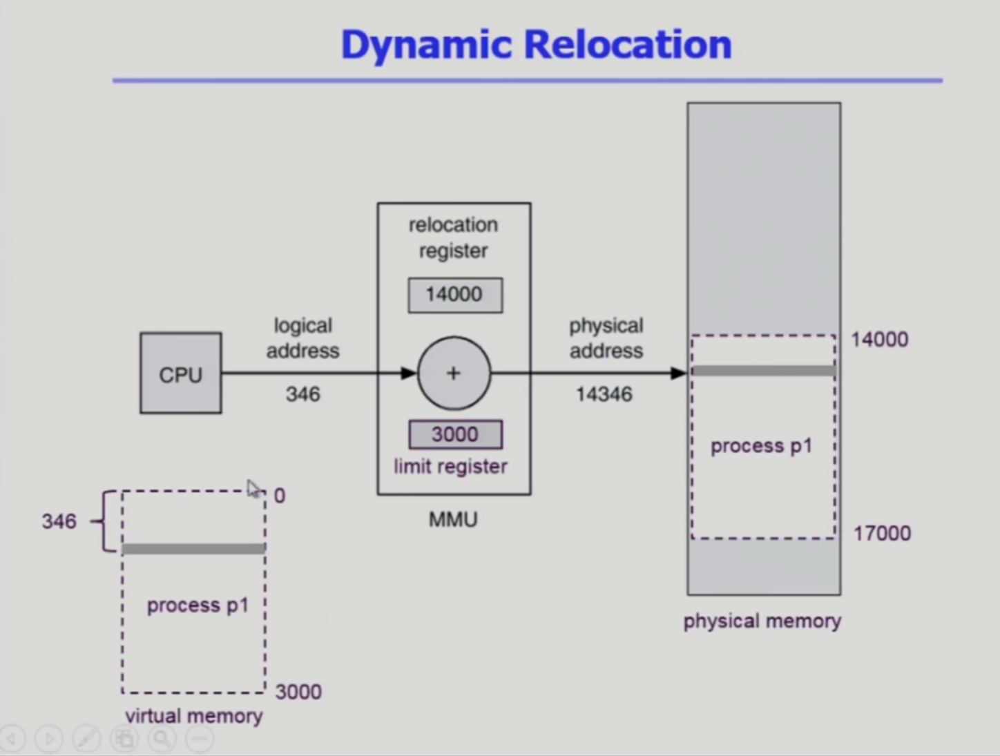
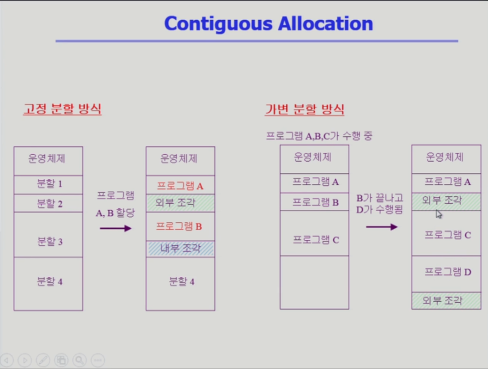
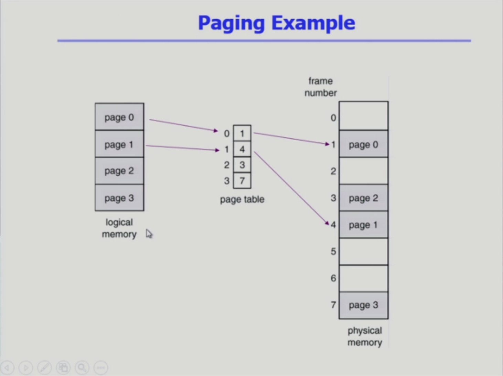
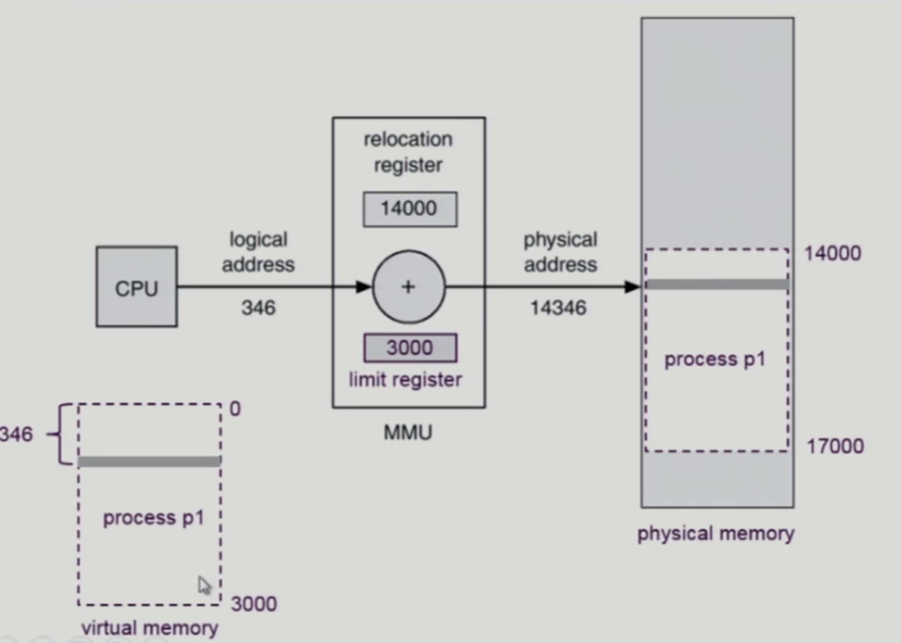
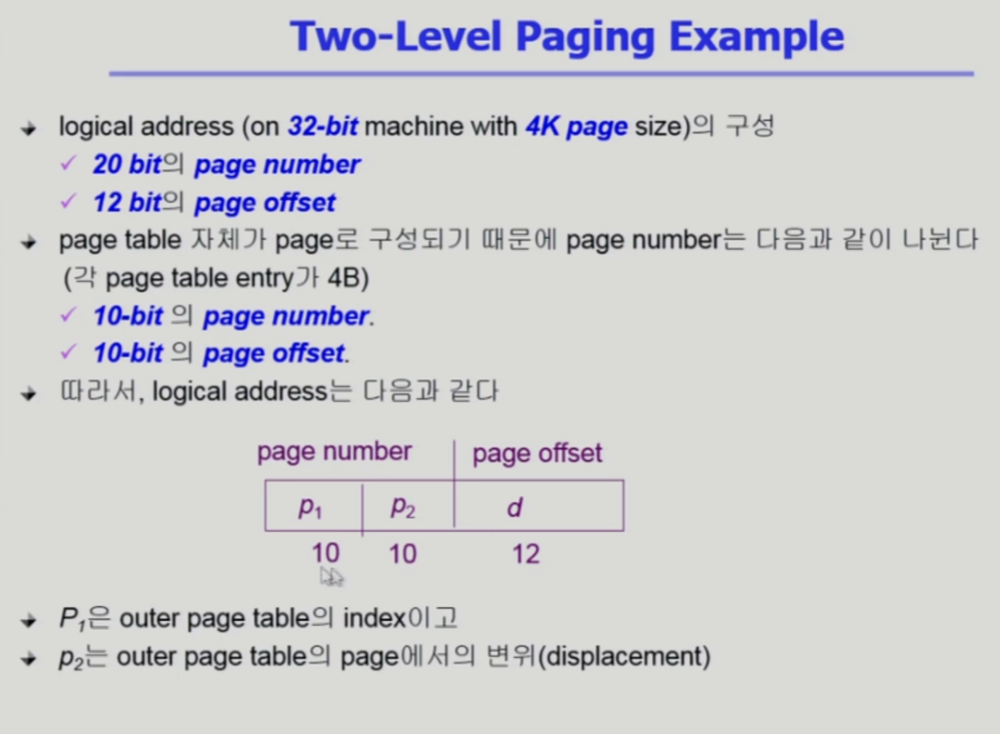
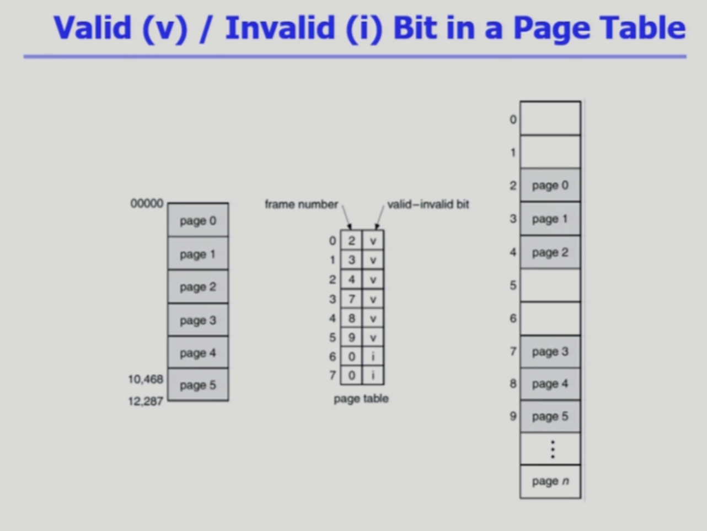
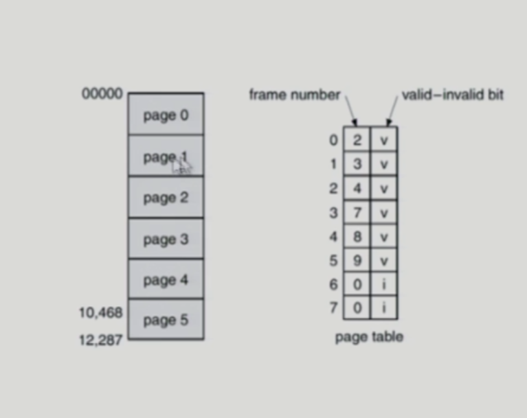
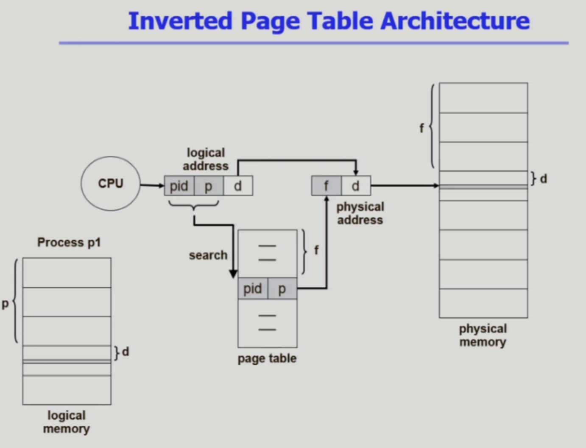

# 메모리 관리


## 불연속 할당 : 페이징

### Noncontiguous allocation(불연속 할당)


Contiguous allocation(연속 할당)

- 프로그램을 구성하는 가상 메모리 주소 공간이 물리적인 메모리에 모두 올라가는 방법을 전재로 하여 대체로 주소 변환이 간단했었다.

Noncontiguous allocation(불연속 할당)

- 다만 불연속 할당의 경우 프로그램을 구성하는 가상 메모리 주소 공간이 여러개로 나누어진 각각의 부분이

   물리적 메모리 주소 공간에 서로 다른 위치에 올라갈 수 있는 구조로 되어있다.

- 불연속 할당의 환경에서는 주소변환이라는 것이 잘려진 주소공간이 어디부터 시작하는지, 어디에 올라가는지 알아야한다.

- 그래서 연속 할당처럼 레지스터 2개만 가지고 주소 변환이 이루어 질 수는 없기에

- 각각의 잘려진 부분들의 시작 위치를 얻기위한 레지스터가 많이 필요하게 되지만 레지스터는 한정되어 있기에 소개할 기법중 하나인

- Paging(페이징) 기법은 프로세스를 구성하는 주소공간이 동일 크기의 페이지 단위로 나뉘어져 있다.

- 가장 많이 사용되는 페이징 기법중 하나는 페이지 하나가 4kb로 구성이 된다. 다만 최근에는 64bit 운영체제를 사용하면서

   더 큰 크기의 페이지를 사용하기는 하지만 전통적인 방법은 4kb 라고 한다.

- 그래서 당장 사용해야 하는 페이지는 물리적 메모리로 올라가게 되는데 올라가는 위치도 페이지마다 모두 다를 수 있기에

   각각의 페이지마다 주소 변환이 필요하다.

- 다만 페이지 개수가 워낙 많아서 레지스터를 가지고는 주소 변환을 하기엔 감당할 수 없기 때문에 페이지 테이블을 사용하게 된다.



---

### Paging(페이징)


페이징 기법이란 프로세스 각각에 메모리 주소공간을 페이지 단위로 잘라서 각각의 페이지가 서로 다른 물리적인 메모리 위치에 올라갈 수 있게 되어있다고 한다.

그래서 당장 필요한 부분은 물리적 메모리(physical memory)에 올리게 되고 나머지는 보조기억장치(backing storage)라고 하는 swap area 또는 file system에 위치하게 된다.

같은 크기로 나누기 때문에 프로세스를 구성하는 주소공간도 페이지와 같은 크기로 나누는데 그렇다면 물리적인 메모리도 페이지가 들어갈 수 있는 같은 크기로 나누어야 한다.

여기서 Frame 과 Page의 구분으로는

- Frame : 물리적인 메모리는 해당 페이지를 담기 위한 공간이기에 페이지라고도 부르지만 Page Frame 이라고 부른다.
- Page : 프로세스를 구성하는 논리적인 메모리 페이지를 Page 라고 부른다.

그리고 주소 변환은 페이지 테이블을 통해서 이루어진다.

예를 들어 프로세스를 구성하는 주소 공간의 페이지가 100만개로 이루어져 있다고 한다면, 페이지 테이블에는 100만개의 페이지를 물리적인 주소로 변환 할 수 있는 테이블.

---

### 페이징 기법과 연속 할당의 차이



우선 연속 할당의 경우 크기가 서로 다르기에 크기가 작은 프로그램의 실행이 완료후 빠져나가게 되었을 때 크기가 더 큰 프로그램이 들어오려 해도 크기가 맞지 않아 들어오지 못하는 문제가 있는데

페이징 기법의 경우 동일한 페이지 크기로 잘랐으며 물리적인 메모리 또한 동일한 크기의 페이지 프레임으로 잘랐기 때문에 빈 페이지 프레임이 있으면 어떠한 페이지든지 들어갈 수 있게 된다.

그래서 External fragmentation(외부 조각)이 발생하지 않게 된다.

다만 Internal fragmentation(내부 조각)은 발생할 수 있게 된다.

우선 외부 조각이란 ?

- 아무도 사용하지 않는 공간이지만 크기가 너무 작아 아무것도 들어가지 못해 공간을 낭비하고 있는 것을 의미한다.

내부 조각?

- 분할 3의 경우를 예로 든다면 프로그램 하나가 들어갈 수 있는 공간이지만 프로그램 하나가 들어가고도 남아버리는 공간을 의미한다.

그래서 내부 조각이 발생하게 되는 이유는

4kb 크기로 나누다 보면 마지막에 남게 되는 공간의 크기가 4kb 로 딱 나누어 떨어지지 않을 수 있기 때문이다.

---



위의 사진의 경우

하나의 프로그램을 구성하는 논리적인 메모리 공간을 4개의 페이지로 나누었을때 서로 다른 위치의 물리적인 메모리 공간에 위치하게 된다.

그래서 페이지 0번은 frame number 1번에 위치 페이지 1번은 frame number 4번에 위치되어 있다.

그리고 이들에 대한 주소 변환을 위해서는 단순히 레지스터 하나만으로 되지 않고 각각의 페이지가 어디에 위치할지를 찾아야 하기 때문에

주소 변환을 위한 정보가 페이지 개수만큼 필요하게 되어있다.

그래서 각각의 페이지들이 물리적인 메모리의 어디에 있는지를 나타내는 주소 변환을 페이징 기법에서는 페이지 테이블을 통해서 하게 되며

배열의 인덱스와 마찬가지로 페이지 테이블에서는 엔트리로 순서를 나타내게 된다 0번 엔트리에는 1번, 1번 엔트리에는 4번 식으로!

예를 들어 1번 페이지가 어디로 갔는지 봤을 때 페이지 테이블의 1번째 엔트리에 접근을 해서 해당 엔트리에는 몇번이 있는지 확인하는 것으로

1번 페이지는 4번 프레임에 올라가있다라는 것을 의미하게 된다고 한다.

물론 뒤에 나올 내용으로 valid-invalid bit 에 valid 의 v가 있다면 메모리에 존재하는 것을 의미하고, invalid의 i 가 있다면 메모리에 존재하지 않다는 것을 의미한다.


그래서 cpu가 보는 주소는 각 프로그램 마다 가지고 있는 논리적인 주소인데 페이지 테이블을 통해서 물리적인 메모리 주소로 주소 변환을 하게 된다.

그런데 이런 과정에서 p | d 로 나뉘게 되는데 p 는 페이지 번호, d 는 페이지에서 얼마나 떨어져 있는가를 나타내는 오프셋이 된다. 여기서 오프셋의 경우 위의 사진과 같이 변경 되지 않는다.

이해하기 쉽도록 하자면 부산의 연제구의 우리집의 주소를 기억해둔 상태로 부산을 그대로 미국으로 옮겨갔을 경우 부산에서의 우리집 위치는 그대로 인 것 처럼

주소 변환을 하더라도 부산 내에서의 상대적인 우리집 위치는 변하지 않는다 마찬가지로 페이지 번호인 p는 f 인 프레임 번호로 순서가 바뀌게 되지만 그 안에서 얼만큼 떨어져 있는지에 대한 d인 오프셋은 변하지 않는다.

bit 수는 32bit 를 많이 사용했는데 최근에는 64bit 를 많이 사용해서 메모리 크기도 커지고 했지만 편의상 32bit 를 예시로 든다고 하심.

아래의 사진으로 봤을 때 만약 논리적 주소의 크기가 32bit 의 경우 해당 프로그램(virtual memory)의 크기는 최대.................

우선 메모리는 논리적인 메모리든, 물리적인 메모리든 메모리에 메겨지는 주소는 바이트 단위로 매겨지게 된다.

해당 주소의 1bit 마다 서로 다른 주소가 메겨지게 된다.

만약 logical address 가 1bit 주소일 경우 1bit 는 0 또는 1 이기 때문에 메모리는 2개로 나누어 구분할 수 있다.

메모리는 byte 단위로 매겨지기 때문에 2byte를 구분할 수 있다고 한다.

만약 주소가 2bit의 경우 00,10,10,11 이렇게 4가지로 구분 할 수 있기에 4byte로 구분 할 수 있다.

그래서 32bit의 경우 2^32 byte 가 프로그램 메모리의 최대치가 된다.

참고 \* 2^10 : Kbyte, 2^20 Mbyte, 2^30 Gbyte 이기에 2^32 btye == 4 Gbyte 가 된다.

그래서 페이지 하나가 4Kbyte이기에 4Gbyte 를 4Kbyte 나누어 본다면 1M 인 100만개가 된다.

즉 프로세스를 구성하는 메모리가 100만개가 넘는 페이지로 구성된다.

그렇다면 페이지 테이블에 엔트리가 페이지 개수만큼 필요하기에 100만개가 넘게 필요하다.

그러면 32bit 주소 중에서 페이지 번호는 몇 bit? 오프셋은 몇 bit??

하나의 페이지는 4Kbyte 이기에 1byte로 4K개 구분해야하기에 필요한 bit 수가 오프셋 bit 가 될 것이다. (뒤에 나온다고 한다...)



---

Implementation of Page Table


페이지 개수가 프로세스 마다 100만개가 넘는 상황이기에 페이지 테이블을 레지스터에 넣을 수가 없기에 페이지 테이블 자체가 main memory에 올라가게 된다.

그래서 페이지 테이블의 시작위치인 PTBR(Page-table base register), 테이블의 크기 보관을 하는 PTLR(Page-table lengthregister) 가 있다.

여기서 문제점은 페이지 테이블이 메모리에 올라가기 때문에 메모리에 한번 접근하려 하면 두번을 접근하게 된다.

이유로는 주소 변환을 위해 메모리에 한번 접근하게 되고, 주소 변환이 됐으면 실제 데이터에 접근하기 위해 또다시 접근해야하기 때문이다.

그래서 이러한 성능 저하를 막기 위해 주소 변환을 전담하는 좀 더 빠른 캐쉬 메모리인 TLB(Translation look-aside buffer)를 두게 된다.

여기서 캐쉬 메모리는 2가지가 있는데

1. 데이터를 위한 캐쉬 메모리
2. 주소 변환을 위한 캐쉬 메모리(TLB)

우리가 여기서 알아볼 캐쉬 메모리는 2번째 주소 변환을 위한 캐쉬 메모리 이다.

우선 컴퓨터 시스템의 최상단에는 cpu가 있고 cpu 안에는 register 가 있고 그 다음에는 메인 메모리가 있는데 여기서 cpu의 register 와 main memory 사이에 있는

캐쉬 메모리는 메인 메모리와 cpu 의 속도 차이를 완화 해주는 역활을 한다.

그래서 페이지 테이블로 주소 변환을 하지만 페이지 테이블의 일부를 TLB에 담아 더욱 빠르게 주소 변환을 할 수 있게 된다.

---

### Paging Hardware with TLB


위의 사진처럼 CPU가 논리적인 주소를 주고 주소 변환을 해달라고 하는데 TLB 캐쉬가 없을 경우엔 페이지 테이블을 통해 주소 변환을 한다.

즉 논리적 주소에서 페이지 번호 P를 주면 페이지 테이블 위에서 P번째 엔트리로 가서 페이지 프레임 번호 f를 얻게 되고 주소 변환이 끝이 나게 되며

물리적 메모리의 최상단에서부터 f 번째 프레임에 가서 해당 프레임에서 d 번째 떨어진 위치에 가면 CPU에서 요청한 내용을 얻을 수 있게 된다.

그래서 위에서 언급했듯이 페이지 테이블이 메모리에 올라가기 때문에 메모리에 한번 접근하려 하면 두번을 접근하게 되기에 페이지 테이블의 일부를 TLB 캐쉬에 보관함으로써 빠른 주소변환이 가능하게 된다

물론 TLB는 물리적 메모리보다 빠르다고 한다.

그래서 정리하자면 CPU가 논리적 주소를 주면 페이지 테이블로 가기전에 TLB를 우선 확인한 후 TLB에 페이지 P가 있으면 주소 변환 후 바로 메모리에 접근하게 되면 메모리에는 한번만 접근하게 되며,

일부만 TLB에 보관했기에 TLB에 없는 페이지의 경우 페이지 테이블을 통해서 접근하기에 물리적 메모리에 2번 접근하게 된다.

단 Page Table의 경우는 인덱스와 같은 엔트리로 하나하나 찾아가는 것이 아닌 책의 목차처럼 해당 번호로 바로 넘어갈 수 있지만

TLB의 경우 일부만 보관함으로서 인덱스같이 바로 넘어가는 것이 아닌 처음부터 순서대로 하나하나 매칭하며 찾아야 하기에

**TLB는 논리적인 페이지 번호와 물리적인 페이지 프레임 번호를 함께 가지고 있게 된다.**

그래서 TLB는 처음부터 끝까지 해당 페이지를 찾아야 하며 끝까지 찾아도 없을 경우 TLB miss 를 반환하여 page table을 향해 가게 되므로 오버헤드가 크게 되는데

위의 사진처럼 TLB로 갈때 병행으로 여러개의 화살표가 한번에 가게 되는데 그것은 하드웨어 적으로 처리를 할 수 있어야 하는데 이러한 하드웨어를 associative register 라고 한다.

---

### Associative Register


TLB 또한 context switch(문맥 교환)이 생길 경우 새로운 프로세스의 page table의 일부를 보관하고 있는 TLB이어야 하기 때문에 모든 엔트리가 지워져야 한다.

그래서 context switch 자체가 큰 오버헤드를 가지고 있다고 한다.

---

### Effective Access Time


Hit ratio 란 ?

- TLB를 통해서 주소 변환이 이루어 지는 비율

TLB 의 Hit ratio 를 α라고 했을 때 TLB miss 가 생기는 비율은 1 - α 가 된다.

우선

- TLB에 접근하는 시간을 ε(입실론)

- 메모리에 접근하는 시간을 1

   그렇다면 메모리에 접근하는 시간보다 TLB에 접근하는 시간이 적게 된다.

그래서 메모리 접근 시간이 얼마나 걸리겠는가를 의미하는 EAT는

(실제 데이터에 접근하는 시간 (1) + TLB에 접근하는 시간 (ε)) \*α == TLB를 통해 주소 변환이 되는 경우 +

(페이지 테이블을 통해 데이터에 접근하는 시간 (2) + TLB에 접근하는 시간 (ε)) \* (TLB miss 가 생기는 비율 (1 - α) )

EAT = 2 + ε - α

---

### Two-Level Page Table


우선 페이지 테이블을 사용시 장점

- 프로그램을 동일 크기의 페이지로 자르게 될 경우 메모리에 빈 칸이 있을 경우 어떤 페이지라도 무작위 메모리에 올릴 수 있다.
- 당장 필요한 페이지만 메모리에 올릴 수 있다.
- 그러므로 메모리를 상당히 효율적으로 사용이 가능하다.

단 프로세스 마다 페이지의 개수가 100만개가 넘기 때문에 페이지 테이블의 엔트리 개수가 100만개가 넘게 되고 엔트리 하나하나마다 각각의 프레임 번호를 가지고 있게 되기에

프로세스당 페이지 테이블이 4Mbyte 이상의 메모리 공간이 필요하고 페이지 테이블은 프로세스마다 각각 가지고 있기에 페이지 테이블로 인해 공간낭비가 심하게 되고 있다.

그래서 Two-Level Page Table 혹은 다단계 페이지 테이블을 사용하게된다.


2단계 페이지 테이블은 바깥쪽 테이블은 outer-page table, 안쪽 테이블은 page table 으로 2개를 거치게 된다

그래서 주소를 전달하게 되면 바깥쪽 페이지 테이블을 통과해서 안쪽 페이지 테이블을 통과해서 메모리상 위치를 얻게 된다.

현재 주소 전달을 위해 2번의 메모리 접근을 하고 실제 데이터를 접근하기 위해 한번 더 추가로 접근을 해야하는 시간적으로 손해가 있지만

공간상으로는 이점이 있다. 현재 위에서 언급했듯이 너무 많은 페이지 테이블로 인해 메모리 공간을 심하게 낭비하고 있어서 2단계 페이지 테이블을 사용시 공간상의 이점이 생기게 된다.


자세히 설명해보자면

logical memory 에 100만개의 엔트리가 있을 경우 중간에 거의 대부분이 사용되지 않을텐데 그렇다고 해서 page table에 사용하는 엔트리만 올릴 수가 없다.

만약 없애버리게 된다면 서로의 엔트리 값이 달라지기 때문에 한번에 이동을 할 수 없게 된다. 그래서 원래는 공간의 낭비가 심하게 되는 건데


2단계 페이지 테이블을 사용하게 될 경우 바깥쪽 페이지 테이블에서 사용이 되지 않는 경우

안쪽 페이지 테이블에서는 만들어지지 않게 된다.

그래서 바깥쪽의 하나의 페이지는 4Kbyte 가 되고 안족의 페이지 테이블의 한 덩어리는 똑같이 4Kbyte가 되고

한칸씩은 4byte가 되어 1K 개수 만큼 존재하게 된다.

---

### Address-Translation Scheme


그래서 2단계 페이지 테이블에서 주소변환이 되는 과정을 보자면 32bit의 주소가 세부분으로 나뉘어지는데

맨 뒤쪽의 d는 페이지 오프셋(페이지 안에서 얼마나 떨어져 있는가)를 의미하며

한칸은 4Kbyte 이며 1byte씩 4Kbyte를 채우면 4K 개가 되기에 4K개 만큼의 위치 부분이 필요하기에 2^12 이 이므로 12bit가 필요하다.

그리고 page of page table의 p번째를 의미하는 p2는 안쪽 페이지 테이블 하나가 페이지화 되어서 메모리로 들어가기 때문에

4Kbyte가 되고 오프셋 처럼 byte당 이 아닌 엔트리로

각각의 엔트리가 4byte가 되기 때문에 1K 개 만큼 존재하게 되기에 2^10 인 10bit 만큼 필요하기에 10bit가 필요하게 된다.

마지막으로 p1은 남은 크기인 10bit만큼을 가지게 된다.



---

### Multilevel Paging and Performance


다단계 페이징 기법은 사용은 가능하며 장점으로는 공간을 상당히 줄일 수 있게 되지만 시간이 오래 걸릴 수 밖에 없다.

예를 들어 4단계 페이지 테이블 기법을 사용하게 될 경우 주소 변환을 위해 4번의 메모리 접근이 필요하게 되며 실제 메모리 접근을 위해 1번 접근하기 때문에

총 5번의 메모리 접근을 하게 된다.

다만 주소 공간의 상당 부분을 사용하지 않지만 페이지 엔트리는 100만개 이상 만들어지게 때문에 다단계 페이지 테이블이 유효하다고 한다.

그래서 다단계 페이지 테이블 기법을 사용한 TLB를 통해 주소 변환이 되는 비율을 굉장히 높일 수 있게 된다.

위의 사진을 봤을 때 4단계 페이지 테이블을 사용하는 경우의 TLB 성공 비율이 98%의 경우의 시간은

98%는 성공했기에 메모리 접근 시간 100ns + TLB 접근 시간 20 == 0.98\*120 +

2% 의 실패로 메모리 접근 시간 100ns 를 4번 접근한 400ns + 주소 변환이 끝난 다음에 실제 데이터에 접근하는 시간인 120(메모리 접근 시간 100ns + TLB 접근 시간 20)을 식으로 하면

0.02\*520이 되고 성공과 실패를 더하게 되면 128ns 이 된다.

---

### Valid(v) / Invalid(i) Bit in a Page Table



여기서 v 는 해당 페이지가 프레임이 확실히 올라가 있다라는 것을 의미

i 는 해당 페이지가 프레임 페이지에 올라가 있지 않아서 디스크로 내려가 있다는 것을 의미하는 것을 의미할 수도 있고

해당 프로그램이 해당 페이지를 사용하지 않는 경우일 수도 있다.


주소 변환을 하더라도 자기 자신의 페이지만 접근이 가능할 뿐 다른 프로그램의 페이지 혹은 주소 공간에 접근 할 수가 없어서 Protection bit 가 왜 필요할까 싶을텐데

여기서 Protection bit 란?

- 접근 주체에 대한 Protection 이 아니라 해당 페이지가 연산(read,write,read-only) 을 하나만 할지 모두 다 가능하게 할지를 표시해놓는 것을 의미한다.

- 예를 들어 각각의 페이지는 프로세스의 주소 공간을 Code, Data, Stack 으로 구성되어 있는데

- 그 중 Code의 경우를 보자면 함수 또는 기계어를 담고 있다 그렇다면 코드를 담고 있는 페이지는 변경이 되어서는 안되기 때문에 만들어진 그대로 메모리에서 read-only

   즉 읽기만 가능해야하기 때문에 Code 같은 경우는 read-only로 설정을 해야한다.

- 그래서 아래의 사진과 같이 1번 페이지에서는 write 를 하려 했는데 page table 에서는 해당 페이지가 read-only 로 설정되어 있다면 write 를 하지 못하게 막아주게 된다.

  

---

### Inverted Page Table(역방향 페이지 테이블)



원래 페이지 테이블이라고 하면 Logical address(논리 주소)로 부터 Physical address(물리 주소) 를 얻는 과정으로

CPU 가 논리 주소를 주면 페이지 번호에 해당하는 페이지 테이블의 엔트리로 가서 해당 페이지 번호는 물리 메모리의 몇번째 프레임에 올라가 있는가를 확인하는 것으로

즉 논리 주소의 페이지 번호를 가지고 물리적인 프레임 번호를 얻는 과정인데

그러다 보니 각각의 프로세스마다 가지게 되는 페이지 테이블의 공간 낭비가 너무 심해져서

Inverted Page Table 은 물리적인 메모리 각 프레임 하나하나당 페이지 테이블의 엔트리가 존재하게 하는 것을 의미한다.

그래서 과정을 보자면

1. 물리적 페이지 프레임 번호를 위에서부터 찾아 f 번째 프레임에 해당하는 엔트리가 페이지 테이블의 위에서부터 f 번째 해당하는 엔트리이며
2. 해당 엔트리를 확인해보면 P 가 있는데 그것을 프로세스의 논리적인 메모리 공간의 위에서 부터 P 번째에 해당하는 페이지가 물리적인 메모리에 올라가 있다를 의미한다.

기존의 과정은 논리적인 주소에서 물리적인 주소로 주소 변환을 했지만 역방향 페이지 테이블의 경우는 물리적인 주소를 가지고 논리적인 주소를 얻어내는 방법.

Inverted Page Table의 특징

- 장점 : 물리적인 메모리는 하나이기에 페이지 테이블 또한 하나만 만들면 된다는것은 장점.

- 단점 : 주소 변환 자체에는 크게 도움이 되지는 않는다.

  - 이유는 원래 주소 변환이라고 함은 논리 주소를 물리 주소로 변환하는 것을 의미하기 때문.

  - 또한 해당 프레임 번호에 해당하는 엔트리의 P번은 어떠한 프로세스에 해당하는 P인지 알 수 없기에 그것을 표시 해야하므로

     프로세스 id인 pid 를 함께 가지고 있어야 한다.

  - 또 주소 변환을 위해서는 페이지 테이블을 전부 검색을 해야하기 때문에 단점이라고 할 수 있다.


그래서 다시 한번 정리를 하자면

Inverted Page Table을 사용하는 이유는 위의 사진과 같이

Page table이 매우 크며 프로세스마다 별도로 가지고 있어야 하기 때문에 공간 오버헤드가 너무 심해서 Inverted Page Table 은 물리적인 페이지 프레임 하나당 페이지 테이블에 하나의 엔트리를 두는 구조이기 때문에

시스템 전체에 페이지 테이블이 하나만 있으면 된다라는 장점이 있는 반면

대신 주소 변환을 하기 위해선 페이지 테이블 전체를 모두 조사해야한다는 큰 오버헤드가 있기 때문에 대단히 비효율적이다.

그래서 보안하기 위한 방법으로 아래의 사진과 같이 Associative Register라고 하는 모든 위치를 병렬적으로 한번에 탐색할 수 있는 그런 하드웨어를 사용하는 방법이 있지만 비용이 많이 든다.


---

### Shared Page (공유 페이지)


현재 위의 사진을 보면 각각의 프로세스 P1,P2,P3 가 페이징 기법을 통해 같은 크기로 잘려 있는 상태와 각각의 주소 변환을 위한 페이지 테이블들이 존재하는데

여기서 같은 프로그램을 3번 실행한 상황으로 문서작업을 새롭게 작성한다고 했을 경우 다른 코드들의 경우는 모두 같지만

타이핑 한 내용들은 서로 다르기에 프로세스 별로 data의 내용만 서로 다르게 나타나게 된다.

그래서 원래 같으면 공통된 코드의 경우에도 각각의 프로세스 별로 서로 다른 물리 메모리 프레임에 올라가야 하지만

Shared code 를 담는 Shared Page를 사용하게 된다.


Shared code 란?

- Re-entrant Code(=Pure code) 로 재진입 가능한 코드
- 어차피 같은 내용이기에 여러 카피를 올리지 말고 공유를 하자라는 의미를 가지고 있다.
- 그래서 제약 조건이 2개가 있는데
  1. 동일한 코드 부분을 서로 읽기만 가능한 read-only 상태로 두기.
  2. Shared code 는 모든 프로세스의 동일한 Logical address space(논리적 주소 공간)에서 동일한 위치에 있어야 한다.
     - 즉 논리적인 주소가 같아야 한다는 의미.
     - 해당 프로세스에서 Shared Page가 어떠한 주소를 가지고 있다면 다른 프로세스에서도 Shared Page를 같은 주소(같은 위치)로 가지고 있어야 한다는 의미.
     - 즉 페이지 번호가 같아야 한다는 의미.

그리고 프로세스마다 각자 가지고 있는 페이지는 Private code and data 라고 해서

각 프로세스마다 독자적으로 메모리에 올리며, 논리적 주소 공간의 어디에 와도 무방하다.

페이징 (페이징 테이블 TLB effective Access Time…)

2단계 페이징 테이블

다단계 페이징 테이블

역방향 페이지 테이블

Shared page

## 불연속 할당 : 세그먼트

> **Noncontiguous allocation**

> **_Segmentation_**

- 프로그램은 의미 단위인 여러 개의 segment로 구성

  - 작게는 프로그램을 구성하는 함수 하나하나를 세그먼트로 정의
  - 크게는 프로그램 전체를 하나의 세그먼트로 정의 가능
  - 일반적으로는 `code` `data` `stack` 부분이 하나씩의 세그먼트로 정의

- 다음과 같은 Logical unit

  ```
  main ()
  function
  global variables
  stack
  symbol table, arrays
  ```

---

- **Architecture**
  - Logical address는 다음의 두 가지로 구성

    ```
    **<segment-number, offset>**

    # segment-number : 번호
    # offset : 간격
    ```

  - **Segment table**
    - each table entry has:
      - base -starting physical address of the segment
      - limit -length of the segent
  - **Segment-table base register (STBR)**
    - 물리적 메모리에서의 segment table의 위치
  - **Segment-table length register (STLR)**
    - 프로그램이 사용하는 segment의 수

      ```python
      segment number s is legal if s < STLR

      # ex. 프로세스 Segment 수가 3개인데, Segment 5번을 준 경우
      ```
    
- CPU가 논리 주소를 전달
- 논리 주소의 앞 부분을 Segment-number, 뒷 부분은 offset

1. s (Segment-number)번째 Segment가 물리적인 메모리를 찾는다.
2. Segment table의 s번째 base가 물리적인 메모리 전체의 offset
3. d는 Segment 시작 위치로 부터 offset

- **Segment table은 Segment의 길이 (limit)도 가지고 있음**
  - Paging 기법은 길이가 같기 때문에 필요 없음
- Segment offest d와 Segment table의 limit를 서로 비교
- base는 바이트 단위 주소를 가지고 있다.


- 프로세스가 5개의 Segment로 구성
  - **base** : Physical memory의 시작 위치
  - **limit** : Physical memory에서의 길이
- Segmentation은 Segment 갯수가 많지 않음

---

- **Protection**
  - 각 세그먼트 별로 protection bit가 있음
  - Each entry:
    - Valid bit = 0 ⇒ illegal segmnet
    - Read/Write/Execution 권한 bit
- **Sharing**

  - Shared Segment
  - Same Segment Number
    - Segment는 의미 단위이기 때문에 공유(Sharing)와 보안(Protection)에 있어 Paging보다 훨씬 효과적

- **Allocation**
  - First-Fit / Best-Fit
  - External Fragmentation 발생
    - Segment의 길이가 동일하지 않으므로 가변 분할 방식에서와 동일한 문제점
      - Paging은 동일한 크기
- **Sharing of Segment**


---

> **Segmantation with Paging**

- **Pure Segmentation과 차이점**
  - Segment-table entry가 Segment의 Base Address를 가지고 있는 것이 아님
  - **Segment를 구성하는 Page table의 Base Address를 가짐**
  
- Segment 단위로 물리적 메모리에 올라가는 것이 아니라
- 그 Segment를 구성하는 Page를 쪼개서 물리적 메모리에 올린다.
- Page-table은 Segment마다 존재
