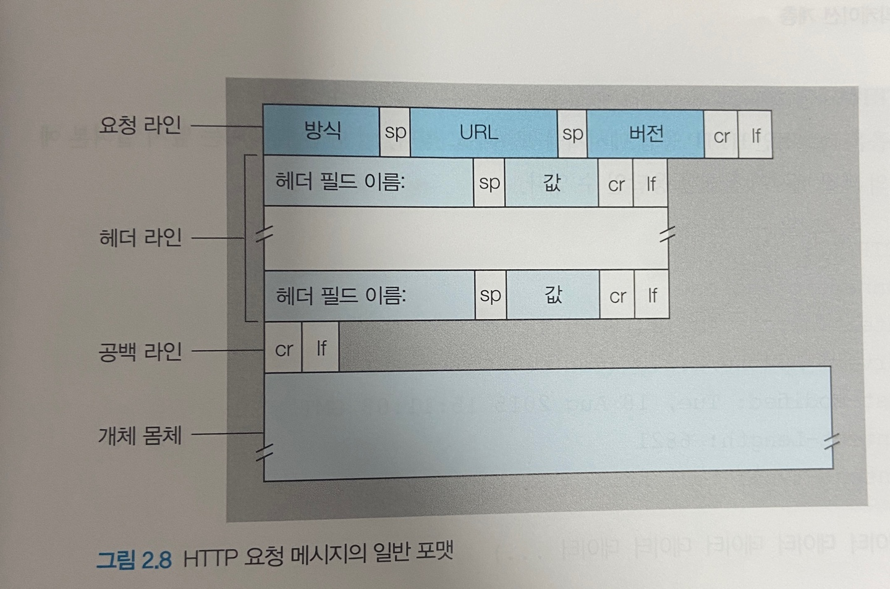
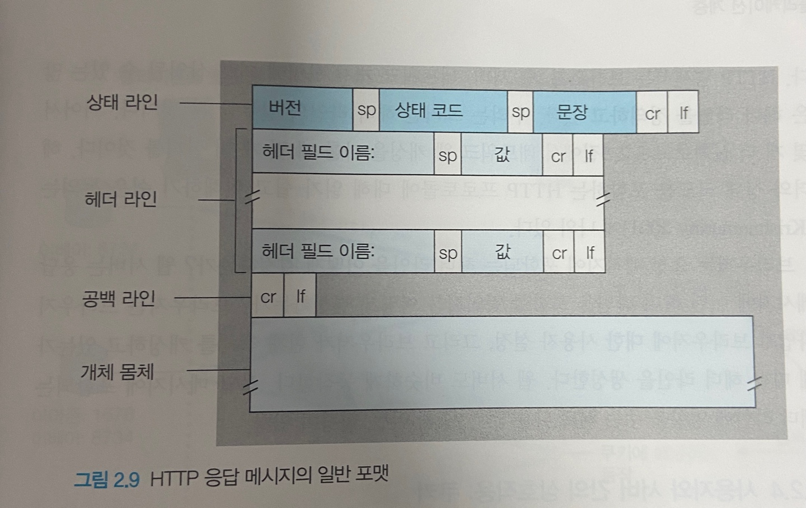
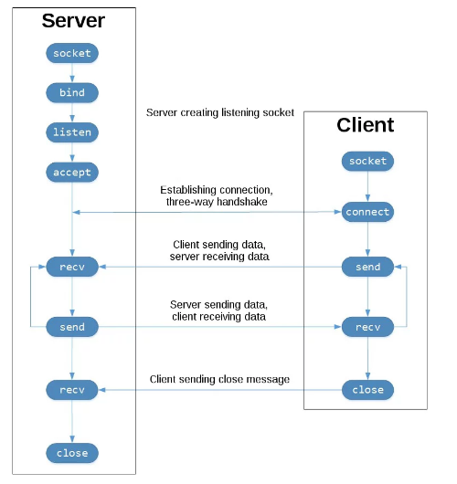

# 어플리케이션 레이어

## 네트워크 용어정리 / 개요

**인터넷** - TCP / IP 프로토콜을 사용하는 세계 최대 규모의 네트워크

**패킷 packet** - 네트워크 통신 시 분할된 데이터 조각. 전송 데이터의 기본 단위

**인터넷 서비스 제공사 ISP** - 인터넷에 접속하는 수단을 제공하는 주체. KT, U+…

**서버** - 컴퓨터 네트워크에서 다른 컴퓨터에 서비스를 제공하기 위한 컴퓨터 또는 프로그램

**온프레미스 on-premise** : 사내 또는 데이터 센터에 서버를 두고 운영하는 것 ↔ **클라우드**

**DMZ(DeMilitarized Zone)** - 네트워크 구성 중에서 일반적으로 인터넷인 외부 네트워크와 내부 네트워크 사이에 위치한 중간 지대(서브넷). 네트워크의 보안 영역으로 외부 공격자가 내부 네트워크에 침투하는 것을 막는 역할을 한다.

**프로토콜 protoco**l - 컴퓨터 간에 정보를 주고받을 때의 통신 방법에 대한 규칙이나 표준

**OSI 7계층 모델 Open Standards Interconnection model** - ISO 국제 표준화 기구가 1977년 정의한 국제 통신 표준 규약. 네트워크 기본 구조를 일곱 개 계층으로 나눠서 표준화했으며 다른 모든 통신 규약의 기반이 된다.

**TCP / IP 모델 Transmission Control Protocol / Internet Protocol model** - OSI 모델 7계층의 네트워크에서 데이터를 전송화는 과정을 4 개의 계층(Layer)로 단순화시켜 사용하는 모델. 인터넷 모델이라고도 합니다. 응용 계층, 전송 계층, 인터넷 계층, 네트워크 접속 계층

**물리 계층 physical layer** - 컴퓨터와 네트워크 장비를 연결하고, 전송되는 데이터를 전기신호로 변환. OSI 최하위 계층. 전송 매체를 통해 데이터를 통신할 수 있는 전기적인 신호로 바꾸어 전송하는 일을 한다.

**데이터 링크 계층** -네트워크 장비 간에 신호를 주고받는 규칙을 정하는 계층. 일반적으로 가장 많이 사용되는 규칙이 이더넷(Ethernet). 캡슐화, 데이터에 이더넷 헤더와 트레일러를 추가하여 프레임을 만들고, 물리 계층에서 이 프레임 비트열을 전기 신호로 변환하여 네트워크를 통해 전송한다. 역캡슐화, 전기 신호로 전송된 데이터를 비트열로 변환하고 데이터 링크 계층에서 이더넷 헤더와 트레일러를 분리.

**캡슐화 / 역캡슐화 encapsulation / decapsulation** - 캡슐화는 컴퓨터 통신에서 상위 계층의 통신 프로토콜로 정보를 데이터에 추가하여 하위 계층으로 전송하는 기술. 역캡슐화는 상위 계층의 통신 프로토콜에서 하위 계층이 추가한 정보와 데이터를 분리하는 기술

**헤더 header** - 저장되거나 전송되는 데이터의 맨 앞에 위치하는 추가적인 정보 데이터. 데이터의 내용이나 성격을 식별, 제어하는데에 사용한다.

**스위치** - 데이터 링크 계층에서 동작. 레이어 2 스위치 혹은 스위칭 허브라고 불린다. 컴퓨터(호스트)에서 특정한 다른 단말기로 패킷을 보낼 수 있는 기능이 있어 통신 효율이 향상된다.

- **MAC 주소 테이블 -** 스위치 내부에 존재.스위치의 포트 번호와 해당 포트에 연결되어 있는 컴퓨터의 MAC 주소가 등록되어 있다.(데이터베이스)
- **MAC 주소 학습 기능** - 프레임이라는 데이터가 전송되면 MAC 주소 테이블을 확인하고 출발지 MAC 주소가 등록되어있지 않으면 MAC 주소를 포트와 함께 등록하는 기능
- **플러딩 flooding** - MAC 주소가 등록되어 있지 않다면 송신 포트 이외에 데이터 프레임이 전송되는 것
- **MAC 주소 필터링** - MAC 주소가 등록되어 있으면 목적지 컴퓨터에만 데이터가 전송된다. MAC 주소를 기준으로 목적지를 선택하는 것

**트위스트 페어 케이블 twisted pair cable = 랜 케이블(LAN)**

- **UTP 케이블 Unsheilded Twist Pair.** - 구리 선 여덟개를 두 개씩 꼬아 만든 네 쌍의 전선. 실드로 보호되어 있지 않다. 실드란 금속 호일이나 금속 매듭과 같은 것으로 노이즈를 막는 역할을 한다. 따라서 노이즈의 영향을 받기 쉽지만 저렴해서 일반적으로 많이 사용된다.
- **STP 케이블 Shielded Twist Pair** - 실드로 보호한 케이블.

**랜 케이블**

- **다이렉트 케이블** - 구리 선 여덟 개를 같은 순서로 커넥터에 연결. 컴퓨터와 스위치 연결 시 사용
- **크로스 케이블** - 1 2번에 연결되는 구리선을 다른쪽의 3, 6번에 연결한 케이블. 1, 2에서는 수신, 3, 6에서는 송신을 담당. 컴퓨터 간에 직접 랜 케이블로 연결할 때 사용. 이 때 양 쪽 모두 1번과 2번 선을 사용한다.. 일부러 중간에 전선을 교차시켜서 송신과 수신 측이 올바르게 영ㄴ결되도록 한다.
- auto MDIX ( auto Medium-Dependent Interface crossover) - 다이렉트 케이블과 크로스 케이블을 자동으로 판단하는 기능. 컴퓨터나 라우터의 인터페이스는 MD, 스위치나 허브의 인터페이스는 MDI-X(Medium Dependent Interface crossover) 라고 한다. 일반적으로 MDI , MDI-X를 연결 시에는 다이렉트 케이블. MDI 끼리나 MDI-X끼리 서로를 연결 시 크로스 케이블. 자동 판단해 연결 신호 전환하는 기능을 가진 스위치나 허브를 자주 이용한다고 합니다.

**리피터 reapter** - 일그러진 전기 신호를 복원하고 증폭하는 기능을 가진 네트워크 중계 장비. 멀리 있는 상대방과도 통신할 수 있도록 파형을 정상으로 만드는 기능을 하지만 요즘은 다른 네트워크 장비가 리피터 기능을 지원해 쓸 필요가 없다.

**허브 hub** - 포트 여러개를 갖고 컴퓨터 여러 대와 통신. 전기 신호 정형 및 증폭. 단, 특정 포트로부터 데이터를 받는다면 나머지 모든 포트로도 받은 데이터를 전소하는 특징이 있음. 스스로 판단하지 않고 전기 신호를 모든 포트로 보내 더미 허브라는 이름으로도 불림.

**이더넷 Etherne**t - 허브와 같은 장비에서 연결된 컴퓨터와 데이터를 주고 받을 때 사용. 데이터에 목적지 정보를 추가해서 보내고 목적지 이외의 컴퓨터는 데이터를 받더라도 무시하게 한다. 여러 컴퓨터가 동시에 데이터를 전송해도 충돌이 일어나지 않는 구조로 되어 있다.

- CSMA / CD (Carrier Sense Multiple Access with Collsion Detection
  - CS - 데이터를 보내려고 하는 컴퓨터가 케이블에 신호가 흐르고 있는지를 확인한다는 규칙
  - MA - 케이블에 데이터가 흐르고 있지 않다면, 데이터를 보내도 좋다는 규칙
  - CD - 충돌이 발생하고 있는지를 확인한다는 규칙
  - 효율이 좋지 않다는 이유로 거의 사용하지 않고, 스위치라는 네트워크 장비를 사용

**이더넷 헤더** - 목적지의 MAC 주소 6바이트, 출발지의 MAC 주소 6바이트, 유형 2바이트 = 14바이트

**이더넷 유형** - 인터넷으로 전송되는 상위 계층 프로토콜의 종류. 프로토콜을 식별하는 16진수 번호가 들어간다.

**트레일러** - FCS Fram Check Sequence 데이터 전송 도중에 오류가 발생하는지 확인하는 용도로 뒤에 붙임

**프레임** - 헤더와 트레일러가 추가된 데이터. 네트워크를 통해 프레임이 전송된다

이더넷 규격

- 10BASE - T : 10 통신속도, BASEBAND 전송방식, UTP 케이블.
- 1000BASE - T 가 일반적. 10GBASE - T도 많아짐.

**충돌 collsion** - 컴퓨터 여러대가 동시에 데이터를 보내면 데이터들이 서로 부딪히게 된다.

**충돌 도메인** - 반이중 통신 방식으로 데이터 전송 시 충돌이 발생할 수 있는데 , 충돌 발생 시 그 영향이 미치는 범위. 허브는 연결되어있는 컴퓨터 전체가 하나의 충돌 도메인이 된다. 반면 스위치는 데이터를 동시에 송수신 가능한 전이중 통신 방식이므로 충돌 도메인이 좁다. 범위가 넓을수록 네트워크가 지연되므로, 충돌 도메인을 좁히는 것은 매우 중요

**MAC 주소 Media Access Control Address 물리 주소** - 제조할때 새겨지는 이더넷의 물리 주소. 전 세계에서 유일한 번호로 할당된다. 컴퓨터 네트워크에서 각각의 기기를 구분하기 위해 사용

- 랜 카드 만든 제조사 번호 - 제조사가 붙인 일련번호 24, 24 총 48비트

**통신 방식**

**전이중 통신 방식** - 송수신을 동시에. 직접 랜 케이블로 두 컴퓨터를 연결. 스위치는 충돌이 일어나지 않는 구조라 이 방식으로 통신가능. 네트워크로 스위치 사용하는 게 요즘 표준

**반이중 통신 방식** - 송수신을 번갈아. 허브를 사용

**ARP Address Resolution Protocol 주소 변환 프로토콜** - 목적지 컴퓨터의 IP 주소를 이용해 MAC 주소를 찾기 위한 프로토콜. 이더넷 프레임을 전송하려면 목적지 컴퓨터의 MAC 주소를 지정해야 한다.

- ARP 요청 - 출발지 컴퓨터가 목적지 주소를 모르면 MAC 주소를 알아내기 위해 네트워크에 브로드캐스트를 하는 것(브로드캐스트 패킷 요청)
- ARP 응답 - 지정된 IP주소를 가진 컴퓨터는 MAC 주소를 응답으로 보냄. 이를 통해 출발지 컴퓨터는 MAC 주소를 얻고 이더넷 프레임을 만들 수 있다.
- ARP 테이블 - 출발지 컴퓨터에서 MAC 주소를 얻은 후에 MAC 주소와 IP주소의 매핑 정보를 메모리에 보관한 것. IP 주소가 변경되면 해당 MAC 주소도 함께 변경되므로 제대로 통신 불가. 그래서 ARP 테이블에서는 보존 기간을 ARP 캐시로 지정하고 일정 시간 지나면 삭제 후 재요청

**네트워크 계층** - 서로 다른 네트워크에 있는 목적지로 데이터를 전송하기 위해 필요

**라우터router** - 서로 다른 네트워크를 연결해주는 장비. 현재 네트워크에서 다른 네트워크로 패킷을 전송할 수 있도록 한다. 네트워크를 분리시킬 수 있다. 스위치만 있는 네트워크에서는 모든 컴퓨터와 스위치가 동일 네트워크에 속하는데, 이를 분리시킬 수 있게 됨. 컴퓨터 1 이 다른 네트워크에 데이터를 전송하려면 라우터의 IP 주소를 설정해야 한다. 데이터의 목적지가 정해지면 해당 목적지까지 어떤 경로로 가는 것이 좋은지를 알려주는 기능을 한다. 이를 위해서는 네트워크 목적지 주소가 필요하다.

- 기본 게이트웨이 default gateway - 라우터의 IP 주소 설정 (네트워크 출입구 설정)
- 출입구 지정 후 일단 라우터로 데이터를 전송

**라우팅 routing** - 목적지 IP 주소까지 어떤 경로로 데이터를 보낼지 결정하는 것.

**라우팅 테이블** - 경로 정보를 등록, 관리. 소규모 네트워크는 수동, 대규모 네트워크는 자동. 자동은 라우터 간 경로 정보를 서로 교환하여 라우팅 테이블 정보를 자동으로 수정해준다. 따라서 네트워크 관리자가 일일이 변경하지 않아도 된다

**라우팅 프로토콜** - 라우터 간에 라우팅 정보를 교환하기 위한 프로토콜. 라우터 간에 경로 정보를 서로 교환하고 이를 테이블에 등록해나간다.

- 대표적인 라우팅 프로토콜은 RIP, OSPF, BGP 등이 있다.

**IP 주소** - 네트워크를 식별할 수 있는 주소. 어떤 네트워크의 어떤 컴퓨터인지 구분할 수 있다. 인터넷 서비스 제공자 ISP에게 받을 수 있다. 32비트로 구분하기 쉽도록 10진수로 표시. 8비트 단위로 나눠서 표시(옥텟)

- **IPv4 -** 32비트. 약 43억개… 주소로 쓰기에 부족해짐

- **IPv6** - 128비트. 340간개 정도로 엄청 많음

- 공인 IP 주소

  \- 인터넷에 직접 연결되어 있는 컴퓨터나 라우터에 할당. ISP가 제공. 사용 가능한 숫자가 제한되어 있어 라우터에만 공인 IP주소 할당 후 랜 안의 컴퓨터에는 랜의 네트워크 관리자가 자유롭게 사설 IP 주소 할당하거나 라우터의 DHCP 기능을 사용해 주소를 자동으로 할당. 2진수 32비트

  - **DHCP** Dynamic Host Cofiguration Protocol - 주소를 자동으로 할당하는 프로토콜

- **사설 IP 주소** - 회사나 가정의 랜에 있는 컴퓨터에 할당. 2진수 32비트

- **네트워크 ID** - 어떤 네트워크인가

- **호스트 ID** - 해당 네트워크의 어느 컴퓨터인가. 네트워크 ID와 더불어서 IP 주소가 된다. 하나를 크거나 작게 만들어서 네트워크 크기 조정 가능

- 클래스

  \- 네트워크 크기는 이 개념으로 구분. A는 대규모 B는 중형 C는 소규모 D는 멀티캐스트 E는 연구 및 특수용도 주소

  - A 클래스 - 처음 8비트는 네트워크 ID, 나머지 24비트 호스트 ID.

    - 공인 IP 범위 - 1.0.0.0~9.255.255.255 / 11.0.0.0~126.255.255.255
    - 사설 IP 범위 - 10.0.0.0 ~ 10.255.255.255

  - B 클래스 - 처음 16비트 네트워크 ID, 나머지 16비트 호스트 ID

    - 공인 IP 범위 - 128.0.0.0~172.15.255.255 / 172.32.0.0~191.255.255.255
    - 사설 IP 범위 - 172.16.0.0 ~ 172.31.255.255

  - C 클래스 - 처음 24바이트 네트워크 ID, 나머지 8비트 호스트 ID

    - 공인 IP 범위 - 192.0.0.0~192.167.255.255 / 192.169.0.0~223.255.255.255
    - 사설 IP 범위 - 192.168.0.0 ~ 192.168.255.255

    ~ 가정의 랜에서는 주로 C클래스 사설 IP 주소인 192.168.~.~ 가 사용된다.

    ~ cmd 에 ipconfig 입력해서 확인이 가능

IP 주소 중 특별한 주소. 컴퓨터나 라우터가 자신의 IP로 사용하면 안 된다.

- **네트워크 주소** - 호스트 ID 가 10진수로 0, 2진수로 00000000. 전체 네트워크에서 작은 네트워크를 식별하는데 사용된다. 호스트 ID가 10진수로 0이면 그 네트워크 전체를 대표하는 주소가 된다. = 네트워크의 대표 주소
- **브로드캐스트 주소** - 호스트 ID가 10진수로 255. 2진수로 1111111. 네트워크에 있는 ㅋ넘퓨터나 장비 모두에게 한 번에 데이터를 전송하는데 사용되는 IP. 브로드캐스트 주소로 데이터를 전송하면 네트워크 안에 있는 모든 컴퓨터가 데이터를 받게된다.

**IP Internet Protocol** -

**IP 헤더** - 네트워크 계층에서 캡슐화 할때 붙는 헤더. 버전, 헤더 길이, 서비스 유형, 전체 패킷 길이, ID(일련번호), 조각 상태 (flags), 조각의 위치, TTL, 프로토콜, 헤더 체크섬, 출발지 IP 주소 32비트, 목적지 IP 주소 32 비트 순서로 헤더 정보가 구성

**IP 패킷** - 네트워크 계층의 데이터. 데이터에 IP 헤더가 추가되어 만들어진 것

**프레임** - 데이터 링크 계층의 데이터.

**서브넷팅** - 네트워크를 분할해서 브로드캐스트로 전송되는 패킷 범위를 좁히는 것

**서브넷 subnet** - 분할된 네트워크. 기존 네트워크 ID와 호스트 ID가 서브넷 ID를 포함한 3분할로 쪼개진다.

**서브넷 마스크** - 네트워크 ID와 호스트 ID를 식별하기 위한 값. prefix 프리픽스 표기법으로도 사용할 수 있다. 서브넷 마스크를 슬래시 비트수로 나타낸 것

- A 클래스 255.0.0.0
- B 클래스 255.255.0.0
- C 클래스 255.255.255.0 /24
- C 클래스는 일반적으로 네트워크 ID가 24비트지만 다음과 같이 네트워크 ID를 28비트로 변경하면 4비트를 호스트 ID에서 빌리게 된다. 즉 네트워크 ID가 24비트, 서브넷 ID가 4비트, 호스트 ID가 4비트가 된다. 00000000을 4개씩 쪼개서 1111 0000 이런 식으로… 그러면 255.255.255.240 / 28 이처럼 서브넷팅 하여 여러 네트워크를 만들 수 있음.

**멀티캐스트** - 한 컴퓨터(호스트)에서 패킷을 여러 컴퓨터로 동시에 전송하는 것

**브로드캐스트** - IP 네트워크에 있는 모든 컴퓨터(호스트)로 데이터를 전송하는 방식

**전송 계층** - 목적지에 신뢰할 수 있는 데이터를 전송하기 위해 필요. 오류를 점검하는 기능이 있으며, 오류 발생 시 재전송을 요청한다. 해당 데이터가 어떤 애플리케이션에서 사용하는 데이터인지 식별하는 기능 또한 갖고 있다.

- 특성 1. 신뢰성/정확성

  \- 데이터를 목적지에 문제없이 전달하는 것

  - 연결형 통신 - 정확한 데이터를 전달하는 통신. 상대편과 확인해가며 통신한다. TCP가 사용된다.

- 특성 2. 효율성

  \- 데이터를 빠르고 효율적으로 전달하는 것

  - 비연결형 통신 - 효율적으로 데이터를 전달하는 통신. 일방적으로 데이터를 전송한다. 동영상 송출 시 사용. UDP가 사용된다.

**TCP** - 신뢰성과 정확성을 우선으로 하는 연결형 통신 프로토콜.

**TCP 헤더** - TCP로 전송할 때 붙이는 헤더

**세그먼트 segment** - TCP 헤더가 붙은 데이터.

- 출발지 포트 번호 16비트
- 목적지 포트 번호 16비트
- 일련번호 32비트
- 확인 응답 번호 32비트
- 헤더 기리 4비트
- 예약 영역 6비트
- 코드 비트 6비트 - TCP 헤더의 107번째~112 번째 6비트로 연결의 제어정보가 기록되는 곳
  - URG, ACK, PSH, RST, SYN, FIN
  - 초기값 0. 비트 활성화 시 1.
  - 연결을 확립하려면 SYN (연결요청)과 ACK (확인응답)이 필요
- 윈도우 크기 16비트
- 체크섬 16비트
- 긴급 포인터 16비트
- 옵션

**연결 connection** - 가상의 독점 통신로. 이를 확립 후 데이터를 전송할 수 있다. SYN과 ACK를 사용해야 함.

1. 연결 확립 요청 SYN 1로 활성화 : 컴1 → 컴2
2. 연결 확립 응답 + 연결 확립 요청 = SYN + ACK … ACK 1로 활성화 : 컴2 → 컴1
3. 연결 확립 응답 ACK 1로 활성화, SYN 0: 컴1 → 컴2

**3-way 핸드셰이크 three-way handshake** - 이처럼 데이터를 보내기 전에 연결을 확립하기 위해 패킷 요청을 3번 교환하는 것

**연결 끊기** - FIN, ACK 사용. FIN은 연결종료를 의미

1. 컴1 → 컴2 : 연결 종료 요청 FIN을 보냄. FIN 1
2. 컴2 → 컴1 : 연결 종료 응답 ACK 보냄. ACK 1 FIN 0
3. 컴2 → 컴1: 연결 종료 요청 FIN 보냄. FIN 1 ACK 0
4. 컴1 → 컴2: 연결 종료 응답 ACK 보냄. ACK 1 FIN 0

**일련번호** - 송신 측에서 수신측에 이 데이터가 몇 번째 데이터인지 알려주는 역할. 순서. 연속된 번호. 이 번호를 이용해 TCP 패킷 순서 제어 가능

**확인 응답 번호** - 수신 측이 몇번째 데이터를 수신했는지 송신 측에 알려주는 역할. 10번째 데이터 수신 시 11번 데이터를 송신 측에 요청함

**재전송 제어** - 일련번호와 확인 응답 번호를 사용해 데이터가 손상되거나 유실된 경우 데이터를 재전송

**버퍼** - 세그먼트(데이터)를 연속해서 보내고 난 다음에 확인 응답을 반환하면 효율이 높아짐. 이를 위해 세그먼트를 일시적으로 보관하는 장소

**오버플로우** - 수신 측은 대량으로 데이터가 전송되면 보관하지 못하고 넘치는데, 이 현상

**버퍼의 한계 크기 = TCP 헤더의 윈도우 크기** - 오버플로우를 방지하기 위한 버퍼의 한계 크기. 얼마나 많은 용량의 데이터를 저장해둘 수 있는지를 나타낸다. 이 크기 초기값은 3-way 핸드셰이크 시 판단한다.

**포트 번호 port number** - 데이터의 목적지가 어떤 프로그램인지 구분하는 역할. 0~65535번 사용 가능.

- 출발지 포트 번호 source port number

- 목적지 포트 번호 destination port number

- 잘 알려진 포트 well-known-ports

  \- 0~1023. 서버 측 애플리케이션에서 사용된다.

  - SSH 22
  - SMTP 25
  - DNS 53
  - HTTP 80
  - POP3 110
  - HTTPS 443

- 예약되어있지만 사용되지는 않는 포트 - 1024

- 랜덤 포트 - 1025 이상. 클라이언트 측의 송신 포트로 사용된다.

**UDP User Datagram Protocol** - 전송 계층에서 효율적으로 통신할 수 있도록 돕는 프로토콜. 비연결형 통신. 데이터를 효율적으로 빠르게 보내는 장점. 동영상 스트리밍 등에 사용. 랜에 있는 컴퓨터나 네트워크 장비에 데이터를 일괄로 보낼 수 있음 = 브로드캐스트

**UDP 데이터그램** - UDP 헤더가 붙은 데이터.

**UDP 헤더 -** 올바른 목적지의 애플리케이션으로 데이터를 전송하기 위해 필요한 정보가 기록된.

- 출발지 포트 번호 16비트
- 목적지 포트 번호 16비트
- 길이 16비트
- 체크섬 16비트

**응용 계층 - 5계층 세션 계층 + 6계층 표현 계층.** 애플리케이션과 데이터를 주고받기 위해 필요. 클라이언트의 요청을 전달하기 위해 서버가 이해할 수 있는 데이터로 변환하고 전송 계층으로 전달하는 역할을 한다. 또한 클라이언트 측 어플이 서버 측 어플과 통신하려면 응용 계층의 프로토콜을 사용해야 한다.

이메일, 파일 전송, 웹사이트 조회 등 애플리케이션 서비스 제공 계층

- HTTP HyperText Transfer Protocol - 웹사이트 접속 프로토콜
- DNS Domain Name System - 이름 해석 name resolution - 컴퓨터나 네트워크 장비에 붙여진 이름을 기반으로 IP 주소 알아내는 것
- FTP File Transfer Protocol - 파일 전송. 통신 포트 제어 21번, 데이터 전송 용도 20번 포트
- SMTP Simple Mail Transfer Protocol - 메일 송신. 25번
- POP3 Post Office Protocol version - 메일 수신. 110번

**클라이언트** - 서비스 요청

**서버** - 서비스 제공

www

**HTML** - 웹페이지에서 문장 구조나 문자를 꾸미는 태그를 사용해 작성하는 마크업 언어. 제목이나 목록과 같은 문장 구조를 지정하거나 이미지 파일을 보여줄 때에도 사용. 하이퍼텍스트를 작성하는 마크업 언어. 클라이언트가 html을 요청하면 서버가 보내주고, 이후 안에 있는 img 를 요청하면 다시 보여주고.. 이래서 사이트 들어갈때 간혹 이미지만 늦게 뜨는 경우가 생긴다.

- 80번 포트 - 클라이언트가 웹사이트를 보기 위해 사용하는 서버 포트

**DNS** - 응용 계층에서 이름 해석을 통해 도메인 이름을 IP 주소로 변환시킴. 즉, URL을 IP 주소로 변환하는 서비스(시스템)

**이름 해석 name resolution** - IP 주소가 아닌, http://www.~ 로 접속하도록 돕는 것.

**도메인 이름** - www. 뒷부분~ 컴퓨터나 네트워크를 식별하기 위해 붙여진 이름

**호스트 이름(서버 이름)** - www

1. URL 입력
2. URL의 IP 주소를 알려달라고 DNS 서버에 요청
3. 서버가 갈켜줌( 그 서버가 모르면 다른 DNS 서버에게 물어보고 와서 갈쳐줍니다)
4. IP 주소 가르쳐준거로 접속

DNS 서버는 전 세계에 흩어져있고 계층적으로 모두 연결되어 있다.

SMTP - 메일 보내는데 사용되는 프로토콜. 포트번호 25번 사용

POP3 - 메일 받는데 사용하는 프로토콜. 포트번호 110번 사용

ping 명령 - 목적지 컴퓨터와의 통신을 확인하기 위한 명령

ICMP Internet Control Message Protocol - 목적지 컴퓨터에 ICMP 패킷을 전송하고 패킷에 대한 응답이 제대로 오는지 확인

```jsx
ping 목적지 IP 주소
ping 목적지 호스트 이름
```

OSI 계층

- 응용 계층(세션 + 표현) - 어플리케이션 등에서 사용하는 데이터 송수신에 필요
- 전송 계층 - 목적지에 데이터를 정확하게 전달하는데 필요. TCP 헤더가 붙음(세그먼트)
  - 출발지 포트 번호(웹 브라우저)는 잘 알려진 포트가 아닌 1025번 이상 포트 중에서 무작위로 선택된다.
- 네트워크 계층 - 다른 네트워크에 있는 목적지에 데이터를 전달하는데 필요. IP 헤더가 붙음
  - 출발지 IP 주소와 목적지 IP 주소가 추가된 IP패킷이 된다.
- 데이터 링크 계층 - 랜에서 데이터를 송수신하는데 필요. 이더넷 헤더와 트레일러가 붙어 이더넷 프레임이 됨
- 물리 계층 - 데이터를 전기 신호로 변환하는데 필요

라우터에서

- 데이터가 전기신호로 변환되어 케이블을 통해 라우터 A에 도착하면, 라우터 A는 데이터 링크 계층에서 이더넷 프레임의 목적지 MAC 주소와 자신의 MAC 주소를 비교
  - 같으면 이더넷 헤더와 트레일러 분리(역캡슐화)
- 네트워크 계층에 전달하고 자신의 라우팅 테이블과 목적지 IP 주소 비교
- 이어서 라우팅. 현재 출발지 IP 주소를 라우터 외부 IP주소로 변경 후 데이터 링크 계층에 전달해 라우터 B로 보내지도록 이더넷 헤더와 트레일러 붙인 후 물리 계층에서 데이터를 전기 신호로 변환하여 네트워크로 전달
- 이더넷 프레임의 목적지 MAC 주소와 자신의 MAC 주소를 비교. 같다면 역캡슐화 수행 후 네트워크 계층 전달. 거기서는 라우팅 테이블과 목적지 IP 주소를 비교. 데이터 링크 계층에 전달해 스위치에 전달되도록 이더넷 헤더와 FCS(트레일러) 붙여 물리 계층으로

OSI 역캡슐화

- 전기신호로 웹서버에 도착하면 데이터 링크 계층에서 이더넷 프레임의 목적지 MAC 주소와 자신의 MAC 주소를 비교. 같으면 헤더와 트레일러 분리 후 네트워크 계층에 전달
- 목적지 IP 주소와 웹서버의 IP 주소가 같은지 확인. 같으면 IP 헤더 분리 후 전송 계층에 전달
- 전송 계층에서는 목적지 포트 번호를 확인해 어떤 어플리케이션에 전달해야 하는지 판단하고 TCP 헤더를 분리해 응용 계층에 전달

**정적 라우팅** - 관리자가 미리 라우팅 테이블에 경로를 수동으로 추가하는 방법. 목적지까지의 경로를 고정하거나 목적지까지의 경로가 하나로 한정되는 경우에 사용. 소규모 네트워크. 대역폭 부담이 적으며 보안 유지가 좋다는 장점(라우팅 정보가 교환되지 않음) 동적 반영이 되지 않아 어떤 경로에 장애가 발생해도 다른 경로로 우회 불가. 하나하나 수동변경 해줘야함

**동적 라우팅** - 네트워크 변경을 자동으로 감지해 라우팅 테이블을 업데이터 하거나 네트워크 장애가 발생했을 때 라우터끼리 정보를 교환해 최적의 경로로 전환하는 기능 수행. 관리자는 정적 라우팅처럼 라우팅 테이블에 경로를 수동으로 추가할 필요 x. 대규모 네트워크에서 사용

**인프라스트럭처 방식** - 무선 액세스 포인트를 통해 통신

**에드혹 방식** - 무선 클라이언트끼리 직접 통신

### 네트워크

네트워크란 물리적, 논리적으로 연결된 하드웨어 장비의 모음이다. 네트워크를 통해 정보를 교환할 수 있다.

**네트워크의 장점**

- 연결성과 통신
- 데이터 및 하드웨어 공유
- 인터넷 접속 및 접속 공유
- 데이터 보안과 관리
- 성능 향상과 분배
- 엔터테인먼트

**네트워크의 단점**

- 하드웨어, 소프트웨어 구성 및 관리 비용
- 바이러스와 같은 악성 공유
- 불법(회사 자원 남용, 생산성 저하, 불법 자료 다운로드, 저작권 침해)
- 데이터 보안

### 네트워크 계층, 모델, 구조

**계층을 나누는 이유?**

- 생산 장비에서 작업을 분할하는 것과 유사. 각 계층에서 필요로 하는 특수 기능만 수행하면 된다.
- 계층별로 나누면 네트워크가 전체적으로 어떻게 동작하는지 이해하기 쉽다.
- 제각각 다른 곳에서 만든 기술이 상호작용 할 수 있다.
- 설계 변경과 개선이 쉽다

**OSI 7계층 (Open System Interconnection)**


| 그룹 | #   | 계층 이름    | 핵심 역할                                                                                              | 처리 데이터            | 유형 범위                                       | 주요 프로토콜과 기술                                                                                                      |
| ---- | --- | ------------ | ------------------------------------------------------------------------------------------------------ | ---------------------- | ----------------------------------------------- | ------------------------------------------------------------------------------------------------------------------------- |
| 하위 | 1   | 물리         | 인코딩과 신호 처리, 물리적 데이터 전송, 하드웨어 명세, 토폴로지와 설계                                 | 비트                   | 로컬 장비 간에 전송된 전기 OR 광신호            | 대부분의 데이터 링크 계층 기술을 위한 물리 계층                                                                           |
| 하위 | 2   | 데이터 링크  | 논리적 연결 제어, 매체 접근 제어, 데이터 프레이밍, 주소지정, 에러 탐지와 처리, 물리 계층 요구사항 정의 | 프레임                 | 로컬 장비 간에 전송도니 하위 수준 데이터 메시지 | IEEE 802.2 LLC, 이더넷 관련 프로토콜; 토큰 링, FDDI와 CDDI), IEEE 802.11(WLAN, 와이파이), HomePNA, HomeRF, ATM,SLIP과 PPP |
| 하위 | 3   | 네트워크     | 논리적 주소지정, 라우팅, 데이터그램 캡슐화, 단편화와 재조합, 에러 처리와 진단                          | 데이터그램 / 패킷      | 로컬 또는 원격 장비 간의 메시지                 | IP, IPv6, IP NAT, IPsec, 모바일 IP, ICMP, IPX, DLC, PLP, RIP와 BGP 같은 라우팅 프로토콜                                   |
| 하위 | 4   | 전송         | 프로세스 수준 주소 지정, 다중화/역다중화, 연결, 분할과 재조합, 승인과 재전송, 흐름 제어                | 데이터그램 / 세그먼트  | 소프트웨어 프로세스 간의 통신                   | TCP와 UDP, SPX, NetBEUI/NBF                                                                                               |
| 상위 | 5   | 세션         | 세션 수립, 유지 ,종료                                                                                  | 세션                   | 로컬 또는 원격 장비 간의 세션                   | NetBIOS, 소켓, 네임드 파이프(named pipes), RPC                                                                            |
| 상위 | 6   | 프레젠테이션 | 데이터 번역, 암축과 암호화                                                                             | 인코딩된 사용자 데이터 | 애플리케이션 데이터 표현                        | SSL, 셀과 방향변경자(redirectors), MIME                                                                                   |
| 상위 | 7   | 애플리케이션 | 사용자 애플리케이션 서비스                                                                             | 사용자 데이터          | 애플리케이션 데이터                             | DNS, NFS, BOOTP, DHCP, SNMP, RMON, FTP, TFTP, SMTP, POP3, IMAP, NNTP, HTTP, Telnet                                        |

[유의점]

- 많은 프로토콜이 OSI 모델을 염두에 두고 설계되지 않아 정확히 들어맞지 않고, 두 개 이상의 계층이 걸쳐있거나 두 프로토콜이 하나의 계층을 공유하기도 한다.
- 상위 계층(세션, 프레젠테이션, 애플리케이션) 경계가 모호하다.
- LAN을 염두에 두고 설계된 모델이라 WAN 기술은 이들 계층과 중첩되거나 일부만을 공유하므로 주의

**캡슐화**


모듈화되고 유연한 네트워크를 만드는데 매우 중요한 역할을 합니다.

데이터 송신 시

- PDU는 그 다음 하위 계층으로 전달된다. 하위 계층은 그 PDU를 처리하는 서비스를 상위 계층에 제공하기 때문에 그 PDU를 하위 계층에서는 SDU라고 부른다. SDU는 하위 계층의 PDU로 캡슐화되고 이것이 다시 스택의 하위 계층으로 전달되어 물리 계층에 도달한다.

데이터 수신 시

- 이와 반대 과정이 일어난다 == 역캡슐화

4계층 PDU = TCP 세그먼트

3계층 PDU = IP 데이터그램 = TCP 헤더 + 상위계층 SDU

2계층 PDU = 이더넷 프레임 = 3계층 IP 헤더 + 4계층 TCP 헤더 + 상위계층 SDU +

1계층 = 2계층 이더넷 헤더 + 3계층 IP 헤더 + 4계층 TCP 헤더 + 상위계층 SDU + 2계층 이더넷 푸터

**구조 architecture**

- 계층을 구성하는 HW와 SW의 특정 부분 기능을 설명하는 규칙 모음.
- 특정 기술을 이용하는 장비와 프로그램이 어떻게 동작해야 하는지를 설명하는 명세나 표준의 형태
- 네트워킹 구조는 OSI 참조 모델의 특정 계층과 관련된 기능을 구현하기 위해 설계됨

**프로토콜**

용어가 애매하고 여러 의미를 동시에 지니고 있다.

- 장비와 시스템이 통신하기 위한 언어, 규칙과 절차의 모음
- 장비가 서로 효율적으로 통신하는 것을 보장하는 방법
- 둘 이상의 장비 같은 OSI 참조 모델 계층끼리의 통신 방법을 설명한다.
- OSI 참조 모델에서는 동일한 계층의 실체 간의 통신을 규정하는 규칙 모음을 의미
- 네트워크나 인터네트워크에 참여하는 모든 장비들이 전체 통신 과정에서 다양한 행위가 어떻게 이루어져야 하는지에 대해 동의했다

**서킷 스위칭 Circuit-Switching 네트워크**

- 모든 통신에 쓰이는 서킷이라는 연결이 두 장비 간에 맺어진다
- 두 장비간 통신이 일어나기 전에 서킷이 맺어지는데 일단 서킷이 맺어지면 데이터를 전송할 수 있는 다른 경로가 존재하더라도 이들 장비 간의 모든 통신이 서킷을 통해 이루어진다.
- 전화 시스템

**패킷 스위칭 Packet-Switching 네트워크**

- 데이터 전송을 위한 특정 경로가 존재하지 않는다.
- 데이터를 패킷이라는 작은 조각으로 나눈 뒤 전송.
- 이 패킷은 최종 목적지에 도달하기 전에 라우팅되고, 결합되고, 분할될 수 있다
- 패킷 수신자는 패킷을 읽어 원본 데이터를 만든다.
- 동일한 파일이나 채널에 속한 데이터 블록이라도 한 장비에서 다른 장비로 전송되는 동안 매우 다양한 경로를 거칠 수 있다.
- 전용 회선 없이 많은 장비가 동시에 통신할 수 있어서 오늘날 많이 쓰이고 있지만, 데이터가 동일 경로로 전송되지 않아 일부 데이터가 유실되거나 순서가 뒤바뀔 수 있다.
- 우편 시스템

**메시지**

패킷 스위칭 네트워크 장비 간의 통신은 메세지를 통해 이루어지며, OSI참조 모델의 각 계층에 따라 패킷, 데이터그램, 프레임, 셀로 불리기도 한다. OSI에서 이 메세지를 설명하는데 사용하는 공식 용어는 프로토콜 데이터 유닛 PDU, 서비스 데이터 유닛 SDU이 있다.

- 패킷
  - OSI 참조 모델의 네트워크 계층에서 동작하는 프로토콜이 보내는 메세지를 의미
- 데이터그램
  - 패킷과 동의어. 네트워크 계층 메세지
  - OSI 참조 모델의 상위 계층에서 전송되는 메세지
- 프레임
  - OSI 하위 계층에서 오가는 메세지와 연관
  - 데이터 링크 계층 메세지를 언급할때 해당 단어를 사용
  - 상위 계층 패킷이나 데이터그램을 받은 다음 하위 계층에서 필요로 하는 헤더를 추가해 프레임을 만드는 것에서 유래
- 셀
  - 크기가 고정된 메세지
  - ATM 전송 크기가 53바이트로 고정된 메세지
- 프로토콜 데이터 유닛 PDU, 서비스 데이터 유닛 SDU
  - N 계층의 PDU는 N계층의 프로토콜 사이에서 전송되는 메세지로, N계층 헤더 정보와 N+1 계층에서 캡슐화된 데이터(N계층 SDU, N+1계층 PDU)
- 세그먼트 ( TCP )

**메세지 포매팅**

메세지는 네트워크를 통해 정보를 전송하는데 쓰이는 구조. 프로토콜이나 기술 별로 크게 다르며 명칭도 다양하다. 모든 프로토콜은 자신이 이용하는 메시지의 구조를 결정하는 특수한 포매팅 방법을 사용한다. 이러한 메시지들은 3개의 요소로 이루어진다.

- **헤더**
  - 실제 데이터 앞부분에 위치하는 정보
  - 메시지가 담고 있는 데이터의 중요한 속성, 데이터 해석 및 사용법을 설명하는 여러 작은 제어정보 바이트를 포함
  - 서로 다른 장비의 프로토콜 요소간 통신/제어 링크 역할
- **데이터**
  - 실제 데이터. 메시지의 페이로드라고 불린다
  - 일부 메시지는 데이터를 가지고 있지 않은 경우도 있다(제어나 통신에 쓰이는 경우)
  - 실제 데이터 전송 전 논리적 연결을 맺거나 연결 끊 는 경우에 쓰이는 메시지는 데이터를 포함하지 않는다
- **푸터**
  - 데이터 뒷부분에 위치하는 정보
  - 헤더와 마찬가지로 제어 정보를 포함하므로 헤더와 큰 차이는 없으며, 트레일러라 부르기도 한다.
  - 헤더와 따로 두는 이유는 일부 제어 정보 중 데이터 자체의 내용을 이용해 계산되는 것이 있기 때문. 이 계산 한 뒤 그 결과를 페이로드 뒤에 붙여서 보내는게 효율적인 경우가 있다.
  - 수신 장비에서 에러를 탐지하는데 쓰이는 순환 중복 검사 CRC 코드가 그 예시
  - 하위 계층 프로토콜, 특히 OSI 참조 모델의 링크 계층 프로토콜에서 많이 쓰인다.

**메시지 주소지정과 전송 방법**

메시지를 보내려면 주소를 지정해야 한다. 즉, 시스템에서 메시지를 어디로 보낼지 알 수 있도록 주소를 적어야한다. 이후 수신자에게 메시지를 전송해야 한다.

- **유니캐스트**
  - 한 장비에서 다른 장비로 전송하는 방법.
  - 지정된 수신자가 아닌 장비는 메시지를 받으면 안 된다.
  - 단, 특정 컴퓨터에게 메시지를 보낸다고 해서 다른 컴퓨터가 그 메시지를 읽을 수 있다는 보장은 없다.
  - **주소 지정** - 목적지 주소가 특정한 하나의 주소여야 한다. 가장 널리 쓰이는 방법으로, 거의 모든 프로토콜에서 유니캐스트 주소지정 방법을 지원한다.
- **브로드캐스트**
  - 메시지를 네트워크의 모든 장비로 전송하는 방법.
  - 정보를 네트워크에 있는 모두에게 보내야 하거나, 한 장비에게 보내야 하지만 그 장비의 주소를 모를 때 사용
  - 여러 서비스를 관리하는 특정 스테이션이나 장비의 위치를 찾는 거소가 같은 다양한 목적엣 사용
  - **주소 지정** - 브로드캐스트를 위해 예약된 특수 주소를 이용한다. 브로드캐스트 주소로 전송된 메시지를 받은 장비는 그 메시지를 모든 사람에게 전송되는 것으로 해석한다.
- **멀티캐스트**
  - 유니캐스트 + 멀티캐스트
  - 특정 기준을 만족하는 스테이션 그룹으로 메시지를 전송한다.
  - **주소 지정** - 특정 장비 그룹으로 메시지를 전송하며, 이를 위해 어떤 장비가 어떤 그룹에 속해 있는지를 관리하기 위한 방법을 필요로 한다.
- 점대점 네트워크 point-to-point network
  - 오직 두 장비가 서로 연결되는 것.
  - 한 장비가 보낸 모든 데이터는 수신자가 다른 장비라는 것을 암시적으로 내포
  - 메시지 주소 지정이 반드시 필요하지 않음
- 애니캐스트 메시지 anycast message
  - 장비 그룹 구성원 중 가장 가까운 장비에게 전송되어야 하는 메시지
  - IPv6 버전부터 정의된 새로운 메시지 주소지정 방법

**네트워크 구조 모델**

자원 공유를 위한 네트워크 구성을 결정하려면 어떻게 할당할지 여부 등을 결정해야 한다.

- 피어투피어
  - 엄격하게는 각 컴퓨터가 네트워크에서 동등항 상대방(peer)으로 인식된다
  - 각 머신은 다른 머신과 공유할 수 있는 자원을 갖고 있다.
  - 특정 장비에 특수한 역할이 할당되는 경우는 없으며, 각 장비는 보통 비슷한 SW를 운영한다.
  - 이 구성에서는 어떤 장비든 다른 모든 장비에게 요청을 보낼 수 있다.
  - 단순하고 비용이 저렴해 작은 네트워크에서 사용된다.
- 클라이언트/서버
  - 소수의 중앙 서버가 클라이언트라고 불리는 다수의 사용자 머신에게 서비스를 제공한다.
  - 서버는 일반적으로 대용량 메모리와 저장공간, 빠른 네트워크 인터페이스를 가진 강력한 컴퓨터
  - 클라이언트는 보통 pc와 같이 작은 일반 컴퓨터로 최종 사용자에게 최적화되어있다.
  - TCP / IP와 인터넷 애플리케이션의 많은 부분이 클라이언트/서버 구조로 되어 있다.
  - 성능, 확장성,보안, 안정성 측면의 장점. 단, 구성 비용이 많이 든다. 대형 네트워크에 적합

**네트워크의 유형**

서로 연결되는 장비간의 상대적 거리, 장비간 통신에 쓰이는 방식으로 구분. 통신해야 할 영역의 양, 정보를 주고받는데 사용하는 방법에 따라 필요로 하는 네트워크 기술이 달라지기 때문

- 근거리 네트워크 LAN Local Area Networks
  - 비교적 가까이에 있는 컴퓨터를 연결.
  - 케이블을 사용
- 무선 LAN - WLAN Wireless LANs
  - 무선 장비를 유,무선 장비와 연결
- 원거리 네트워크 WAN Wide Area Networks
  - LAN보다 훨씬 먼 거리에 있는 장비나 다른 네트워크를 연결하는 네트워크
  - 물리적으로 멀리 떨어진 LAN을 연결하는데 쓰인다.
- LAN과 WAN 사이의 캠퍼스 네트워크 CAN, 도시권 네트워크 MAN 등이 있다.
- 개인 영역 네트워크 PAN personal area network
  - 수십 CM 정도 되는 매우 작은 LAN
  - 한 사람이 사용하는 자입를 연결
  - 블루투스 / IEEE 802/15 무선 기술에 사용되어 무선 PAN과 동일한 의미로 쓰이기도

**네트워크의 크기와 각 단어에 대한 범용 / 특수 의미**

네트워크가 강력한 이유 중하나는 컴퓨터 그룹을 연결할 수 있기 때문. 네트워크 연결은 여러 수준으로 구성될 수 있다.

- **네트워크**
  - 기본적으로 네트워크의 크기는 정해져 있지 않다. 하지만 네트워크가 커지고 여러 작은 네트워크라고 구성되어있다면 이를 인터네트워크라고 부른다.
- **서브네트워크(서브넷)**
  - 네트워크의 일부분 또는 더 큰 인터네트워크를 구성하는 네트워크를 의미
  - 서브넷은 TCP/ IP 주소지정에서 별도의 특수한 의미로 쓰이기도 한다.
- **세그먼트(네트워크 세그멘트)**
  - 네트워크의 작은 영역. 서브네트워크와 때때로 동의어로 사용된다.
  - 대부분의 경우 서브네트워크보다 좀더 작은 의미
  - 네트워크의 효율성을 위해 서로 연관되어 있거나 동일한 그룹에 속한 사람들이 사용하는 컴퓨터들은 같은 네트워크 세그먼트에 위치하는 경우가 많다.
  - 일부 LAN 기술(이더넷 포함) 에서는 지리적으로 가까이에 위치해있으며 단일 케이블 또는 허브와 같은 단일 장비로 직접 연결된 머신들의 집합체를 의미
  - 이러한 기술은 사용하는 네트워크 연결 장비의 종류에 따라 세그먼트에 얼마나 많은 장비가 존재할 수 있는지, 그리고 얼마나 많은 세그먼트가 서로 연결될 수 있는지 등을 정하는 규칙을 가지고 있다.
  - 이더넷고 관련해 두가지 서로 다른 방식으로 용어가 사용된다.
    - 전통적 의미 - 특정 케이블 지칭. 동축 케이블은 여러 장비가 공유하고 네트워크의 충돌 도메인이 됐었다. 허브와 리피터같은 장비는 이러한 케이블 세그먼트를 서로 연결해 더 넓은 네트워크로 만듦으로서 충돌 도메인을 확장하는데 쓰였다. 시간이 지나면서 충돌 도메인과 세그먼트가 혼용되기 시작하다가….
    - 오늘날 - 특정 케이블 조각, 하나의 충돌 도메인을 나타내는 전기적으로 연결된 케이블 모음
    - TCP에서 전송되는 메시지의 이름을 의미하기도 한다
- **인터네트워크(인터넷)**
  - 인터넷은 대충 킹 오브 인터네트워크다(제일 커서) (용어 혼동 주의)
  - 다른 네트워크를 구성요소로 포함하는 매우 큰 네트워크라는 의미를 문맥적으로 갖기도
  - 장비가 어떻게 연결되는지에 따라 네트워크랑 인터네트워크로 구분되기도 한다
    - TCP / IP가 대표 사례
    - 네트워크 - OSI 참조모델 2계층 이더넷이나 토큰링같은 기술을 이용해 서로 연결된 머신, 허브, 스위치 모음을 의미.
    - 네트워크가 3계층(IP 데이터그램을 전달하는 라우터를 이용)에서 연결될 때 인터네트워크가 구성된다고 말함

[CAN (Controller Area Network) 개요](https://www.ni.com/ko-kr/innovations/white-papers/06/controller-area-network--can--overview.html)

## 어플리케이션 계층

### 서버와 클라이언트


클라이언트 서버 구조에서는 정보를 제공하는 서버 측과 제공받는 클라이언트로 나누어진다.

서버가 가게를 여는 주인 쪽이라면 클라이언트는 그 가게에 찾아오는 손님 쪽이다.

서버의 특징은 **IP 주소가 고정된다는 점**이다.

- 서버

인터넷 상의 모든 컴퓨터는 각자 주소를 갖게 되는데 그게 바로 IP이다.

서버는 고정된 IP 주소를 가져야만 한다.

웹 사이트에 들어간다고 할 때 주소가 매일 바뀐다면 사용자는 그 웹 사이트에 접속하기 어려울 것이다.

- 클라이언트

반면 클라이언트는 IP가 가변이다.

IP 주소가 바뀌어도 서버의 IP를 알고 있으므로 접속할 수 있기 때문이다.

따라서 클라이언트는 매번 IP 주소가 바뀌어도 충분히 접속할 수 있다.

### (2) 프로세스 간 통신(IPC; inter-process communication)


하나의 컴퓨터에는 여러 개의 프로세스가 있을 수 있다.

경우에 따라 프로세스 간에 데이터를 공유해야 하는 일이 생길지도 모른다.

이 경우, **같은 호스트 사이에서 프로세스 간에 통신을 하는 것**을 프로세스 간 통신(IPC)이라 한다.

프로세스 사이에 파이프를 연결해서 통신할 수 있다.

반면 네트워크는 **서로 다른 호스트의 프로세스 간에 통신**하는 것을 말한다.

이때 프로세스 간 통신(IPC)처럼, 네트워크는 앱(App)과 앱(App) 사이에 소켓으로 연결하게 된다.

**원격 프로시저 호출(RPC)**


### (3) 소켓(socket)

프로세스는 프로세스별로 소켓을 만들어서, 소켓을 통해 통신한다.

클라이언트 프로세스에 있는 소켓에서 메시지를 보내면, 서버 프로세스에 있는 소켓에서 그 메시지를 받는 식이다.

소켓은 통신을 위한 '문'의 역할을 한다.

프로세스가 다른 호스트의 프로세스에 메시지를 보내거나 받기 위해서는 소켓을 거쳐야 한다.

소켓으로 통신할 때에는, 어느 소켓과 통신할지를 먼저 지정해야 한다.

소켓은 어떻게 다른 호스트, 다른 프로세스를 식별할까?

**1. 어떤 컴퓨터와 통신할까?**

- > 호스트를 식별하기 위해 IP Address를 사용한다.
-

**2. 어떤 프로그램, 어떤 소켓, 어떤 프로세스와 통신할까?**

- > 포트(Port) 번호를 통해 확인한다.

같은 컴퓨터여도 어떤 프로그램으로 가야 하는지를 분간해야 한다면, 포트 번호를 통해 소켓을 확인한다.

하나의 디바이스에는 여러 프로세스가 열려 있을 수 있고, 네트워크를 사용하는 프로세스도 여러 개가 있다.

### TCP 와 UDP

#### TCP: 신뢰성/정확성

- 연결형통신 : 신뢰할수있고 정확한 데이터를 전달하는 통신 (여러번확인함 이게맞는지)

ex)파일전송

3-way handshaking과정은 목적지와 수신지를 확실히 하여 정확한 전송을 보장하기 위해서세션을 수립하는 과정을 의미한다


#### UDP: 효율성

- 비연결형통신 : 효율적으로 데이터를 전달 (바로 보냄)

ex)실시간 서비스


어플리케이션 계층 프로토콜 종류

- HTTP: 웹 사이트 접속
- DNS : 이름 해석 ( 네트워크에서 컴퓨터나 네트워크 장비에 붙여진 이름을 기반으로 ip주소를 알아냄)
- FTP : 파일 전송
- SMTP : 메일 송신
- POP3 : 메일 수신

### HTTP

WWW(월드 와이드 웹)에서 HTML 문서를 송수신 하기 위한 표준 프로토콜

### DNS

도메인 네임을 ip주소로 매핑(Mapping)하는 시스템이다.

### FTP

컴퓨터와 컴퓨터, 컴퓨터와 인터넷 사이에서 파일을 주고받을 수 있도록 하는 원격 파일 전송 프로토콜

### SMTP

전자 우편을 교환하는 서비스

### 전송계층

- TCP : HTTP, DNS, FTP
- UDP : SMTP, POP3

## HTTP - 요청과 응답

#### 웹 동작 방식

웹의 동작 방식으로는 온디맨드 방식으로서

온디맨드 방식은 사용자는 본인이 원할 때 원하는 것을 수신하는 것으로서

 콘텐츠 제공자가 콘텐츠를 제공할 때 사용자가 주파수를 맞추고 있어야 하는 라디오/TV 방송과는 다른 방식이다.

#### URL 입력 시 일어나는 과정(SW 엔지니어 인터뷰에서 나오는 단골 질문이라고 함)

과정:

1.  웹 브라우저에 URL을 입력하고 Enter 키 입력
2.  웹 브라우저가 도메인명의 IP 주소 조회 (먼저 캐시를 찾고, 그다음 DNS를 검색)
3.  웹 브라우저가 서버와의 TCP 연결 시작
4.  웹 브라우저가 HTTP 요청을 서버로 전송 (필요한 경우, HTTPS 보안 통신이 진행됨)
5.  웹 서버가 요청을 처리하고 응답을 다시 전송
6.  웹 브라우저가 콘텐츠 렌더링

잡 지식!

DNS: 사람들이 네트워크를 통해 원격의 컴퓨터에 접속하기 위해서는 IP 주소를 이용해야 하지만

 숫자의 연속인 IP 주소를 일일이 외울 수 없기 때문에 기억하기 쉽도록 도메인 주소 체계가 만들어졌다.

 ex) naver.com, youtube.com

HTTP : 80 Port

HTTPS : 443 Port

#### HTTP 개요

HTTP(HyperText Transfer Protocol)는 웹의 애플리케이션 계층 프로토콜 중 하나로 웹의 중심이 된다.

HTTP는 두가지 프로그램인 클라이언트 프로그램, 서버 프로그램으로 구성되며, 각기 다른 종단 시스템에서 수행되는

 클라이언트 프로그램과 서버 프로그램은 서로 HTTP 메시지를 교환하여 통신한다.

그래서 HTTP는 메시지의 구조 및 클라이언트와 서버가 메시지를 어떻게 교환하는지에 대해 정의하고 있다.

HTTP는 웹 클라이언트가 웹 서버에게 웹 페이지를 어떻게 요청하는지와 서버가 클라이언트로 어떻게

 웹 페이지를 전송하는지를 정의한다.

 예를 들어 사용자가 웹 페이지를 요청할 때, 브라우저는 페이지 내부의 객체에 대한 HTTP 요청 메시지를

 서버로 보내고 서버는 요청을 수신하고 객체를 포함하는 HTTP 응답 메시지로 응답한다.

또한 HTTP 서버는 클라이언트에 대한 정보를 유지하지 않으므로, HTTP를 비상태 프로토콜이라고 한다.

---

#### 비지속 연결, 지속 연결

애플리케이션과 그 애플리케이션이 어떻게 이용되는지에 따라 일련의 요구가 계속해서, 일정한 간격으로 주기적으로

 혹은 간헐적으로 만들어질 수 있다.

그래서 클라이언트와 서버 간의 상호작용이 TCP 상에서 발생 할 때 두가지의 연결로는

1. 비지속 연결 : 각각의 요구(request), 응답(response)이 분리 되어 따로 분리된 TCP 연결을 보내는 것을 의미

   - 연결 수행 과정

     1. HTTP 클라이언트는 HTTP의 기본 포트 번호 80을 통해 서버에 TCP 연결을 시도하여

         클라이언트와 서버에 각각 소켓이 있게 된다.

     2. HTTP 클라이언트는 1단계에서 설정된 TCP 연결 소켓을 통해 서버로 HTTP 요청 메시지를 보낸다

     3. HTTP 서버는 1단계에서 설정된 연결 소켓을 통해 요청 메시지를 받고

         저장장치로부터 객체를 추출하여, HTTP 응답 메시지에 그 객체를 캡슐화한다.

         그리고 응답 메시지를 소켓을 통해 클라이언트로 보낸다.

     4. HTTP 서버는 TCP에게 TCP 연결을 끊으라고 한다(그러나 실제로 TCP 클라이언트가 응답 메시지를 올바로 받을 때까지 연결을 끊지 않는다).

     5. HTTP 클라이언트가 응답 메시지를 받으면, TCP 연결이 중단된다.

     6. 그 이후에 참조되는 각 객체에 대해 처음 네 단계를 반복한다.

   - 우선 비지속 연결은 몇 가지 단점이 있다.

     1. 각 요청 객체에 대한 새로운 연결이 설정되고 유지되어야 한다.
        - TCP 버퍼가 할당되어야 하고 TCP 변수들이 클라이언트와 서버 양쪽에 유지되어야 하는데
        - 이는 수많은 클라이언트들의 요청을 동시에 서비스하는 웹 서버에게 심각한 부담을 줄 수 있다.
     2. 각 개체는 2개의 RTT를 필요로 한다. (TCP 연결에 1개, 객체를 요청하고 받는데 1개)

2. 지속 연결 : 모든 요구와 해당하는 응답들이 같은 TCP 연결상으로 보내는 것을 의미

   - 지속 연결에서 서버는 응답을 보낸 후에 TCP 연결을 그대로 유지한다.
   - 같은 클라이언트와 서버 간의 이후 요청과 응답은 같은 연결을 통해 보내진다.
   - 객체에 대한 요구는 진행 중인 요구에 대한 응답을 기다리지 않고 연속해서 만들어질 수 있다.(파이프라이닝)
   - 일반적으로 HTTP 서버는 일정 기간(타임아웃 기간) 사용되지 않으면 연결을 닫는다.
   - 서버가 연속된 요구를 수신할 때, 서버는 객체를 연속해서 보낸다.
   - HTTP의 default mode는 파이프라이닝을 이용한 지속 연결을 사용한다.

---

#### HTTP 메세지 포맷

HTTP 명세서는 HTTP 메시지 포맷을 정의한다.

HTTP 메시지는 '요청 메시지' 와 '응답 메시지' 가 있다.

###### 요청 메시지

- GET /somedir/page.html HTTP/1.1
  Host: www.someschool.edu
  Connection: close
  User-agent: Mozilla/5.0
  Accept-language: fr

- 우선 ASCII 텍스트로 쓰여 있어 사람들이 읽을 수 있으며

- 위 메시지는 다섯 줄로 되어있고 각 줄은 CR(carriage return)과 LF(line feed)로 구별된다.

- 요청 메시지는 더 많은 줄로 구성되거나 하나의 줄이 될 수도 있다.

- HTTP 요청 메시지의 첫 줄은 요청 라인(reqeust line) 이라 부르고, 다음부터는 헤더 라인(header line)이라고 부른다.

- 요청 라인(reqeust line)은 3개의 필드를 갖는다.

  - Method Field(방식)
    - GET,POST,HEAD,PUT,DELETE 를 포함하는 여러 가지 값을 가질 수 있다.
  - URL Field
  - HTTP version Field

- 헤더 라인(header line)

  - 객체가 존재하는 호스트를 명시한다.

  - 호스트 헤더라인이 제공하는 정보는 웹 프록시 캐시에서 필요로 하며

  - Connection: close 헤더 라인을 포함함으로써, 브라우저는 서버에게 지속 연결 사용을 원하지 않는다는 것을 말하고 있다.

  - User-agent: 헤더 라인은 사용자 에이전트, 즉 서버에게 요청을 하는 브라우저 타입을 명시하고 있다.

    - 여기서 사용자 에이전트는 Mozilla/5.0, 파이어폭스 브라우저 이다.
    - User-agent 헤더 라인은 서버가 같은 객체에 대한 다른버전을 다른 타입의 사용자 에이전트에게 보낼 수 있으므로 유용하다.

  - Accept-language: 헤더는 HTTP에서 사용 가능한 많은 콘텐츠 협상 헤더 중 하나로 위 코드로는

     프랑스어 버전을 원하고 있음을 나타내고 존재하지 않으면 서버는 기본 버전을 보낸다.

  - 요청 메세지의 일반 포멧

    

  - 헤더 라인(그리고 추가 CR, LF) 이후에 개체 몸체(entity body)'가 있는데 개체 몸체의 경우

    - GET 방식: Empty

    - POST 방식: 일반적으로 사용

       POST 메시지로 사용자는 서버에 웹 페이지를 요청하고 있으나, 웹 페이지의 특정 내용은

       사용자가 폼 필드에 무엇을 입력하는가에 달려 있다.

       방식 필드의 값이 POST 이면 개체 몸체는 사용자가 폼 필드에 입력한 것을 포함한다.

###### 응답 메세지

- HTTP/1.1 200 OK
  Connection: close
  Date: Tue, 18 Aug 2015 15:44:04 GMT
  Server: Apache/2.2.3 (CentOS)
  Last-Modified: Tue, 18 Aug 2015 15:11:03 GT
  Content-Length: 6821
  Content-Type: text/html

- 현재 응답 메세지는 아래의 3개의 섹션으로 이루어져 있다.

  - 초기 상태 라인(status line)

    - 아래의 3개의 필드, 즉 프로토콜 가진다고 한다.

      - 버전 필드

      - 상태 코드 : 현재 예시에서는 서버가 HTTP/1.1을 사용하고 있고, 모든 것이 양호함을 나타내는 OK를 나타낸다

         즉 서버가 요청 객체를 찾아서 보내고 있음을 알려준다.

      - 해당 상태 메시지

  - 6개의 헤더 라인

    1. Connection: close: 클라이언트에게 메시지를 보낸 후 TCP 연결을 닫는데 사용

    2. Date: HTTP 응답이 서버에 의해 생성되고 보낸 날짜와 시간을 나타낸다.

    3. Server: 현재는 아파치 웹 서버에 의해 만들어졌음을 나타내며, HTTP 요청 메시지의 User-agent: 헤더 라인과 비슷하다.

    4. Last-Modified: 객체가 생성되거나 마지막으로 수정된 시간과 날짜를 나타낸다.

        이 헤더는 객체를 로컬 클라이언트와 네트워크 캐시 서버 캐싱에 매우 중요하다

    5. Content: 송신되는 객체의 바이트 수를 나타낸다.

    6. Content-Type: 개체 몸체 내부의 객체가 HTML. 텍스트인 것을 나타낸다.

        객체 타입은 파일 확장자로 나타내는 것이 아니라 공식적으로 Content-Type: 헤더로 나타낸다.

  - 개체 몸체 : 요청 객체(데이터들로 표현 된 부분)

    

  - 일반적인 상태 코드와 연관 문장은

    - 200 OK: 요청이 성공했고, 정보가 응답으로 보내졌다.

    - 301 Moved Permanent1y: 요청 객체가 영원히 이동되었다.

       클라이언트 소프트웨어는 자동으로 이 새로운 URL을 추출한다.

    - 400 Bad Request: 서버가 요청을 이해할 수 없다는 일반 오류 코드다.

    - 404 Not Found: 요청 문서가 서버에 존재하지 않는다.

    - 505 HTTP Version Not Supported: 요청 HTTP 프로토콜 버전을 서버가 지원하지 않는다.

---

#### 메소드(GET,POST,...) 특징과 개별 차이점

GET 방식

- HTTP메시지의 대부분은 GET 방식을 사용한다
- 브라우저가 URL 필드로 식별되는 객체를 요청할 때 사용된다

POST 방식

- HTTP 클라이언트는 사용자가 폼을 채워 넣을 때
- POST 메시지로 사용자는 서버에 웹 페이지를 요청하고 있으나,
- 웹 페이지 의 특정 내용은 사용자가 폼 필드에 무엇을 입력하는가에 달려 있다.
- 만약 방식 필드의 값이 POST이면, 개체 몸체는 사용자가 폼 필드에 입력한 것을 포함한다

HEAD 방식

- GET 방식과 유사하다.

- 서버가 HEAD 방식을 가진 요청을 받으면 HTTP 메시지로 응답하는데, 요청 객체는 보내지 않는다.

- 애플리케이션 개발자는 흔히 디버깅을 위해 HEAD 방식을 많이 사용한다.

PUT 방식

- 웹 서버에 업로드할 객체를 필요로 하는 애플리케이션에 의해 사용된다.

DELETE 방식

- 사용자 또는 애플리케이션이 웹 서버에 있는 객체를 지우는 것을 허용한다.

## 쿠키, 세션, 웹캐싱, HTTPS / SMTP

### 💡HTTP의 특징

---


- **Connectionless(비연결지향) :** 클라이언트가 서버에 요청을 하고 요청에 맞는 응답을 받으면 연결을 끊음.
- **Stateless(상태정보 유지 안 함) :** 비연결지향에서 나온 특징으로 연결을 끊는 순간 클라이언트의 상태 정보를 가지지 않는다.

### But, 실제로는 데이터 유지가 필요한 경우가 많다.

- 로그인 상태 유지
- 장바구니 상품 저장
- 오늘 하루 팝업 끄기
- 추천 광고 띄우기

### ⇒ 따라서, Stateful 한 경우를 대처하기 위해 쿠키와 세션을 사용한다.

- 상태 정보의 저장 위치에 따라
  - 쿠키 → 클라이언트
  - 세션 → 서버

### 💡쿠키 (Cookie)

---


Key-Value 형태의 문자열 덩어리

### 쿠키 ?

- 클라이언트(브라우저) 로컬에 저장되는 키와 값이 들어있는 작은 데이터 파일
- 이름, 값 만료기간(지정 가능), 경로 정보가 있고 키와 값으로 구성되어 있음
- 쿠키는 사용자가 따로 요청하지 않아도 브라우저가 Request시에 Request Header에 넣어서 자동으로 서버에 전송합니다.
- 클라이언트에 300개까지 쿠키 저장 가능
- 하나의 도메인당 20개의 값만 가질 수 있음, 하나의 쿠키값은 4KB까지 저장

### 쿠키의 구성요소

- 이름 : 각각의 쿠키를 구별하는 데 사용되는 이름
- 값 : 쿠키의 이름과 관련된 값
- 유효시간 : 쿠키의 유지시간
- 도메인 : 쿠키를 전송할 도메인
- 경로 : 쿠키를 전송할 요청 경로


### 쿠키의 동작 방식

1. 클라이언트가 페이지를 요청(Request)
2. 서버에서 클라이언트가 보낸 Request Header에 쿠키가 없음을 판별 후
3. 클라이언트 측에 저장하고 싶은 정보를 담아서 쿠키 Response
4. 클라이언트(브라우저)가 받은 쿠키를 생성/보존
5. 두번째 연결부터는 HTTP Header에 쿠키를 실어서 서버에 Request

### 💡세션 (Session)

---

### 세션 이란?

- 서버에 저장되는 쿠키
- 클라이언트를 구분하기 위해 세션 id를 부여
- 브라우저가 서버에 접속 ~ 종료까지 인증 상태 유지
- 접속 시간에 제한을 두어 일정 시간 응답 없을 시 유지되지 않게 설정도 가능(ex. 은행 사이트)
- 서버에서 직접 관리하므로 보안에 좋음
- 사용자가 많아질수록 서버 메모리를 많이 차지 → 성능 저하의 요인

### 세션의 동작 방식

1. 클라이언트가 서버에 접속 시 세션 ID를 발급 받음
2. 클라이언트는 세션 ID에 대해 쿠키를 사용해서 저장하고 가지고 있음
3. 클라이언트는 서버에 요청할 때, 이 쿠키의 세션 ID를 같이 서버에 전달해서 요청
4. 서버는 세션 ID를 전달 받아서 별다른 작업없이 세션 ID로 세션에 있는 클라이언트 정보를 가져와서 사용
5. 클라이언트 정보를 가지고 서버 요청을 처리하여 클라이언트에게 응답

   

### 💡캐시 (Cache)

---

- 리소스 파일들의 임시 저장소
- 같은 웹 페이지에 접속할 때 사용자의 PC에서 로드 → 서버를 거치지 않아도 된다.
- ( 이미지, 비디오, 오디오, CSS/JS 등… )
- 이전에 사용되었던 데이터는 다시 사용될 가능성이 높다 → 그래서 다시 사용될 확률이 있는 데이터들을 빠르게 접근 가능한 저장소에 저장한다.

⇒ **페이지 로딩 속도를 개선함**

### 💡HTTPS

---

### HTTP 의 문제점

서버 ↔브라우저(클라이언트)로 전송되는 정보가 암호화되지 않는다. → 데이터의 도난 가능성

### HTTPS ?

- HTTP + SSL
- HTTP의 문제를 SSL(보안 소켓 계층) 사용하여 해결
- SSL : 서버와 브라우저 사이에 안전하게 암호화된 연결을 만들 수 있게 도와주고, 서버와 브라우저가 민감한 정보를 주고받을 때 해당 정보가 도난 당하는 것을 막아줌

### SSL ?

- Secure Sockets Layer
- Netscape 에서 웹 서버와 웹 브라우저 간의 **보안**을 위해 만든 프로토콜
- 암호화의 대상은 주로 중요한 정보 (ex. 비밀번호, 개인정보 ..)
- **비대칭키 + 대칭키 방식 적절히 혼합하여 사용**

### 대칭키 vs 비대칭키

- 대칭키

  

  - 클라이언트와 서버가 같은 키를 가지고 암호화 / 복호화 한다.
  - 그런데 애초에 어떻게 같은 키를 가질 수 있을까 ?? ⇒ 한계점

- 비대칭키 (공개키 + 개인키)

  

  

  - A키로 암호화 하면 B키로만 복호화 할 수 있다.
  - B키로 암호화 하면 A키로만 복호화 할 수 있다.
  - 사이트에서는 하나의 키를 가지고 (개인키) 다른 하나의 키를 공개한다 (공개키)
  - 내가 사이트에 보내는 정보는 공개키로 보내지며, 개인키로만 복호화 가능
  - 나의 공개키로 해독할 수 있는 정보는 인증된 사이트에서 개인키로 암호화한 정보 뿐
  - ( 예를 들어, 피싱 사이트에서 보낸 정보는 오류가 난다. )

### 인증 시스템 (CA)

내가 받은 공개키가 신뢰할 수 있는 사이트에서 준 것인지 어떻게 알 수 있을까??


1. 클라이언트에서 서버에 처음 접속할 때, 일종의 탐색전을 거친다 (handshake)
2. 클라이언트는 무작위 데이터를 서버에 보내고,
3. 서버에서도 무작위 데이터와 함께 서버의 인증서를 담아 보낸다.
4. 클라이언트는 인증서를 브라우저에서 가지고 있는 CA의 공개키로 복호화한다.
5. ( 신뢰할 수 있는 사이트의 인증서 = CA의 개인키로 암호화 한 인증서 )
6. 성공적으로 복호화된 인증서에는 서버의 공개키가 있다.
7. 클라이언트는 handshake 했던 클라이언트와 서버의 무작위 데이터를 혼합하여 어떤 임시 키를 만들고, 서버의 공개키로 암호화하여 서버로 보낸다.
8. 양측에서 임시 키로 일련의 과정을 거쳐 동일한 대칭키를 갖게 된다.

### 💡SMTP

---

- Simple Mail Transfer Protocol
- 이메일 전송에 사용되는 네트워크 프로토콜
- 클라이언트가 자신이 포함된 도메인의 메일 서버에게 메일을 전송하거나 이를 수신한 메일서버가 상대방 도메인의 메일 서버로 전송하는 경우에 사용이 된다.


- IMAP / POP3 : TCP/IP 연결을 통해 원격 서버로부터 이메일을 가져오는 데 사용
- 더 알아보기 ….

  [이메일 프로토콜 이해하기: SMTP, POP3, IMAP의 의미](https://post.naver.com/viewer/postView.naver?volumeNo=26957131&memberNo=2521903)

## DNS

---

> **DNS (Domain Name System)**

- 인터넷 표준 프로토콜은 TCP/IP
- TCP/IP 프로토콜을 사용하는 네트워크 안에서 Host들을 식별하기 위한 목적으로 IP 주소를 사용
- 네트워크에서 도메인이나 호스트 이름을 숫자로 된 IP 주소로 해석해 주는 TCP/IP Network Service인 DNS가 등장


- 호스트(IP주소)를 유일하게 식별
- 주소보다 이름을 사용하고자 하는 경향
- IP주소와 도메인의 매칭 시스템 필요
- URL주소에 상응하는 IP주소를 알려주는 서비스
- 호스트의 도메인 네임 (www.example.com)을 네트워크 주소(192.168.1.0)로 변환하거나, 그 반대의 역할을 수행하는 시스템이다.

- 호스트 파일을 저장, 매핑할 필요
- 클라이언트와 서버간 모델
- 빠른 처리속도를 위해 UDP를 사용하며 인증과정을 거치지 않음

  - 보안에 취약한 구조

- **DNS 구조**

  - 도메인 네임 공간
  - 도메인 네임 공간은 계층적으며 루트를 가지는 역 트리구조
  - 최상위에는 루트 DNS 서버가 존재하고 하위에는 인터넷에 연결된 모든 노느가 연속하여 이어진 계층 구조

  

  

- 최대 63개의 문자로 구성된 스트링
- 트리의 각 노드는 도메인네임을 가짐
- 점(.)으로 구분되고 루트방향에서 읽혀짐
- 완전한 도메인은 점(.)으로 끝남 ⇒ 생략

- 도메인 네임 해석 과정
  - www.naver.com.
    - .(생략됨) → com → naver - > www
    
- **작동원리**

  

  1. PC 브라우저에서 `www.naver.com` 을 입력한다.
     - PC는 미리 설정되어 있는 DNS (단말에 설정되어 있는 이 DNS를 Local DNS라 부름, 위에서는 203.248.252.2) 에게 www.naver.com 이라는 hostname 에 대한 IP 주소를 요청한다.
  2. `Local DNS` 에는 `www.naver.com 의 IP 주소`가 있을 수도 없을 수도 있다.
     - 만약 있다면 Local DNS 가 바로 PC에 IP 주소를 주고 끝난다.
     - 하지만 본 설명에서는 Local DNS에 www.naver.com 의 IP 주소가 없다고 가정 한다.
  3. `Local DNS`는 이제 `www.naver.com 의 IP 주소`를 찾아내기 위해 다른 DNS 서버들과 통신(DNS 메시지)을 시작한다.
     - 먼저 `Root DNS` 서버에게 `www.naver.com 의 IP 주소`를 요청하며, 이를 위해 각 `Local DNS` 서버에는 `Root DNS` 서버의 정보 (IP 주소)가 미리 설정되어 있어야 한다.
     - Root DNS 서버는 전세계에 13대가 구축되어 있다. 미국에 10대, 일본/네덜란드/노르웨이에 각 1대씩이며, 우리나라의 경우 Root DNS 서버가 존재하지는 않지만 Root DNS 서버에 대한 미러 서버를 3대 운용하고 있다고 한다.
  4. `Root DNS` 서버 는 `www.naver.com 의 IP 주소`를 찾을 수 없어 Local DNS 서버에게 www.naver.com 의 IP 주소 찾을 수 없음. 다른 DNS 서버에게 물어봐 라고 응답을 한다.
  5. 이 다른 DNS 서버는 `com 도메인` 을 관리하는 DNS 서버이다.
  6. 이제 `Local DNS` 서버는 `com 도메인`을 관리하는 DNS 서버에 다시 `www.naver.com에 대한 IP 주소`를 요청한다.
  7. `com 도메인`을 관리하는 DNS 서버에도 해당 정보가 없으면, Local DNS 서버에게 www.naver.com 의 IP 주소 찾을 수 없음. 다른 DNS 서버에게 물어봐 라고 응답을 합니다.
     - 이 다른 DNS 서버는 `naver.com` 도메인을 관리하는 DNS 서버 이다.
  8. 이제 `Local DNS` 서버는 `naver.com DNS` 서버에게 다시 `www.naver.com 의 IP 주소` 를 요청한다.
  9. `naver.com DNS` 서버 에는 `www.naver.com 의 IP 주소` 가 있다. 그래서 **Local DNS 서버에게 www.naver.com에 대한 IP 주소는 222.122.195.6** 라는 응답을 한다.
  10. 이를 수신한 Local DNS는 www.naver.com 의 IP 주소를 캐싱을 하고 이후 다른 요청이 있을시 응답할 수 있도록 IP 주소 정보를 단말(PC)에 전달해 줍니다.

  

- **Recursive Query**
  - Local DNS 서버가 여러 DNS 서버에 차례대로 (Root DNS 서버 -> com DNS 서버 -> naver.com DNS 서버) 요청하여 그 답을 찾는 과정
- **Root DNS**
  - (루트 네임서버) 는 인터넷의 도메인 네임 시스템의 루트 존이다.
  - 루트 존의 레코드의 요청에 직접 응답하고 적절한 최상위 도메인에 대해 권한이 있는 네임 서버 목록을 반환함으로써 다른 요청에 응답한다. 전세계에 961개의 루트 DNS가 운영되고 있다.

> **P2P (Peer to Peer : 동배간 처리 방식)**

- 모든 컴퓨터를 동등하게 연결하는 방식
- 시스템에 소속된 컴퓨터들은 어느 것이든 서버가 될 수 있으며 동시에 클라이언트도 될 수 있다.
- 워크스테이션 혹은 개인용 컴퓨터(PC)를 단말기로 사용하는 작은 규모의 네트워크 구성에 많이 사용된다.


- 장점

  - 고품질의 서비스 제공
  - 서버, 클라이언트가 되기 때문에 구축 비용이 없다.
  - 보안 기능이 우수하다.

- 단점
  - 저작권 보호가 어렵다.
  - 노드들의 연결 속도에 영향을 받음
  - 데이터 사용에 어려움이 있음
- **P2P 구현 방식**

  1. **하이브리드 P2P (Hybrid P2P)**

     

     - 서버의 중앙화를 완전히 벗어나진 못한 형태
     - 중앙 서버가 중개 및 검색을 제공하고 데이터 전송만 P2P (개인간)방식으로 주고 받음
     - 장점 : 중앙 서버가 존재하여 검색이 빠름
     - 단점 : 네트워크가 커질수록 중앙서버에 부담 증가 / 중앙 서버 폭파 시 전체 네트워크는 끝이다.
       - ex. 소리바다, 냅스터와 같은 파일 공유 프로그램, 메신저를 통한 파일 전송

  2. **퓨어 P2P (Pure P2P)**

     

     - 중앙 서버가 존재하지 않음
     - 네트워크에 참여하는 모든 컴퓨터는 똑같이 Server & Client 역할을 겸한다.
       - 데이터 전송에 있어 동일한 수준의 책임을 가진다.
     - 장점 : 서버가 없어서 전체 네트워크가 죽는 일은 거의 희박하다. / 전 세계 모든 컴퓨터의 정보 자료를 100% 검색 및 공유 가능 / 제한된 커뮤니티 안에서 파일 정보 공유 네트워크 구성 가능 / 각 네트워크 연결을 통해 커뮤니티 상호 간의 정보 공유망 자유롭게 구축 가능
     - 단점 : 중앙 서버가 없어서 네트워크를 제어할 수단이 없고 파일 목록을 검색할 때마다 네트워크의 모든 컴퓨터를 검색해야해서 속도가 떨어진다. / 과부하 / 해킹 위험
       - ex. Gnutella, Freenet

  3. **슈퍼 피어 방식 (Super Peer)**
     - 하이브리드 P2P와 퓨어 P2P 방식의 장점들을 결합해 놓은 방식이다.
     - P2P 네트워크에 중앙 서버 역할을 하는 슈퍼 피어들을 여러개 두어 네트워크를 구성한다.
     - 장점 : 중앙 서버 존재 ⇒ 검색 속도 빠름
       - 여러개의 중앙 서버로 하나의 중앙서버가 문제가 있더라도 다른 중앙 서버로 대처 가능
     - 단점 : 슈퍼 피어를 구현하기가 쉽지 않다 / 아직 최적화된 이론이 없다

### 소켓 프로그래밍

### **소켓**

### **1) 소켓이란?**

- 프로그램이 네트워크에서 데이터를 주고받을 수 있도록 네트워크 환경에 연결할 수 있게 만들어진 연결부
- 어플리케이션 계층(Application Layer)에 존재하는 네트워크 응용 프로그램들은 데이터를 소켓을 거쳐 전송 계층(transport Layer)의 통신망으로 전달함으로써 데이터를 송수신한다.
- 소켓은 어플리케이션 계층과 전송 계층 사이에 위치하고 있다.


### 2**) 소켓 종류**

- Stream sockets
  - TCP (Transmission Control Protocol)
- Datagram sockets
  - UDP (User Datagram Protocol)
- Raw sockets

### 3**) 소켓 통신**

- HTTP 통신과 소켓 통신
  - HTTP 통신
    - 클라이언트(Client)의 요청(Request)이 있을 때만 서버(Server)가 응답(Response)하여 해당 정보를 전송하고 곧바로 연결을 종료하는 방식
    - ex) 웹페이지
  - 소켓 통신
    - 클라이언트(Client)와 서버(Server)가 특정 포트(Port)를 통해 실시간으로 양방향 통신을 하는 방식
    - 클라이언트와 서버가 계속 연결을 유지하는 양방향 통신
    - 클라이언트와 서버가 실시간으로 데이터를 주고받는 상황에 사용
    - ex) 실시간 동영상 스트리밍, 온라인 게임

### **TCP 소켓 프로그래밍**

- 특징
  - 연결 지향형(Connection-oriented) 소켓
  - 신뢰성을 보장한다.
  - 점대점(point-to-point) 연결
  - 이메일, 파일 전송 등에 사용
- 통신 흐름

  

  - 클라이언트(Client)
    - socket() : 소켓 생성. 소켓의 종류를 지정할 수 있다.
    - connect() : 'IP주소'와 '포트 번호' 로 식별되는 대상(Target)으로 연결 요청을 보낸다.
    - send()/recv() : 연결된 소켓을 통해 데이터를 보낼 때는 send(), 데이터를 받을 때는 recv()를 사용한다.
    - close() : 데이터 송수신이 끝나면 소켓을 닫는다.
  - 서버(Server)
    - socket() : 소켓 생성. 소켓의 종류를 지정할 수 있다.
    - bind() : 소켓이 사용할 포트 번호를 지정.
    - listen() : 소켓에 결합(bind)된 포트 번호로 클라이언트의 연결 요청이 있는지 확인하며 대기한다.
    - accept() : 연결 요청을 받으면, 통신을 위한 새로운 소켓을 생성 후 연결한다.
    - send()/recv() : 연결된 소켓을 통해 데이터를 보낼 때는 send(), 데이터를 받을 때는 recv()를 사용한다.
    - close() : 데이터 송수신이 끝나면 소켓을 닫는다.

### **UDP 소켓 프로그래밍**

- 특징
  - 비연결형(Connectionless) 소켓
  - 신뢰성을 보장할 수 없다.
  - 동영상 스트리밍, 게임 등에 사용
- 통신 흐름

  

  - 클라이언트(Client)
    - socket() : 소켓 생성. 소켓의 종류를 지정할 수 있다.
    - sendto() : 데이터 전송. 목적지의 정보도 함께 전송된다.
    - recvfrom() : 데이터 수신.
    - close() : 데이터 송수신이 끝나면 소켓을 닫는다.
  - 서버(Server)
    - socket() : 소켓 생성. 소켓의 종류를 지정할 수 있다.
    - bind() : 소켓이 사용할 포트 번호를 지정.
    - recvfrom() : 데이터 수신. 송신지의 정보를 얻을 수 있다.
    - sendto() : 데이터 전송.
