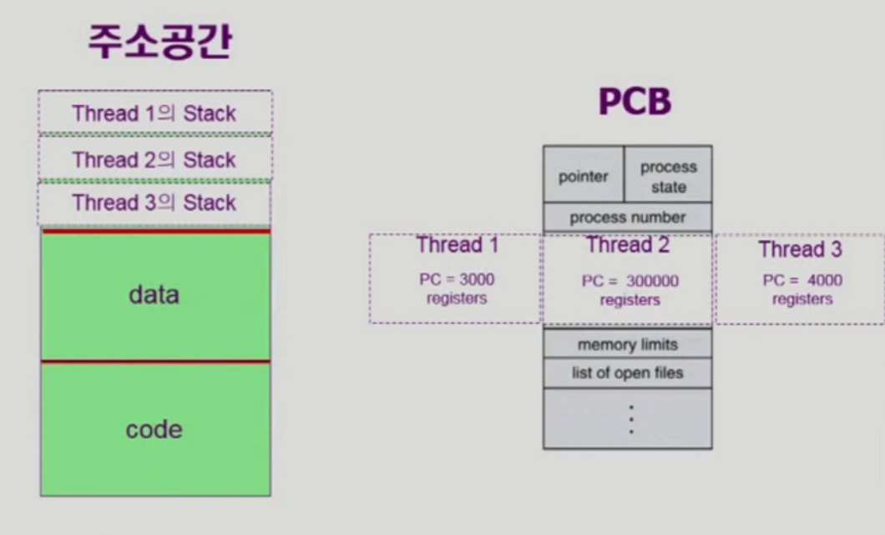
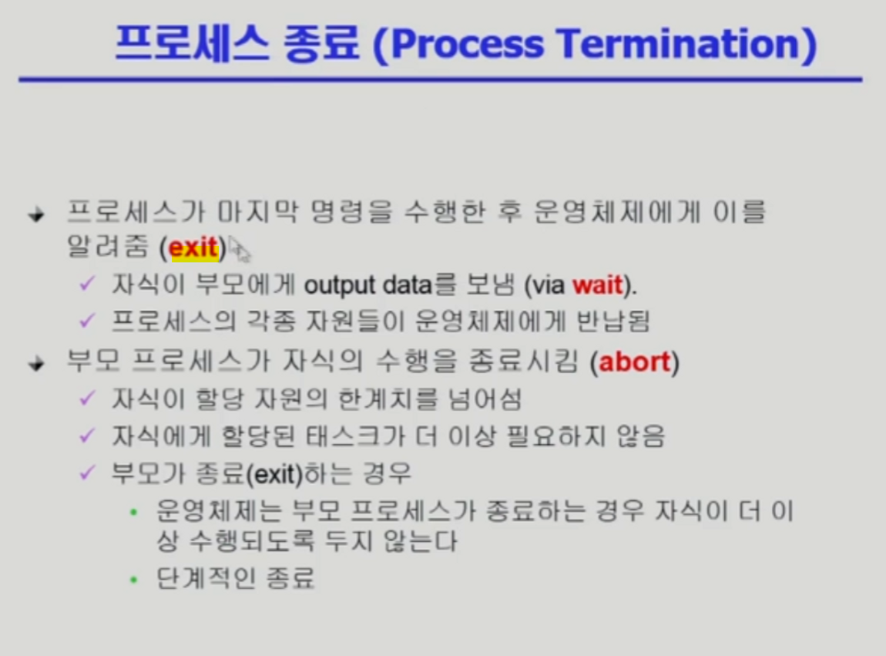
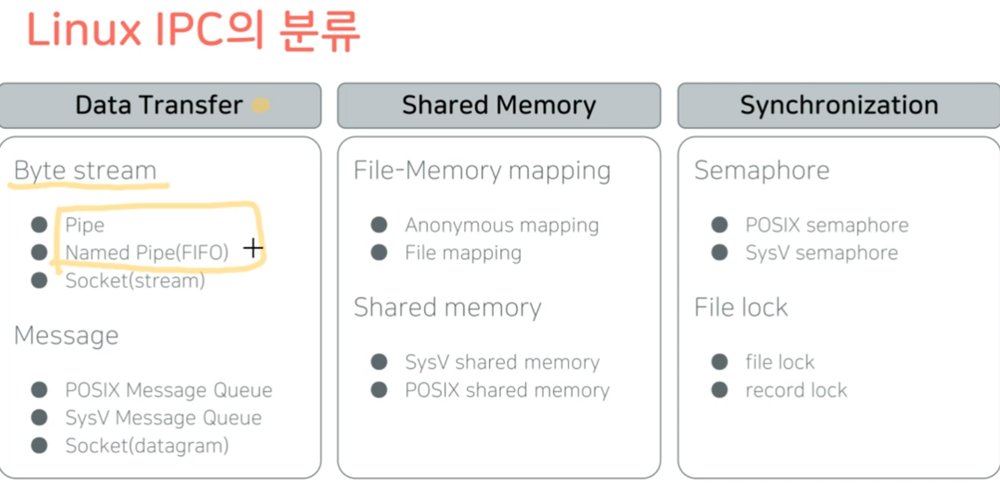
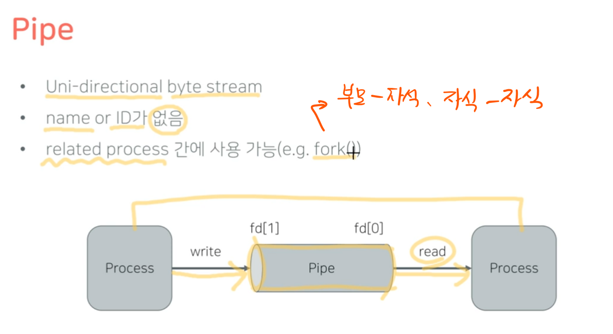
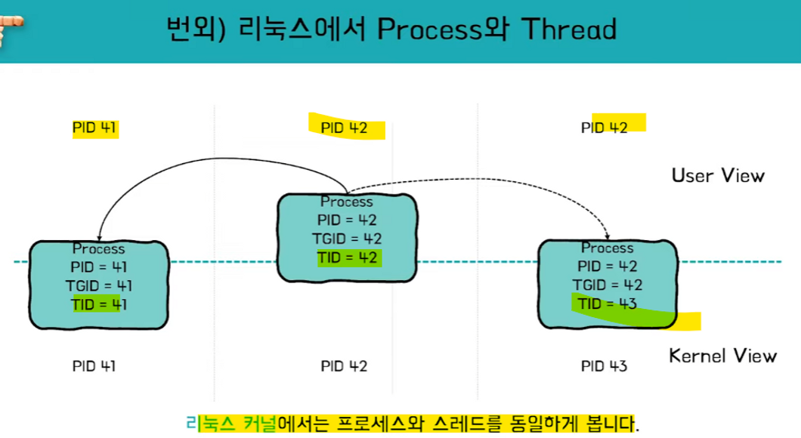
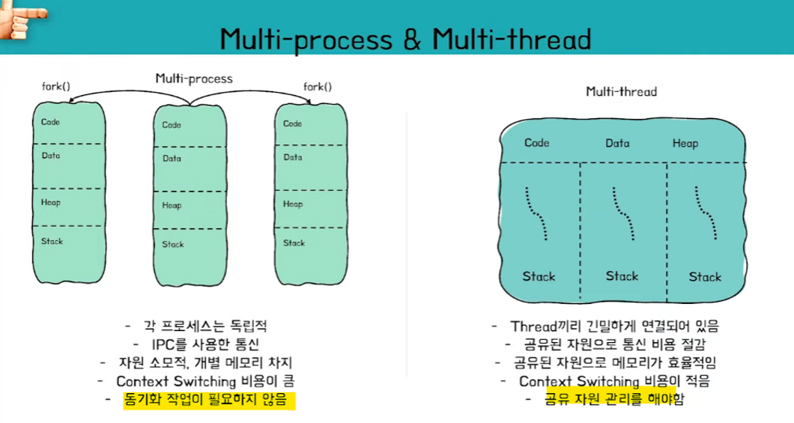
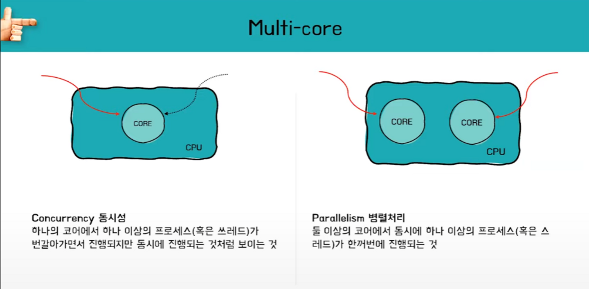

# 운영체제 전반부

## 컴퓨터 시스템의 구조 

### 💡프로그램의 실행

---

### 1. CPU와 메모리


1. Disk 에 있던 프로그램이 Memory로 올라와, CPU가 참조할 수 있게 된다.


1. 프로세스는 독자적인 주소 공간 생성 ( + 커널도 프로그램이므로 주소 공간 가짐!)

   - code : 프로그램 소스 코드
   - data : 전역 변수 ( 프로그램 시작 시 할당, 종료 시 소멸 )
   - heap : 동적 변수
   - stack : 함수, 지역 변수 ( 함수 호출 시 할당, 종료 시 소멸 )

   ### 2. CPU와 I/O 장치


1. **컴퓨터**에 대한 연산은 **CPU**가 처리
2. **I/O 디바이스**에 대한 연산은 각각의 **디바이스 컨트롤러**가 처리
3. 각각의 컨트롤러로부터 들어오고 나가는 데이터들은 **로컬 버퍼**에서 관리
4. **컨트롤러**는 연산 후 CPU에 **인터럽트** 발생시켜 보고한다.

### 💡인터럽트 (Interrupt)

---

프로그램을 실행하는 도중에 **예기치 않은 상황이 발생할 경우 현재 실행 중인 작업을 즉시 중단**하고, **발생된 상황에 대한 우선 처리가 필요함을 CPU에게 알리는 것**


- 외부 인터럽트 (Intuerrupt) - I/O , 타이머 , 전원 이상 …
- 내부 인터럽트 (Trap)

  - 시스템콜-프로세스가 data 입력 등 운영체제 서비스를 받기 위해 커널 함수를 호출하는 경우
  - Exception - 0으로 나누기, 오버 플로우, 명령어를 잘못 사용한 경우

- 인터럽트 루틴 : 운영체제 안에 저장되어 있는 인터럽트 처리에 대한 task
- 인터럽트 벡터 : 인터럽트 종류에 따라 처리해야 할 코드가 위치한 부분을 포인터로 가리키고 있는 자료구조

<aside>
❓ **한컴오피스 '한글'을 클릭 후 빈 화면에 커서가 깜빡이고 있다. 이때 hello world!를 작성하면 컴퓨터 내부에서 어떤 일이 발생하는가?**

- 예시 답안 1. 키보드에서 사용자 입력이 들어오면 키보드 컨트롤러가 인터럽트를 발생시켜서 CPU에게 키가 입력 되었다는 사실을 알려준다. 2. CPU는 현재 수행중이던 작업의 상태를 저장하고 인터럽트 요청 처리를 위해 OS내에 정의된 키보드 인터럽트 처리 루틴을 찾아간다. 3. 키보드 인터럽트 처리 루틴은 키보드로부터 입력받은 내용을 메모리의 특정 부분에 저장해서 해당 프로그램에게 키보드 입력이 들어왔음을 알리며 인터럽트 처리를 완료한다. 4. 인터럽트 처리가 끝나면 인터럽트 발생 직전 상태를 복구시켜 중단된 작업을 재개한다.
</aside>

### 💡레지스터 (Register)

---

고속 기억장치

명령어 주소, 코드, 연산에 필요한 데이터, 연산 결과 등을 임시로 저장

용도에 따라 범용 레지스터와 특수목적 레지스터로 구분됨

- 범용 레지스터 : 연산에 필요한 데이터나 연산 결과를 임시로 저장
- 특수 목적 레지스터 : 특별한 용도로 사용하는 레지스터

### **특수 목적 레지스터 중 중요한 것들**


- MAR(메모리 주소 레지스터) : 읽기와 쓰기 연산을 수행할 메모리 주소 저장
- PC(프로그램 카운터) : 다음에 수행할 명령어 주소 저장
- IR(명령어 레지스터) : 현재 실행 중인 명령어 저장
- MBR(메모리 버퍼 레지스터) : 메모리에서 읽어온 데이터 or 저장할 데이터 임시 저장
- AC(누산기) : 연산 결과 임시 저장

### 💡Block/non-block 과 Sync/Async

---

- Block / non-block : 제어권의 관점
- Synchronous / Asynchronous : 결과와 순서, 시점의 관점

✔️ 어떤 함수를 호출했을 때,

- 제어권은 언제 돌아오는지 ? → Block/non-Block
- 결과를 return한 시점과 호출자가 결과 값을 활용하는 시점의 일치? → Sync/Async


## 스레드

### 스레드

### 스레드란?



프로세스 단위로만 프로그램을 실행할 경우, 동일한 실행 파일을 여럿 실행 시키면 같은 코드의 카피가 메모리에 올라가게 될 것이고, 이는 비효율적입니다. 따라서 동일한 프로그램을 실행하면 프로세스 하나가 만들어지고, 내부에서 CPU가 수행하는 단위를 따로 두어 수행하도록 만드는 방법을 취할 수 있습니다. 이러한 맥락에서 스레드가 등장하게 되었습니다.

즉, **스레드는 프로세스 내부에서 CPU가 수행하는 단위**를 의미합니다.

스레드는 하나의 프로세스 내에서 코드, 데이터, OS 자원을 공유하되 프로그램 카운터, 레지스터 셋, 스택 영역을 별도로 갖게 됩니다.

### 스레드의 장점


프로세스에서 프로세스로 CPU가 넘어갈 때에는 컨텍스트 스위치가 발생합니다. 이는 오버헤드가 큰 작업입니다. 이에 비해 프로세스 내부의 스레드들은 내부적으로 **공유하는 자원이 있기 때문에 컨텍스트 스위칭이 일어날 때 캐싱 적중률이 올라갑니다.** (모조리 다 빼고 다시 넣을 필요 X) 따라서 **프로세스 자체를 컨텍스트 스위칭하는 것보다 오버헤드가 크지 않다는 장점**이 있습니다.

### 스레드의 구현 방법 - pthread library

https://www.joinc.co.kr/w/Site/system_programing/Book_LSP/ch07_Thread

리눅스에서는 **pthread**라는 thread 구현 라이브러리가 사용되고 있습니다.

pthread란 POSIX Thread의 약자로 유닉스계열 POSIX시스템에서 병렬적으로 작동하는 소프트웨어를 작성하기 위하여 제공하는 API입니다. 즉 스레드를 편하게 만들수 있게 도와주는 API.

pthread는 POSIX thread 의 줄임말로 POSIX 표준을 따르고 있습니다.

pthread는 리눅스 뿐만 아니라 다른 거의 대부분의 유닉스에서도 사용할 수 있습니다.

이외에도 BSD 계열에서 사용하는 'Light Weight Kernel Threads , Apple 에서 사용하는 Multiprocessing Services등의 구현체가 있습니다.

pthread는 리눅스 운영체제에서 제공하는 thread 를 제어하기 위한 함수들을 모아 놓은 C 라이브러리로, 다음과 같은 기능의 함수군을 제공합니다.

- 쓰레드 생성과 종료 관련 함수들

- 쓰레드 동기화 관련 함수들

- 쓰레드 시그널 제어 함수들

  signal은 프로세스 단위로 작동합니다. 그러나 쓰레드 프로그램의 경우, 각 쓰레드 마다 다른 시그널 정책이 필요하므로, 쓰레드 전용의 시그널 제어 함수가 필요합니다.

```python
gcc -o pthread pthread.c -pthread
//pthread.c
#include <pthread.h>
#include <stdio.h>
#include <unistd.h>
#include <stdlib.h>

void *p_function(void * data)
{
  pid_t pid; //process id
  pthread_t tid; // thread id

// pid는 프로세스의 아이디. tid는 해당 스레드의 아이디
  pid = getpid();
  tid = pthread_self();

  char* thread_name = (char *)data;
  int i = 0;

// 하나의 스레드는 while 문에서 자신의 pid, tid를 출력하며 3번 반복
// 한 번 출력 후 1초씩 쉰다.
// 이 때 sleep이 걸리면 다른 스레드가 동작.
// 스레드가 1개일 때에는 CPU가 1초 기다리는 반면 이 코드에서는 다른 스레드가 동작
  while(i<3)
  {
    printf("thread name : %s, tid : %x, pid : %u\\n", thread_name, (unsigned int)tid, (unsigned int)pid); //5
    i++;
    sleep(1);
  }
}

int main(void)
{
  pthread_t pthread[2];
  int thr_id;
  int status;
  char p1[] = "thread_1";
  char p2[] = "thread_2";
  char p3[] = "thread_3";

  sleep(1); //1초 멈춤

// pthread_create 함수를 통해 생성 가능.
// int pthread_create
//(pthread_t*thread, const pthread_attr_t*attr, void*(*start_routine)(void *), void *arg);
// 스레드 식별자(id), 스레드 특성 지정(기본값 NULL), thread 실행 시 시작할 스레드 함수 이름
// 스레드가 분기할 함수에 보낼 입력 파라미터
// 코드 실행 시 하나의 스레드가 생성되어 총 두 개의 스레드 (main, thread1이 동작)
  thr_id = pthread_create(&pthread[0], NULL, p_function, (void*)p1); 
  if(thr_id < 0)
  {
    perror("pthread0 create error");
    exit(EXIT_FAILURE);
  }
// 이제 3개의 스레드가 동작
  thr_id = pthread_create(&pthread[1], NULL, p_function, (void *)p2);
  if(thr_id < 0)
  {
    perror("pthread1 create error");
    exit(EXIT_FAILURE);
  }

// 메인을 돌고있는 스레드를 p_function에 보냄
  p_function((void *)p3); //3

// pthread_join() 함수는 main을 도는 스레드가 자신이 분기시킨 스레드들이 종료되기를
// 기다리는 함수. 그러나 이 코드를 이용하지 않고 pthread_detach 함수를 이용한다면
// join을 이용하더라도 스레드를 기다리지 않고 종료하게 됩니다.
  pthread_join(pthread[0], (void **)&status); 
  pthread_join(pthread[1], (void **)&status);

  printf("end??\\n");
  return 0;
}
```

**헤더파일**

http://sourceware.org/git/?p=glibc.git;a=blob;f=nptl/pthreadP.h;h=43ca44c8296f17f97baeda18cf50f2367ff19651;hb=HEAD

#### 프로세스 생성 Process Creation

프로세스가 실행 중 일때, 새로운 프로세스를 생성하기도 합니다. 이때 생성을 한 프로세스를 **부모 프로세스(parent process)** 부모 프로세스에 의해 생성된 프로세스를 **자식 프로세스(child process)** 라고 합니다.

자식은 부모의 공간을 복사해 사용하며, 자식은 그 공간에 새로운 프로그램을 올리게 됩니다.(fork)

프로세스는 각자 고유한 정수형 id 값을 가지고 있는데 이를 **pid(process identifier)** 이라고 합니다.이 **pid** 값은 커널 내에 프로세스의 다양한 속성에 접근하기 위한 인덱스로 사용이 됩니다.


부모 프로세스는 자식에게 본인의 자원을 분할하거나, 공유할 수 있습니다.

이때 자식 프로세스를 부모 리소스의 일부분으로 만들어서 제한을 한다면 프로세스를 생성할때 발생하는 오버헤드를 줄여 시스템의 과부화가 발생하는 것을 방지해 줄 수 있게 됩니다.

------

프로세스가 새로운 프로세스(자식 프로세스)를 생성할 때 2가지의 방법이 존재하는데,

1. 부모 프로세스와 자식 프로세스가 동시에 실행

   *(The parent continues to execute concurrently with its children)*

2. 부모 프로세스는 자식 프로세스가 종료될때까지 기다리는 방식

   *(The parent watis until some or all of its children have a terminated)*

------

### 프로세스 종료 Process Termination



종료 시에는 exit이라는 시스템 콜 진행 → 모든 자원 반납하고 종료

항상 부모 프로세스가 자식을 만들다보니 자식이 종료되면 부모에게 종료 사실을 알리게 됩니다.

프로세스의 세계에서는 항상 자식이 먼저 죽은 후 부모가 죽습니다.

**abort** 부모가 자식을 강제로 종료시키게 되는 경우

- 자식이 할당 자원의 한계치를 넘어섬
- 자식에게 할당된 태스크가 더 이상 필요하지 않음 → 자식에게 더 이상 시킬 일 없다
- 부모가 종료 exit 하는 경우
  - 운영체제는 부모 프로세스가 종료하는 경우 자식이 더 이상 수행되도록 두지 않는다
  - 단계적인 종료 → 내부적으로 룰을 지키기 위해 부모 종료하려 할때 가장 말단 자식들부터 먼저 다 죽인 후 그 부모 그 다음 부모 죽여가며 단계적 종료

### 시스템 콜

#### fork ()


**운영체제에게 자식 프로세스를 만들어달라고 요청하는 시스템 콜 함수.**

같은 구조를 가진 별개의 프로세스를 하나 더 생성하며, pid 값만 차이가 나게 됩니다.

부모 프로세스는 fork 요청을 통해 자식의 pid 값을 결과로 받게 되며, 자식의 경우 fork 결과값으로 0을 받게 됩니다. 이를 분기로 이후에 공유 자원을 든 채 exec 시스템 콜로 각자 다른 일을 할 수 있게 됩니다.

프로세스의 생성(fork)는 복제 생성. 컨텍스트 정확히 복제해서

- 메모리 주소공간 똑같이 복제
- CPU 컨텍스트(문맥) →현재 레지스터에 어떤 값을 넣고 프로그램 카운터로 어디를 실행했는가

### exec ()


**해당 프로젝트를 새 프로젝트로 덮어씌우는 시스템 콜 함수.**

execlp 인터페이스를 통해 실행. 이 함수를 만난 시점에서 해당 프로그램이 완전히 새로운 프로그램으로 덮어씌워지기 때문에 이후 내용은 출력되지 못합니다.

### wait ()


프로세스 A가 wait() 시스템 콜을 호출하면 커널은 child가 종료될 때 까지 A를 sleep 시킵니다.(block)

child process가 종료되면 커널은 프로세스 A를 깨웁니다. (ready)

부모가 wait call을 하지 않으면 부모와 자식 프로세스는 독립적인 별개의 프로세스이기 때문에 CPU를 두고 경쟁하게 됩니다.

### exit ()

프로세스가 자발적 종료를 할 때 해당 시스템 콜. 별도로 명시하지 않아도 main 함수가 리턴되는 위치에 컴파일러가 자동으로 넣어줍니다.

비자발적 종료 상황이 벌어질 때도 있습니다. 부모가 자식 프로세스를 강제로 종료시키는 경우가 이에 해당하는데, 한계를 넘어서는 자원을 요청하거나 자식이 더이상 할 일이 없을 때 종료시킵니다.

이 밖에도 키보드 인터럽트를 통해 kill, break 등을 입력한 경우, 부모가 종료되는 경우 자식 프로세스들을 종료한 후 마지막으로 부모 프로세스가 종료됩니다.

# 프로세스 간 협력 IPC


동기화 자체로 데이터 교환을 하진 않지만… 공유하는 리소스를 사용할 때 두 개 이상의 프로세스들이 동시에 접근하면 서로 원치 않는 상황이 발생하므로 동기화시킵니다.

프로세스 간 협력을 통해 다른 프로세스의 수행에 영향을 미치게 되며, 이 협력 매커니즘을 IPC( Interprocess Communication) 이라고 합니다.



## Messange Passing

커널을 통해 메시지를 전달하는 방법

중간에 운영체제를 두고 프로세스 A가 메세지를 보내달라는 시스템 콜 요청을 하면, 운영체제는 메세지를 프로세스 B에게 전달합니다. 이 때, 직접 누구에게 보낼지 명시하거나 메일박스 포트에 메세지를 집어넣어 먼저 접근하는 프로세스에게 메세지를 전달하는 방식이 있습니다.

## shared memory

주소 공간을 공유하는 방법. 두 프로세스가 메모리 일정 부분을 공유합니다. 단, 이 방법은 서로 신뢰 가능한 프로세스일 때 사용할 수 있습니다.

스레드 또한 주소 공간을 일부 공유하기 때문에 스레드 간 협력이 가능합니다.

## Pipe 파이프

파이프를 통해 통신하는 방법




### Messange Queue

메세지 타입의 전송을 지원하는 도구


id 지정 및 사용은 파직스와 시스템v가 다른 방식을 사용합니다.

시스템v → 파직스 순서로 나왔는데 시스템v가 오래되다보니 널리 퍼지고 많이 사용되어서 예전에 작성된 코드는 이 쪽으로 작성된 경우가 많다.


### Memory map

Memory mapping 은 파일을 프로세스의 메모리에 매핑하는 것이다. 즉 프로세스에 전달할 데이터를 저장한 파일을 직접 프로세스의 가상 주소 공간으로 매핑한다. read와 write함수를 사용하지 않고도 프로그램 내부에서 정의한 변수를 사용해 파일에서 데이터를 읽거나 쓸 수 있다.

### Socket

네트워크 소켓 통신을 사용한 데이터 공유


# 면접 질문

- Q. **프로세스와 스레드의 차이는 무엇입니까?**

  - 프로세스는 독립적이다. 쓰레드는 프로세스의 서브셋이다.
  - 프로세스는 각각 독립적인 자원을 가진다. 쓰레드는 code, memory 기타 다른 자원들을 공유한다.
  - 프로세스는 자신만의 **주소영역**을 가진다. 쓰레드는 **주소영역**을 공유한다.
  - 프로세스는 **IPC**를 이용해서만 통신이 가능하다.
  - 일반적으로 쓰레드의 문맥교환(context switching)는 프로세스의 문맥교환보다 빠르다.

  

- Q. **멀티 스레딩(Multi-threading) 의 장점과 단점은?**

  Multi Thread 프로그램은 Multi Process 프로그래밍 방식과 달리 하나의 쓰레드에서 발생된 문제가 전체 프로세스에 영향을 미치게 됩니다.

  멀티 프로세스의 경우에는 프로세스하나가 문제가 생기더라도 단일 프로세스로 문제가 제한됩니다. 하지만 멀티쓰레드 프로그램의 경우 하나의 쓰레드에 생긴 문제가 다른 쓰레드에까지 영향을 줄 수 있습니다. 예를 들어 쓰레드 하나가 다른 프로세스의 메모리 영역을 침범할 경우 프로세스 자체가 죽어버림으로써, 프로세스에 생성된 다른 모든 쓰레드도 프로세스와 함께 죽어버리게 됩니다. (이 문제는 시그널을 잘 활용해 해결할 수 있기는 합니다.)

  - 디버깅이 어렵다. 문맥이 서로 교환되므로 추적하기가 까다롭다.

  이러한 단점이 있음에도 불구하고 멀티쓰레딩 프로그래밍 기법을 선호하고 있다.

- Q. **멀티 프로세스 대신 멀티 스레드를 사용하는 이유는 무엇입니까?**

  

  ### **1. 자원의 효율성 증대[Permalink](https://landwhale2.github.io/os/67/#1-자원의-효율성-증대)**

  멀티 프로세스로 실행되는 작업을 멀티 스레드로 실행할 경우, 프로세스를 생성하여 자원을 할당하는 시스템 콜이 줄어들어 자원을 효율적으로 관리할 수 있음.

  - 프로세스 간의 Context Switching시 단순히 CPU 레지스터 교체 뿐만 아니라 RAM과 CPU 사이의 캐시 메모리에 대한 데이터까지 초기화되므로 오버헤드가 큼
  - 스레드는 프로세스 내의 메모리를 공유하기 때문에 독립적인 프로세스와 달리 스레드 간 데이터를 주고 받는 것이 간단해지고 시스템 자원 소모가 줄어들게 됨

  ### **2. 처리 비용 감소 및 응답 시간 단축[Permalink](https://landwhale2.github.io/os/67/#2-처리-비용-감소-및-응답-시간-단축)**

  또한 프로세스 간의 통신(IPC)보다 스레드 간의 통신의 비용이 적으므로 작업들 간의 통신의 부담이 줄어듬

  - 스레드는 Stack 영역을 제외한 모든 메모리를 공유함

  프로세스 간의 전환 속도보다 스레드 간의 전환 속도가 빠름

  - Context Switching시 스레드는 Stack 영역만 처리하기 때문 (Stack 빼고 다 공유해서 바꿀 필요가 없음)

  ### **3. 주의 사항[Permalink](https://landwhale2.github.io/os/67/#3-주의-사항)**

  동기화 문제가 남아있음

  - 스레드 간의 자원 공유는 전역 변수(데이터 세그먼트)를 이용하므로 함께 상용할 때 충돌이 발생할 수 있다.

  그렇기 때문에 잘못사용하면 변수에 의도치않은 결과가 생길수있고, 프로그램에 이상이 생긴다.

- **Q. 소켓이란?**

  소켓은 두 응용 프로그램(호스트)을 연결하는 데 사용되는 도구입니다. 인터페이스 역할을 하며, 데이터를 주고 받을 수 있는 구조체. 역할에 따라 서버 소켓 / 클라이언트 소켓으로 나눠진다.

- **Q. 동시성과 병렬성을 설명해주세요.**

  

## CPU 스케줄링 

프로세스(Process)가 구동하려면 다양한 시스템 자원이 필요하다.

대표적으로 CPU(중앙처리장치)와 입출력장치가 있는데, 최고의 성능을 내기 위해자원을

**_어떤 프로세스에 얼마나 할당하는지_** 정책을 만드는 것을 CPU스케줄링이라고 한다.

스케줄링에는 크게 장기, 중기, 단기 세 가지로 나눌수 있다.

- **장기 스케줄링**이란 어떤 프로세스가 CPU를 차지할 수 있는지 결정해서 Ready Queue에 보내는 작업 을 뜻한다.
  **어떤 프로세스를 커널에 등록할 것인지** 정하는 작업
- **중기 스케줄링**이란 **어떤 프로세스들이 메모리를 할당받을 것인지** 결정하는 작업.
  이 때, 만약 이러한 프로세스가 많을 경우 과부하 방지를 위해 프로세스를 일시적으로 정지(Waiting) 시키면서 관리합니다.
- **단기 스케줄링**이란 프로세스 실행을 위해 **언제 CPU에 어떤 프로세스를 할당할 것인지** 결정하는 작업. 프로세스 스케줄링과 문맥 교환은 프로세스 스케줄러에 의해 수행됩니다.


### 프로세스 상태도

총 5가지의 상태가 있으며, 프로세스는 위 5가지의 상태 중 1가지를 가지고 있습니다.

- **new(create)** 는 **프로세스가 생성되는 중**을 나타냅니다. '중' 이라고 표현한 이유는 프로세스는 생성되었지만 OS의 스케줄러에서 승인하지 않은 프로세스도 존재하기 때문입니다.

- **ready** 는 **준비완료**의 상태로, 아직 프로세스가 사용되진 않지만 CPU를 제외한 모든 자원은 이미 준비된 상태이며 CPU 할당만을 기다리고 있습니다.

- **running** 은 프로세스가 프로세서를 차지하여 **명령어를 실행하고 있는 중**입니다.

- **waiting** 은 **프로세스가 어떤 이벤트(입/출력 완료, 시그널 수신 등) 가 발생하기를 기다리고 있는 상태** 입니다. 실행 도중 일어날 수 있습니다.

- **terminated** 는 **프로세스의 실행이 종료되고 CPU를 반납하는 상태**입니다.

**스케줄링은 언제 발생하나요? (스케줄링 시점), 결정시점**

A.  크게 4개의 시점에서 발생합니다.

**running(수행) -> waiting(대기)** 시점은 보통 I/O 요청이 일어나거나 자식 프로세스가 종료 대기를 할 때

**running(수행) -> ready(준비)** 시점은 인터럽트(Interrupt) 가 발생했을 때

**waiting(대기) -> ready(준비)** 시점은 I/O가 완료되었을 때

**running(수행) -> terminate(종료)** 시점은 프로세스가 완전히 종료되었을 때

**선점형 스케줄링과 비선점형 스케줄링의 차이는 무엇인가요?**

A.  선점형 스케줄링은 어떤 프로세스가 CPU를 할당받아 실행되고 있는 중에도 다른 프로세스에 의해 언제든 CPU 점유를 빼앗길 수 있습니다. 이는 문맥교환 오버헤드가 크며, 대화형 시스템 또는 리얼타임 시스템에 적합합니다.

반면, 비선점형 스케줄링은 선점형 스케줄링과 반대로 다른 프로세스가 절대 CPU를 빼앗을 수 없습니다. 그렇기 때문에, 프로세스의 실행이 완료되고 CPU를 반납해야지 다음 차례의 프로세스가 실행될 수 있습니다. 문맥교환 오버헤드가 작으며, 일괄처리 시스템에 적합합니다. 단점은 하나의 프로세스가 오랫동안 CPU를 잡는 경우도 있어 처리율이 낮아질 수 있습니다.

**선점형 스케줄링의 기법은 어떤 것들이 있나요?**

A.  선점형 스케줄링에는 크게 **SRT, RR(Round Robin), MLQ(다단계 큐)** 세 가지 기법이 존재합니다.

**SRT**는 Shortest Remaining Time 의 약자로, **CPU 점유시간이 가장 낮은 프로세스에 먼저 CPU를 할당하는 기법**입니다. 단, 선점형 스케줄링이므로 중요한 프로세스가 있거나 남은 실행 프로세스의 실행 시간이 짧은 경우 현재 실행중인 프로세스를 중단하고 해당 프로세스로 옮겨 실행합니다.


다음으로, **RR(Round Robin)** 기법은 **프로세스들 사이에 우선순위를 두지 않고 순서대로 일정 시간 단위만큼 할당하는 기법**입니다. 문맥 교환의 오버헤드가 큽니다.


마지막으로, **MLQ**는 Multi-Level Queue의 약자로, **프로세스들을 특정 우선순위 그룹으로 분류한 후 각각의 다른 Ready Queue를 사용하는 기법**입니다. **각각의 Ready Queue 내부는 RR 기법을 사용**하고, 하위 Ready Queue의 프로세스를 실행하고 있더라도 상위 Ready Queue에 프로세스가 들어오면 **상위 프로세스에 CPU를 할당**합니다.


**비선점형 스케줄링의 기법은 어떤 것들이 있나요?**

A.  비선점형 스케줄링에는 크게 **FIFO, SJF, HRN** 세 가지 기법이 존재합니다.

**FIFO**는 First-In-First-Out(큐와 같음) 으로, 선입선출의 방식입니다. 즉, **먼저 Ready Queue에 들어온 프로세스부터 처리**합니다. 대신, 비선점형 스케줄링이므로 아무리 작업시간이 길어도 해당 프로세스를 계속 실행해야합니다.


**SJF**는 Shortest Job First 의 약자로, 평균 대기 시간을 최소화하기 위해 **CPU 점유 시간이 가장 짧은 프로세스부터 CPU를 먼저 할당**하는 방식입니다. 단점은 실행시간이 긴 프로세스는 짧은 프로세스들에게 밀려 무한히 대기해야 할 수 있습니다.


**HRN**은 Highest Response-Ratio Next 의 약자로, SJF 기법을 보완하고자 **대기시간과 실행시간을 이용하여 우선순위를 계산하고, 이러한 우선순위에 맞게 프로세스를 실행하는 기법**입니다. 장점은 무한히 대기해야 하는 프로세스의 비율을 낮출 수 있습니다.

### 평가 기준

- CPU 사용률 (CPU Utilization) : 전체 시스템 시간 중 CPU가 작업을 처리하는 시간의 비율
  - 전체 시간 중 주방장이 일한 시간의 비율
- 처리량 (Throughput) : CPU가 단위 시간당 처리하는 프로세스의 개수.
  - 주방장이 정해진 시간 동안 요리를 만들어 준 손님의 수
- 응답 시간 (Response Time) : 대화식 시스템에서 요청 후 응답이 오기 시작할 때까지의 시간.
  - 최초의 음식이 나오기까지 기다린 시간
- 대기 시간 (Waiting Time) : 프로세스가 준비 큐 내에서 대기하는 시간의 총합.
  - 음식을 먹은 시간을 제외한 순수하게 기다린 시간 (음식이 조금씩 여러 번 나왔더라도 중간 중간 기다린 시간을 다 합쳐야 함)
- 반환 시간 (Turnaround Time) : 프로세스가 시작해서 끝날 때까지 걸리는 시간.
  - 손님이 중국집에 들어와서 주문한 음식을 다 먹고 나가기까지 소요된 총 시간

> 

