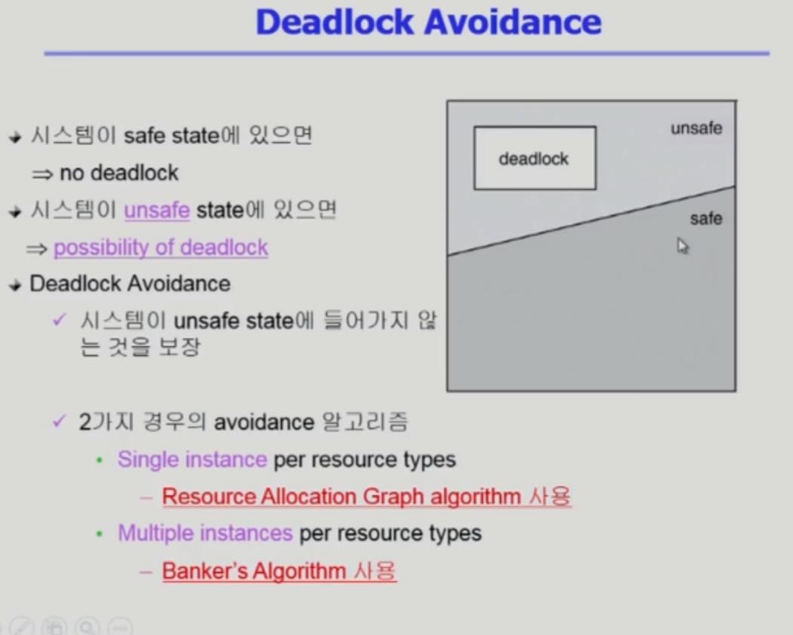

# 데드락

## 데드락1

> **Deadlock (데드락)**

- 교착상태
- 일련의 프로세스들이 서로 가진 자원을 기다리며 block된 상태
- 프로세스가 필요한 자원을 획득하지 못하고 영원히 자원을 기다리는 상태

---

- **Resource (자원)**
  - 하드웨어, 소프트웨어 등을 포함하는 개념
  - (예) I/O device, CPU cycle, memory spaces, semaphore 등
  - 프로세스가 자원을 사용하는 절차
    - Request (요청), Allocate (할당), Use (사용), Release (반환)

---

- **데드락 발생 4가지 조건**

1. **Mutual exclusion (상호 배제)**
   - 자원 자체를 동시에 쓸 수 없는 경우 → 공유가 불가능한 자원을 소유하고 있는 것
   - 매 순간 하나의 프로세스만이 자원을 사용할 수 있음
   - 상호 배제가 없다면 교착 상태는 발생하지 않는다.
   - 공유해서는 안되는 자원의 경우 반드시 성립해야 함
2. **No preemption (비선점)**
   - 프로세스는 자원을 스스로 내어놓을 뿐 강제로 빼앗기지 않음
   - 다른 프로세스가 자원을 뺏어올 방법이 없음
   - 자원을 취득한 프로세스 만 자원을 반환(release) 할 수 있다.
     - 예시) 우선순위 선점이 가능해 진다면 디스코드에서 녹음기가 마이크를 뺏어서 먼저 할 일을 한다.
3. **Hold and wait (보유 대기)**
   - 자원을 가진 프로세스가 다른 자원을 기다릴 때 보유 자원을 놓치 않고 계속 가지고 있음
   - 프로세스가 자원을 소유한 상태에서 다른 추가 자원을 요청하기 때문에 생긴다.
   - 자원을 붙잡은 상태에서 다른 자원을 기다리고 있음
     - 예시) 디스코드에서 마이크와 카메라를 사용해야 하는데, 마이크를 가져오는 데는 성공했지만 카메라 앱이 카메라를 잡고 있어서 그걸 기다리고 있음
4. **Circular wait (원형 대기)**
   - 자원을 기다리는 프로세스간에 사이클이 형성되어야 함
   - ex. 프로세스 P0, P1, … Pn이 있을때,
     - P0은 P1이 가진 자원을 기다림
     - P1은 P2가 가진 자원을 기다림
     - Pn-1은 Pn이 가진 자원을 기다림
     - Pn은 P0이 가진 자원을 기다림

⇒ 모두 만족해야 데드락이 생긴다.

---

- **Resource-Allocation Graph (자원할당그래프)**
  - 프로세스가 자원을 요청하고 자원이 프로세스에게 할당 되는 방향성이 가진 그래프
  
- P1, P2, P3 : 프로세스
- R1, R2, R3, R4 : 자원

  - ● : 자원의 인스턴스 갯수다.

- 자원은 모두 상호 배제 (Mutual exclusion), 하나의 프로세스 만이 자원을 사용

- R → P : R 자원을 P가 가지고 있다.
- P → R : P가 R자원을 기다리고 있다.
  - 보유 대기 (Hold and wait)

- 그래프에 cycle이 없으면 Deadlock이 아니다.
- 그래프에 cycle이 있으면,
  - 자원이 1개만 있으면 Deadlock
  - 자원이 여러개 있으면 Deadlock이 아닐 수 도 있다.

---

- **Deadlock 처리 방법**

1. **Deadlock Prevention**

   - 가장 강력한 방법
   - 자원 할당 시 Deadlock의 4가지 필요 조건 중 어느 하나가 만족되지 않도록 하는 것

   1. _Mutual exclusion (상호 배제)_
      - 공유해서는 안되는 자원의 경우 반드시 성립해야 함
      - 상호 배제가 없다면 교착 상태 (Deadlock)는 발생하지 않는다.
        - 프린터 등의 일부 입출력 장치, 연산 결과 저장 변수 등 동시에 건드리면 위험한 자원들이 있기에, 상호 배제를 없에는 것은 불가능
      - Deadlock 방지에서 사용할 수 없다. → 현실성이 없다.
   2. _No preemption (비선점)_
      - Process가 어떤 자원을 기다려야 하는 경우 이미 보유한 자원이 다른 프로세스에 의해 선점됨 → 자원 반환에 강제성
      - 모든 필요한 자원을 얻을 수 있을 때 그 프로세스는 다시 시작된다.
      - State를 쉽게 Save하고 Restore할 수 있는 자원에서 주로 사용 (CPU (Timer Interrupt), memory)
   3. _Hold and wait (보유 대기)_
      - 프로세스가 자원을 요청할 때 다른 어떤 자원도 가지고 있지 않아야 한다.
        - 방법\_1 : 프로세스 시작 시 모든 필요한 자원을 할당받게 하는 방법 (wait X)⇒ 자원의 낭비
        - 방법\_2 : 자원이 필요한 경우 보유 자원을 모두 반환하고 다시 요청 (hold 상태, wait X)→ 동시에 확보
   4. _Circular wait (원형 대기)_
      - 모든 자원 유형에 할당 순서를 정하여 정해진 순서대로만 자원 할당
      - 예) 순서가 3인 자원 $R_i$를 보유 중인 프로세스가 순서가 1인 자원 $R_j$을 할당 받기 위해서는 우선 $R_i$를 Release(반환) 해야 한다.

   ⇒ Utilization (효율성) 저하, Throughput (처리량) 감소, Starvation (기아) 문제

   ⇒ Deadlock 조건을 원천 봉쇄, 하지만 비효율적

---

## 데드락2

### Deadlock Avoidance

- Deadlock Avoidance란 :
  - 프로세스마다 내 평생의 자원을 최대로 사용하면은 얼마나 사용할지에 대한 정보가 미리 주어진다고 가정하여 Deadlock을 회 피하는 것.
- 자원 요청에 대한 부가적인 정보를 이용해서 deadlock의 가능성이 없는 경우에만 자원을 할당
- 시스템 state가 원래 state로 돌아올 수 잇는 경우에만 자원 할당
- safe state : 시스템 내의 프로세스들에 대한 safe sequence 가 존재하는 상태
- safe sequence
  - 프로세스의 sequence <P1, P2,......, Pn> 이 safe 하려면 Pi(1<= i <=n)의 자원 요청이 '가용 자원 + 모든 Pj (j<i)의 보유 자원'에 의해 충족되어야 함
  - 조건을 만족하면 다음 방법으로 모든 프로세스의 수행을 보장
    - Pi의 자원 요청이 즉시 충족될 수 없으면 모든 Pj (j<i)가 종료될 때까지 기다린다.
    - Pi-1이 종료되면 Pi의 자원요청을 만족시켜 수행한다.
      

Deadlock 에 들어가지 않도록 하는 Deadlock Avoidance 알고리즘으로

1. 단일 인스턴스를 가지는 자원의 경우
   - Resource Allocation Graph Algorithm
2. 다중 인스턴스를 가지는 자원의 경우
   - Banker's Algorithm

---

### Resource Allocation Graph Algorithm

사각형 :자원

원 : 프로세스

화살표가 가리키는 곳 :

- 실선 :

  원으로 부터 나가는 실선의 경우

  - 해당 프로세스는 자원을 요청했지만 해당 자원은 다른 프로세스가 가지고 있다는 의미

- 점선 :

  Deadlock Avoidance는 점선을 추가한다.

  - 점선은 항상 프로세스에서 자원을 향해서 나아가는 선만 존재하며
  - 의미로는 평생에 해당 자원을 요청하는 시기가 있을 수도 있을 것이다라는 의미를 가짐 (지금 요청X), 평생에 한 번 이상 요청할 수 있다.
  - 만약 P2 프로세스가 R2를 요청하게 되면 (현재 안전한 상황이라고 가정하에)
    - 점선에서 실선으로 변경되며 해당 자원은 요청한 프로세스를 향해 화살표를 가리키게 된다.
  - 가장 오른쪽 그림을 보게 되면 화살표가 서로를 향해 가리키게 되어 Circular Wait (환형 대기)가 될 것 같지만
  - P1에서 R2로 가는 선이 점선인 경우로 교착 상태는 아니지만 unsafe한 조금 위험한 상황이 되어 버리게 된다.
  - 그런데 만약 P1이 R2의 자원을 요청하게 된다면 Circular Wait 이 되어 교착 상태가 되어 버리게 된다.

---

### Banker's Algorithm

Allocation : 각 프로세스 별 현재 사용하고 있는 자원의 수

Available : 총 가용 자원 양인 사진상의 [10,5,7]에서 현재 사용하고 있는 Allocation을 뺀 남은 자원의 수

Need : 추가로 요청 가능한 자원으로, Max의 값에서 Allocation인 현재 요청한 자원 수를 뺀 사용 가능한 자원의 수

Max : 각 프로세스들이 평생에 최대로 사용하게 되는 자원의 수

**<만약>**

상황 : P0 가 C를 하나 요청 했을 경우

결론 :현재 Available을 보면 C는 2개로 요청이 가능한 상황이지만 Banker's Algorithm의 경우

비록 자원이 여유가 있더라도 만약에 그 자원을 줬을 때 불안정한 상황이 생길 수 있다면 해당 요청을 받아들이지 않게 된다.

과정 : Available(가용 자원)의 경우 여유가 있어서 줄 수는 있지만 P0의 경우 필요로 하는 자원인

Need의 경우 [7, 4, 3] 가 되는데 Need에 있는 수 만큼 모두 지금 요청해 버리면 가용자원인 Available 자원으로는 충족이 되지 않게된다.

물론 다른 프로세스들이 사용 중이던 자원을 반납하게 되면 괜찮을 수 있지만

그렇지 않은 경우엔 가용자원은 없고 다른 프로세스들은 가지고 있는 걸 내어놓지 않게되며 처리할 수 없게 되어 Deadlock이 발생하게 된다.

정리 : Banker's Algorithm의 경우 비록 자원의 여유가 있더라도 해당 프로세스가 자원을 최대로 요청했을 때 해당 자원을

현재 가용 자원으로 충족이 되지 않는다면 해당 요청을 받아들이지 않게 되어 **Banker's Algorithm 항상 safe state를 유지하게 된다.**

safe 의미 : 가용 자원만 가지고 해당 프로세스를 하나씩 종료 시킬 수 있는 그러한 sequence 가 있다면 safe 하다고 한다.

그래서 사진의 마지막에 있는 sequence <P1, P3, P4, P2, P0>를 보게 되면

우선 P1가 요청하는 자원은 가용 자원으로 충족이 되기에 실행 후 종료를 하게 되면 현재 사용했던 자원 또한 반납하게 되며

가용 자원은 반납 받은 자원을 더한 수가 되며, 다른 프로세스 또한 요청하는 자원이 가용 자원으로 충족이 되어

요청을 받아들여 실행을 종료하게 되는 것을 반복하여 P0까지 안전하게 수행할 수 있게 되는 시퀀스이기에

해당 시퀀스의 시스템은 safe state, safe sequence 라고 할 수 있다.

## 데드락3

### Deadlock Detection and Recovery 감지와 회복

- 데드락을 사전에 방지하지 않습니다. 따라서 데드락이 발생할 수 있습니다.
- 주기적으로 데드락 발생을 확인해줘야 합니다.(시스템, 프로세스)
- Resource Allocation Graph(RAG) 사용

여유 자원을 안 주고 있으면 비효율적이니 일단 가용자원 있는데 요청 들어오면 무조건 줍니다. 따라서 이 경우 데드락이 발생할 수 있는데, 데드락 발생 시 느려지거나 프로세스가 멈추게 되면 detection과 recovery하는 방법입니다. → 데드락 발생 후 처리

### Detection **데드락 발생 여부를 확인하는 방법**

### single instance - Wait-for graph

### multiple instance : 뱅커스 알고리즘과 유사

일단 가용 자원은 전부 주고, 나중에 내놓을 가능성이 있는 녀석으로 내놓아지면 그 가용 자원으로 요청을 처리하고.. 이를 통해 전부 처리가 된다면 데드락이 아니므로 그것을 판단합니다.

자원을 요청 안 한 친구들은 자원을 내놓을 것이다.(낙관적)

그러니 걔네가 내놓은 것들로 조건이 만족하는지를 확인합니다.

Deadlock Avoidance가 추후에 데드락이 발생할 것 같다는 것을 예상하고 자원을 미리 주지 않는다면, 디텍션은 추후에 데드락이 발생할 수 있지만, 현재 상태만을 확인합니다.

## Graph Reduction

### Deadlock Detection and **Recovery**

# Deadlock Ignorance

데드락은 운영체제의 고전적인 문제라서 다루긴 했지만, 현대의 범용 운영체제는 이를 다루지 않고 사람이 직접 프로세스를 죽이는 식으로 해결합니다. 따라서 그 중요성이나 입지가 줄어들긴 했습니다. 하지만 시험에 내기엔 또 좋은 측면이 있기 때문에 알아두면 좋을 내용.

## [번외] 데이터베이스의 교착 상태

