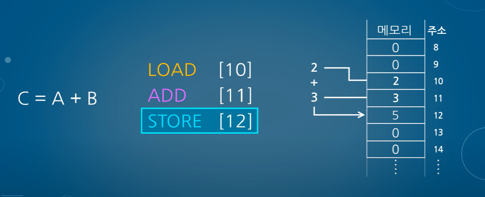
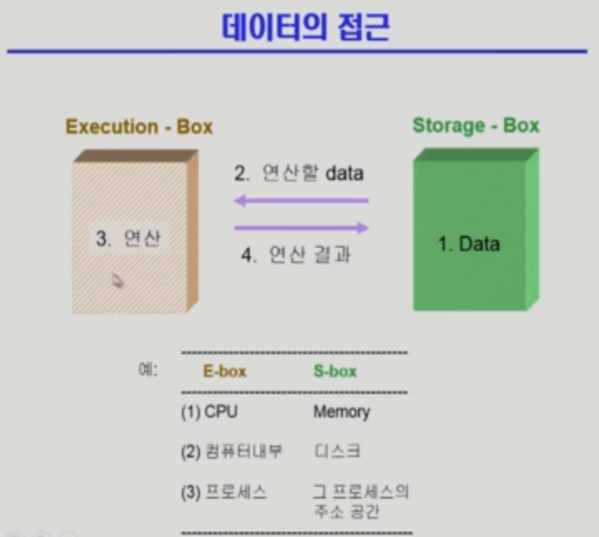
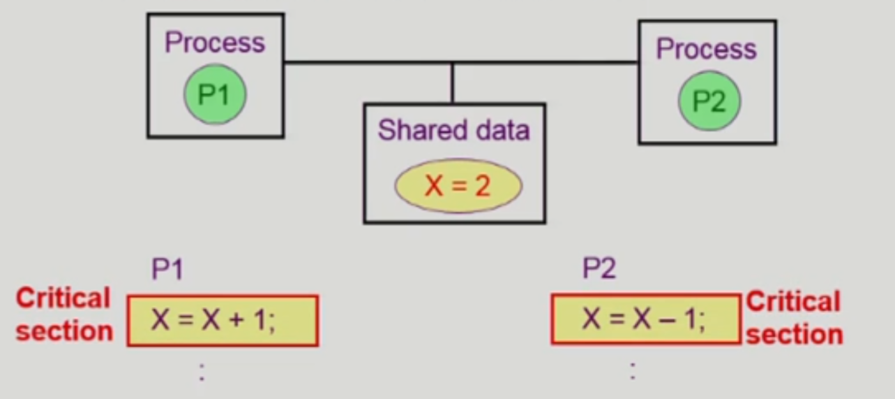
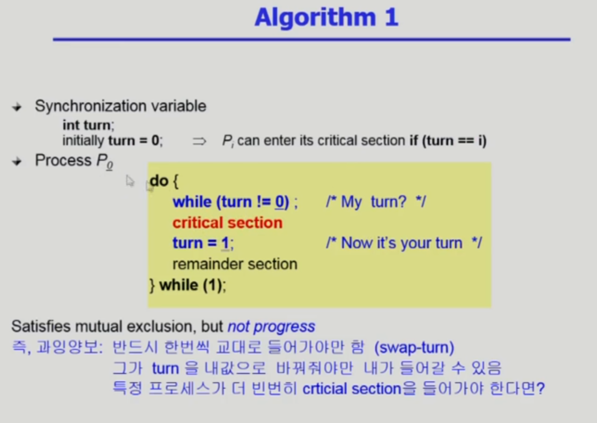
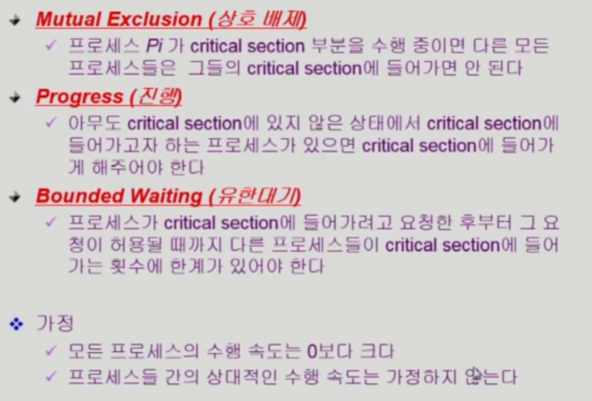

# 병행 제어Ⅰ

## Race Condition 

### 💡Process Synchronization (프로세스 동기화)

---

- 공유 데이터의 동시 접근은 데이터의 불일치를 발생 시킬 수 있다.
- 그래서 프로세스 간의 실행 순서를 정해주는 매커니즘이 필요하다.

### 💡CPU의 연산 과정

---

CPU의 연산 과정은 atomic 하지 않다 !!




프로그래밍 언어(고급 언어) → 어셈블리어 → 기계어 (명령어 6bit + 데이터 10bit의 집합)

1. **LOAD[10**] : 10번지의 데이터를 읽어와서
2. **ADD[11]** : 11번지의 값을 더한 다음
3. **STORE[12]** : 12번지에 저장하라


1. 프로그램 카운터의 값 100 → 메모리 주소 레지스터로 전달
2. 메모리 주소 레지스터는 100번지에 있는 정보를 가져와 메모리 버퍼 레지스터에 저장
3. 명령이면 명령어 레지스터로 전달
4. 프로그램 카운터에 다음 수행 주소 저장 (102)
5. 명령어 레지스터에 저장된 명령 제어 장치로 전달되어 해석 ( LOAE[10] )
6. 메모리 주소 레지스터에 10 전달
7. 10번지의 값을 읽어서 메모리 버퍼 레지스터에 2 저장
8. 데이터이므로, 누산기로 전달
9. … 다음 과정 …

[CPU는 어떻게 작동할까?](https://www.youtube.com/watch?v=Fg00LN30Ezg)

## 💡Race Condition

---

### Race Condition 이란 ?

두 개 이상의 Thread 또는 Process가 공유 자원을 병행적으로 읽거나 쓰는 상황


- 여러 프로세스에서 Shared Memory의 데이터를 사용하는 경우
- 커널 내부 데이터에 접근하는 도중에 시스템콜 / 인터럽트 발생하여 프로세스 바뀌는 경우
- Multi-Processor System의 경우

### 1. kernel 수행 중 인터럽트 발생 시


1. 커널의 코드 수행 중 **count++** 를 위해 `LOAD` 진행하여 레지스터에 변수 저장
2. 인터럽트가 발생하여 이전 문맥 저장하고 인터럽트 해당 작업 처리, ( **count--** 수행 )
3. 인터럽트 이전에 레지스터에 저장한 값에 연산하여 `STORE` 함. ( 2. 에서 **count--**된 값 덮어씀 )

→ 결과적으로 , **count++**된 값만 저장된다.

- 해결방법
  
    변수 건들기 전에 인터럽트 disable ( 인터럽트 안 받겠다) 하고 처리 끝난 다음 인터럽트 받는다.
    

## 2. system call로 인해 kernel mode 수행 중 context switch


1. Pa 가 시스템 콜 요청하여 커널 모드 진입, 커널 모드 상에서 **count++** 수행 중
2. Time Quantum 만료로 인해 Pb로  Context Switch 발생
3. Pb에서도 시스템 콜을 통해 커널 모드 진입 후 동일한 커널 데이터에 대해 **count++** 수행
4. Pb 처리 후 Pa 이전 작업 이어서 수행
5. 이전에 레지스터에 저장한 값에 연산하여 `STORE` 함. (3.  에서 **count++**된 값 덮어씀 )

→ 커널의 **count++**가 **1회만** 발생

- 해결방법
  
    커널 모드 수행중에는 CPU를 preempt 하지 않고,
    
    커널 모드 종료 후 유저 모드로 돌아갔을 때 preempt
    

### Multi Processor 환경 내 Shared Memory 동시 접근 시


멀티 프로세서 환경에서는 공유되는 메모리에 각각의 Processor들이 동시에 특정 값에 접근 가능

- 해결 방법
    - 방법 1 : 운영체제 커널 전체를 lock
      
        ( 여러 개의 CPU가 동시에 커널에 접근할 수 없으므로 비효율적 )
        
    - 방법 2 : 운영 체제 안의 각 데이터를 사용 중일 때 lock
      
        ( 해당 데이터가 아니라면 여러 CPU들이 운영체제 코드를 충분히 동시에 수행할 수 있음)
        

---

## Process Synchronization

### 동기화 문제 발생 원인과 예시

우선 데이터의 접근에 대해서 한번 더 집고 넘어가자면

컴퓨터 안에서 어떤 연산을 할 경우

항상 데이터를 읽어 와서 연산을 하고 결과를 다시 어딘가에 저장하도록 되어있다.



예를 들어

1. CPU와 메모리가 있을 경우 ( 3. 연산 = CPU, 1. Data = 메모리)
    - 메모리에 있는 데이터를 읽어와서 CPU에서 연산을 하고 다시 데이터를 해당 데이터를 다시 메모리에 넣을 것이다.
2. 컴퓨터 내부와 I/O를 하는 하드디스크의 경우
    - 하드디스크에 있는 파일을 읽어와서 컴퓨터 내부에서 어떤 작업을 하고 해당 결과를 밖으로 내보낼 것이다.
    - 

다만 문제가 되는 것은

이러한 데이터를 한 군데에서 읽은 후 연산을 하는 것이 아닌 여러 곳에서 읽은 후 연산을 하는 과정에서 문제가 발생하게 된다.

예를 들어 Storage- box 에 저장되어 있는 count 라는 변수 값이 있는데 해당 count를 다른 Execution-box에서 활용을 하려고 하는데

각각 연산을 마무리 하고 다른 곳에서 count를 사용할 경우 문제가 되지 않지만

좌측 box에서 count를 읽은 후 연산을 하는 도중 우측 box에서 count를 읽은 후 연산을 한다면

각각의 box들은 완료된 count의 값을 가지고 연산을 하는 것이 아닌 완료 이전의 count 값을 가지고 연산을 하기에 문제가 발생하게 된다.


그래서 지금처럼 하나의 공유데이터를 다수가 동시에 접근하려 할때 생기는 문제를 Race Condition 즉 경쟁 상태라고 한다.

이제 본론으로 들어와 프로세스 동기화 문제에 알아보자면

공유 데이터의 동시 접근은 데이터의 불일지 문제를 발생시킬 수 있으며

race condition(경쟁 상태)을 막기 위해서는 concurrent process(병행 프로세스)는 동기화가 되어야 한다.

그래서 병행 프로세스 사용으로 인한 일관성(Consistency) 문제를 해결하기 위해선 협력 프로세스 간의 실행 순서를 정해주는 메커니즘이 필요하다.


위의 그림처럼 각각의 프로세스가 X라는 공유데이터를 가지고 1을 더하거나 빼는 처리를 하고 싶을 때

고급언어에서의 X = X+1 or X = X-1가 기계어로 바뀌게 되면 원자적(Atomic)으로 전송이 되는 것이 아닌

여러개의 기계어인 초록색, 파란색 말풍선 과정으로 나뉘어 실행 된다고 한다.

초록색 말풍선을 예시로 본다면

1. 변수 X는 reg1에 읽혀져서
2. reg1 값을 1 증가 시킨 후
3. 해당 reg1을 다시 메모리에 저장하는 작업이 일어난다.

그런데 해당 작업이 일어나는 도중에 쪼개져서 CPU가 다른 프로세스한테 넘어가게 되는 경우에 문제가 발생하게 된다.

---

### Critical-Section Problem

n 개의 프로세스가 공유 데이터를 동시에 사용하기를 원하는 경우 : critical section

각 프로세스의 code segment에는 공유 데이터를 접근하는 코드인 critical section이 존재

이때 critical section이란 공유 데이터를 의미하는 것이 아닌

공유 데이터를 각각의 프로세스가 접근하는 코드를 critical section 이라고 한다.



그래서 critical section에 들어갔을 경우 다른 모든 프로세스가 critical section에 들어갈 수 없도록 해야한다.

쉽게 생각한다면 p1에서 critical section에 들어갔을 경우 Lock을 걸어 다른 모든 프로세스가 critical section에 들어갈 수 없도록 한 후

작업이 완료 된 후 Unlock을 하여 다른 프로세스도 처리할 수 있도록 하는 과정을 의미한다.


위의 사진처럼 critical section을 수행하기 전에

CPU를 빼앗기더라도 다른 프로세스가 동일 데이터에 접근하는 critical section을 수행하지 못하도록 코드를 추가하고 (Lock)

수행을 완료 후엔 unlock을 하여 다른 프로세스도 접근 할 수 있도록 한다. (unlock)

---

### 해결 알고리즘 1 - turn

아래의 그림에서 Synchronization variable 이란

프로세스 들은 수행의 동기화를 위해 몇몇 변수를 공유할 수 있다 라는 의미로 받아들이면 좋을 것 같다.



우선 critical section에 들어가기 전에 turn을 체크하게 되는데

여기서 turn은 누구의 차례인지를 의미하는데

- 현재 turn == 0 의 경우 나의 turn 이 되는 것이고
- 현재 turn == 1 의 경우 나의 turn 이 아니고 다른 프로세스의 차례를 의미한다.

그래서 위의 노란색 구역을 해석해 보자면

우선 while (turn != 0): 을 들어가면

- 현재 turn 이 1인 상태로 나의 차례가 아닌 경우 해당 위치에서 머무르고
- turn이 0의 경우 critical section에 들어간다고 한다.

현재 turn 이 0이 아닌 경우 ( 즉 나의 차례가 아닌 경우)

- 계속 while 문만 돌다가 할당된 CPU 시간만 소비하고 반납을 하게 된다.

그런데 여기서 turn이 어떻게 나의 차례인 0으로 변경이 되는가 하면 상대방에 의해서 바뀌게 된다.

위의 그림을 다시 보자면 critical section을 사용하고 나갈 때 turn = 1 즉 상대방으로 변경되기에 나의 차례가 0으로 변경 될 수 있게 된다.

Turn Algorithm을 정리하자면

- critical section에 들어가기 전에 이번이 나의 차례인지를 체크해서
- 나의 차례가 아닌 경우 (turn = 1) 이면 계속 기다리고
- 나의 차례인 경우 (turn = 0) 이면 critical section에 들어가서 공유 코드를 수행하고
- 처리가 끝나게 되면 나의 차례를 상대방 차례로 변경 (turn = 0 -> 1)

**<문제점>**

물론 동시에 들어가는 경우는 turn 으로 인해 생기지 않는데

다만 엄격하게 turn을 상대방 1번 , 나 1번 식이다 보니 반드시 한번씩 교대로 들어가야 하기에

critical section의 빈도수가 많은 프로세스가 있을 경우는 불합리 하게 계속 기다리게 되는 상황이 발생하게 된다.

**<프로그램적 해결법의 충족 조건>**



Bounded Waiting = No starvation (기아현상 방지) 으로 Progress 와는 달리

여러 프로세스가 있을 경우 예를 들어 프로세스 A,B,C 가 있을 경우

A와 B만 서로 turn을 주고받고 할 경우 C는 Starvation이 발생하게 되는데 이를 방지하는 조건.

---

### 해결 알고리즘 2 - flag


Flag Algorithm은

프로세스마다 각자의 flag가 있는데 critical section에 들어가고 싶다라고 하면

- 자신의 flag를 들어서(flag = true) critical section에 들어가고 싶다라는 의중을 두게 된다.
- 들어가기전에 다른 프로세스들 중에서도 flag를 들어서 flag = true 상태가 되어있는지 체크하여 동시 접근이 안되도록 방지.
  
    (현재는 프로세스 i, j 가 있기에 flag[j] == True 인지를 확인)
    
    - 만약 flag가 들려있다면 while 문을 계속 돌면서 critical section에 들어가지 않는다.
    - 만약 flag가 내려저 있다면(flag == False) critical section에 들어가게 된다.
- 이때 flag가 내려지게 되는 경우는
    - 누구나 critical section에 들어갔다 나오게 되는 경우를 만들어
    - flag를 내리게 하는 flag [i] = false를 수행하게 한다 ( 현재는 프로세스 i이기에 flag[i])
    

**<문제점>**

우선 동시에 들어가게 되는 경우는 방지하게 된다 flag를 들어서 바로 들어가는 것이 아닌

다른 프로세스들도 들었는지 확인을 하는 while 문을 돌기 때문에 Mutual Exclusion(상호 배제)은 방지하게 된다.

다만 flag algorithm 도 turn algorithm 처럼 critical section을 수행하는 프로세스가 없는 경우에도 진행이 안되는 문제가 발생하게 된다.

우선 flag를 든다고 해서 critical section에 들어가는 것을 잘 기억하고

상대방이 flag를 들었다고 해서 못들어가는 상황을 예로 들어보자면

- flag를 들기만하고 아직 critical section 들어가지 못한 상황이라면
- 나는 상대방이 flag를 들었으니까 계속 기다려야지 하는 상황이 계속 되는 것이기에
- 진행이 되지 않는 문제가 발생하게 된다. (Not progress requirement)

---

### Peterson’s Algorithm

perterson's algorithm의 경우 앞서 소개한 turn, flag algorithm의 변수를 모두 사용하게 된다.


**<순서>**

- flag를 이용해서 critical section에 들어가겠다는 의중을 표하고
- turn을 우선 상대방의 turn으로 만들어 놓고 (이유가 있기에 turn을 상대방으로 바꾼다고 한다.)
- 체크를 한다.
    - 상대방이 flag를 들고 있는지와
    - 이번 차례가 상대방 차례인지.
    - 위의 두가지를 만족할 경우 while문을 돌며 기다리고
    - 둘중 하나라도 아닌 경우 critical section에 들어가게 된다.
- 그리고 critical section를 다 사용하고 나올때는 flag를 False로 변경 후 나오게 된다.

**<문제점>**

비효율적인 문제점이 있다.

만약에 해당 프로세스가 critical section에 들어가지 못하는 상황일 경우

즉 while 문에서 빠져나가지 못하는 경우

CPU를 가지고 while문만 돌고 있게 되기에 이런 상황을

Busy Waiting or Spin Lock 이라고 해서 계속 CPU와 Memory를 쓰면서 기다리며 자원을 낭비하는 상황을 의미한다.

---

> **Synchronization Hardware**
> 
- 하드웨어적으로 Test & motify를 atmoic하게 수행 하는 것
- atmoic : 원자적으로

- Test_and_set(a) 지원이 되면 가능
  
    
    
- a의 값을 읽어내고 a의 값을 1(True)로 세팅
  
    
    
- lock = 1 누군가가 lock을 걸고 critical section에 들어가 있음

### Semaphores

> **Semaphores**
> 

- **추상 자료형** : 어떻게 구현되는 지가 중요하지 않고 어떤 오브젝트와 오퍼레이션으로 정의 되는가?
- 공유된 자원의 데이터 혹은 임계영역에 여러 프로세스 혹은 스레드가 접근하는 것을 막아줌 (동기화 대상이 여러개)
- 직접 코드를 만드는 것이 아님 / 앞의 방식들을 추상화 시킴

```python
Semaphore S  # 변수 S는 integer variable (정수형), 사용가능한 자원의 개수

Semaphore 5  # 자원이 5개 있다.
```

---

- **아래 두가지 연산에 의해서 접근 가능**
    1. P(S): 자원을 획득하는 과정
    2. V(S): 자원을 반납하는 과정
    
    - **임계구역 (Critical Section)**
        - P 연산과 V 연산 사이에서 자원을 사용하는 코드
        - 다수의 프로세스가 데이터를 공유하며 실행되는 상황에서 각 프로세스가 공유 자원에 접근하는 코드 블록
    
    ```python
    **P(S):     while (S ≤ 0) do no-op;**   → i.e. wait  **
              S--;**                   
    
    					If positive, decrement-&-enter.
    					Otherwise, wait until Positive (busy-wait)
    
    **V(S):                            
              S++;**                   
    ```
    
    - ex. Mutex 기준에서 P 연산은 lock을 걸어주는 과정 V연산은 풀어주는 과정

---

- **Semaphore 종류**
    - **Counting Semaphore**
        - 도메인이 0 이상인 임의의 정수 값
        - 주로 Resourece Counting 에 사용
        - N개의 프로세스가 동시 접근 가능
    
    - **Binary Semaphore**
        - 0 또는 1 값만 가질 수 있는 Semaphore
        - 주로 Mutual Exclusion (lock/unlock) 에 사용
        - Mutex Lock과 동일

---

- **Critical Section of n Processes**


- **Mutex : Mutaul Exclusion (상호 배제)**
    - Mutex는 Binary Semaphore이기도 하며 특성을 어느정도 가지고 있음
    - 단 하나의 프로세스/스레드만 접근 가능
    - 임계구역 (critical section) 은 공유가 불가능한 자원
    - 사용중인 프로세스/스레드가 Lock을 걸어서 다른 프로세스/스레드의 접근을 방지
    - Lock은 본인이 아니면 해제가 불가능
    
- **Semaphore vs. Mutex**
    - Mutex는 Lock을 건 프로세스/스레드만이 임계 구역을 나갈 때 Lock을 해제할 수 있음
      
        ex. 매장내에 화장실이 1개, 카운터에서 열쇠를 받아가는 방식
        
    - Semaphore은 다른 프로세스들도 자유롭게 확인하고 변경가능하다.
      
        ex. 매장내에 화장실이 5개, 매장 모니터에 갯수가 출력되는 방식
        

---

- **Semaphore 방식**

1. **busy-waiting (= spin lock)**
    - 자원이 없다면 while 루프 돌면서 기다리는 방식 (= spin lock)
    - 프로세스는 critical section에 접근할 수 있는지 계속해서 체크 해야함 → CPU 사이클 낭비
    - 사용중인 프로세스가 critical section을 거쳐서 V 연산을 해야하지 다음 프로세스가 사용
    - **효율적이지 못함 → Block & Wakeup (= sleep lock)**
    
2. **Block/Wakeup Implementaiton**
    - Semaphore를 구조체 같이 정리
    
    
    
    - 자원의 여분이 없을 때는 blocked 시키는 방식 (= sleep lock)
    - 자원이 생기면 wakeup으로 block 상태인 프로세스를 깨우는 방식
    
    - **Block**
        - 커널은 block을 호출한 프로세스를 suspend 시킴
        - 이 프로세스의 PCB를 semaphore에 대한 wait queue에 넣음
        
    - **Wakeup(P)**
        - block된 프로세스 P를 wakeup시킴
        - 이 프로세스의 PCB를 ready queue로 옮김
        
    
    
    
    
    
    - P(S) 무조건 S에서 1 뺀다.
    - V(S) 0 이하라는 것은 L에 누군가가 기다리고 있다.
    
    - **Busy-wait vs. Block/Wakeup**
      
        → Block/wakeup 
        
    - **Block/Wakeup overhead vs. Critical section 길이**
      
        → Critical section의 길이가 긴 경우 Block/Wakeup이 적당 (경쟁이 치열한 경우)
        
        → Critical section의 길이가 매우 짧은 경우 Block/Wakeup 오버헤드가 busy-wait 오버헤드보다 더커질 수 있음.
        
        → 일반적으로 Block/Wakeup 더 좋음
        

Deadlock

둘 이상의 프로세스가 서로 상대방에 의해 충족될 수 있는 event를 무한히 기다리는 현상

---

세마포  0824 추가본

---

- **Semaphore 문제점**
    - 코딩하기 힘들다.
    - 정확성 (correctness)의 입증이 어렵다.
    - 자발적 협력 (voluntary cooperation)이 필요하다.
    - 한번의 실수가 모든 시스템에 치명적 영향
    - 연산을 원자적으로 카운트하는 연산을 제공하기만 했음
    

> **Monitor**
> 

- Mutex(Lock)와 Condition Variables(Queue)을 가지고 있는 기법
- 동시 수행중인 프로세스 사이에서 abstract data type의 안전한 공유를 보장하기 위한 high-level synchronization construct
- 공유 데이터에 대한 동시 접근을 모두 책임

- 공유데이터에 대한 접근은 모니터에 정의된 함수를 통해서만 접근
- 모니터 안에서 액티브하게 실행하는 프로세스는 하나로 제한
- 모니터 내부의 코드로써 공유데이터 접근을 시키면 알아서 동기화


- 공유데이터를 모니터 내부에 정의
- 접근하는 코드는 모니터 내부의 연산으로만 접근 가능
- 모니터가 알아서 공유 데이터 접근을 막고 연산이 수행 중이면 큐에 줄을 세움

- 모니터 내에서는 한번에 하나의 프로세스만이 활동 가능
- 프로그래머가 동기화 제약 조건을 명시적으로 코딩할 필요가 없음

