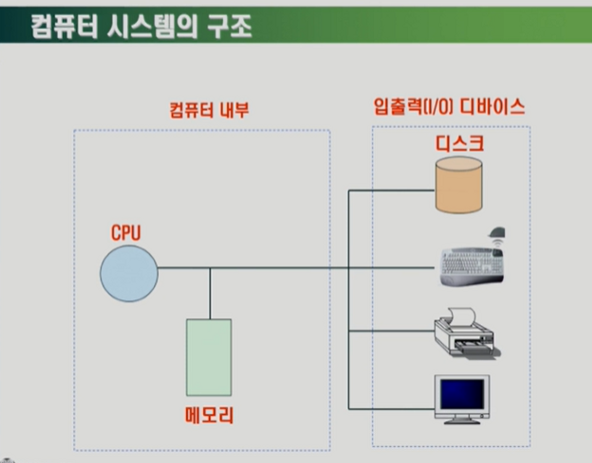

# 운영체제 개요

- ### **운영체제의 역할**

  - 컴퓨터 하드웨어 바로 위에 설치되어 **사용자 및 다른 모든 소프트웨어와 하드웨어를 연결**하는 소프트웨어 계층

    - 사용자가 컴퓨터의 하드웨어(CPU, 메모리 등)를 어떻게 관리하는 지 몰라도 편하게 사용할 수 있도록 하드웨어를 관리하며 사용자에게 편리한 인터페이스를 제공

      

  - 한 대의 컴퓨터에서 여러 프로그램이 실행 되더라도, **프로그램들이 각각 독자적 컴퓨터에서 수행되는 것 같은 환상(illusion)**을 제공

    - ex) 음악을 들으면서 게임을 하고, 인터넷 창으로는 뉴스를 읽는 경험

  - 컴퓨터 시스템의 **자원을 효율적으로 관리 (자원: CPU, 메모리, I/O(입출력) 장치 등)**

    - 효율성 : 주어진 자원으로 최대한의 성능을 내도록

      - 어떤 방법으로?

        **메모리**는 CPU의 작업 공간인데, 프로그램이 실행 되려면 메모리에 올려 놓아야 한다. 그래서 여러 프로그램이 실행될 때에는 어떤 프로그램을 메모리에 얼마나 올려놔야 하는가 효율적으로 분배해야 하는데, 그 역할을 운영체제가 수행한다.

    - 형평성 : 특정 사용자/프로그램의 지나친 불이익이 발생하지 않도록 (프로그램 차별 X)

- **운영체제의 종류**

  - 서버용 : 리눅스
  - PC용 : 윈도우, 맥, 리눅스
  - 스마트 디바이스용 : iOS, 안드로이드, 리눅스
  - 리눅스는 공개 소프트웨어(Open Source) 이므로 다양한 곳에서 사용될 수 있었다.

### ** 컴퓨터 시스템 구조**

- **매순간 CPU가 메모리를 읽는다.**
    - **인풋 : 디바이스를 통해서 데이터가 컴퓨터 내부로 들어가는 것**
    - **아웃풋 : 컴퓨터 내부 작업을 통해서 디바이스로 보내는 것**
- **부팅하면 운영체제가 메모리에 올라가면서 시작**
- **운영체제 컴퓨터가 꺼질 때 까지 항상 실행되는 프로그램**
- **커널 : OS의 기본 기능을 실행하는 부분을 말한다. 응용프로그램이나 주변장치나 조작 감시, 디스크나 메모리 등을 자원 배분, 응용 프로그램의 실행 등과 같은 처리를 실행한다.**
- **CPU의 작업 공간은 메모리,, 매 클럭마다 메모리 어딘가 있는 기계어를 읽어서 연산**
- **CPU가 외부장치에서 직접적으로 데이터 이동을 하지는 않는다.**
- **외부장치는 컨트롤러를 통해 요청**

### **3 CPU 스케줄링**

**목적 - 성능 향상**

**다중 프로그래밍 지원 ost에서 프로세서를 효율적으로 관리하기 위해 필요**

**다중 프로그래밍? -> cpu를 항상 실행되게 해서 cpu 이용률을 높임**

**비선점형 / 선점형 스케쥴링**

**한 명 끝나야 다음 사람….차례대로 … 비선점형**

**FCFS -> 기다리는 시간이 전체적으로 길다**

**SJF->**cpu 사용시간이 가장 짧은 순서대로 일하게 해서 전체 평균 대기시간을 짧게 할 수 있습니다. 이는 굉장히 효율적이지만 Starvaition이 발생. 왜냐하면 긴 시간을 필요로 하는 프로그램이 영원히 실행되지 못할 수 있기 때문….

**우선순위가 높은 급한 사람이 화장실을 먼저 쓴다…선점형**

**RR Round Robin ->** 공을 굴리면 일정한 시간이 바닥에 닿아서 시간이 일정??

짧은건 짧은대로 빨리 끝나고, 사용시간이 길어도 조금씩 실행이 가능해서 스타베이션 예방(형평성)

### **4 메모리 관리**

**김현진**

## 메모리 관리

가상 메모리를 만든후 필요한 부분만 물리적 메모리에 할당

- 필요한 부분은 물리적 메모리에 올라가지만 그렇지 않은부분은 메모리 공간이 없어
  
    어딘가에 보관 해야한다. 그보관 장소가 디스크 (스왑 영역. 메모리의 연장 공간이다)
    
    **전원이 꺼지면 사라짐 , 디스크(파일시스템)은 안사라짐**
    

LRU : 가장 오래전에 참조페이지 삭제 - 1번 삭제

LFU :  참조횟수가 가장 적은 페이지 삭제 : 4번 삭제  

**메모리 관리… 메모리는 휘발성. 컴퓨터가 종료되면 함께 사라집니다.**

**가상메모리. 디스크(파일시스템) 에서 실행파일을 실행시키면 이 각각의 실행파일은 가상 메모리에 올라오고, 이 중 당장 필요한 부분이 메인 메모리로 올라가며 남은 부분이 swap 영역에 저장됩니다.**

파일 시스템은 전원 꺼지더라도 내용이 유지되어야 한다. (비휘발성)

디스크 스왑 영역은 메모리의 연장 공간이지만 전원 꺼지면 메모리도 날아가니 의미가 없는 정보가 됩니다.

**CPU가 요청한 페이지 순서.**

**LRU** 가장 오래전에 참조했던 페이지의 삭제. 가장 최근에 사용하지 않은 페이지 삭제.

**LFU** 참조 횟수가 가장 적은 페이지 삭제. 사용 빈도가 가장 적은 페이지 삭제.,

- **> 이를 통해 한정된 메모리에 새 데이터를 할당할 때 어떤 것을 먼저 삭제할지 결정**

### **디스크 스케줄링**

### **디스크 스케줄링(보조기억장치)**

- **정의 : 사용할 데이터가 디스크상의 여러 곳에 저장되어 있을 경우 데이터를 엑세스하기 위해 디스크 헤더가 움직이는 경로를 결정하는 기법**
- **목적 : 처리량의 최대화, 응답시간의 최소화, 응답시간 편차의 최소화**
- **종류 : FCFS, SSTF, SCAN, C-SCAN N-STEP SCAN 하드디스크의 구조**
  
    

### **FCFS (First-Come First-Service)**

**입출력 요청 대기 큐에 들어온 순서대로 서비스를 하는 방법 (선입선출)**

**대기 큐(들어온 순서대로) : 108, 193, 47, 132, 24, 134, 75, 77**

---

**초기 헤드위치 : 1**

---

**이동 순서 : 1 -> 108 -> 193 -> 47 -> .....**

---

**이동 거리 : 107 + 85 + 146+ .....**

---

### **SSTF (Shortest Seek Time First)**

**FCFS 보다 처리량이 많고 평균 응답 시간이 짧다**

**탐색 거리가 가장 짧은 트랙에 대한 요청을 먼저 서비스하는 기법**

**디스크 스케줄링 기법 중에서 현재 헤드위치의 가까운 곳에 있는 모든 요구를 먼 곳보다 먼저 처리**

**탐색 시간 편차 ↑ : 안쪽이나 바깥쪽 트랙이 가운데 트랙보다 서비스를 덜 받는 경향**

**→ 헤드에서 멀리 떨어진 요청은 기아상태(starvation)가 발생할 수 있다.**

**→ 응답시간의 편차가 크므로 대화형 시스템에는 부적합**

**처리량이 많은 일괄처리 시스템에 유용**

**대기 큐 : 108, 193, 47, 132, 24, 134, 75, 77**

---

**초기 헤드위치 : 63**

---

**이동순서 63 - 75 - 77 - 47 - 24 - 108 - 132 - 134 - 193**

---

**이동거리     12 +  2 + 30+ 23+ 84 + 24   +  2 +    59 = 236**

---

### **SCAN 한 방향으로 가장 짧은 거리**

**SSTF가 갖는 탐색 시간의 편차를 해소하기 위한 기법**

**현재 진행중인 방향으로 가장 짧은 탐색 거리에 있는 요청을 먼저 서비스**

**현재 헤드의 위치에서 진행 방향이 걸정되면 탐색 거리가 짧은 순서에 따라 그 방향의 모든 요청을 서비스하고 끝까지 이동한 후 역벙향의 요청 사항을 서비스함**

**→ 끝까지 이동하지 않을 경우(LOOK기법)**

**디스크 스케줄링의 기본 전략**

**대기 큐 : 108, 193, 47, 132, 24, 134, 75, 77**

---

**번호가 0부터 199인 200개의 틀팩, 헤드의 위치가 63에 있고 바깥쪽 방향으로 이동 중**

---

**이동 순서 : 63 - 75 - 77 - 108 - 132 - 134 - 193 - 199 - 47 - 24  *199가 큐에 없지만 끝까지 이동**

---

**이동 거리 :     12  + 2  + 31  + 24  + 2  +  59  +  6   +  152+ 23 = 311**

---

### **C-SCAN (Circular SCAN) 바깥 → 안 가장 짧은 거리**

**항상 바깥쪽에서 안쪽으로 움직이면서 가장 짧은 탐색거리를 갖는 요청을 서비스**

**디스크 스케줄링 기법 중 가장 안쪽과 가장 바깥쪽의 실린더에 대한 차별대우를 없앤 기법**

**헤드는 트랙의 바깥쪽에서 안쪽으로 한 방향으로만 움직이며 서비스하여 끝까지 이동한 후 안쪽에 더 이상의 요청이 없으면 헤드는 가장 바깥쪽의 끝으로 이동한 후 다시 안쪽으로 이동하면 요청을 서비스함**

**→끝까지 이동하지 않을 경우 (C-LOOK 기법)**

**대기 큐 : 108, 193, 47, 132, 24, 134, 75, 77**

---

**초기 헤드 위치 : 63 (번호가 1부터 200인 트랙)**

---

**이동순서 : 63 - 47 - 24 - 1 - 200 - 193 - 134 - 132 - 108 - 77 - 75**

---

**이동거리 :     16  +23+ 23+199+ 7  + 59  +  2  +  24  +  31  +  2 = 386**

---

### **N-step SCAN**

**SCAN의 무한 대기 발생 가능성을 제거한 것으로 SCAN보다 응답 시간의 편차가 적고, SCAN과 같이 진행 방향상의 요청을 서비스 하지만, 진행 중에 새로이 추가된 요청은 서비스하지 않고 다음 진행시에 서비스하는 디스크 스케줄링**

