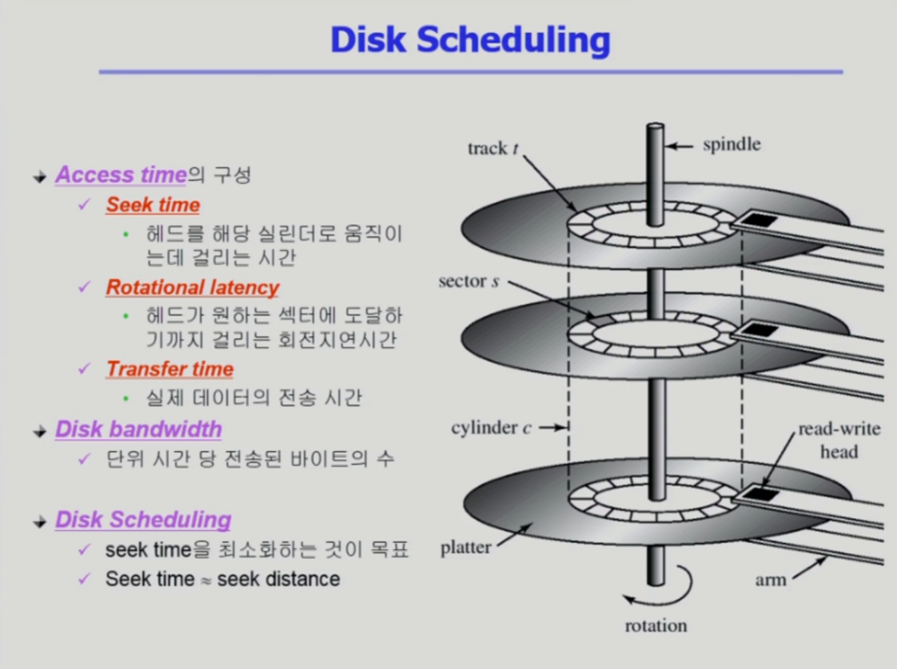
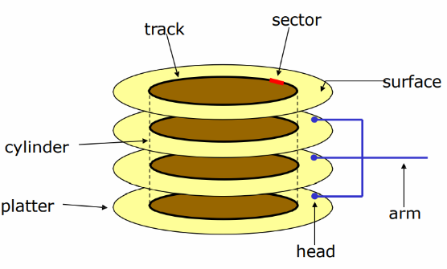
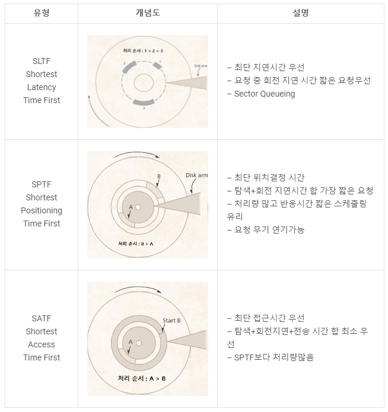
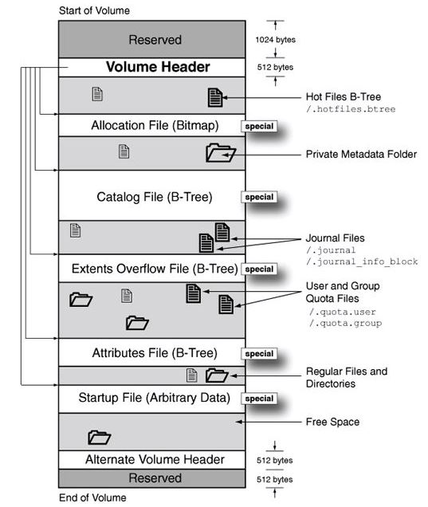

# 입출력 시스템

## Disk Scheduling

디스크 관리

위의 사진은 디스크의 내부구조

여러개의 원판과 마그네틱에 실제 데이터가 저장되어있다.

하드디스크 내부에서 데이터를 저장하는 최소 단위는 sector(섹터)라고 한다.

각각의 원판들은 track(트랙)으로 구성되어있으며

안쪽 트랙과 바깥쪽 트랙으로 구성되어 각각의 트랙에 데이터를 읽고 쓸 수 있도록 되어있다.

그리고 트랙안에 있는 각각의 조각들을 sector(섹터) 라고 한다.

그리고 cylinder(실린더)는 서로 다른 원판에서 상대적으로 같은 위치에 있는것을 모아놓은 것을 의미한다고 한다.

섹터에 데이터를 저장하고 읽고 쓰게 되는데, 실제로 읽고 쓰고를 담당하는 곳은 디스크 헤드가 수행한다.

또한 디스크 헤드는 각각의 원판의 서로 다른 위치를 향할 수 없고 같이 움직여 중앙을 기준으로하여 같은 거리에 위치한다.

---

그래서 위의 사진처럼

Sector는 디스크 내부에서 실제로 데이터가 저장되는 최소 단위이자 위치를 의미한다. (512byte 정도로 구성된다고 한다.)

그래서 디스크 내부에서는 디스크 컨트롤러가 섹터에 데이터를 저장하거나 꺼내고 하지만

디스크 외부에서 즉 컴퓨터 내부에서 디스크의 내부에 있는 데이터를 요청할 경우

해당 요청은 섹터에게 요청하는 것이 아닌 Logical Block에 한다고 한다.

그래서 디스크 외부에서는 디스크 내부의 데이터를 요청할 경우 특정 원판, 특정 트랙의 섹터 번호를 전달하는 것이 아닌

논리적인 블록 번호를 전달하여 요청한다.

그래서 Logical Block의 실제 저장되는 위치는 디스크의 섹터라는 곳에 1:1로 매핑이 되어 저장이 되어있다고 한다.

그리고 섹터 0번의 경우는 항상 부팅을 위해서 항상 준비되어있으며 최외각 실린더의 첫 트랙에 있는 첫 번째 섹터이다.

정리하자면, 부팅을 위해 항상 준비가 되어있는 0번 섹터는 실린더의 최외각에 위치한 첫 번째 트랙에 있는 첫 번째 섹터이다.

---

디스크 컨트롤러가 섹터 단위로 구역을 나누는 것을 Physical formatting 이라고 한다.

Physical formatting에서의 각 섹터는 실제 데이터(보통 512byte)로 구성되는 것 뿐 아니라 앞뒤로 header와 trailer 가 함께 구성되어 있다.

여기서 header와 trailer는 디스크 외부에 보이는 정보는 아니며 디스크 내부에서 컨트롤러가 관리하기 위해서두는 정보라고 하며

실제로 어떤 데이터가 들어왔는지를 알 수 있는 Sector number와 데이터가 제대로 저장이 되어있는지를 체크하는 즉 데이터의 축약본인 ECC(Error-Correcting Code) 와 같은

부가적인 코드들이 Header와 tailer에 있다고 한다.

과정 정리 (디스크 컨트롤러한테 섹터에 있는 데이터를 요청할 경우)

- 디스크 컨트롤러가 해당 섹터에 있는 데이터를 읽는다.
- 실제 512byte의 데이터 뿐만 아니라 header와 trailer의 정보를 함께 읽는다.

그 다음으로 물리적인 디스크를 파티셔닝을 하는 절차를 가진다.

운영체제(OS)는 물리적인 디스크를 디스크로 보지 않고 파티셔닝을 한 각각의 파티션인 논리적인 디스크를 독립적인 디스크로 취급한다.

그 다음으로 각각의 파티셔닝이 된 논리적인 디스크는 파일시스템을 설치해서 사용하던지, Swap area 용도로 사용하던지 하는데 해당 과정을 Logical formatting이라고 한다.

그리고 컴퓨터가 부팅될 때 어떻게 디스크를 읽으며 부팅이 되는가하면 (부팅의 절차)

- 컴퓨터의 전원을 켜면 CPU는 메모리에 있는 기계어를 하나씩 실행시킨다.

- 다만 메모리는 휘발성 매체이므로 전원을 켜게 되면 메모리는 비어있게 되고 CPU는 메모리에 있는 기계어를 읽을 것이 없게 된다.

   (휘발성 있는 메모리를 DRAM이라 부른다.)

- 그래서 CPU의 PCR(Program Counter Register)은 전원을 끄더라도 사라지지 않는 메모리인 ROM의 주소를 가리키고 있게 되어 ROM의 기계어를 실행시키게 된다.

- ROM의 기계어로는 부팅시 사용하는 디스크의 0번 Sector에 있는 내용을 메모리에 올리는 것으로 해당 기계어를 읽어 실행시키게 된다.

   (Small Bootstrap Loader 라고 부른다)

- 그리고 0번 Sector를 Full Bootstrap Loader Program 이라 부르며 진정한 부팅의 과정을 하는 로더라고 한다.

그리고 디스크에 접근하는 시간은 총 3가지 요소로 구성되어 있다.

Access Time의 구성

1. Seek Time :
   - 디스크 헤드가 해당하는 실린더로 움직이는데 걸리는 시간을 의미하며.
   - 디스크를 접근하는 시간 중 가장 큰 시간 규모를 차지한다.
2. Rotational Latency(회전 지연시간)
   - 헤드가 원하는 섹터에 도달하기까지 걸리는 회전 지연시간을 의미.
   - Seek Time의 1/10 정도의 시간을 차지
3. Transfer Time
   - Rotational Latency 이후 실제 데이터를 읽거나 사용할 경우 데이터를 사용할 텐데 그때 실제 데이터의 전송 시간을 의미
   - Seek Time에 비해 굉장히 짧은 시간을 차지한다고 한다.

디스크의 성능 지표

- Dist Bandwidth (대역폭) : 단위 시간 당 전송된 바이트의 수로 Seek Time을 줄이게 되면 단위 시간당 전송되는 바이트의 수를 늘릴 수 있게 된다.

그래서 Disk Scheduling 이란 단위 시간 당 전송되는 바이트 수를 늘리기 위해 Seek Time을 최소화 하는 것을 목표로 한다.

---

### Swap - Space 관리

위의 사진과 같이 Disk 를 사용하는 두 가지 이유

1. 메모리의 (최적화 등 컴파일러의 재량을 제한하는 역할)한 특성으로 전원이 나가더라도 영구적으로 내용을 유지하는 File System
   - File System 의 관리: 512byte의 Sector 단위로 관리 (최근에는 호스트 컴퓨터와 데이터를 주고받는 단위를 4kbyte 단위로 관리한다고 한다.)
2. 메모리의 연장 공간으로 프로세스의 주소공간을 담는 공간 Swap Area
   - Swap Area 의 관리: File System에 비해 단위가 훨씬 크다.
   - 이유로는 파일 시스템의 데이터는 전원이 나가더라도 항상 유지해야하는 단위이기에 공간 효율적으로 관리하는 것이 중요하지만
   - Swap Area 의 경우 전원이 켜져있을 경우에만 의미가 있는 데이터이기에 공간 효율적이지 않아도 되며, 속도 효율성이 더욱 중요하기 때문.

---

### RAID

RAID의 경우 위의 사진과 같이

여러 개의 디스크를 묶어서 사용하는 것을 의미

사용 목적

1. 디스크 처리 속도 향상

   - 여러 디스크에 Block의 내용을 분산 저장
   - 병렬적으로 읽어 옴(각각의 디스크에 분산하여 저장후 읽어오게 되면 하나의 디스크에서 읽어오는 것보다 속도가 훨씬 빠르기에)

2. 신뢰성 향상

   - 동일 정보를 여러 디스크에 중복 저장하며

   - 하나의 디스크가 고장시 다른 디스크에서 읽어오며 이러한 과정을 Mirroring or Shadowing 이라 부른다.

   - 또한 단순한 중복 저장이 아닌 일부 디스크에 Parity를 저장하여 공간의 효율성을 높일 수 있다.

      (패리티: 축약 정보로 일부 디스크에 각각의 디스크 안에 어떤 정보가 있는지를 저장)

참고: RAID의 단계별 내용

https://waystation.tistory.com/112

## Disk Scheduling Algorithm

---

1. **_FCFS (First-Come First-Served)_**

   - 먼저 온 것부터 처리
   - 헤드의 이동거리가 길어질 수 있음
   - 단위 시간당 디스크의 처리랑이 낮아짐 → 대역폭 낮아짐

   - 총 헤드의 이동 : 640 cylinders
   - Queue = 98, 183, 37, 122, 14, 124, 65, 67
   - Head stars at 53

   <aside>
    53 → 98 → 183 → 37 → 122 → 14 → 124 → 65 → 67

   </aside>

---

1. **_SSTF (Shortest Seek Time First)_**

   - 제일 가까운 것을 찾아감
   - **Starvation 문제**

   - 총 헤드의 이동 : 236 cylinders
   - Queue = 98, 183, 37, 122, 14, 124, 65, 67
   - Head stars at 53

   <aside>
    53 → 65 → 67 → 37 → 14 → 98 → 122 → 124 → 183

   </aside>

---

1. **_SCAN_**
   - 헤드가 디스크의 한쪽 끝에서 다른쪽 끝까지 이동하며 가는 길목에 있는 모든 요청을 처리
   - 다른 한쪽 끝에 도달하면 역방향으로 이동하며 오는 길목에 있는 모든 요청을 처리하며 다시 반대쪽 끝으로 이동한다.
   - 실린더 위치에 따라 대기 시간이 다르다.
   - 엘리베이터 스케줄링 → 새로운 요구가 헤드 진행 방향 바로 앞이나 뒤에 따라 대기시간 편차가 큼

- 총 헤드의 이동 : 208 cylinders
- Queue = 98, 183, 37, 122, 14, 124, 65, 67
- Head stars at 53

<aside>
 53 → 37 → 14 → **0** → 65 → 67 → 98 → 122 → 124 → 183

</aside>

- **_C-SCAN_**
  - 헤드가 한쪽 끝에서 다른쪽끝으로 이동하며 가는 길목에 있는 모든 요청을 처리
  - 다른쪽 끝에 도달했으면 요청을 처리하지 않고 곧바로 출발점으로 다시 이동
  - SCAN보다 균일한 대기 시간을 제공

  - Queue = 98, 183, 37, 122, 14, 124, 65, 67
  - Head stars at 53
    <aside>
     53 → 65 → 67 →  98 → 122 → 124 → 183 → **199** → **0** → 14 → 37
    
    </aside>

- **_N-SCAN_**
  - SCAN의 변형 알고리즘
  - 진행 중에 새로 추가된 요청은 서비스하지 않고 다음 진행시에 서비스
  - 일단 Arm이 한 방향으로 움직이기 시작하면 그 시점 이후에 도착한 job은 되돌아올 때 service

  - Queue = 98, 183, 37, 122, 14, 124, 65, 67
  - 새롭게 발생된 트랙 : 58, 100
  - Head stars at 53
    <aside>
     53 → 65 → 67 →  98 → 122 → 124 → 183 → **199** → 100 → 58 → 37 → 14
    
    </aside>

---

1. **_LOOK_**

   - 헤드가 진행 중이다가 그 방향에 더 이상 기다리는 요청이 없으면 헤드의 이동방향을 즉시 반대로 이동
     - SCAN은 헤드가 디스크 끝에서 끝으로 이동
   - Queue = 98, 183, 37, 122, 14, 124, 65, 67
   - Head stars at 53

   <aside>
    53 → 65 → 67 →  98 → 122 → 124 → 183 → **37** → **14**

   </aside>

   - **_C-LOOK_**
     - Queue = 98, 183, 37, 122, 14, 124, 65, 67
     - Head stars at 53
       <aside>
        53 → 65 → 67 →  98 → 122 → 124 → 183 → **14** → **37**
       
       </aside>

2. **_회전 지연시간 최적화 위한 디스크 스케줄링 기법_**

[N - Step SCAN, C-SCAN, LOOK, SLTF](https://3catpapa.tistory.com/117)

## 파일시스템 1

### UNIX 파일시스템

- 수퍼블록: 파일시스템의 총체적구조 ,블럭크기, i-node 몇개, 데이터몇개 등
- i-node 블럭 하나에 i-node 여러개가 들어가있음

### i-node

- 파일의소유주, 접근권한, 파일의 위치정보 등이 메타데이터로서 i - node에 보관

파일 시스템의 변천사

제일많이쓰는 파일 시스템 EXT4

### EXT2

UNIX파일시스템과 i-node와 다른점이없다

15개의 포인터

12 : 실제 데이터블럭위치

3 : 큰파일을 지원하기위해 Indirect pointer로 (상당히 큰파일을 지원 가능)

유닉스보다 개선 : 블록 그룹화 i-node와 데이터블록을 그룹으로

파일 접근할때 : 메타데이터 접근 > 실제데이터 접근

i-node block 과 data block을 왔다갔다하는 것은 디스크 헤더가 많이 움직인다. 이러한 단점을 보완하기 위해서 블록의 그룹화가 나왔다.

- 데이터 그룹에 대한 총체적인 정보를 담고 있는 것이 Group descriptor이다.

- 사용적인 블록과 비어있는 그룹은 block bitmap으로 구분한다.

Data block 개수만큼 Data Block Bitmap 있어서 사용중인블럭과 비어있는블록 표시

inode도 마찬가지

### 요약: 전체 파일시스템을 그룹화 해서 나누었다

### **Ext4 파일시스템**

### 저널링:

전원 플러그 뽑힘

- 작업하는게 소실
- 파일 시스템이 깨질수있음

### 파일시스템에 있는 내용을 작업하기위해서는 Main memory에있는 버퍼캐시에 올려놓고 작업함

- 파일 시스템 : 비휘발성
- 버퍼캐시 : 휘발성 ( 전원이 나가면 내용이 사라짐)

수정된 내용을 파일시스템이 반영해줘야함

### 이문제를 해결하기위해 저널링 사용 (신뢰성이 높도록)

[https://www.notion.so](https://www.notion.so)

[https://www.notion.so](https://www.notion.so)

- 버퍼캐시에서 쫓겨날때 파일에 저장을 해주는 것이 아니라 주기적으로 스토리지에 써주는 것이다.

파일시스템에 쓰는것이 아니라 저널 영역이라는 것에 써주는 것이다.

도중에 크래쉬가 나더라도 저널영역에 있는 것을 옮겨쓰면 된다

(저널영역 조금만 들어가면 저널영역을 날려서 옛날 데이터 보존)

### Ext4의 저널링 모드 2가지

#### 기본값: 메타데이터만

사용자가 수정 > 버퍼캐시에 반영 , 메타데이터도 수정

메타데이터만 저널링 영역에 담아줌

그리고 긴 주기로 저널링 영역에 있는 메타데이터를 파일시스템에 수정

- 메타데이터만 저널링했기 때문에 파일의 위치정보는 깨지지않는다. 일반 데이터는 깨질 수 있다.

### 메타데이터 와 일반데이터 다

## 파일 시스템 2 (강의 밖 내용)

### **NTFS(New Technology File System)**

FAT의 한계점을 개선한 파일시스템

windows NT 이후부터 사용

최대 하드디스크 용량 8PB

### **ReFS(Resilient File System)**

마이크로소프트에서 NTFS를 대체하기 위해 개발 중인 차세대 파일 시스템

### **HFS(Hierarchical File System)**

Apple이 개발한 파일 시스템

파일 용량 2GB 파티션 용량 2TB

### **HFS+**

HFS 파일시스템은 저널링을 제공하지 않으며 파일 이름 제한이 255자이며 큰 용량의 데이터 처리 문제가 존재하므로 이러한 단점을 보완한 파일시스템이 HFS+이다

**Reserved(1024byte):** 원래 Boot block이 들어가던 자리이나 OS의 발달로 Boot 블록 불필요.
**Volume Header:** HFS+의 시그니처, 볼륨정보, 블록정보, 파이/폴더의 개수, Catalog File 정보 등.
**Allocation File:** 할당된 Block들에 대한 Bit 저장. 블록에 대한 flag 값을 통해 비트맵 형식의 관리.
**Extents Overflow File:** B-Tree에서 넘친 값을 저장. 하나의 Fork가 값을 모두 담지 못할때 이곳에 저장
**Catalog File:** 파일 및 폴더에 대한 정보(위치, 크기).
**Attributes File:** B-Tree 속성 정보
**Startup File:** Boot Loader가 사용하는 정보. 부팅을 위해 사용됨.
**Alternate Volume Header:** Volume Header의 백업

### **APFS(Apple File System)**

HFS, HFS+ 의 디스크 용량 한계로 인해 개발된 apple의 차기 파일 시스템

**Space sharing**

파티션이 물리적으로 공간을 차지하는 것이 아니라 논리적으로 차지하고 있어 형태의 이점을 얻을 수 있게 해준다. APFS는 파티션의 공간을 늘리거나 줄일 때 파티션을 다시할 필요없이 원하는 파티션의 크기를 늘리고 줄일 수 있다.

**Cloning files and directories**

파일이 복제되면 메타데이터만 변경하고 기존의 파일을 그대로 지정한다. 그리고 복제본에서 일부가 수정되면 수정된 부분만 디스크에 기록되고 수정되지 않은 부분은 기존의 파일 데이터를 가리키게 되므로 파일의 용량이 적어진다.

**Snapshots**

스냅샷은 특정 볼륨에 대한 읽기전용 인스턴스이다. 스냅샷은 한 시점의 데이터를 지정하는 메타데이터의 역할을 한다. 스냅샷이 지정하고 있는 파일의 일부가 변경된다면, 원본 데이터는 변경되지 않고, 변경된 부분에 대해서만 디스크의 다른 공간에 데이터를 사용한다. 이런 방식으로 운영체제나 응용 프로그램은 많은 용량 사용없이 특정 시점으로 파일을 되돌리는 기능을 수행할 수 있다.

**암호화**

APFS 컨테이너 속에 있는 볼륨은 3가지의 암호화 방식을 선택할 수 있다.

볼륨을 암호화하지 않는 단계

볼륨당 하나의 키를 이용해 암호화(기존의 파워볼트방식)

메타데이터와 각각의 파일 데이터를 서로 다른키로 암호화

### **ZFS(ZettaByte File System)**

썬 마이크로 시스템즈에서 개발하였으며 Unix 파일시스템을 대체하기 위해 탄생한 파일시스템

128비트 파일시스템이며 32~64비트 파일 시스템의 160억배 수준의 볼륨 크기가 가능함

### 버퍼 캐시 교체 알고리즘. LRU LFU에서의 변천

LRU - 가장 오래 전에 사용된 블록 삭제

LFU - 사용 횟수가 가장 적은 블록 삭제

실제로는 성능 더 좋은 알고리즘들이 많이 등장했습니다

---

[Cache replacement policies - Wikipedia](https://en.wikipedia.org/wiki/Cache_replacement_policies#RRIP-style_policies)

LRU 알고리즘은 높은 오버헤드로 인해 운영체제 와 같은 컴퓨터 시스템의 주요 경로에서 직접 구현할 수 없습니다 . 따라서 CLOCK 이라고 하는 LRU의 근사치가 구현에 일반적으로 사용됩니다.

이와 유사하게 CLOCK-Pro는 시스템에서 저비용 구현을 위한 LIRS의 근사치입니다.

### LIRS

LIRS는 IRR(Inter-Reference Recency)의 원리를 사용한 디스크 기반의 버퍼 교체 정책

[LIRS caching algorithm - Wikipedia](https://en.wikipedia.org/wiki/LIRS_caching_algorithm)

IRR (Inter - reference Recency )

참조된 블록의 현 시점과, 그 참조된 블록 이전의 시점 사이에 참조된 다른 블록의 수

R ( Recency ) : 최근성

어떤 페이지가 마지막으로 접근된 이후부터 현재 사이에 접근된 중복되지 않은 다른 페이지의 수

LIRS는 IRR이 작은 페이지를 LIR(Low Inter-reference Recency) 페이지로,

IRR이 큰 페이지를 HIR(High Inter-reference Recency) 페이지로 구별하여 관리하며,

페이지 교체시에 버퍼에 상주(resident)하는 HIR 페이지 중 최대 IRR을 가진 페이지를 교체한다.

교체된 페이지는 메타데이터를 포함하는 버퍼 비상주(nonresident) HIR 페이지가 되어 리스트에 남게 된다.

LIRS스택은 크기가 가변적이라 크기가 증가하는데 한없이 커질 수는 없으므로 상대적으로 콜드 블록인 스택 밑의 HIR블록들을 제거해야 할 것이다. 이 작업을 Stack Pruning이라 한다.

새로 참조된 블록이 LIR블록이 되느냐 HIR블록이 되냐는 바로 새로 참조된 블록의 IRR값이 Rmax값보다 큰 가 작은가에 따라 나눠진다.

만약 새로 참조된 B의 IRR 값이 1, 기존 블록 중 최대 Rmax (=3)값을 가진 블록이 E였다고 할 때,

B IRR =1 < E Rmax = 3 이므로 B는 HIR → LIR이 되고, E는 HIR → LIR이 된다.

LIRS스택은 한 가지 규칙이 있다. 스택 맨 아래에는 언제나 LIR블록이 위치해야 한다는 것이며, 이 블록은 언제나 최근성 R이 최대인 Rmax값을 가질 것이다. 그러지 못한 것들은 stack에서 그냥 빼버린다.

첫째는 LIR블록을 참조하였을 경우이다. 이 경우 캐시에서 적중이 일어나며, 이 블록은 스택의 맨 위로 올라가게 된다. 만약 참조된 블록이 스택의 맨 밑에 있었을 경우에는 바로 Stack Pruning이 일어나게 된다.

둘째는 HIR Resident블록을 참조하였을 경우이다. 이 경우 또한 캐시에서 적중이 일어난다.

참조된 블록은 스택의 맨 위로 올라가게 되는데 이후, 두 가지 케이스가 있다.

1. 참조된 블록이 스택 안에 있는 경우, 이 블록은 LIR상태가 되며, list Q에서 제거된다. 스택 맨 아래에 있던 LIR블록은 list Q의 맨 끝으로 이동이 되며, 그 다음 Stack Pruning이 일어난다.
2. 참조된 블록이 스택 안에 없는 경우, 이 블록은 HIR상태로 list Q의 끝으로 이동한다.

셋째는 Non-resident HIR블록을 참조하였을 경우이다. 이 경우 비적중이 일어난다. list Q에의 맨 앞에 있는 블록이 캐시에서 제거된다. 그 다음 참조된 블록을 스택의 맨 위에 적재시킨다. 이후 2가지 케이스가 있는데,

1. 참조된 블록이 스택에 존재한 경우, 이 블록은 LIR블록이 되며, 스택 맨 밑에 있는 LIR블록은 list Q의 맨 끝으로 이동이 되며 HIR블록이 된다.

2. 참조된 블록이 스택에 존재하지 않는 경우, 이 블록은 HIR블록이 되며 list Q의 맨 끝에 위치시킨다.

현재 Linux 버전에서의 버퍼 캐시 교체 알고리즘 구현은 LRU와 CLOCK-Pro의 조합으로 이루어져 있습니다.

### Clock-Pro

CLOCK-Pro는 IRR과 동일한 재사용 거리(reuse-distance) 에 기반하여 재사용 거리가 짧은 페이지를 핫 페이지로, 재사용 거리가 긴 페이지를 콜드 페이지로 구별하여 관리한다.

모든 페이지는 기본 값이 0이고 접근 시 1이 되는 참조 비트를 가지며, 각 콜드 페이지에는 페이지가 리스트의 끝을 지날 때까지의 시간과 같은 테스트 기간(test period)이 주어져 이 기간 중에 참조되면 핫 페이지로 변경될 수 있다.
CLOCK-Pro는 순환리스트 구조로 시계 방향으로 이동하는 세개의 클락 핸드를 가지고 있다.

HANDcold는 페이지 폴트 시에 교체할 콜드 페이지를 찾기 위한 시작 위치인 버퍼 상주 콜드 페이지 중 최대 재사용 거리를 가진 페이지를 가리킨다.

HANDhot은 최대 recency를 가진 핫 페이지를 가리키며, HANDhot이 지나가면 참조비트가 0인 핫 페이지는 콜드 페이지로 변경된다. (그림 3)에서와 같이 HANDhot은 항상 리스트 끝을 가리키고 시계 방향으로 HANDhot을 바로 뒤따르는 페이지는 리스트 앞이다. 즉, HANDhot의 이동은 가리키는 페이지를 리스트 앞으로 보내는 것이다.

HANDtest는 리스트의 끝에서 가장 가까운 콜드 페이지를 가리키며, HANDtest가 지나간 콜드 페이지의 테스트 기간은 종료되고 버퍼 비상주 콜드 페이지는 리스트에서 삭제된다.

CLOCK-Pro의 페이지 교체는 클락 핸드들의 동작을 조합하여 이루어진다.

우선, HANDcold는 참조 비트가 0인 버퍼 상주 콜드 페이지를 찾아 교체한다. 교체된 콜드 페이지는 메타데이터를 가진 버퍼 비상주 콜드 페이지가 되어 남은 테스트 기간 동안 리스트에 유지된다.

그러나 버퍼 상주 콜드 페이지의 참조비트가 1이고 테스트 기간 중에 있지 않으면 참조비트만 0으로 변경하여 리스트 앞으로 이동시키고, 다시 교체할 페이지를 찾아 이동한다.

만약, HANDcold가 만나는 콜드 페이지가 테스트 기간 중에 있고 참조비트가 1이면 핫 페이지로 변경 되어 리스트 앞으로 이동하고 참조 비트는 0이 된다.

콜드 페이지가 핫 페이지로 변경된 후에는, HANDhot이 가리키는 리스트 끝의 핫 페이지는 콜드
페이지가 되어 리스트 앞으로 이동된다.

그러나 HANDhot이 가리키는 핫 페이지의 참조비트가 1이면 참조비트만 0으로 변경되고 HANDhot은 다시 참조비트가 0인 핫 페이지를 찾아 이동한다. 이 과정에서 HANDhot은 만나는 콜드 페이지의 테스트 기간을 종료시키고, 버퍼 비상주 콜드 페이지를 제거한다. 실제로 HANDhot이 HANDtest의 역할을 대신하여 동작한다.

CLOCK-Pro 장점

- CLOCK-Pro는 하나의 "바늘"만 사용되는 CLOCK의 단순한 구조와 달리 세 개의 "시계 바늘"을 가지고 있습니다. 따라서 CLOCK-Pro는 세 개의 HAND으로 데이터 액세스의 재사용 거리를 대략적인 방식으로 측정할 수 있습니다.
- 일회성 액세스 및/또는 낮은 지역 데이터 항목을 신속하게 제거하는 것과 같은 LIRS의 모든 장점이 유지됩니다.
- CLOCK-Pro의 복잡도는 CLOCK과 동일하여 저렴한 비용으로 구현이 용이합니다.

  → 따라서 디스크 기반의 저장장치에서 좋은 성능을 보입니다

CLOCK-Pro 단점

- 플래시 메모리의 비대칭 연산 비용의 특성을 고려하고 있지 않아 플래시 메모리 기반의 저장 장치에서 사용하기에는 적절하지 못합니다.
- 테스트 기간 중에 있는 콜드 페이지에 다수의 접근이 발생해도 HANDcold를 만나기 전까지 핫 페이지로 변경되지 못하므로 페이지 접근 정보의 활용이 효율적이지 못합니다.
