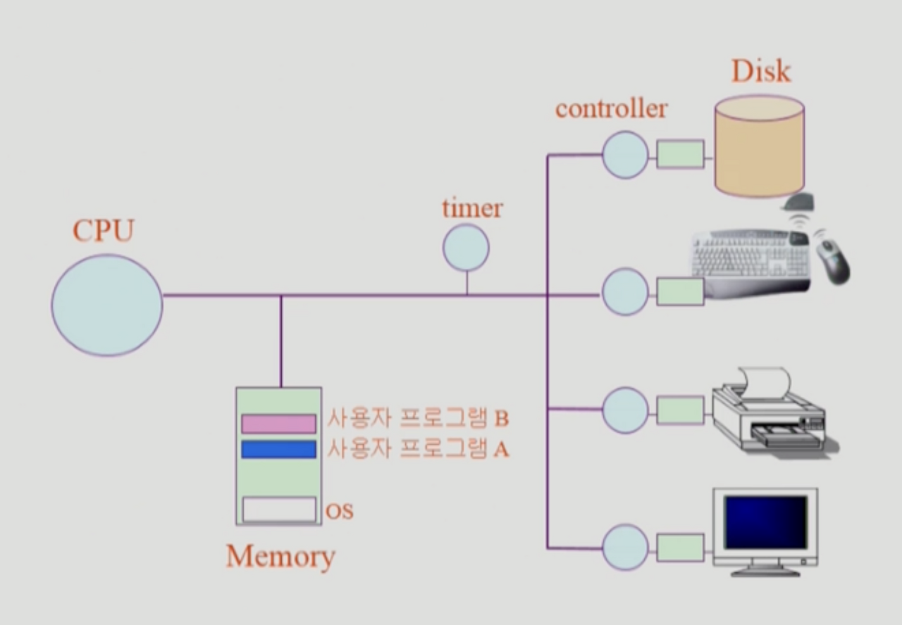

# 컴퓨터 시스템 구조


### 인터럽트와 트랩

모드빗, 인터럽트 라인, 타이머, 시스템 콜(HW 인터럽트와 SW 트랩)

# 💡 컴퓨터 시스템 구조

---


- **CPU의 실행**
    1. 운영체제에 의해 실행될 때 : 믿고 맡길 수 있음
    2. 사용자 프로그램에 의해 실행 : 악의적인 프로그램이 있을 가능성 有
        - 이 때, 운영체제는 손을 쓸 수 없다.

- **mode bit**
    - 사용자 프로그램의 잘못된 수행으로 다른 프로그램 및 운영체제에 피해가 가지 않도록 하기 위한 보호 장치 필요
    - CPU에서 기계어를 실행하는 프로그램을 구분하는 것이 mode bit
        - **운영체제 → [ mode bit = 0 ] : 모니터 모드 (=커널 모드 = 시스템 모드)**
            - 운영체제가 사용자 프로그램에게 CPU 사용권을 넘겨줄 때, mode bit을 1로 바꿈
        - **사용자 프로그램 →[ mode bit = 1 ] : 사용자 모드**
            - mode bit이 1일 때, 사용자 프로그램은 안전한 기계어만 실행할 수 있음
            - 위험한, 보안을 해칠 수 있는 기계어? “특권명령” ← mode bit이 0일 때만 실행 가능
            - mode bit이 1일 때 위험한 기계어를 사용하면 자동으로 CPU가 운영체제에게 넘어감
            - 이 때, 운영체제로 넘어가는 방법 : Interrupt, exception(예외사항)
            - Interrupt나 Exception 발생시 하드웨어가 mode bit을 0으로 바꿈

# 💡 인터럽트 (Interrupt)

---

- 하드웨어 인터럽트(**Inturrupt**) : 일반적인 인터럽트
    - I/O device
    - timer
- 소프트웨어 인터럽트 (**Trap**) : 넓은 의미에서의 인터럽트
    - **System call** : 프로그램이 스스로 커널 함수(운영 체제)를 호출하는 경우
    - **Exception**
        - 프로그램이 오류를 범한 경우
        - 0으로 나누기 → CPU가 처리
- 인터럽트 관련 용어
    - 인터럽트 벡터 : 해당 인터럽트의 처리 루틴 주소를 가지고 있음
        - 인터럽트 종류(타이머/ 디스크 컨트롤러 …) 별로 실행해야 할 코드 위치를 담고 있음
    - 인터럽트 처리 루틴 (= 인터럽트 핸들러) : 해당 인터럽트를 처리하는 커널 함수
        - 벡터로 찾아가면 해당 인터럽트를 처리하는 커널 함수. = 핸들러
        

### 2 레지스터[강의 외 추가 공부 필요]와 프로그램 카운터 - 김유민

레지스터는 무엇이며 어떤 종류가 있는지, 그 중 프로그램 카운터의 역할

> **CPU의 기본 구조**
> 

1. **산술논리연산장치 (Arithmetic and Logical Unit: ALU)**
2. **레지스터 (Register set)**
3. **제어 유니트 (Control Unit)**


1. **레지스터 (Resgister)**
    - 액세스 속도가 가장 빠른 기억장치
    - CPU 내부에서 처리할 명령이나 연산의 중간 값들을 일시적으로 기억하는 임시 저장소
    - CPU 내부에 포함할 수 있는 레지스터들의 수가 제한됨
    - (특수 목적용 레지스터들과 적은 수의 일반 목적용 레지스터들)
    
    1. 범용 레지스터
        - 플립플롭 (Flip-Flop) : 플립플롭 구조의 레지스터 묶음
            - 두 개의 안정상태에서 한쪽을 보존하여 상태를 유지
        - 스크래치패드 (Scratch-Pad Memory) : 임시저장을 위한 고속 메모리
            - 작은 데이터 항목들을 주로 보관
    2. 특수 레지스터
        - 레지스터

---

> **명령어 실행**
> 

- **명령어 사이클 (instruction cycle)** : CPU가 한 개의 명령어를 실행하는데 필요한 전체 처리 과정으로서,
- CPU가 프로그램 실행을 시작한 순간부터 전원을 끄거나 회복 불가능한 오류가 발생하여 중단될 때까지 반복


- 인출 사이클(fetch cycle) : CPU가 기억장치로부터 명령어를 읽어오는 단계
- 실행 사이클(execution cycle) : 명령어를 실행하는 단계

- **명령어 실행에 필요한 CPU 내부 레지스터들**

1. **프로그램 카운터 (Program Counter : PC)**
   
    다음에 인출할 명령어의 주소를 가지고 있는 레지스터
    
    각 명령어가 인출된 후에는 자동적으로 일정 크기 (한 명령어 길이) 만큼 증가
    
    분기 (branch) 명령어가 실행되는 경우에는 목적지 주소로 갱신
    
2. **누산기 (Accumulator : AC)**
   
    데이터를 일시적으로 저장하는 레지스터
    
    레지스터의 길이는 CPU가 한 번에 처리할 수 있는 데이터 비트 수 (단어 길이)와 동일
    
3. **명령어 레지스터 (Instruction Register: IR)**
   
    가장 최근에 인출된 명령어 코드가 저장되어 있는 레지스터
    
4. **기억장치 주소 레지스터 (Memory Address Register : MAR)**
   
    PC에 저장된 명령어 주소가 시스템 주소 버스로 출력되기 전에 일시적으로 저장되는 주소 레지스터
    
5. **기억장치 버퍼 레지스터 (Memory Buffer Register : MBR)**
   
    기억장치에 쓰여질 데이터 혹은 기억장치로 부터 읽혀진 데이터를 일시적으로 저장하는 버퍼 레지스터
    
- **데이터 레지스터 (DR : Data Resgiter)**
    - 명령 수행시 주기억장치에서 가져온 데이터를 기억, 워드 크기과 같다. 주기억장치의 용량과 관계가 있음
    - 종류 : 누산기(AC), MBR, GPR (범용 레지스터)
- **주소 레지스터 (AR : Address Register)**
    - 주기억장치의 주소의 일부 또는 전부를 기억
    - 종류 : PC, MAR, 베이스 레지스터(Base Register), 인덱스 레지스터(Index Register)
        - 베이스 레지스터 (Base Register) : 프로그램이 메모리에 A, B, C에 여러 개가 존재하면 각각의 프로그램의 주소를 가리킴
        - 인덱스 레지스터 (Index Register) : 특정한 데이터를 다른 곳으로 연속적으로 옮기고자 할 때, 두 위치를 지정해야함
        


---

> **I/O 장치 제어기 (I/O Device controller)**
> 

- CPU로부터 I/O 명령을 받아서, 해당 I/O 장치를 제어하고, 데이터를 이동함으로써 명령을 수행하는 전자회로 장치 (ex. 키보드 제어기, 프린터 제어기)
- **상태 레지스터**
    - I/O 장치의 현재 상태를 나타내는 비트들을 저장한 레지스터
    - 준비 상태(RDY) 비트, 데이터 전송확인(ACK) 비트, 등
- **데이터 레지스터**
    - CPU와 I/O 장치 간에 이동되는 데이터를 일시적으로 저장하는 레지스터
    

---

1. **제어 유니트**
    - 명령어 코드의 해독
    - 명령어 실행에 필요한 제어 신호들의 발생
    
    - 구성 요소
        - 명령어 해독기 (instruction decoder) : 명령어 레지스터(IR)로부터 들어오는 명령어의 연산 코드를 해독하여 해당 연산을 수행하기 위한 루틴의 시작 주소를 결정
        - 제어 주소 레지스터 (control address register : CAR) : 다음에 실행할 마이크로 명령어의 주소를 저장하는 레지스터 → 이 주소는 제어 기억장치의 특정 위치를 지칭
        - 제어 기억장치(control memory) : 마이크로명령어들로 이루어진 마이크로프로그램을 저장하는 내부 기억 장치
        
        - 제어 버퍼 레지스터 (control buffer resgister : CBR) : 제어 기억장치로부터 읽혀진 마이크로명령어 비트를 일시적으로 저장하는 레지스터
        - 서브루틴 레지스터 (subroutine register : SBR) : 마이크로 프로그램에서 서브루틴이 호출되는 경우에 현재의 CAR 내용을 일시적으로 장하는 레지스터
        - 순서제어 모듈 (sequencing module) : 마이크로명령어의 실행 순서를 결정하는 회로들의 집합
        
        

### 3 인터럽트 전체 과정 - 김홍민

디스크에서 파일 읽어오거나 키보드 입력 받을 때 OS 내부에서 일어나는 과정

<인터럽트의 개념>

- 사전적인 의미로는 `방해하다, 중단시키다` 라는 뜻을 가진다
- OS적으로는 `CPU의 정상적인 프로그램 실행을 방해했다` 는 의미를 가진다
- 프로그램을 실행하는 도중에 예기치 않은 상황이 발생할 경우, 현재 실행중인 작업을 중단하고 발생된 상황을 처리한 후, 다시 실행중인 작업으로 복귀하는 것
  
    <요약하자면>
    
    ```
    1. OS는 서로 다른 일을 하는 수많은 하드웨어를 사용한다.
        이런 장치들은 동기적으로 구동되는데, 이는 각각 동작이 완료될 때 까지 기다려야하므로
        아무것도 하지 않으면서 바쁜 상태로 많은 시간을 소비하게된다.
        이 때, 인터럽트를 사용하여 한번에 하나의 명령만 수행할 수 있는 CPU의 한계성을 보완할 수 있다.
    ```
    

<인터럽트의 종류>

- 외부 인터럽트
  
    ```
    CPU 코어 외부에서 어떤 일이 발생한 것을 전기적인 신호로 CPU에게 통지하는 경우, 주로 입출력장치에 의해 발생한다고 합니다.
    
    <유형>
    1. 타이머 인터럽트 : 타이머가 일정한 시간 간격으로 중앙처리장치에게 인터럽트를 요청
    2. 입출력 인터럽트 : 속도가 느린 입출력장치가 입출력 준비가 완료되었음을 알리기 위해 인터럽트를 요청
    ```
    
- 내부 인터럽트
  
    ```
    CPU 코어 외부에서 인터럽트를 거는 경우가 일반적이지만, CPU 내부에서 실행하면서 인터럽트에 걸리는 경우
    
    <유형>
    1. 하드웨어 고장(Hardware Interrupt)
        컴퓨터 고장
        데이터 전달 과정에서의 비트 오류
        전원이 나간 경우
    2. 실행할 수 없는 명령어 : 기억장치에서 인출한 명령어의 비트 패턴이 정의되어 있지 않은 경우
    3. 명령어 실행 오류 : 나누기 0을 하는 경우
    4. 사용 권한 위배 : 사용자가 운영체제만 사용할 수 있는 자원에 액세스하는 경우
    ```
    
- 소프트웨어 인터럽트
  
    ```
    사용자가 프로그램을 실행시키거나 Supervisor(=OS) 를 호출하는 동작을 수행하는 경우
    ```
    

<인터럽트 동작 순서>

- 인터럽트의 처리 과정 : 1. 요청 -> 2. 중단 -> 3. 보관 -> 4. 처리 -> 5. 재개
    1. 인터럽트 요청
    2. 프로그램 실행 중단
        - 현재 실행중이던 `Micro Operation` 까지 수행
            - `micro operation` : 레지스터에 저장된 데이터에 의해 이루어지는 동작
    3. 현재 실행중인 프로그램 상태 보관
        - `Interrupt Vector` 를 읽어 `ISR` 주소값을 얻음
            - `Interrupt Vector` : 인터럽트 요청이 발생했을 때, CPU는 인터럽트 소스가 무엇이며, 해당 인터럽트 ISR이 어디에 적재되어	있는지를 확인해야한다. 이 때, CPU는 `인터럽트 벡터` 를 활용한다.
                - 여러 종류의 인터럽트에 대한 ISR의 시작 주소
                - `인터럽트 벡터 테이블` : 주기억장치의 특정 영역에 여러 개의 인터럽트에 대한 인터럽트 벡터를 모아놓은 영역
            - `ISR (Interrupt Service Routine) or 인터럽트 핸들러` : CPU에서 인터럽트가 접수되면, 해당 인터럽트 핸들러의
              
                코드의 위치를 찾고 실행에 옮긴다. 실행 중이던 `레지스터` 와 `PC` 를 보관함으로써 CPU의 상태를 보존한다.
                
                인터럽트가 핸들링이 완료되면 이전의 상태로 복귀된다.
            
        - ISR 로 점프 (이 때, `PC` 값은 자동 대피 저장됨)
            - `PC (Program Counter)` : CPU 내부에 있는 레지스터 중의 하나로서, 다음에 실행될 명령어의 주소를 가지고 있어
              
                실행할 기계어 코드의 위치를 지정한다. 때문에 명령어 포인터라고도 불린다.
                
            - 현재 진행중인 프로그램의 레지스터를 대피함
    4. 인터럽트 서비스 루틴 처리
        - 인터럽트 원인을 파악하고 실질적인 작업 수행
        - 서비스 루틴 수행 중, 우선순위가 더 높은 인터럽트가 발생하면 재귀적으로 1~5 과정 수행
    5. 상태 복구
        - 해당 작업을 다 처리하면, 대피시킨 레지스터를 복원한다
        - ISR 끝에 `RETI` 명령어에 의해 인터럽트 해제
        - 명령어가 실행되면, PC 값을 복원하여 이전 실행 위치로 복원
- 쉽게 정리
  
    
    
- 위 그림이 시사하는 바는 다음과 같다. 우선, 명령어 사이클은 `인출(fetch stage)`과 `실행(execution stage)` 두 가지 단계를 반복해서 수행한다.
  
    그런데 인터럽트 요청이 들어왔다고 해서 바로 이를 처리하는 것이 아니라, 명령어 N의 `실행` 단계를 마쳐야 한다.
    
    명령어의 실행단계를 마칠 때마다 중앙처리장치는 `반복적으로` 인터럽트 요청이 있는지 계속해서 확인한다.
    
    인터럽트 요청이 있어야 인터럽트 서비스 단계를 진행한다.
    
    좀 더 큰 개념으로 살펴본다면 아래와 같은 그림이 된다.
    
    
    
    `인터럽트 서비스 루틴`(ISR) : 어떤 소스(source)가 인터럽트 요청을 하면 반복적으로 수행하는 일이 있다는 뜻이다.
    
    다른 말로 `인터럽트 핸들러`(interrupt handler)라고도 한다.
    

---

<프로그램의 입출력>

1. 프로그램은 입출력을 하기 위해 우선 운영체제에게 부탁한다.
2. 이후 시스템 콜(system call)이라는 소프트웨어 인터럽트를 걸어서 CPU가 OS에게 넘어가게 한다(= trap을 걸어서 인터럽트를 건다).
3. OS는 항상 올바른 요청인지 확인 후 입출력을 수행한다.
4. 입출력이 완료되면 하드웨어 인터럽트가 걸리게 된다.

다시 한번 정리하자면



1. 사용자 프로그램이 입출력을 요청하기 위해서 OS에게 시스템 콜이라는 소프트웨어 인터럽트를 겁어줍니다.
2. OS가 입출력 장치에게 일을 시킨다.
3. CPU는 다른 프로그램에게 넘어가게 된다.
4. 시킨 일이 끝나면 하드웨어 인터럽트가 걸린다(일을 끝냈다고 입출력 장치가 CPU에게 알린다).

### 4 동기식 입력과 비동기식 입출력 - 이상훈

## **입출력**

**입출력(I/O)**이란 컴퓨터 시스템이 컴퓨터 외부의 주변 장치들과 데이터를 주고받는 것

입출력 방식에는 **동기식 입출력**과 **비동기식 입출력**이 있음

### **동기식 입출력(Synchronous)**

**동기식 입출력**은 입출력 요청 후 입출력 작업이 완료되어야 프로그램이 다음 명령을 수행할 수 있음

### **blocking 동기 입출력 (구현 1)**

프로그램이 디스크에서 어떠한 정보를 읽어오라는 요청을 했을 때, 디스크 입출력이 완료되기까지 일정 시간 소요

이 때, CPU는 입출력이 진행되는 동안 그 프로그램의 다음 명령을 수행하지 않고 대기

입출력이 완료되어 인터럽트를 통해 그 사실이 전달된 후 해당 프로그램이 다음 명령을 수행

따라서, blocking동기식 입출력에서는 입출력 연산이 끝날 때까지 CPU는 아무 일을 할 수 없음


### **단점**

CPU의 명령 수행 속도는 빠른 반면 외부 장치에서 데이터를 읽어오는 등의 입출력 연산은 상대적으로 속도가 느린데

CPU가 입출력이 완료될 때까지 아무 일도 하지 못하기 때문에 자원의 낭비가 발생함.

### **non-blocking 동기 입출력(구현2)**

일반적으로 프로그램이 입출력을 수행중인 경우 CPU를 다른 프로그램에게 이양해 CPU가 계속 쉬지 않고 일할 수 있도록 관리.
봉쇄 상태의 프로그램에게는 CPU를 할당하지 않고, CPU를 할당하면 곧바로 작업을 수행할 수 있는 프로그램들에게만 CPU를 할당.


### **단점 (다수의 입출력 연산이 동시에 요청되거나 처리되는 경우)**

A라는 프로그램이 디스크에 원래 1이던 파일의 내용을 3으로 바꾸는 입출력 연산을 요청했을 때

입출력 연산을 수행중인 A에게서 CPU를 선점해 B에게 할당한 경우

프로그램 B가 CPU를 할당받고 수행중일 때, 이 프로그램 역시 입출력 요청을 할 수 있으며 프로그램 B가 요청한 입출력 연산은

A가 접근하려는 곳과 동일한 파일의 내용을 1 증가시키는 연산일 때

```
A => 1->3
B => 1 증가
```

이 경우 매 시점 두 개 이상의 입출력 연산을 수행할 수 있다면, 컨트롤러는 A와 B의 순서를 바꾸어 수행할 가능성이 있음

즉, 1 -> 3 -> 4로 바뀌어야 하는데, 1 -> 2 -> 3으로 바뀔 수도 있음

### **해결 방법**

따라서 동기식 입출력에서는 입출력 요청의 동기화를 위해 장치별로 큐(queue)를 두어 요청한 순서대로 처리할 수 있도록 함

프로그램 A가 먼저 요청했으면 이를 먼저 큐에 넣고, 그 후에 발생한 B의 요청을 A의 요청 뒤에 삽입

동기식 입출력은 입출력이 완료될 때까지 입출력과 관련 없는 프로그램을 수행하도록 하고, 요청된 입출력 연산이 완료되면 CPU에게 입출력이 완료되었음을 알려주는 방식으로 진행

연산 완료의 통보는 **인터럽트**를 통해서 수행되며, 이 경우 운영 체제 커널은 인터럽트 처리 루틴으로 가서 입출력 연산을 끝낸 프로그램이 CPU를 할당받을 수 있도록 그 프로그램의 상태를 봉쇄 상태(block state)로부터 해제

## **비동기식 입출력(Asynchronous)**

**비동기식 입출력**은 입출력 연산을 요청한 후에 연산이 끝나기를 기다리는 것이 아니라 CPU의 제어권을 입출력 연산을 호출한 그 프로그램에게 곧바로 다시 부여하는 방식

비동기식 입출력에서는 입출력이 필요없는 작업을 먼저 수행하고, 읽어오는 데이터가 반드시 있어야 수행할 수 있는 일들은 입출력이 완료된 후에야 수행

또한, 입출력 요청이 디스크에서 읽어오는 요청이 아니라 디스크에 쓰는 요청이라면 쓰기 작업이 완료되기 전에도 다음 명령을 수행할 수 있으므로 비동기식 입출력이 사용될 수 있음

### 5 DMA - 손수민

DMA가 실제로 CPU와 디바이스 사이에서 어떤 과정으로 메모리 및 인터럽트 신호를 처리하는지

[[kocw]2. 컴퓨터 시스템의 구조](https://www.notion.so/kocw-2-1d8f8000816549d792cc1e37ec405715?pvs=21) 

### 6 프로그램의 실행 과정(메모리 load, 커널 주소공간, 유저모드/커널모드)

파일 시스템에서 실행파일을 열면 가상메모리에 저장이 된 각 내용 중 필요한 부분만 …

그럼 가상메모리는 뭐고 구조는 어떻고.. 커널 주소 공간 구조는…

유저모드와 커널모드를 오가며 프로그램이 실행되는 과정


프로그램이 파일 시스템에 실행파일 형태로 저장되어있다

그것을 실행시키면 메모리에 올라가서 프로세스가 된다 


Virtual memory(가상 메모리)

그 프로그램만의 독자적인 주소가 만들어진다

당장 필요한 부분은 물리적인 메모리에 올라가게되고 그렇지 않은부분은 Swap area에 들어가게 된다.  

- 가상메모리 구성 Code data stack

code  실행파일의 코드 (기계어)

data   data가 보관되는 영역(전역변수 프로그램시작과 끝함께하는)

stack  함수호출과 리턴을 쌓아둠

**커널** (Kernel) 도 하나의 프로그램이기 때문에 함수구조로 되어있다

이프로그램이 실행될때 커널의 데이터 주소도 Code data stack으로 구성


Code: 운영체제 코드에 들어있음 (편리 사용자를위한 , 인터럽트가 들어왔을때 어떻게 처리해야하는지, 

- PCB : process control block
    - 다음챕터에서 자세히 다룸

현재 실행중인 모든 프로세스를 관리하기위한 자료구조도 가지고있다

stack: 커널함수와 관련된 스택 


> **컴퓨터는 크게 2가지로 구분**할 수 있습니다. **물리적으로 만질 수 있는 하드웨어**(키보드, 모니터, 컴퓨터 본체와 본체 안에 있는 CPU, 메모리 등)와 **물리적으로 존재하지 않는 소프트웨어**로 구분할 수 있는데요.
> 

**소프트웨어의 구분**

**소프트웨어**의 경우 크게 **운영체제**(Linux, MacOS, Windows 등)와 그 위에 설치되는 프로그램인 **응용 프로그램** (Exel, Chrome 등)으로 다시 나눌 수 있습니다.

# **운영체제의 구분**

그리고 **운영체제**는 **커널(Kernel)**과 **시스템 프로그램**으로 구분됩니다.

**커널은 “운영체제의 핵심부로 컴퓨터 자원들을 관리하는 역할”**을 수행합니다.

> 컴퓨터 자원(System Resource) : CPU, 메모리, 파일, 네트워크, 입출력 장치 등
> 


- 내가 정의한 함수나 라이브러리 함수를 쓸때는 내 주소공간에 있는 코드가 유저모드에서 실행
- 시스템콜을 부르게되면 CPU제어권이 운영체제에게 넘어가서 커널모드에서 운영체제의 주소공간에있는 코드가 실행

