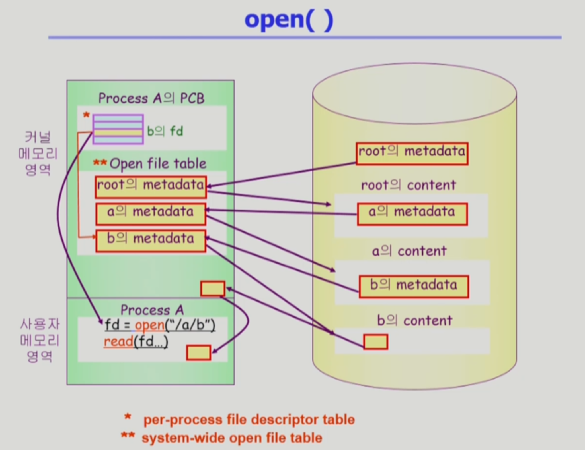
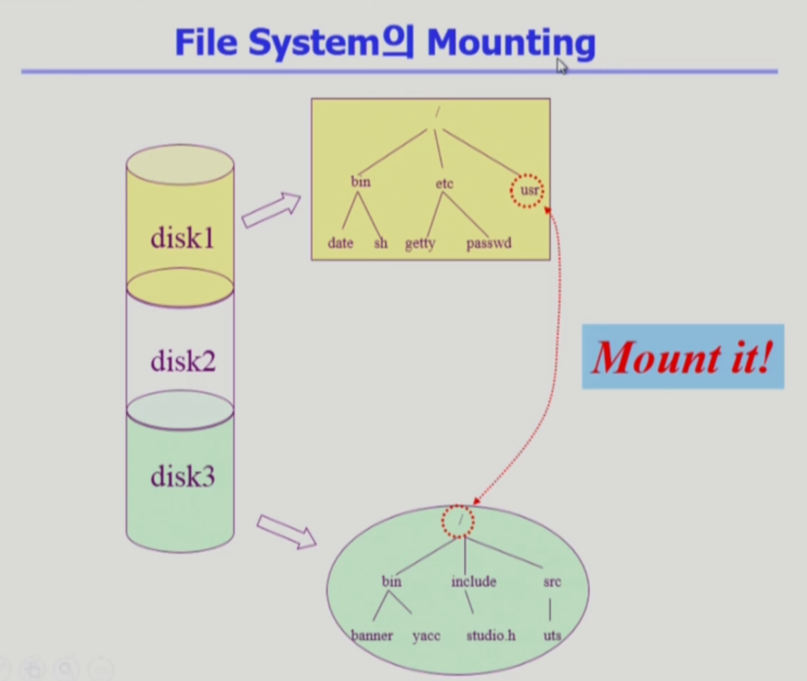

# 파일 입출력

## 파일 시스템

### File and File System

파일이라고 하면 하드 디스크에다 저장하는 단위

메모리는 주소를 통해 접근하는 장치,

파일

- 이름을 통해 접근하는 단위
- 관련 정보를 이름을 가지고 저장하는것
- 비휘발성의 보조 기억장치에 저장(예: 하드디스크)
- 운영체제(리눅스)에서는 여러가지 다른이름의 장치들을 파일을 통해서 관리 (Device Special File)

파일에 대해 정의되는 연산

- create <-> delete

- read, write

- reposition (lseek) : 파일은 여러개의 바이트로 구성되는데 어느 위치를 읽느냐, 쓰느냐를 가리키는 포인터가 있다.

   그래서 보통 파일을 읽으면 파일의 시작부분부터 읽게 되고, 파일을 한번 읽고 나면 파일의 위치 포인터가

   다음 부분을 가리키게 된다.

   다만 필요에 따라 그 다음 부분이 아닌 위치를 읽으려 할 때가 있는데,

   reposition(lseek)는 현재 접근하는 위치를 수정해주는 연산을 의미한다.

- open <-> close : 우선 open 은 파일을 디스크에서 메모리로 내용을 올리는 것이 아닌 파일의 Metadata를 메모리로 올리는 작업을 의미한다. (뒤에서 설명해주신다고 함.)

Metadata(File attribute)

- 데이터에 대한 데이터
- 데이터를 사용하는 사람에게는 보이지 않는다
- 기계(컴퓨터)는 메타데이터의 내용을 이해하고 이를 이용한다.
- 곧, 웹 자료나 다른 것들에 관해 기계가 이해할 수 있는 정보가 메타데이터이다.
- 유형
  1. 기술적 메타데이터
     - 정보의 내용과는 관계가 없으나 그 정보가 어떻게 만들어졌는가를 표현하는 것
  2. 의미적 메타데이터
     - 데이터 자체의 내용적인 측면을 서술한 것

File system

- 파일 자체의 내용 + 파일의 메타데이터 또한 함께 저장
- 디렉토리를 이용하여 계층적으로 관리
- 파일을 어떻게 저장할지, 관리할지

---

### Directory and Logical Disk

Directory

- 디렉토리 밑에 있는 파일들이 어떤건지에 해당하는 정보를 파일의 내용으로하는 파일로
- 파일의 메타데이터 중 일부를 보관하고 있는 일종의 특별한 파일.
- 연산의 유형
  - 위 사진의 Operation
  - Traverse the file system : 파일 시스템 전체를 탐색하는 연산

파일 시스템이 하드디스크에 저장될 텐데

운영체제가 보는 디스크는 논리적인 디스크를 의미하고 다른 말로는 Partition(파티션) 이라고 한다.

파티션은 예를 들어 하나의 물리적 디스크인 하드디스크 하나를 사서 C, D 드라이브를 파티션으로 나누게 되면 각각 논리적인 디스크가 되도록 해준다.

또는 물리적인 디스크를 여러개로 하나의 논리적인 디스크를 구성하기도 한다고 한다.

그래서 물리적 디스크를 파티션으로 구성한 뒤 각각의 파티션에 파일 시스템을 설치하거나 Virtual Swap Area 용도로도 사용할 수 있다.

디스크의 용도

- 크게 두가지로 보는데
  1. File System
  2. Swap Area

---

### Open()

open : 파일의 메타데이터를 메모리로 올리는 것을 의미

메타데이터 중에는 아래의 사진처럼 파일의 저장 위치 또한 있기에 위의 사진의 File Metadata 안에는 파일의 위치, 파일의 내용을 가리키는 포인터 또한 함께 저장되어 있을 것.

초록색 영역이 물리적 영역, 노란색 영역이 논리적인 디스크

초록색 영역은 크게 두개로 나뉜다.

- 사용자 메모리 영역 : 사용자 프로그램이 open(시스템 콜)을 하면
- 커널 메모리 영역 : cpu 제어권이 운영체제로 넘어가서 각 프로세스 별로 관리하기 위한 자료구조인 PCB가 있고 전체 프로그램들이 open 한 파일들이 어떤게 있는지를 관리하는 global한 테이블이 유지되고 있다.

과정 (노란색 영역인 논리적인 디스크의 root의 metadata에서 시작)

1. 루트 디렉토리의 위치는 미리 알려져 있기 때문에 루트 디렉토리의 메타데이터를 메모리로 올리게 된다. (루트를 오픈)

2. 루트의 메타데이터에는 해당 파일의 위치 정보가 있기에 루트 메타데이터를 열어보면 루트 디렉토리의 실제 내용들이 어디에 있는지 찾을 수 있게 되어 노란색 영역으로 넘어가게 된다.

3. 위치로 가게 되면 현재 루트 디렉토리에는 a 라는 디렉토리가 있기에 a의 메타데이터가 있게 되고 해당 메타데이터를 다시 메모리로 올리게 된다.

4. 그러면 다시 a의 메타데이터에는 a 디렉토리의 위치 정보가 있가 담겨 있기에 b에 대한 실제 내용들이 어디에 있는지 찾을 수 있게 되어 다시 노란색 영역으로 넘어가게 되며 시스템 콜인 open이 끝이나지만 시스템 콜이기에 return 값을 받게 된다.

    여기서 return 값은 각 프로세스마다 open 한 메타데이터 포인터를 가지고 있는 배열들이 만들어지고 해당 배열에서 몇번에 인덱스인지를 나타내는 것이 File Descriptor(FD) 가 되어 해당 값을 사용자 프로세스한테 리턴을 하게 된다.

    그래서 사용자는 파일 디스크립터인 숫자(배열의 인덱스)를 가지고 파일들을 read, write 요청을 할 수 있다고 한다.

5. read(fd...) 이것 또한 시스템 콜이기에 CPU가 운영체제로 넘어가게 되어 프로세스 A의 PCB로 가서 해당 디스크립터에 대응하는 파일의 메타데이터 부분을 Open File Table 안에서 찾아간 뒤

    해당 파일의 정보가 디스크의 어디에 있는지를 메타데이터가 알고 있기에 노란색 영역으로 간다.

6. 그 후에는 읽으라고만 했기에 시작 위치부터 읽어오게 되는데 바로 사용자 프로그램한테 전송하는 것이 아니라 운영체제가 자신의 메모리 공간의 일부에 먼저 읽어놓고 해당 내용을 카피해서 사용자 프로그램에게 전달하게 하면 read 작업이 끝나게 된다.

7. 여기서 운영체제가 카피해서 사용자 프로그램에게 전달하는 이유는 다른 프로그램이 동일한 파일의 동일한 위치를 read 시스템 콜을 요청하면 바로 전달 할 수 있게 되기에 카피를 해서 전달하게 된다. 이러한 것을 Buffer Cache(버퍼 캐시)라고 한다.

    버퍼 캐시란

   - 최근 사용된 디스크 블록을 메모리에 캐시하는 것을 말하며,
   - 파일 시스템의 버퍼 캐시는 버퍼 캐시에 내용이 있던지, 없던지 시스템 콜을 통해 CPU가 운영체제에 넘어오게 되어 버퍼 캐시 환경에서는 LRU, LFU 알고리즘을 자연스럽게 사용이 가능하다고 한다. (모든 정보를 운영체제가 알고 있기 때문에 )

그래서 커널을 유지하는 테이블에 대해서 이름이 다르게 주어지는데

파일 디스크립터 테이블은 프로세스마다 가지고 있기에 Per-process file descriptor table 이라고 부르며

파일을 열었으면 프로세스마다 가지고 있는것이 아니라 open된 파일들의 목록들을 한꺼번에 관리하고 있기에 System-wide Open File Talbe이라고 부른다.

---

### File Protection

파일의 접근 권한

- 다양한 유저가 접근을 할 수 있기에 각 파일에 대해 접근 권한이 누구한테 있는지와 어떤 연산이 가능한지를 함께 가지고 있어야 한다.

- 그래서 파일에 대한 접근 권한을 제어하는 방법은 크게 3가지가 된다.

  1.  Access control Matrix : 행과 열을 이용해 파일 이름과, 사용자 이름을 나열한 후 사용자가 각각의 파일에 대해 어떤 권한이 있는지를 표시

      - 다만 행렬을 다 만들다보니 자신만 사용할 수 있는 파일의 경우 다른 사용자는 비어있는 배열로 공간을 낭비하게 되어

      - 주체를 누구로 하는지에 따라 2가지로 나누어 볼 수 있다.

        1. Access control list : 파일을 주체로 하여 누구에게 어떤 권한이 있는지를 표시
        2. Capability : 사용자를 주체로 하여 파일에 대해 어떤 권한이 있는지를 표시

      - 다만 위와 같은 방법으로 해도 오버헤드가 크기에 일반적인 운영체제에서는 아래의 Grouping 을 사용

  2.  Grouping : 각 파일에 대해 세 그룹의 접근 권한(rwx) 를 총 9비트를 이용하여 표시

      - rwx
        - r : read (읽기)
        - w : write (쓰기)
        - x : excute (실행)

      1.  사용자
      2.  사용자와 동일 그룹에 속한 사용자들
      3.  나머지 외부 사용자

      아래 사진중 '-' 의 의미는 일반 파일을 의미

      

  3.  Password

      - 모든 파일마다 password를 두는 방법
      - 단점 : 암기, 관리 문제

---

### FIle System 의 Mounting

위의 사진은 하나의 물리적인 디스크를 파티셔닝을 통해 여러개의 논리적인 디스크로 나눈것을 보여주고 있다.

그리고 각각의 논리적인 디스크는 파일 시스템을 설치하여 사용할 수 있다.

만약 다른 파티션에 설치되어있는 파일 시스템에 접근하려 할 경우 Mounting 이라는 연산을 사용한다.

Mounting

- 루트 파일 시스템의 특정 디렉토리 이름에 또다른 파티션에 있는 파일 시스템을 마운트 했을 경우
- 마운트 된 디렉토리에 접근하게 되면 또다른 파일 시스템의 루트 디렉토리에 접근한 것과 똑같게 되어 서로 다른 파티션에 있는 파일 시스템에 접근할 수 있게 된다.

---

### Access Methods

파일에 접근하는 방법

- 순차 접근 (sequential access) : 카세트 테이프 방식
- 직접 접근 (random access) : LP 판 방식

## 파일 시스템 Implementation 

### File System Implementation

---

- Allocation of File Data in Disk
  - Contiguoust Allocation

    

  - 디스크 상의 연속해서 저장이 되는 방법
  - Directory 내에 파일의 이름이나 위치가 저장되어 있음

  - 단점
    - 내부 조각이 생길 수 있음 (Hole)
    - External Fragmentation
    - File grow가 어려움
      - File 생성시 얼마나 큰 hole을 배당할 것인가?
      - Grow 가능 vs 낭비 (Internal Fragmentation, 미리 할당)
        - 예시) 그림의 14번은 5개가 최대 → 6개는 불가능
  - 장점

    - Fast I/O
      - 한번의 seek/rotation으로 많은 바이트 transfer
        - 예시) 19번 seek하면 6개을 seek 없이 가져옴
      - Realtime file 용으로, 또는 이미 run 중이던 process의 swapping 용
    - Direct access(=random access) 직접 접근 가능

  - Linked Allocation
  
  - 빈 위치면 아무대나 들어갈 수 있음

    - 예시) 9번에 다음 블록의 정보가 저장되어 있음, 더 이상의 다음 블록이 없으면 “-1”

  - 장점
    - External Fragmetation 발생 안 함
  - 단점

    - No random access
      - 직접 접근이 불가능
      - 중간 블록을 보려면 첫번째 블록부터 접근해야함
    - Reliability 문제
      - 한 Sector가 고장나 Pointer가 유실되면 많은 부분을 잃음
    - Pointer를 위한 공간이 block의 일부가 되어 공간 효율성을 떨어뜨림
      - 512 bytes/sector, 4 bytes/pointer
      - 512 byte의 배수로 구성되는데, 4 bytes가 pointer로 사용 → 비효율적

  - 변형

    - File-allocation table (FAT) 파일 시스템
      - Pointer를 별도의 위치에 보관하여 reliability와 공간 효율성 문제 해결

  - Indexed Allocation

    

    - directory의 index block에 파일이 어디에 있는지 위치 정보를 저장
      - 예시) 10번 블록을 찾으려면 Index block을 통해 바로 접근
    - 장점

      - External Fragmentaation이 발생하지 않음
      - Direct access 가능

    - 단점
      - Small File의 경우 공간 낭비 (실제로 많은 file들이 small)
      - Too Large file의 경우 하나의 block으로 index를 저장하기에 부족
        - 해결 방안
          1. Linked Scheme
             - 또 다른 인덱스를 만드는 것
               - 예시) 첫번째 인덱스 블록을 순회하고 없으면 두번째 인덱스 블록을 순회
          2. Multi-Level index
             - 인덱스가 또 다른 인덱스를 가리키는 것

## Free - Space Management

### 디렉토리 구현

***\*Free-Space Management\*\***

비어 있는 블럭은 어떻게 관리하는가?

Bit map or bit vector

비어있는 블럭 = 0

할당된 블럭 = 1

- bit map은 부가적인 공간을 필요로 함
- 연속적인 n개의 free block을 찾는데 효과적

\***\*Linked list\*\***

회색이 비어있는 블럭

빈블럭을 link로 연결

- 연속적인 가용공간을 찾는 것은 쉽지 않다(실제로 사용하긴 쉽지 않다).
- 장점 : 공간의 낭비가 없다.

\***\*Grouping\*\***

- 첫 번째 free block이 n개의 pointer를 가짐
- n-1 pointer는 free data block을 가리킴
- 마지막 pointer가 가리키는 block은 또 다시 n pointer를 가짐

\***\*Counting\*\***

연속적인 빈블럭을 표시하기위해

첫번째 블럭을 표시하고 몇개가 비어있는지 표시

### Directory Implementation 디렉토리 구현

\***\*Linear list\*\***

딕셔너리 처럼 이름, 그이름의 파일의 metadata

\***\*Hash Table\*\***

파일이름을 해쉬함수 적용해서 해쉬함수 결과값만 찾아줌

해쉬함수 특징 : collision 발생

\***\*File의 metadata 보관위치\*\***

일부는 직접가지고있고 일부는 포인터를 두고 다른곳에 보관

\***\*Long file name의 지원\*\***

- file name이 고정 크기의 entry 길이보다 길어지는 경우 entry의 마지막 부분에 이름의 뒷부분이 위치한 곳의 포인터를 두는 방법

## 파일 시스템의 종류

### VFS - Virtual File System

[https://blog.naver.com/PostView.naver?blogId=n_cloudplatform&logNo=222481521174&parentCategoryNo=&categoryNo=11&viewDate=&isShowPopularPosts=false&from=postView](https://blog.naver.com/PostView.naver?blogId=n_cloudplatform&logNo=222481521174&parentCategoryNo=&categoryNo=11&viewDate=&isShowPopularPosts=false&from=postView)

### 레이어가 뭐냐?

MS-DOS 시대에서는 프로세스가 따로 만들어지지 않고 현재 돌고 있는 시스템이 돌다 끝나고 돌다 끝나는 식으로 진행되었습니다. 즉 여러 개의 프로그램을 돌리는 프로세스라는 개념이 없었습니다.

[여러 운영체제 구조](<[https://www.scaler.com/topics/operating-system-structure/](https://www.scaler.com/topics/operating-system-structure/)>)

### Layered Approach 계층 구조 - OS 구조 중 하나

OS의 서로 다른 서비스가 다양한 레이어(계층)으로 분할되는 시스템 구조.

각 레이어에는 수행할 특정 작업이 정의되어 있습니다. 기존의 단순한 구조를 개선하기 위해 만들어진 구조입니다.

제일 바깥에 사용자가 접근할 수 있는 유저 인터페이스 레이어를 두고 계속 레이어를 쌓아놓습니다. 각 레이어는 0번 계층에 HW, N번 계층(최상위 계층)에 유저 인터페이스를 두고 위 계층이 아래 레이어들의 기능을 사용하는 방식으로 이루어집니다.

각 계층의 기능은 분리되어 추상화됩니다. 따라서 디버깅이 더 쉽고 하위 레이어를 모두 디버깅한 후 상위 레이어를 확인합니다. 따라서 모든 하위 레이어는 이미 확인되었을 것이므로 현재 레이어만 확인됩니다.

단, 레이어링 자체는 성능 저하를 일으키며 상위 레이어는 하위 레이어의 기능만 활용하므로 레이어 구성 단계에서 계획을 잘 세워야 합니다.

**장점**

1. **모듈화:**

   이 디자인은 각 레이어가 수행하도록 예약된 작업만 수행하므로 모듈화를 촉진합니다.

2. **쉬운 디버깅:**

   레이어가 분리되어 있기 때문에 디버깅이 매우 쉽습니다. 모든 서비스가 함께 존재하는 모놀리식 시스템과 달리 CPU 스케줄링 계층에서 오류가 발생하여 개발자가 디버그할 특정 계층만 검색할 수 있다고 가정합니다.

3. **쉬운 업데이트 :**

   특정 레이어에서 수정한 사항은 다른 레이어에 영향을 주지 않습니다.

4. **하드웨어에 직접 액세스할 수 없음:**

   하드웨어 계층은 설계에 있는 가장 안쪽 계층입니다. 따라서 사용자가 하드웨어에 직접 접근하는 Simple 시스템과 달리 사용자는 하드웨어의 서비스를 사용할 수 있지만 직접 수정하거나 접근할 수 없습니다.

5. **추상화:**

   모든 레이어는 자체 기능과 관련이 있습니다. 따라서 다른 계층의 기능과 구현은 추상적입니다.

**단점:** 이 시스템은 Monolithic 및 Simple 디자인에 비해 몇 가지 장점이 있지만 다음과 같은 몇 가지 단점도 있습니다.

1. **복잡하고 세심한 구현 :**

   계층이 그 아래 계층의 서비스에 접근할 수 있으므로 계층의 배열은 신중하게 이루어져야 합니다. 예를 들어, 백업 스토리지 계층은 메모리 관리 계층의 서비스를 사용합니다. 따라서 메모리 관리 계층 아래에 유지되어야 합니다. 따라서 뛰어난 모듈성과 함께 복잡한 구현이 수반됩니다.

2. **느린 실행:**

   레이어가 다른 레이어와 상호 작용하기를 원하면 두 개의 상호 작용하는 레이어 사이에 있는 모든 레이어를 통해 이동해야 하는 요청을 보냅니다. 따라서 이보다 빠른 Monolithic 시스템과 달리 응답 시간이 늘어납니다. 따라서 레이어 수의 증가는 매우 비효율적인 설계로 이어질 수 있습니다.

   

   

   

   

   

   ### NFS

   [https://www.youtube.com/watch?v=RJY0PAXYgHY](https://www.youtube.com/watch?v=RJY0PAXYgHY)

   [https://sungwookkang.com/208](https://sungwookkang.com/208)

   

   

   네트워크 상에서 파일 시스템을 공유하도록 설계된 파일 시스템

   LAN을 거쳐 원격 파일을 접근하기 위한 소프트웨어 시스템의 구현과 명세 모두를 말함

   통신은 TCP 또는 UDP 두 가지 중 하나를 사용.

   다른 서버의 파티션을 마치 내 로컬 영역인 것처럼 네트워크를 이용하여 사용할 수 있음.

클라이언트는 정규 시스템 호출을 통해서 연산을 시작한다.
운영체제 계층은 이 호출을 적절한 vnode에 대한 VFS 연산으로 매핑 한다.
VFS 계층은 이 파일을 원격 파일로 인식하고 적절한 NFS 프로시저를 실행한다.
하나의 RPC 호출이 원격 서버 내의 NFS 서비스 계층에 대해 행해진다.
이 호출은 원격 시스템 상의 VFS 계층으로 다시 들어가고 원격 시스템은
그 호출이 지역적임을 반견하며 적절한 파일 시스템 연산을 실행 한다.
이 경로를 되돌아가 결과를 반환한다.

### RPC (Remote Procedure Call)

[https://velog.io/@jakeseo_me/RPC란](https://velog.io/@jakeseo_me/RPC%EB%9E%80)

상호 미리 정의된 규격을 준수해 원격에서 동작하고 있는 프로세스에 포함된 함수를 호출 가능하게 하는 프로세스 간 통신 기술

일반적으로 프로세스는 자신의 주소 공간 안에 존재하는 함수를 호출해 실행이 가능하지만,

RPC를 이용한다면 다른 주소공간에서 동작하는 프로세스의 함수를 실행할 수 있게 됩니다.

**※ 함수 vs 프로시저**

- **함수(Function)** : **Input에 따른 Output의 발생**을 목적으로 한다. 따라서 **Return값을 필수**로 가져야 하며, **Client단**에서 처리되기 때문에 주로 **간단한 계산 및 수치 등을 도출**할 때 사용한다.
- **프로시저(Procedure)** : 여러 **쿼리**를 한번에 수행하는 것. **서버로 보내서 처리,** 리턴값 선택, 리턴값 여러개 반환가능. Return값이 없을수도 있으며, 서버에 보내서 처리되기 때문에 **함수보다 큰 단위의 실행, 프로세싱** 등을 할 때 사용한다.

1. IDL(Interface Definition Language) 을 사용하여 서버의 호출 규약을 정의한다

함수명, 인자, 반환값에 대한 데이터형이 정의된 IDL 파일을 rpcgen 컴파일러를 이용하여 stub 코드를 자동으로 생성한다.

\* **IDL(Interface Definition Language)**
 : 인터페이스 정의 언어. 어느 한 언어에 국한되지 않는 언어 중립적인 방법으로 인터페이스를 표현함으로써, **구현 언어(C, C++, Java 등)가 아닌 정의 언어**로, **구현 언어로의 매핑(mapping)을 지원.**

2. Stub는 원시소스코드 (C 코드등) 형태로 만들어지므로 클라이언트,서버 프로그램에 포함하여 빌드한다

3. 클라이언트 프로그램 입장에서 자신의 프로세스 주소공간의 함수를 호출하는 것과 동일하게 stub 에 정의된 함수를 호출할 수 있게 된다

4. stub 코드는 데이터형을 XDR(eXternal Data Representation) 형식으로 변환하여 RPC 호출을 실행한다.

-XDR 변환 이유는 기본 데이터 타입(정수형, 부동소수점 등)에 대한 메모리 저장방식(리틀엔디안, 빅엔디안)이 CPU 아키텍쳐별로 다르며, 네트워크 전송과정에서 바이트 전송 순서를 보장하기 위함이다.

5. 서버는 수신된 함수/프로시저 호출에 대한 처리 완료 후, 결과값을 XDR 변환하여 반환한다.

6. 최종적으로 클라이언트 프로그램은 서버의 결과값을 반환받는다.

**[RPC 장단점]**

- 장점

1. 고유 프로그램 개발 집중 가능 (하부 네트워크 프로토콜에 신경쓰지 않아도 되기 때문에)

2. 프로세스간 통신 기능을 비교적 쉽게 구현 가능하고 정교한 제어가 가능

- 단점

1. 호출 실행과 반환시간이 보장되지 않음 (네트워크 구간을 통하여 RPC통신을 하는 경우 네트워크 끊기는 경우 치명적 문제 발생)

2. 보안이 보장되지 않음

### 페이지 캐시, 버퍼 캐시

[https://brunch.co.kr/@alden/25](https://brunch.co.kr/@alden/25)

[https://systemdesigner.tistory.com/87](https://systemdesigner.tistory.com/87)

## Memory mapped I/O

### 💡 Memory mapped File

---

프로그램에서 파일을 read, write 할 때마다 디스크까지 접근하는 것이 아니라,

파일이 디스크 메모리에 있다면 접근 속도가 향상되지 않을까?

→페이지(page) 개념을 활용한 MMF ( Memory mapped File)

File 의 일부 메모리 공간을 프로세스의 가상 메모리에 연결

최신의 data는 메모리가 갖고 있음,

주기적으로, or 어떤 상황 발생 시 File에 반영

### 💡 Memory-mapped I/O & I/O mapped I/O

---

→ CPU가 I/O 장치에 접속하는 방식

### Memory-mapped I/O

I/O와 메모리의 주소 공간을 분리하지 않고 하나의 메모리 공간에 취급하여 배치하는 방식.

- I/O가 차지하는 만큼 메모리 용량은 감소한다.
- CPU의 입장에서는 메모리와 I/O가 동일한 외부기기로 간주되므로 같은 명령어로 접근한다.
- 내부 로직이 덜 필요하므로, CPU를 만들 때 더 저렴하고, 빠르고, 쉽게 만들 수 있다.
- 임베디드 시스템에서 주로 사용한다.

### I/O Mapped I/O

메모리와 I/O의 주소 공간을 분리하여 접근 하는 방식

- I/O를 사용하더라도 메모리 용량은 감소하지 않는다.
- I/O를 액세스하기 위해 다른 기계어 명령어가 필요하다.
- 특히 Addressing 능력이 제한된 CPU에서 메모리 주소 영역 전체를 사용할 수 있어 효과적이다.
- I/O 장치 추가나 삭제가 빈번한 PC환경에서 주로 사용한다.
- 주로 인텔 계열 프로세서(x86)에서 채용된다. (x86의 ‘포트’)
- 하드웨어 구성이 비교적 복잡하다.
