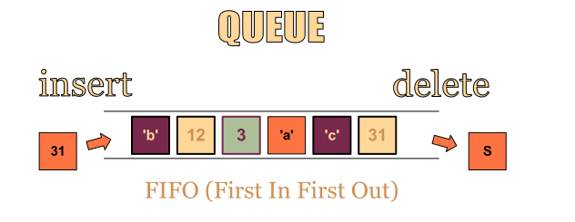
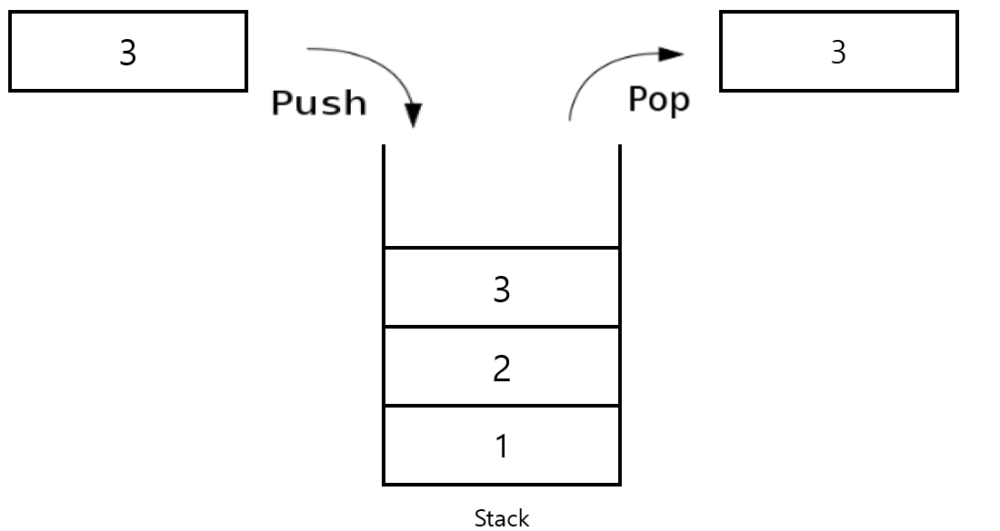
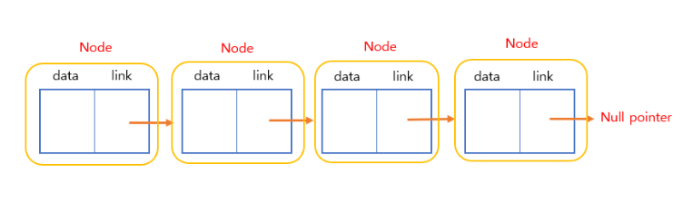
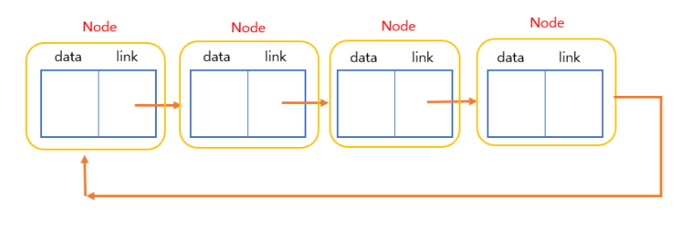
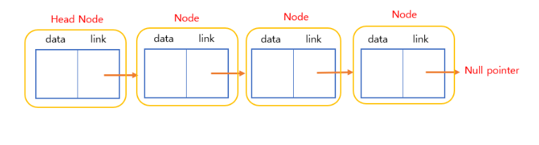

# 프로세스 관리


### 자료구조

우선 자료구조란?

여러 데이터들의 묶음을 저장하고, 사용하는 방법을 정의한 것.

### 데이터란?

1. 문자, 숫자, 소리, 그림, 영상 등 실생활을 구성하고 있는 모든 값.
2. 데이터 자체만으로 어떤 정보를 가지기 힘들기에 분석하고 정리하여 활용해야만 의미를 가질 수 있다.
    - 예를 들어 나이라는 데이터만 알고 있다면,
    - 사람의 나이인지, 강아지의 나이인지, 나무의 나이인지 알 수 없기 때문이다.
3. 분석하고 정리하여 활용해야만 의미를 가질 수 있다.
4. 사용하려는 목적에 따라 형태를 구분하고, 분류하여 사용한다.

상황에 따른 예시

1. 번호를 다 알지 않아도, 이름을 아는 것만으로도 전화를 할 수 있는 방법은 무엇이 있을까?
2. 웹 브라우저에서 뒤로/앞으로 가는 방법은 무엇이 잇을까?
3. 게임 매칭을 잡을 때, 수많은 사람들을 통제하는 방법엔 무엇이 있을까?

위와 같은 상황을 해결하기 위한 방법인

**데이터를 효율적으로 다룰 수 있는 방법** 즉 ***자료구조***라는 이름을 붙였다고 합니다.

자료구조에서 자주 등장하는 네가지는 Stack, Queue, Tree, Graph 가 있습니다.


---

### Queue (큐)

queue란 ?

FIFO (First In First Out) 으로 선입선출의 특징을 가지는 자료 구조로 한쪽 끝에서만 삽입이 이루어지고, 다른 한쪽 끝에서는 삭제 연산만 이루어지는 유한 순서 리스트입니다. 즉 가장 처음에 들어온 데이터가 먼저 큐 공간에서 제거가 됩니다.



실생활에서 쓰이는 큐의 예시

1. 티켓 판매부스에서 줄을 서서 기다리는 사람들
2. 한줄로 나란히 가야만하는 차들
3. 컴퓨터 운영체제의 테스크 스케줄링

---

### 큐의 특징과 구성 및 구현방법


큐의 특징

구조상 먼저 삽입된 item이 먼저 삭제가 이루어진다.

큐의 주요 동작

- enQueue() : 큐에 데이터를 넣는다.
- deQueue() : 큐에서 데이터를 뺴낸다.
- isEmpty() : 큐가 비어있는지 확인한다.
- isFull() : 큐가 꽉 차있는지 확인한다.
- peek() : 앞에있는 원소를 삭제하지 않고 반환한다.

큐의 표현

- 순차표현
    - 1차원 배열을 이용한 순차표현으로 인텍스를 값으로 가지는 front, rear라는 두개의 변수와
    - 큐의 사이즈를 나타내는 n이라는 변수를 사용한다.
    - fornt, rear를 -1로 초기화 하여 큐가 empty 임을 나타낸다. (front==rear 일 때 큐는 공백 상태)
    - rear에서 삽입이 되므로 rear가 점차 증가하여 rear==n-1의 경우 큐는 full 상태

큐의 문제점

큐에 삽입이 되며 점차 rear가 증가하게 되며 결국 full 상태가 되었을 때에 첫번쨰 원소의 위치를 큐의 [0]번째 인덱스부터 위치되게 한뒤

이것을 기준으로 rear의 위치도 다시 정해주어야 하기 때문에 큐 원소 이동에 따른 지연시간이 발생되어서 순차 표현 큐는 많은 비용을 발생하게 된다.

그래서 해결책으로는 원형큐를 사용하게 되는데

간단히 정리하자면 원형큐는 큐의 순차표현시 원형큐를 이용하게 되면 원소의 이동없이 이용할 수 있다고 하며

front와 rear를 0으로 초기화 한후 fornt와 rear가 같은 값일 경우 큐는 비어있다는 뜻이 되고

삽입시 rear 를 1씩 증가하게 되며 그 자리에 item을 삽입하고 full 상태를 검사하기 위해서 rear를 증가시켰을 때 front와 같게 된다면

rear+1 == front가 full 로 처리하면 되기에 그렇다면 항상 큐의 front가 가리키는 인덱스는 비어있는 상태로 유지되고 이것을 통해 full과 empty를 구분하게 된다고 합니다.

---

### Stack (스택)

stack (스택)이란?

한 쪽 끝에서만 자료를 넣고 뺄 수 있는 LIFO (Last In First Out) 형식의 자료 구조



스택의 연산

- pop(): 스택에서 가장 위에 있는 항목을 제거한다.
- push(item): item 하나를 스택의 가장 윗 부분에 추가한다.
- peek(): 스택의 가장 위에 있는 항목을 반환한다.
- isEmpty(): 스택이 비어 있을 때에 true를 반환한다.

스택의 구현

- 배열 기반으로 구현
- 동적 배열을 기반으로 구현
- 연결 리스트로 구현

---

### Linked List (연결 리스트)

Linked List (연결 리스트) 란?

시작(주소) -> 연결(link)-> 끝(null pointer circluar) 으로 구성되며 연결 리스트는 여러개의 노드를 연결함으로써 데이터를 표현가능하다.

노드는 자료를 가진 data 부분과 다음 노드를 연결하는 link 부분으로 나뉘어져 있다.

배열과 연결 리스트 차이

배열 : 정적 할당으로 정해진 메모리 크기를 미리 할당 하기 때문에 오버플로우나 공간 낭비가 발생 가능하다.

연결 리스트 : 동적 할당으로 필요한 만큼 메모리를 동적으로 할당 받아서 만든다.

연결리스트의 여러 종류

- Singly linked list : 기본적인 연결 리스트
  
    
    
- Circularly linked list : 마지막 노드가 다시 처음 노드를 가리킴
  
  
    
    
- List with a header node : 노드의 가장 앞에 head node를 넣어 삽입, 삭제 등 연산에서 이점을 만듬.
  
    
    
- Doubly linked list : 양방향 연결리스트로 노드를 연결하는 link가 앞 뒤로 존재해서 앞 뒤 노드들 간의 관계를 바로 확인할 수 있다.


---

### 프로세스의 상태

[05-1 프로세스의 개념과 상태](https://www.youtube.com/watch?v=CHuSozSvKyk)

> **프로세스**

- Process is a program in execution
- 실행 중인 프로그램을 프로세스라고 한다.
- 프로그램을 실행시키면 프로세스가 생성된다.


---

- **프로세스의 문맥 (context)**
    - 현재의 어떤 시점을 놓고 프로세스가 어떤 상태인지 나타내는 개념 ⇒ 시간에 따라 바뀌는 개념
    - 프로세스를 제어를 위한 다양한 정보 (PCB에 저장되는 정보)
    
    - CPU 수행 상태를 나타내는 하드웨어 문맥 (CPU 시점)
        - Program Counter
        - 각종 register
    - 프로세서의 주소 공간 (메모리 시점)
        - 현재 시점에 프로세스의 주소 공간에 어떤 내용이 들어있는가?
        - code, data, stack
    - 프로세스 관련 커널 자료 구조 (운영체제 시점)
        - 운영체제는 프로세스가 하나 생길 때마다 그 프로세스를 관리하기 위해 자신의 주소공간 (커널 주소공간)의 데이터 영역에 각 프로세서의 PCB를 만든다.
        - PCB (Process Control Block)
        - Kernel stack
        

---

- **프로세스 상태**


- 프로세스는 상태(state)가 변경되며 수행된다.
- 많은 프로세스가 하나의 CPU를 공유하기 위해 필요한 개념
- 하나의 CPU는 여러 개의 프로세스를 동시에 실행시키지는 못한다.
- 운영체제는 멀티태스킹이라는 기법을 통해 동시에 실행시키는 것 처럼 보이게 만든다.

---

- **프로세스 상태의 종류**

- **New**
    - 프로세스가 생성되는 중인 상태 (프로세스 X)
    
- **Running**
    - CPU를 잡고 명령(instructuon)을 수행중인 상태
    
- **Ready**
    - CPU를 기다리는 상태 (메모리 등 다른 조건을 모두 만족하고)
    - CPU는 하나 밖에 없기 때문에 기다리는 상태
    - CPU만 주면 바로 실행된다. / 메모리에 존재한다.
    
- **Blocked (wait, sleep)**
    - CPU를 주어도 당장 instruction을 수행할 수 없는 상태
    - Process 자신이 요청한 event(예: I/O)가 즉시 만족되지 않아 이를 기다리는 상태
    - (예) 디스크에서 file을 읽어와야 하는 경우
    - 자신이 요청한 event가 만족되면 Ready
    
- **Suspended (stopped)**
    - 외부적인 이유로 프로세스의 수행이 정지된 상태
    - 프로세스는 통째로 디스크에 swap out 된다.
    - (예) 사용자가 프로그램을 일시 정지시킨 경우 (break key)
        - 시스템이 여러 이유로 프로세스를 잠시 중단시킴
        - 메모리에 너무 많은 프로세스가 올라와 있을 때
    - Inactive, 외부에서 resume해 주어야 Active
    
- **Terminated**
    - 수행(execution)이 끝난 상태 (프로세스 X)
    - 프로세스가 종료될 때 나머지 일이 남은 경우

- PCB를 통해 프로세스가 어떤 상태인지 확인하고 있다.

예) Disk I/O가 event가 끝났다.

→ Disk 컨트롤러가 cpu에게 인터럽트를 발생시키고 운영체제에게 넘어감

→ disk I/O queue는 blocked 상태에서 ready로 바꾼다.


- admitted
    - 운영체제의 승낙을 받는다.

- ready → running
    - 단 한 개의 프로세스만 들어 간다. (scheduler의 정책에 따라 선택)

- running
    - 끝날때 까지 계속 실행되는 것이 아니라
    - 3가지 조건에 따라 멈추게 된다.
    
    1. exit
        - 종료
        
    2. I/O or event wait 
        - 외부 장치에 대해서 입출력을 요구
        - 외부 장치가 동작하는 시간은 CPU 동작 시간 느리기 때문에 CPU가 waiting 상태로 빠지게 되고 CPU를 다른 프로세스에게 할당하는 기회를 가진다.
        - I/O 요청이 있게되면 스스로 waiting으로 빠지고 언제 waiting이 끝날지 알 수가 없다. 실행되고 있지 않기 때문
        - 그것을 알려주는 것이 I/O or event completion = Interrupt
        - I/O completion interupt가 발생하면 waiting에서 ready로 간다. ready 상태에서 이미 많은 프로세스 들이 기다리고 있기때문에 running으로 바로 가지 않는다.
        - 오래걸리는 작업에 들어가는 상태
        
    3. Timer interrupt
        - 프로세스를 계속 실행해야 하는 경우, I/O가 아닌 경우에도 불구하고 벗어나는 경우가 있다.
        - 운영체제 스케줄러가 일정한 시간이 지나면 타이머 인터럽트가 발생
        - CPU는 ready큐를 번갈아가면서 실행하기 때문에 할당 시간 만료
        - 현재 실행중인 프로세스를 강제로 중지를 시키고 종료가 아니고 ready 상태로 빼놓는다.
        - 중지된 프로세스 대신 기다리고 있는 프로세스 중 하나를 다시 running

---

> **PCB (Process Control Block, 프로세스 제어 블록)**
> 

- 운영체제가 각 프로세스를 관리하기 위해 프로세스 당 유지하는 정보 → 프로세스 당 하나씩 존재
- 문맥을 이어가기 위한 상태를 저장
- wating → ready로 가면 어디까지 진행했는지에 대한 정보

- PCB의 구성 요소 (구조체로 유지)
    - OS가 관리상 사용하는 정보
        - Process state, Process ID
        - scheduling, information, priority
    - CPU 수행 관련 하드웨어 값
        - Program Counter, Register

- CPU가 실행 즉 연산을 할때, 상태가 변화하는데 그 정보는 Register에 저장되어있다.
  
    

---

> **문맥 교환 (Context Switch)**
> 

- **CPU를 한 프로세스에서 다른 프로세스로 넘겨주는 과정**
- CPU가 다른 프로세스에게 넘어갈 때 운영체제는 다음을 수행
    - CPU를 내어주는 프로세스의 상태를 그 프로세서의 PCB에 저장
    - CPU를 새롭게 얻는 프로세스의 상태를 PCB에서 읽어옴
    - 스케줄러가 CPU를 다른 프로세스에게 할당하려고 할때 현재 프로세스의 문맥을 PCB에 저장하고 새로운 프로세스 PCB로 교체하는 것

- System call이나 Interrupt 발생시 반드시 context switch가 일어나는 것은 아님


- (1)의 경우에도 CPU 수행 정보 등 context의 일부(레지스터 등)를 PCB에 save해야 함
- 문맥교환을 하는 (2)의 경우 그 부담이 훨씬 큼 (eg. cache memory flush)

- 하드웨어 인터럽트 (Interrupt)
    - Timer Interrupt 또는 I/O 작업 때문에 CPU 사용권을 넘기는 경우에만 문맥교환이 일어난다고 볼 수 있다.
- 소프트웨어 인터럽트 (Trap)
    - 동일한 프로세스가 CPU를 가져갈 확률이 높다.

---

> **Scheduling Queues (스케줄링 큐)**

- **Queue (큐)**
    - 선입 선출의 자료 구조
    
- 프로세스를 스케줄링하기 위한 큐
- 운영체제는 프로세스들을 큐에 넣고 관리함

1. **Job Queue**
    - 현재 시스템 내에 있는 모든 프로세스의 집합
    - Reday Queue, Device Queue의 합집합
    - 실행할 작업을 포함하는 Long-term scheduler (장기 스케줄러 or job scheduler) 소프트웨어에 의해 유지되는 데이터 구조
    - Time Sharing System 같은 운영체제에서 Ready queue와 동일시 여기기도 한다.
    
2. **Ready Queue**
    - 현재 메모리 내에 있으면서 CPU를 잡아서 실행되기를 기다리는 프로세스의 집합
    - CPU를 만나기만하면 즉시 연산 가능하도록 준비된 프로세스의 집합
    
3. **Device Queues**
    - I/O device의 처리를 기다리는 프로세스의 집합
    
- 프로세스들은 각 큐들을 오가며 수행된다.
- 큐 안에 줄지어 있는 각각의 PCB들은 포인터를 통해 연결되어 있다.

---

> **스케줄러 (Scheduler)**
> 

- **운영체제의 요소 중에 정말 중요함**
- 둘 이상의 프로세스가 적절히 실행되도록 컨트롤
- 여러 개의 프로그램이 동시에 실행되는 것처럼 규칙을 부여하는 소프트웨어 모듈
- 어떤 프로세스에 CPU와 메모리를 할당할지 결정하는 것

1. **Long-term scheduler (장기 스케줄러 or job scheduler)**
    - 시작 프로세스 중 어떤 것들을 ready queue로 보낼지 결정
    - 프로세스에 memory(및 각종 자원)을 주는 문제
    - Degree of Multiprogramming (메모리에 올라간 프로그램 수) 을 제어
    - Time Sharing System에는 보통 장기 스케줄러가 없음 (무조건 ready)
    - (우리가 다루는 운영체제에서는 보통 없음)
    - 하드 드라이브에서 어떤 프로세스를 준비큐에 넣을지 결정하는 스케줄러
    
    - 프로세스 상태도에서 admitted / 메모리에 들어오도록 허락
    
2. **Short-term scheduler (단기 스케줄러 or CPU scheduler)**
    - 어떤 프로세스를 다음번에 running 시킬지 결정
    - 프로세스에 CPU를 주는 문제
    - 충분히 빨라야 함 (ms 단위)
    - CPU를 누구에게 얼마나 줄 것인가?
    - 엄청 자주 호출이 된다.
    - Time inturrupt 걸릴 때마다 단기 스케줄러 호출
    
3. **Medium-term scheduler (중기 스케줄러 or Swapper)**
    - 여유 공간 마련을 위해 프로세스를 통째로 메모리에 디스크로 쫓아냄
    - 프로세스에게서 memory를 뺏는 문제
    - Degree of Multiprogramming (메모리에 올라간 프로그램 수) 을 제어
    - 메모리를 쓰다가 뺏긴 상태, Suspended (Stopped)
    
    장기 스케줄러가 없기 때문에 메모리 경합이 심해서 성능이 저하된다.
    


 

본인 코드를 실행할 때는 Running (user mode)

**Q. Blocked(Wait/Sleep) vs. Suspended(Stopped)**

A. Blocked는 언제든 CPU를 다시 만나서 연산되고자하는 의지를 여전히 보유 ⇒ 잠시 다른 프로세스에게 양보한 것

A. Suspended는 외부의 강제로 메모리에서 해제된 상태

---

### PCB


프로세스를 제어하는 블록! 단일 cpu가 여러 프로세스를 처리할 수 있는 방법입니다.

- 프로세스 관리에 필요한 정보를 저장하는 공간
- PCB는 프로세스의 중요한 정보를 포함해 일반 사용자는 접근하지 못하는 보호된 메모리 영역에 존재한다.
- 프로세스 생성 시 커널 내부에 함께 생성됨. 얘네로 프로세스를 관리하니 커널을 갖고 있어야

프로그램 실행 → 프로세스 생성 → 프로세스 주소공간(코드,데이터,스택) 생성 →이 프로세스의 메타데이터들이 PCB에 저장


- 운영체제가 각 프로세스를 관리하기 위해 프로세스 당 유지하는 정보(프로세스 개별)
- **다음의 구성요소(구조체로 유지)**
    - OS가 관리상 사용하는 정보 → ready, blocked, running…
        - Process state, Process ID (PID - 프로세스 고유 식별 번호)
        - scheduling information, priority
          
            → 스케줄링 우선순위 정보…우선순위 계산하는 룰이 있어서 그에 따라 우선순위 높은 친구에게 cpu 다음으로 사용 권한 제공
            
            → 스케줄링 대기열에 대한 포인터
        
    - CPU 수행 관련 하드웨어 값
        - Program Counter(PC) → 프로세스에서 실행되어야 하는 다음 명령어 주소 가리킴
        - registers→프로세스에서 사용중인 레지스터 내용
            - 인덱스 레지스터, 스택 포인터, 범용 레지스터 등….
    - 메모리 관련 → 어떤 메모리를 할당받았는가?
        - Code, Data, Stack의 위치 정보
        - Page table, segment table
    - 파일 관련 → 어떤 파일을 오픈하고 있는지.  어떤 입출력 장치를 할당 받았는지
        - Open file descriptors ….
    - 문맥 저장 영역(context save area)
        - 프로세스의 레지스터 상태를 저장하는 공간
    - 계정 정보(다중 사용자의 경우 각각의 계정을 구분해야하므로)
        - 자원 사용 시간 등을 관리(사용중인 CPU, 시간, 메모리)
        
        → 실행을 위해 특정 프로세스에서 사용중인 모든 리소스에 대한 계정을 유지
        

 

:: PCB 정보는 OS별로 다르며, PCB의 참조 및 갱신 속도가 OS의 성능을 결정짓는 중요한 요소 중 하나입니다.

현대의 리눅스같은 운영체제는 프로세스 별로 우선순위를 계산하고 높은 친구에게 우선순위를 넘겨주는 식으로 되어 있습니다. (시스템과 관련된 프로세스 우선순위가 높다거나…하는 식으로 책정)

→ PCB에서 관리되고 있습니다.


커널의 메모리 안에서 관리되는 PC와 레지스터 정보…. 왜? 갖고 있나

매번 CPU 얻었다가 뺏겼다가 하기 때문에 뺏길때 진행중인 프로세스가 어디까지 진행했는지 컨텍스트를 저장을 해놔야 다음번에 CPU 얻었을 때 해당 컨텍스트 다음 지점부터 실행이 가능

**PCB 관리 방식**

링크드 리스트(연결 리스트)로 관리됩니다. 따라서 삽입 삭제가 용이하며 프로세스가 생성되면 해당 PCB가 생성되고, 프로세스가 완료되면 제거됩니다.


---

### Thread 


1. **프로그램 (Program)**
   
    : 어떤 작업을 위해 운영체제 위에서 실행할 수 있는 파일
    
     ex - 웹 브라우저, 카카오톡 등
    
2. **프로세스 (Process)**
   
    : 운영 체제 위에서 **실행중인** 프로그램
    
      프로그램 명령어와 데이터들이 메모리에 올라오고 실행 중 또는 실행 대기 중인 상태
    
3. **프로세서 (Processor)**
   
    : 프로세스가 **동작**될 수 있도록 하는 하드웨어(=CPU)
    
    (* 동작 : 프로그램의 자원들이 메모리에 올라오고, 실행 되어야 할 코드의 메모리 주소를 CPU의 레지스터로 올리는 것)
    
- **멀티 태스킹 (동시성)**
  
    ### CPU(프로세서)는 **한순간에 하나의 프로세스**만 실행할 수 있음
    
    운영체제가 짧은 시간에 여러 프로세스를 교체하고 있기 때문에, 여러 개의 작업이 실행되고 있다고 느끼는 것
    
- **프로세스의 주소 공간**
  
    : 메모리 공간을 확보
    
    - Stack : 호출된 함수, 지역변수 등 임시 데이터
    - Heap : 동적으로 생긴 데이터
    - Data : 전역 변수
    - Code : 프로그램의 코드
    
- **PCB**
  
    프로세스를 제어하기 위한 정보 모음
    
    ex - 프로세스 식별자(PID), 프로세스 상태, 다음 실행할 명령어의 주소, 이전에 작업하던 내용 (레지스터), CPU 스케줄링 정보, 프로세스의 주소공간 등
    
- **Context Switching**
  
    Task → Task 전환될 때, 지금 작업하고 있는 Task 어디까지 진행 되었는 지 저장, 이 다음 불러올 Task 어디부터 진행하면 되는 지 로딩
    

### 프로세스 vs 스레드

- **멀티 프로세스**
  
    프로그램의 작업 흐름에 갈래가 생기는 경우 여러 개의 프로세스로 하나의 작업을 구성
    
    
    
    - 단점
        1. 각 프로세스가 각각의 메모리 영역을 따로 가지고 있기 때문에 context switching 과정에서 비효율 발생
        2. 다른 프로세스의 정보를 사용하기 위해 통신이 필요함
        
    
    (예시) 
    
    CPU = 스터디 룸
    
    Task = 개인
    
    Data = 물품
    
- **멀티 스레드**
  
    멀티 프로세스의 비효율을 해결하기 위해 Code, Data, Heap 영역 공유
    
     Stack 영역, PCB의 프로그램 카운터와 레지스터 값은 각각 따로 가짐
    
    
    
    - 멀티 스레드 주의점
        1. 디버깅이 까다로움
        2. 한 프로세스 안의 스레드가 문제가 생기면 같은 프로세스 안의 스레드도 문제가 생김
        3. 같은 데이터를 공유하기에 , 데이터 동기화에 신경 써야함
        
    - 스레드 구현 (파이썬)
    
    ```python
    import threading
    from datetime import datetime
    
    # threading 모듈의 Thread 클래스 상속
    class Thread1(threading.Thread) :
        def run(self) -> None:
            for i in range(1000) :
                now = datetime.now()
                print(now)
    
    class Thread2(threading.Thread) :
        def run(self) -> None:
            for i in range(10000) :
                print(i)
    
    t1 = Thread1()
    t1.start()
    t2 = Thread2()
    #t2.daemon = True    : True -> 스레드 동시에 끝남
    t2.start()
    ```
    

---

### 프로세스 관리

### **프로세스 생성**

- 운영체제가 최초의 프로세스를 생성하면, 이미 존재하는 프로세스가 다른 프로세스를 복제 생성한다. 이때 기존 프로세스를 부모 프로세스라 하고, 새로 생긴 프로세스를 자식 프로세스라고 부른다.
  
    - OS가 시스템 콜(fork())을 받아서 만들어준다
    
- 프로세스의 트리 (계층 구조)를 형성한다.

### 프로세스는 자원을 필요로 한다.

### (thread가 자원을 공유하는것은 프로세스 내부에서 이루어지는것)

- 운영체제에게 받는다.
- 부모와 공유한다.
  
    (특별한 경우에 해당하며 기본적으로 프로세스 간에는 자원을 공유하지 않는다)
    
- 자원의 공유
    - 부모와 자식이 모든 자원을 공유하는 모델
    - 일부를 공유하는 모델
    - 전혀 공유하지 않는 모델
- 수행 (Execution)
    - 부모와 자식이 공존하며 수행하는 모델 (이때는 부모와 자식이 CPU를 획득하기 위해 경쟁하는 관계가 됨)
    - 자식이 종료(terminate)될 때까지 부모가 기다리는(wait) 모델

### **주소 공간 (Address space)**

- 자식은 부모의 공간을 복사한다. (프로세스 ID를 제외한 운영체제 커널 내의 정보와 주소 공간의 정보 ex)전역변수, 부모 프로세스의 프로그램 카운터부터 실행 등)
- 자식은 그 공간에 새로운 프로그램을 올린다.
- 유닉스의 예
    - `fork()` 시스템 콜이 새로운 프로세스를 생성한다. 부모를 그대로 복사하고 주소 공간을 할당한다.
    - `fork()` 다음에 이어지는 `exec()` 시스템 콜을 통해 새로운 프로그램으로 주소 공간을 덮어 씌운다.

### **프로세스 종료 (Process Termination)**

- 프로세스가 마지막 명령을 수행한 후 운영체제에게 이를 알려준다. `exit()`
    - 자식이 부모에게 out data를 보낸다.
    - 프로세스의 각종 자원이 운영체제에 반납된다.
- 부모 프로세스가 자식의 수행을 종료한다. `abort()`
    - 자식이 할당 자원의 한계치를 넘어선다.
    - 자식에게 할당된 task가 더 이상 필요하지 않는다.
    - 부모가 종료 `exit()` 한다.
        - 운영체제는 부모 프로세스가 종료하는 경우 자식이 더 이상 수행되도록 주지 않는다.
        - 단계적인 종료

`exit()` 는 프로그램이 끝날 때 운영체제에게 자신이 끝났음을 알리는 자발적 종료에 해당하는 시스템 콜이고, `abort()` 는 부모 프로세스가 자식 프로세스의 수행을 중단하는 비자발적 종료에 해당하는 시스템 콜이다.

### **각종 시스템 콜**

### **`fork()` 시스템 콜 (복사)**

**개념**

- 운영체제는 자식 프로세스의 생성을 위해 `fork()` 시스템 콜을 제공한다.
- 프로세스가 해당 시스템 콜을 호출하면 CPU의 제어권이 커널로 넘어가고, 커널은 `fork()` 를 호출한 프로세스를 복제하여 자식 프로세스를 생성한다.
- `fork()` 를 수행하면 부모 프로세스의 주소 공간을 비롯해 프로그램 카운터 등 레지스터 상태, PCB 및 커널 스택 등 모든 문맥을 그대로 복제해 자식 프로세스의 문맥을 형성한다.
- 따라서 자식 프로세스는 부모 프로세스의 처음부터 수행하지 않고, 부모 프로세스가 현재 수행한 시점부터 수행하게 된다.
- 다만 자식 프로세스와 부모 프로세스의 식별자는 다르다. (운영체제가 프로세스를 관리해야 하기 때문

**소스 코드**


- 부모 프로세스가 메인 함수의 첫 번째 줄부터 한 줄씩 코드를 수행하다가 `fork()` 라인에 이르면 자신과 똑같은 프로세스를 하나 생성한다.
- 이때 `fork()` 라인까지 수행했다는 기억조차도 똑같은 자식 프로세스가 생성된다.

- 그래서 복제된 프로세스는 자기가 복제본이 아니라 원본이며, 자기를 복제해서 다른 복제본을 생성했다는 기억을 갖게 된다.
- 다만 이 자식 프로세스가 복제된 프로세스라는 사실을 알 수 있는 단서가 있는데, `fork()` 의 결과 값으로 0을 반환한다. (진짜 부모 프로세스는 0보다 큰 값을 호출한다.)

### **`exec()` 시스템 콜 (덮어쓰기)**

**개념**

- `fork()` 시스템 콜만으로는 같은 코드에 대해 조건을 분기하는 정도로 밖에 사용할 수 없다.
- 자식 프로세스에게 부모 프로세스와는 독자적인 프로그램을 수행할 수 있는 메커니즘이 바로 `exec()` 시스템 콜이다.
- 이 시스템 콜은 프로세스의 주소 공간에 새로운 프로그램을 덮어 씌운 후, 새로운 프로그램의 첫 부분부터 다시 실행하도록 한다.
- 따라서 새로운 프로그램을 수행하기 위해서는 `fork()` 시스템 콜로 복제 프로세스를 생성한 뒤, `exec()` 시스템 콜로 해당 프로세스의 주소 공간을 새롭게 수행하려는 프로세스의 주소 공간으로 덮어 씌우면 된다.

**소스 코드**

- `execlp()` 라인에 이르면 새로운 프로그램으로 덮어 씌운다.

### **`wait()` 시스템 콜**

- 자식 프로세스가 종료되기를 기다리며 부모 프로세스가 봉쇄 상태에 머무르도록 할 때 사용한다.
- 부모 프로세스가 `fork()` 후에 `wait()` 을 호출하면 자식 프로세스가 종료될 때까지 부모 프로세스를 봉쇄 상태에 머무르게 하고, 자식 프로세스가 종료되면 부모 프로세스를 준비 상태로 변경한다.


### **exit() 시스템 콜 (작업 마친 뒤)**

- 프로세스를 자발적으로 종료할 때 사용한다.
- 마지막 statement 수행 후 `exit()` 시스템 콜을 수행한다.
- 프로그램에 명시적으로 적어주지 않아도 main 함수가 리턴되는 위치에 컴파일러가 넣어준다.

### **`abort()` 시스템 콜**

- 프로세스를 비자발적으로 종료할 때 사용한다.
- 부모 프로세스가 자식 프로세스를 강제로 종료한다.
    - 자식 프로세스가 한계를 넘어서는 자원 요청
    - 자식에게 할당된 task가 더 이상 필요하지 않음
- 키보드로 kill, break 등을 입력한 경우
- 부모가 종료하는 경우
    - 부모 프로세스가 종료하기 전에 자식들이 먼저 종료됨.

---

### 프로세스 간 협력

프로세스 협력


 프로세스는 독립적으로 일을 한다 

하나의 프로세스가 다른프로세스에게 영향을 미치지 않는다.

- 독립적 프로세스
    - 독립적 프로세스는 각자 주소 공간을 가지고 수행되며, 원칙적으로 하나의 프로세스는 다른 프로세스의 수행에 영향을 미치지 못한다.
- 협력 프로세스
    - 협력 메커니즘(IPC, Interprocess Communication)을 통해 하나의 프로세스가 다른 프로세스 수행에 영향을 미칠 수 있다.

### IPC 방식

### message passing

1. Direct : 메세지를 누구한테 보낼지 명시
    1. 통신하고자 하는 모든 프로세스의 쌍들 사이에 자동으로 링크(link)가 생성된다. 
    2. 따라서 프로세스들은 오직 서로의 이름만 알면 된다. 
    3. 링크는 오직 두 프로세스에만 관련되며 주로 양방향이지만 단방향일수도 있다.Direct Communication은 반드시 프로세스의 이름을 알아야 하는 단점이 있다
    


b . Indirect : 메일박스나 포트에 메시지를 집어 넣는다

프로세스들은 서로 mailbox를 공유하고 있는 경우 링크가 생성되어 통신할 수 있다.


1. shared memory
    1. w
    


### Message Passing

운영체제 커널에 메시지를 전달해서 다른프로세스가 커널로 부터 전달받음

### Shared Memory

운영체제한테 시스템콜을해서 메모리의 일부공간을 공유하도록 요청한다

### Pipe 파이프


프로세스끼리 통신할 Pipe라는 방식으로도 통신한다. 

말 그대로 프로세스 사이에 파이프를 두고 정보를 주고받는데, 파이프는단방향 통신만 가능하기 때문에 양방향으로 정보를 주고받으려면 두 개의 파이프가 필요하다.

- Anonymous 파이프
    - Anonymous는 부모-자식 또는 공통의 부모를 갖는 프로세스끼리만 통신 가능하다.
- named 파이프
    - 서로 다른 프로레스들이 pipe의 이름만 알면 통신가능

단방향이기 때문에 데이터는 파이프의 한쪽 끝에선 써지고, 한쪽 끝에선 읽힌다. FIFO인 큐와 유사한 방식이다.

파이프에 포함된 데이터의 크기나 수신자/발신자는 알 수 없다. 파이프로의 접근은 파일 서술자(File descriptor)를 통해 가능하다.

### Message Queue

정의

- 메모리를 사용한 PIPE이다.

- 구조체 기반으로 통신을 한다.

구조

- FIFO 구조

- msgtype에 따라 다른 구조체를 가져올수 있다.


### Memory map

-파일을 프로세스의 메모리에 일정 부분 맵핑 해서 사용한다.


### Socket

 [https://helloworld-88.tistory.com/215](https://helloworld-88.tistory.com/215)

(1) 정의

- 네트워크 소켓통신을 시용한 데이터 공유

(2) 구조

  - 네트워크 소켓을 이용하여 Client - Server 구조로 데이터 통신

(3) 사용시기

  - 원격에서 프로세스간 데이터를 공유 할 때 사용

(4) 유의 사항

  - 네크워크 프로그래밍이 가능해야 한다.

  - 데이터 세그먼트 처리를 잘해야한다.

(5) 도식화


